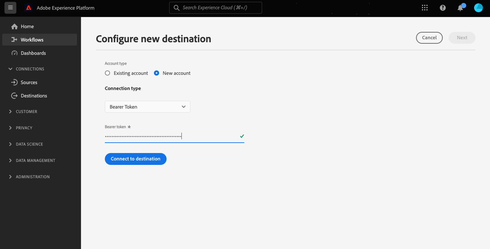

# Connessione API HTTP

## Panoramica {#overview}

>[!IMPORTANT]
>
> Questa destinazione è disponibile solo per [Adobe Real-time Customer Data Platform Ultimate](https://helpx.adobe.com/legal/product-descriptions/real-time-customer-data-platform.html) clienti.

La destinazione API HTTP è un [!DNL Adobe Experience Platform] destinazione di streaming che consente di inviare dati di profilo a endpoint HTTP di terze parti.

Per inviare i dati di profilo agli endpoint HTTP, devi prima [connettersi alla destinazione](#connect-destination) in [!DNL Adobe Experience Platform].

## Casi d’uso {#use-cases}

La destinazione HTTP API ti consente di esportare i dati di profilo XDM e i segmenti di pubblico in endpoint HTTP generici. In questo caso, puoi eseguire analisi personalizzate o eseguire altre operazioni necessarie sui dati del profilo esportati fuori dall’Experience Platform.

Gli endpoint HTTP possono essere sistemi propri dei clienti o soluzioni di terze parti.

## Tipo e frequenza di esportazione {#export-type-frequency}

Per informazioni sul tipo e sulla frequenza di esportazione della destinazione, fare riferimento alla tabella seguente.

| Elemento | Tipo | Note |
---------|----------|---------|
| Tipo di esportazione | **[!UICONTROL Basato su profilo]** | Stai esportando tutti i membri di un segmento, insieme ai campi dello schema desiderati (ad esempio: indirizzo e-mail, numero di telefono, cognome), come scelto nella schermata di mappatura del [flusso di lavoro di attivazione della destinazione](../../ui/activate-segment-streaming-destinations.md#mapping). |
| Frequenza delle esportazioni | **[!UICONTROL Streaming]** | Le destinazioni di streaming sono connessioni basate su API &quot;sempre attive&quot;. Non appena un profilo viene aggiornato in Experience Platform in base alla valutazione del segmento, il connettore invia l’aggiornamento a valle alla piattaforma di destinazione. Ulteriori informazioni [destinazioni di streaming](/help/destinations/destination-types.md#streaming-destinations). |

{style="table-layout:auto"}

## Prerequisiti {#prerequisites}

Per utilizzare la destinazione API HTTP per esportare i dati da Experience Platform, è necessario soddisfare i seguenti prerequisiti:

* È necessario disporre di un endpoint HTTP che supporti l’API REST.
* L’endpoint HTTP deve supportare lo schema del profilo di Experience Platform. Nella destinazione API HTTP non è supportata alcuna trasformazione in uno schema di payload di terze parti. Fai riferimento a [dati esportati](#exported-data) per un esempio dello schema di output dell&#39;Experience Platform.
* L&#39;endpoint HTTP deve supportare le intestazioni.

>[!TIP]
>
> È inoltre possibile utilizzare [Adobe Experience Platform Destination SDK](/help/destinations/destination-sdk/overview.md) per impostare un’integrazione e inviare dati di profilo di Experience Platform a un endpoint HTTP.

## inserire nell&#39;elenco Consentiti indirizzo IP {#ip-address-allowlist}

Per soddisfare i requisiti di sicurezza e conformità dei clienti, Experience Platform fornisce un elenco di IP statici che puoi inserire nell&#39;elenco Consentiti per la destinazione API HTTP. Fai riferimento a [ELENCO CONSENTITI di indirizzi IP per le destinazioni di streaming](/help/destinations/catalog/streaming/ip-address-allow-list.md) per l’elenco completo degli IP da inserire nell&#39;elenco Consentiti.

## Tipi di autenticazione supportati {#supported-authentication-types}

La destinazione API HTTP supporta diversi tipi di autenticazione per l’endpoint HTTP:

* endpoint HTTP senza autenticazione;
* autenticazione del token portatore;
* [Credenziali client OAuth 2.0](https://www.oauth.com/oauth2-servers/access-tokens/client-credentials/) autenticazione con il modulo corpo, con [!DNL client ID], [!DNL client secret] e [!DNL grant type] nel corpo della richiesta HTTP, come illustrato nell’esempio seguente.

```shell
curl --location --request POST '<YOUR_API_ENDPOINT>' \
--header 'Content-Type: application/x-www-form-urlencoded' \
--data-urlencode 'grant_type=client_credentials' \
--data-urlencode 'client_id=<CLIENT_ID>' \
--data-urlencode 'client_secret=<CLIENT_SECRET>'
```

* [Credenziali client OAuth 2.0](https://www.oauth.com/oauth2-servers/access-tokens/client-credentials/) con autorizzazione di base, con intestazione di autorizzazione contenente URL codificati [!DNL client ID] e [!DNL client secret].

```shell
curl --location --request POST 'https://some-api.com/token' \
--header 'Authorization: Basic base64(clientId:clientSecret)' \
--header 'Content-type: application/x-www-form-urlencoded; charset=UTF-8' \
--data-urlencode 'grant_type=client_credentials'
```

* [concessione password OAuth 2.0](https://www.oauth.com/oauth2-servers/access-tokens/password-grant/).

## Collegati alla destinazione {#connect-destination}

>[!IMPORTANT]
> 
>Per connettersi alla destinazione, è necessario **[!UICONTROL Gestire le destinazioni]** [autorizzazione controllo accessi](/help/access-control/home.md#permissions). Leggi la sezione [panoramica sul controllo degli accessi](/help/access-control/ui/overview.md) oppure contatta l’amministratore del prodotto per ottenere le autorizzazioni richieste.

Per connettersi a questa destinazione, segui i passaggi descritti in [esercitazione sulla configurazione della destinazione](../../ui/connect-destination.md). Quando ti connetti a questa destinazione, devi fornire le seguenti informazioni:

### Informazioni di autenticazione {#authentication-information}

>[!CONTEXTUALHELP]
>id="platform_destinations_connect_http_clientcredentialstype"
>title="Tipo di credenziali client"
>abstract="Seleziona **Codificato nel corpo del modulo** per includere l’ID client e il segreto client nel corpo della richiesta, oppure seleziona **Autorizzazione di base** per includere l’ID client e il segreto client in un’intestazione di autorizzazione. Puoi trovare alcuni esempi nella documentazione."

#### Autenticazione token portatore {#bearer-token-authentication}

Se selezioni la **[!UICONTROL Token portatore]** tipo di autenticazione per la connessione all’endpoint HTTP, immetti i campi seguenti e seleziona **[!UICONTROL Connetti alla destinazione]**:



* **[!UICONTROL Token portatore]**: inserisci il token portatore da autenticare nel percorso HTTP.

#### Nessuna autenticazione {#no-authentication}

Se selezioni la **[!UICONTROL Nessuno]** tipo di autenticazione per la connessione all&#39;endpoint HTTP:


Quando selezioni questa autenticazione aperta, devi solo selezionare **[!UICONTROL Connetti alla destinazione]** e viene stabilita la connessione all&#39;endpoint.

#### Autenticazione con password OAuth 2 {#oauth-2-password-authentication}

Se selezioni la **[!UICONTROL Password OAuth 2]** tipo di autenticazione per la connessione all’endpoint HTTP, immetti i campi seguenti e seleziona **[!UICONTROL Connetti alla destinazione]**:


* **[!UICONTROL URL token di accesso]**: L’URL sul tuo lato che rilascia token di accesso e, facoltativamente, aggiorna i token.
* **[!UICONTROL ID client]**: La [!DNL client ID] che il sistema assegna a Adobe Experience Platform.
* **[!UICONTROL Segreto client]**: La [!DNL client secret] che il sistema assegna a Adobe Experience Platform.
* **[!UICONTROL Nome utente]**: Nome utente per accedere all’endpoint HTTP.
* **[!UICONTROL Password]**: Password per accedere all’endpoint HTTP.

#### Autenticazione credenziali client OAuth 2 {#oauth-2-client-credentials-authentication}

Se selezioni la **[!UICONTROL Credenziali client OAuth 2]** tipo di autenticazione per la connessione all’endpoint HTTP, immetti i campi seguenti e seleziona **[!UICONTROL Connetti alla destinazione]**:


* **[!UICONTROL URL token di accesso]**: L’URL sul tuo lato che rilascia token di accesso e, facoltativamente, aggiorna i token.
* **[!UICONTROL ID client]**: La [!DNL client ID] che il sistema assegna a Adobe Experience Platform.
* **[!UICONTROL Segreto client]**: La [!DNL client secret] che il sistema assegna a Adobe Experience Platform.
* **[!UICONTROL Tipo di credenziali client]**: Seleziona il tipo di concessione delle credenziali client OAuth2 supportata dall’endpoint:
   * **[!UICONTROL Corpo del modulo codificato]**: In questo caso, il [!DNL client ID] e [!DNL client secret] sono inclusi *nel corpo della richiesta* inviato a destinazione. Ad esempio, consulta [Tipi di autenticazione supportati](#supported-authentication-types) sezione .
   * **[!UICONTROL Autorizzazione di base]**: In questo caso, il [!DNL client ID] e [!DNL client secret] sono inclusi *in `Authorization` header* dopo essere stato codificato base64 e inviato alla tua destinazione. Ad esempio, consulta [Tipi di autenticazione supportati](#supported-authentication-types) sezione .

### Compila i dettagli della destinazione {#destination-details}

>[!CONTEXTUALHELP]
>id="platform_destinations_connect_http_headers"
>title="Intestazioni"
>abstract="Immetti le intestazioni personalizzate che desideri includere nelle chiamate di destinazione, nel formato seguente: `header1:value1,header2:value2,...headerN:valueN`"

>[!CONTEXTUALHELP]
>id="platform_destinations_connect_http_endpoint"
>title="Endpoint HTTP"
>abstract="URL dell’endpoint HTTP a cui desideri inviare i dati del profilo."

>[!CONTEXTUALHELP]
>id="platform_destinations_connect_http_includesegmentnames"
>title="Includi nomi dei segmenti"
>abstract="Attiva o disattiva questa opzione se desideri che l’esportazione dei dati includa i nomi dei segmenti che stai esportando. Consulta la documentazione per vedere un esempio di esportazione dei dati con questa opzione selezionata."

>[!CONTEXTUALHELP]
>id="platform_destinations_connect_http_includesegmenttimestamps"
>title="Includi timestamp dei segmenti"
>abstract="Attiva o disattiva questa opzione se desideri che l’esportazione dei dati includa il timestamp UNIX al momento della creazione e dell’aggiornamento dei segmenti, nonché il timestamp UNIX al momento della mappatura dei segmenti alla destinazione per l’attivazione. Consulta la documentazione per vedere un esempio di esportazione dei dati con questa opzione selezionata."

>[!CONTEXTUALHELP]
>id="platform_destinations_connect_http_queryparameters"
>title="Parametri di query"
>abstract="Facoltativamente, puoi aggiungere dei parametri di query all’URL dell’endpoint HTTP. I parametri di query che vuoi utilizzare devono essere nel formato seguente: `parameter1=value&parameter2=value`."

Per configurare i dettagli della destinazione, compila i campi obbligatori e facoltativi riportati di seguito. Un asterisco accanto a un campo nell’interfaccia utente indica che il campo è obbligatorio.


* **[!UICONTROL Nome]**: Inserisci un nome con cui riconoscerai questa destinazione in futuro.
* **[!UICONTROL Descrizione]**: Immetti una descrizione che ti aiuterà a identificare questa destinazione in futuro.
* **[!UICONTROL Intestazioni]**: Immetti le intestazioni personalizzate che desideri includere nelle chiamate di destinazione, in questo formato: `header1:value1,header2:value2,...headerN:valueN`.
* **[!UICONTROL Endpoint HTTP]**: URL dell’endpoint HTTP a cui desideri inviare i dati del profilo.
* **[!UICONTROL Parametri query]**: Facoltativamente, puoi aggiungere parametri di query all’URL dell’endpoint HTTP. I parametri di query che vuoi utilizzare devono essere nel formato seguente: `parameter1=value&parameter2=value`.
* **[!UICONTROL Includi nomi dei segmenti]**: Attiva/disattiva se desideri che l’esportazione dei dati includa i nomi dei segmenti che stai esportando. Per un esempio di esportazione di dati con questa opzione selezionata, consulta [Dati esportati](#exported-data) più avanti.
* **[!UICONTROL Includi marche temporali del segmento]**: Attiva/disattiva se desideri che l’esportazione dei dati includa la marca temporale UNIX al momento della creazione e dell’aggiornamento dei segmenti, nonché la marca temporale UNIX al momento della mappatura dei segmenti alla destinazione per l’attivazione. Per un esempio di esportazione di dati con questa opzione selezionata, consulta [Dati esportati](#exported-data) più avanti.

### Abilitare gli avvisi {#enable-alerts}

Puoi abilitare gli avvisi per ricevere notifiche sullo stato del flusso di dati nella tua destinazione. Seleziona un avviso dall’elenco per abbonarti e ricevere le notifiche sullo stato del flusso di dati. Per ulteriori informazioni sugli avvisi, consulta la guida su [iscrizione agli avvisi sulle destinazioni tramite l’interfaccia utente](../../ui/alerts.md).

Una volta completati i dettagli della connessione di destinazione, seleziona **[!UICONTROL Successivo]**.

## Attiva i segmenti in questa destinazione {#activate}

>[!IMPORTANT]
> 
>Per attivare i dati, è necessario **[!UICONTROL Gestire le destinazioni]**, **[!UICONTROL Attivare le destinazioni]**, **[!UICONTROL Visualizza profili]** e **[!UICONTROL Visualizzare i segmenti]** [autorizzazioni di controllo accessi](/help/access-control/home.md#permissions). Leggi la sezione [panoramica sul controllo degli accessi](/help/access-control/ui/overview.md) oppure contatta l’amministratore del prodotto per ottenere le autorizzazioni richieste.

Vedi [Attivare i dati del pubblico nelle destinazioni di esportazione del profilo in streaming](../../ui/activate-streaming-profile-destinations.md) per istruzioni su come attivare i segmenti di pubblico a questa destinazione.

### Attributi di destinazione {#attributes}

In [[!UICONTROL Seleziona attributi]](../../ui/activate-streaming-profile-destinations.md#select-attributes) Adobe consiglia di selezionare un identificatore univoco dal [schema unione](../../../profile/home.md#profile-fragments-and-union-schemas). Seleziona l’identificatore univoco e tutti gli altri campi XDM da esportare nella destinazione.

## Comportamento dell’esportazione del profilo {#profile-export-behavior}

Experience Platform ottimizza il comportamento di esportazione del profilo nella destinazione API HTTP, in modo da esportare i dati nell’endpoint API solo quando si sono verificati aggiornamenti rilevanti a un profilo in seguito alla qualifica del segmento o altri eventi significativi. I profili vengono esportati nella destinazione nelle situazioni seguenti:

* L’aggiornamento del profilo è stato determinato da una modifica dell’appartenenza al segmento per almeno uno dei segmenti mappati alla destinazione. Ad esempio, il profilo si è qualificato per uno dei segmenti mappati alla destinazione o è uscito da uno dei segmenti mappati alla destinazione.
* L&#39;aggiornamento del profilo è stato determinato da una modifica nel [mappa identità](/help/xdm/field-groups/profile/identitymap.md). Ad esempio, a un profilo già qualificato per uno dei segmenti mappati alla destinazione è stata aggiunta una nuova identità nell’attributo di mappa identità.
* L&#39;aggiornamento del profilo è stato determinato da una modifica degli attributi per almeno uno degli attributi mappati alla destinazione. Ad esempio, uno degli attributi mappati alla destinazione nel passaggio di mappatura viene aggiunto a un profilo.

In tutti i casi descritti in precedenza, vengono esportati nella destinazione solo i profili in cui si sono verificati aggiornamenti rilevanti. Ad esempio, se un segmento mappato al flusso di destinazione ha un centinaio di membri e cinque nuovi profili sono qualificati per il segmento, l’esportazione nella destinazione è incrementale e include solo i cinque nuovi profili.

Tieni presente che tutti gli attributi mappati vengono esportati per un profilo, indipendentemente da dove si trovino le modifiche. Nell’esempio precedente, quindi, tutti gli attributi mappati per questi cinque nuovi profili verranno esportati anche se gli attributi stessi non sono cambiati.

### Cosa determina un’esportazione di dati e cosa è incluso nell’esportazione {#what-determines-export-what-is-included}

Per quanto riguarda i dati esportati per un determinato profilo, è importante comprendere i due diversi concetti di *cosa determina un’esportazione di dati nella destinazione API HTTP?* e *quali dati sono inclusi nell&#39;esportazione*.

| Cosa determina un’esportazione di destinazione | Contenuto dell’esportazione di destinazione |
|---------|----------|
| <ul><li>Gli attributi e i segmenti mappati fungono da spunto per un’esportazione di destinazione. Ciò significa che, se un segmento mappato cambia stato (da `null` a `realized` o `realized` a `exiting`) o gli eventuali attributi mappati vengono aggiornati; un’esportazione di destinazione viene avviata.</li><li>Poiché le identità non possono attualmente essere mappate su destinazioni API HTTP, le modifiche apportate a un dato profilo determinano anche le esportazioni di destinazione.</li><li>Una modifica per un attributo è definita come qualsiasi aggiornamento sull&#39;attributo, che sia o meno lo stesso valore. Ciò significa che una sovrascrittura su un attributo viene considerata una modifica anche se il valore stesso non è stato modificato.</li></ul> | <ul><li>La `segmentMembership` l&#39;oggetto include il segmento mappato nel flusso di dati di attivazione per il quale lo stato del profilo è cambiato in seguito a un evento di uscita della qualifica o del segmento. Tieni presente che altri segmenti non mappati per i quali il profilo è qualificato possono far parte dell’esportazione di destinazione, se questi segmenti appartengono allo stesso [criterio di unione](/help/profile/merge-policies/overview.md) come segmento mappato nel flusso di dati di attivazione. </li><li>Tutte le identità nel `identityMap` sono inclusi anche gli oggetti (l&#39;Experience Platform attualmente non supporta la mappatura delle identità nella destinazione API HTTP).</li><li>Solo gli attributi mappati sono inclusi nell’esportazione di destinazione.</li></ul> |

{style="table-layout:fixed"}

Ad esempio, considera questo flusso di dati come una destinazione HTTP in cui tre segmenti sono selezionati nel flusso di dati e quattro attributi sono mappati sulla destinazione.


Un’esportazione di profilo verso la destinazione può essere determinata da un profilo che qualifica o esce da uno dei *tre segmenti mappati*. Tuttavia, nell’esportazione dei dati, nella `segmentMembership` oggetto (vedere [Dati esportati](#exported-data) (sezione seguente), potrebbero essere visualizzati altri segmenti non mappati, se quel particolare profilo è membro di essi e se questi condividono lo stesso criterio di unione del segmento che ha attivato l’esportazione. Se un profilo è idoneo per **Cliente con DeLorean Cars** ma è anche membro del **Guardato &quot;Torna al futuro&quot;** film e **fan della fantascienza** i segmenti, quindi anche questi altri due segmenti saranno presenti nel `segmentMembership` oggetto dell&#39;esportazione di dati, anche se non mappati nel flusso di dati, se questi condividono lo stesso criterio di unione con il **Cliente con DeLorean Cars** segmento.

Dal punto di vista degli attributi del profilo, eventuali modifiche ai quattro attributi mappati sopra determineranno un’esportazione di destinazione e uno qualsiasi dei quattro attributi mappati presenti sul profilo sarà presente nell’esportazione dei dati.

## Recupero dati storici {#historical-data-backfill}

Quando aggiungi un nuovo segmento a una destinazione esistente o quando crei una nuova destinazione e mappi segmenti su di essa, Experience Platform esporta i dati storici di qualificazione dei segmenti alla destinazione. Profili qualificati per il segmento *prima* il segmento aggiunto alla destinazione viene esportato nella destinazione entro circa un’ora.

## Dati esportati {#exported-data}

Esportazione [!DNL Experience Platform] i dati arrivano nel tuo [!DNL HTTP] destinazione in formato JSON. Ad esempio, l’esportazione seguente contiene un profilo qualificato per un determinato segmento, è membro di altri due segmenti ed è uscita da un altro segmento. L’esportazione include anche il nome dell’attributo del profilo, il cognome, la data di nascita e l’indirizzo e-mail personale. Le identità di questo profilo sono ECID ed e-mail.

```json
{
  "person": {
    "birthDate": "YYYY-MM-DD",
    "name": {
      "firstName": "John",
      "lastName": "Doe"
    }
  },
  "personalEmail": {
    "address": "john.doe@acme.com"
  },
  "segmentMembership": {
   "ups":{
      "7841ba61-23c1-4bb3-a495-00d3g5fe1e93":{
         "lastQualificationTime":"2022-01-11T21:24:39Z",
         "status":"exited"
      },
      "59bd2fkd-3c48-4b18-bf56-4f5c5e6967ae":{
         "lastQualificationTime":"2022-01-02T23:37:33Z",
         "status":"realized"
      },
      "947c1c46-008d-40b0-92ec-3af86eaf41c1":{
         "lastQualificationTime":"2021-08-25T23:37:33Z",
         "status":"realized"
      },
      "5114d758-ce71-43ba-b53e-e2a91d67b67f":{
         "lastQualificationTime":"2022-01-11T23:37:33Z",
         "status":"realized"
      }
   }
},
  "identityMap": {
    "ecid": [
      {
        "id": "14575006536349286404619648085736425115"
      },
      {
        "id": "66478888669296734530114754794777368480"
      }
    ],
    "email_lc_sha256": [
      {
        "id": "655332b5fa2aea4498bf7a290cff017cb4"
      },
      {
        "id": "66baf76ef9de8b42df8903f00e0e3dc0b7"
      }
    ]
  }
}
```

Di seguito sono riportati ulteriori esempi di dati esportati, a seconda delle impostazioni dell’interfaccia utente selezionate nel flusso di destinazione di connessione per il **[!UICONTROL Includi nomi dei segmenti]** e **[!UICONTROL Includi marche temporali del segmento]** opzioni:

+++ L’esempio di esportazione dei dati riportato di seguito include i nomi dei segmenti nel `segmentMembership` sezione

```json
"segmentMembership": {
        "ups": {
          "5b998cb9-9488-4ec3-8d95-fa8338ced490": {
            "lastQualificationTime": "2019-04-15T02:41:50+0000",
            "status": "realized",
            "createdAt": 1648553325000,
            "updatedAt": 1648553330000,
            "mappingCreatedAt": 1649856570000,
            "mappingUpdatedAt": 1649856570000,
            "name": "First name equals John"
          }
        }
      }
```

+++

+++ L’esempio di esportazione dei dati riportato di seguito include le marche temporali del segmento nel `segmentMembership` sezione

```json
"segmentMembership": {
        "ups": {
          "5b998cb9-9488-4ec3-8d95-fa8338ced490": {
            "lastQualificationTime": "2019-04-15T02:41:50+0000",
            "status": "realized",
            "createdAt": 1648553325000,
            "updatedAt": 1648553330000,
            "mappingCreatedAt": 1649856570000,
            "mappingUpdatedAt": 1649856570000,
          }
        }
      }
```

+++

## Limiti e nuovo criterio {#limits-retry-policy}

Nel 95% del tempo, Experience Platform tenta di offrire una latenza di throughput inferiore a 10 minuti per i messaggi inviati con successo con un tasso di meno di 10 mila richieste al secondo per ogni flusso di dati a una destinazione HTTP.

In caso di richieste non riuscite alla destinazione API HTTP, Experience Platform memorizza le richieste non riuscite e tenta due volte di inviare le richieste all’endpoint.