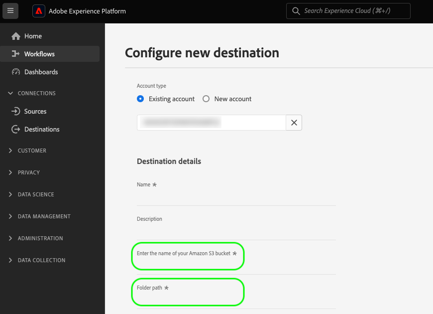

# Creare una configurazione di destinazione

Questa pagina esemplifica la richiesta API e il payload che puoi utilizzare per creare la configurazione di destinazione personalizzata, utilizzando `/authoring/destinations` Endpoint API.

Per una descrizione dettagliata delle funzionalità che puoi configurare tramite questo endpoint, leggi i seguenti articoli:

* [Configurazione dell’autenticazione cliente](../../functionality/destination-configuration/customer-authentication.md)
* [Autenticazione OAuth2](../../functionality/destination-configuration/oauth2-authentication.md)
* [Campi dati cliente](../../functionality/destination-configuration/customer-data-fields.md)
* [Attributi dell&#39;interfaccia utente](../../functionality/destination-configuration/ui-attributes.md)
* [Configurazione dello schema](../../functionality/destination-configuration/schema-configuration.md)
* [Configurazione dello spazio dei nomi identità](../../functionality/destination-configuration/identity-namespace-configuration.md)
* [Consegna delle destinazioni](../../functionality/destination-configuration/destination-delivery.md)
* [Configurazione dei metadati del pubblico](../../functionality/destination-configuration/audience-metadata-configuration.md)
* [Configurazione dei metadati del pubblico](../../functionality/destination-configuration/audience-metadata-configuration.md)
* [Criteri di aggregazione](../../functionality/destination-configuration/aggregation-policy.md)
* [Configurazione batch](../../functionality/destination-configuration/batch-configuration.md)
* [Qualifiche di profilo storiche](../../functionality/destination-configuration/historical-profile-qualifications.md)

>[!IMPORTANT]
>
>Tutti i nomi e i valori dei parametri supportati da Destination SDK sono **distinzione tra maiuscole e minuscole**. Per evitare errori di distinzione tra maiuscole e minuscole, utilizza i nomi e i valori dei parametri esattamente come mostrato nella documentazione.

## Guida introduttiva alle operazioni API di configurazione della destinazione {#get-started}

Prima di continuare, controlla la [guida introduttiva](../../getting-started.md) per informazioni importanti che devi conoscere per effettuare correttamente le chiamate all’API, tra cui come ottenere l’autorizzazione di authoring di destinazione richiesta e le intestazioni richieste.

## Creare una configurazione di destinazione {#create}

Puoi creare una nuova configurazione di destinazione effettuando una richiesta di POST al `/authoring/destinations` punto finale.

>[!TIP]
>
>**Endpoint API**: `platform.adobe.io/data/core/activation/authoring/destinations`

**Formato API**

```http
POST /authoring/destinations
```

La seguente richiesta crea una nuova [!DNL Amazon S3] configurazione di destinazione, configurata dai parametri forniti nel payload. Il payload seguente include tutti i parametri per le destinazioni basate su file accettate dal `/authoring/destinations` punto finale.

Non è necessario aggiungere tutti i parametri alla chiamata API e il payload è personalizzabile in base ai requisiti API.

+++Richiesta

```shell
curl -X POST https://platform.adobe.io/data/core/activation/authoring/destinations \
 -H 'Authorization: Bearer {ACCESS_TOKEN}' \
 -H 'Content-Type: application/json' \
 -H 'x-gw-ims-org-id: {ORG_ID}' \
 -H 'x-api-key: {API_KEY}' \
 -H 'x-sandbox-name: {SANDBOX_NAME}' \
 -d '
{
   "name":"Amazon S3 destination with predefined CSV formatting options",
   "description":"Amazon S3 destination with predefined CSV formatting options",
   "status":"TEST",
   "customerAuthenticationConfigurations":[
      {
         "authType":"S3"
      }
   ],
   "customerDataFields":[
      {
         "name":"bucket",
         "title":"Enter the name of your Amazon S3 bucket",
         "description":"Amazon S3 bucket name",
         "type":"string",
         "isRequired":true,
         "readOnly":false,
         "hidden":false
      },
      {
         "name":"path",
         "title":"Enter the path to your S3 bucket folder",
         "description":"Enter the path to your S3 bucket folder",
         "type":"string",
         "isRequired":true,
         "pattern":"^[A-Za-z]+$",
         "readOnly":false,
         "hidden":false
      },
      {
         "name":"compression",
         "title":"Compression format",
         "description":"Select the desired file compression format.",
         "type":"string",
         "isRequired":true,
         "readOnly":false,
         "enum":[
            "SNAPPY",
            "GZIP",
            "DEFLATE",
            "NONE"
         ]
      },
      {
         "name":"fileType",
         "title":"Select a fileType",
         "description":"Select fileType",
         "type":"string",
         "isRequired":true,
         "readOnly":false,
         "hidden":false,
         "enum":[
            "csv",
            "json",
            "parquet"
         ],
         "default":"csv"
      }
   ],
   "uiAttributes":{
      "documentationLink":"https://www.adobe.com/go/destinations-amazon-s3-en",
      "category":"cloudStorage",
      "icon":{
         "key":"amazonS3"
      },
      "connectionType":"S3",
      "frequency":"Batch"
   },
   "destinationDelivery":[
      {
         "deliveryMatchers":[
            {
               "type":"SOURCE",
               "value":[
                  "batch"
               ]
            }
         ],
         "authenticationRule":"CUSTOMER_AUTHENTICATION",
         "destinationServerId":"{{destinationServerId}}"
      }
   ],
   "schemaConfig":{
      "profileRequired":true,
      "segmentRequired":true,
      "identityRequired":true
   },
   "batchConfig":{
      "allowMandatoryFieldSelection":true,
      "allowDedupeKeyFieldSelection":true,
      "defaultExportMode":"DAILY_FULL_EXPORT",
      "allowedExportMode":[
         "DAILY_FULL_EXPORT",
         "FIRST_FULL_THEN_INCREMENTAL"
      ],
      "allowedScheduleFrequency":[
         "DAILY",
         "EVERY_3_HOURS",
         "EVERY_6_HOURS",
         "EVERY_8_HOURS",
         "EVERY_12_HOURS",
         "ONCE"
      ],
      "defaultFrequency":"DAILY",
      "defaultStartTime":"00:00",
      "filenameConfig":{
         "allowedFilenameAppendOptions":[
            "SEGMENT_NAME",
            "DESTINATION_INSTANCE_ID",
            "DESTINATION_INSTANCE_NAME",
            "ORGANIZATION_NAME",
            "SANDBOX_NAME",
            "DATETIME",
            "CUSTOM_TEXT"
         ],
         "defaultFilenameAppendOptions":[
            "DATETIME"
         ],
         "defaultFilename":"%DESTINATION%_%SEGMENT_ID%"
      },
      "backfillHistoricalProfileData":true
   }
}'
```

| Parametro | Tipo | Descrizione |
|---------|----------|------|
| `name` | Stringa | Indica il titolo della destinazione nel catalogo Experience Platform. |
| `description` | Stringa | Immetti una descrizione che Adobe utilizzerà nel catalogo delle destinazioni Experience Platform per la tua scheda di destinazione. Mirare a non più di 4-5 frasi. {width="100" zoomable="yes"} |
| `status` | Stringa | Indica lo stato del ciclo di vita della scheda di destinazione. I valori accettati sono `TEST`, `PUBLISHED` e `DELETED`. Utilizzo `TEST` la prima volta che configuri la destinazione. |
| `customerAuthenticationConfigurations.authType` | Stringa | Indica la configurazione utilizzata per autenticare i clienti Experience Platform nel server di destinazione. Vedi [configurazione dell’autenticazione cliente](../../functionality/destination-configuration/customer-authentication.md) per informazioni dettagliate sui tipi di autenticazione supportati. |
| `customerDataFields.name` | Stringa | Specifica un nome per il campo personalizzato che stai introducendo. <br/><br/> Vedi [Campi dati cliente](../../functionality/destination-configuration/customer-data-fields.md) per informazioni dettagliate su queste impostazioni. {width="100" zoomable="yes"} |
| `customerDataFields.type` | Stringa | Indica il tipo di campo personalizzato che si sta introducendo. I valori accettati sono `string`, `object`, `integer`. <br/><br/> Vedi [Campi dati cliente](../../functionality/destination-configuration/customer-data-fields.md) per informazioni dettagliate su queste impostazioni. |
| `customerDataFields.title` | Stringa | Indica il nome del campo, come visualizzato dai clienti nell’interfaccia utente di Experience Platform. <br/><br/> Vedi [Campi dati cliente](../../functionality/destination-configuration/customer-data-fields.md) per informazioni dettagliate su queste impostazioni. |
| `customerDataFields.description` | Stringa | Immetti una descrizione del campo personalizzato. Vedi [Campi dati cliente](../../functionality/destination-configuration/customer-data-fields.md) per informazioni dettagliate su queste impostazioni. |
| `customerDataFields.isRequired` | Booleano | Indica se questo campo è obbligatorio nel flusso di lavoro di configurazione della destinazione. <br/><br/> Vedi [Campi dati cliente](../../functionality/destination-configuration/customer-data-fields.md) per informazioni dettagliate su queste impostazioni. |
| `customerDataFields.enum` | Stringa | Esegue il rendering del campo personalizzato come menu a discesa ed elenca le opzioni disponibili per l’utente. <br/><br/> Vedi [Campi dati cliente](../../functionality/destination-configuration/customer-data-fields.md) per informazioni dettagliate su queste impostazioni. |
| `customerDataFields.default` | Stringa | Definisce il valore predefinito da un `enum` elenco. |
| `customerDataFields.pattern` | Stringa | Applica un pattern per il campo personalizzato, se necessario. Utilizzare espressioni regolari per applicare un pattern. Ad esempio, se gli ID cliente non includono numeri o caratteri di sottolineatura, immetti `^[A-Za-z]+$` in questo campo. <br/><br/> Vedi [Campi dati cliente](../../functionality/destination-configuration/customer-data-fields.md) per informazioni dettagliate su queste impostazioni. |
| `uiAttributes.documentationLink` | Stringa | Si riferisce alla pagina della documentazione nel [Catalogo delle destinazioni](https://experienceleague.adobe.com/docs/experience-platform/destinations/catalog/overview.html?lang=en#catalog) per la tua destinazione. Utilizzo `https://www.adobe.com/go/destinations-YOURDESTINATION-en`, dove `YOURDESTINATION` è il nome della destinazione. Per una destinazione denominata Moviestar, puoi utilizzare `https://www.adobe.com/go/destinations-moviestar-en`. Questo collegamento funziona solo dopo che Adobe ha impostato la destinazione in tempo reale e la documentazione è stata pubblicata. <br/><br/> Vedi [Attributi dell&#39;interfaccia utente](../../functionality/destination-configuration/ui-attributes.md) per informazioni dettagliate su queste impostazioni. {width="100" zoomable="yes"} |
| `uiAttributes.category` | Stringa | Si riferisce alla categoria assegnata alla destinazione in Adobe Experience Platform. Per ulteriori informazioni, leggere [Categorie di destinazione](https://experienceleague.adobe.com/docs/experience-platform/rtcdp/destinations/destination-types.html?lang=en#destination-categories). Utilizzare uno dei seguenti valori: `adobeSolutions, advertising, analytics, cdp, cloudStorage, crm, customerSuccess, database, dmp, ecommerce, email, emailMarketing, enrichment, livechat, marketingAutomation, mobile, personalization, protocols, social, streaming, subscriptions, surveys, tagManagers, voc, warehouses, payments`. <br/><br/> Vedi [Attributi dell&#39;interfaccia utente](../../functionality/destination-configuration/ui-attributes.md) per informazioni dettagliate su queste impostazioni. |
| `uiAttributes.connectionType` | Stringa | Il tipo di connessione, a seconda della destinazione. Valori supportati: <ul><li>`Server-to-server`</li><li>`Cloud storage`</li><li>`Azure Blob`</li><li>`Azure Data Lake Storage`</li><li>`S3`</li><li>`SFTP`</li><li>`DLZ`</li></ul> |
| `uiAttributes.frequency` | Stringa | Si riferisce al tipo di esportazione di dati supportato dalla destinazione. Imposta su `Streaming` per integrazioni basate su API, o `Batch` quando esporti file nelle destinazioni. |
| `identityNamespaces.externalId.acceptsAttributes` | Booleano | Indica se i clienti possono mappare gli attributi di profilo standard all’identità che stai configurando. |
| `identityNamespaces.externalId.acceptsCustomNamespaces` | Booleano | Indica se i clienti possono mappare le identità appartenenti a [spazi dei nomi personalizzati](/help/identity-service/namespaces.md#manage-namespaces) all&#39;identità che stai configurando. |
| `identityNamespaces.externalId.transformation` | Stringa | _Non mostrato nella configurazione di esempio_. Utilizzato, ad esempio, quando [!DNL Platform] il cliente ha indirizzi e-mail semplici come attributo e la tua piattaforma accetta solo e-mail con hash. Qui puoi fornire la trasformazione da applicare (ad esempio, trasforma l’e-mail in minuscolo e quindi hash). |
| `identityNamespaces.externalId.acceptedGlobalNamespaces` | - | Indica quale [spazi dei nomi delle identità standard](/help/identity-service/namespaces.md#standard) (ad esempio, IDFA) i clienti possono eseguire il mapping all&#39;identità che stai configurando. <br> Quando utilizzi `acceptedGlobalNamespaces`, puoi utilizzare `"requiredTransformation":"sha256(lower($))"` per gli indirizzi e-mail o i numeri di telefono in lettere minuscole e hash. |
| `destinationDelivery.authenticationRule` | Stringa | Indica come [!DNL Platform] i clienti si connettono alla destinazione. I valori accettati sono `CUSTOMER_AUTHENTICATION`, `PLATFORM_AUTHENTICATION`, `NONE`. <br> <ul><li>Utilizzo `CUSTOMER_AUTHENTICATION` se i clienti di Platform accedono al sistema tramite un nome utente e una password, un token portatore o un altro metodo di autenticazione. Ad esempio, puoi selezionare questa opzione se hai selezionato anche `authType: OAUTH2` o `authType:BEARER` in `customerAuthenticationConfigurations`. </li><li> Utilizzo `PLATFORM_AUTHENTICATION` se esiste un sistema di autenticazione globale tra l’Adobe e la destinazione e [!DNL Platform] il cliente non deve fornire credenziali di autenticazione per connettersi alla destinazione. In questo caso è necessario creare un oggetto credenziali utilizzando [API delle credenziali](../../credentials-api/create-credential-configuration.md) configurazione. </li><li>Utilizzo `NONE` se non è richiesta alcuna autenticazione per inviare dati alla piattaforma di destinazione. </li></ul> |
| `destinationDelivery.destinationServerId` | Stringa | La `instanceId` del [modello server di destinazione](../destination-server/create-destination-server.md) utilizzato per questa destinazione. |
| `backfillHistoricalProfileData` | Booleano | Controlla se i dati storici del profilo vengono esportati quando i segmenti vengono attivati nella destinazione. Imposta sempre su `true`. |
| `segmentMappingConfig.mapUserInput` | Booleano | Controlla se l&#39;ID di mappatura del segmento nel flusso di lavoro di attivazione della destinazione viene immesso dall&#39;utente. |
| `segmentMappingConfig.mapExperiencePlatformSegmentId` | Booleano | Controlla se l&#39;ID di mappatura del segmento nel flusso di lavoro di attivazione della destinazione è l&#39;ID del segmento di Experience Platform. |
| `segmentMappingConfig.mapExperiencePlatformSegmentName` | Booleano | Controlla se l&#39;ID di mappatura del segmento nel flusso di lavoro di attivazione della destinazione è il nome del segmento di Experience Platform. |
| `segmentMappingConfig.audienceTemplateId` | Booleano | La `instanceId` del [modello di metadati del pubblico](../../metadata-api/create-audience-template.md) utilizzato per questa destinazione. |
| `schemaConfig.profileFields` | Array | Quando si aggiungono predefiniti `profileFields` come mostrato nella configurazione precedente, gli utenti avranno la possibilità di mappare gli attributi Experienci Platform agli attributi predefiniti sul lato della destinazione. |
| `schemaConfig.profileRequired` | Booleano | Utilizzo `true` se gli utenti devono essere in grado di mappare gli attributi di profilo dall’Experience Platform agli attributi personalizzati sul lato della destinazione, come illustrato nella configurazione di esempio precedente. |
| `schemaConfig.segmentRequired` | Booleano | Usa sempre `segmentRequired:true`. |
| `schemaConfig.identityRequired` | Booleano | Utilizzo `true` se gli utenti devono essere in grado di mappare i namespace di identità dall&#39;Experience Platform allo schema desiderato. |

{style="table-layout:auto"}

+++

+++Risposta

Una risposta corretta restituisce lo stato HTTP 200 con i dettagli della configurazione di destinazione appena creata.

+++

## Gestione degli errori API

Gli endpoint API di Destination SDK seguono i principi generali dei messaggi di errore API di Experience Platform. Fai riferimento a [Codici di stato API](../../../../landing/troubleshooting.md#api-status-codes) e [errori di intestazione della richiesta](../../../../landing/troubleshooting.md#request-header-errors) nella guida alla risoluzione dei problemi di Platform.

## Passaggi successivi

Dopo aver letto questo documento, ora sai come creare una nuova configurazione di destinazione attraverso la Destination SDK `/authoring/destinations` Endpoint API.

Per ulteriori informazioni sulle operazioni che è possibile eseguire con questo endpoint, consulta i seguenti articoli:

* [Recupera una configurazione di destinazione](retrieve-destination-configuration.md)
* [Aggiornare una configurazione di destinazione](update-destination-configuration.md)
* [Eliminare una configurazione di destinazione](delete-destination-configuration.md)

Per capire dove si trova questo endpoint nel processo di authoring di destinazione, vedi i seguenti articoli:

* [Utilizza Destination SDK per configurare una destinazione di streaming](../../guides/configure-destination-instructions.md#create-destination-configuration)
* [Utilizzare Destination SDK per configurare una destinazione basata su file](../../guides/configure-file-based-destination-instructions.md#create-destination-configuration)
