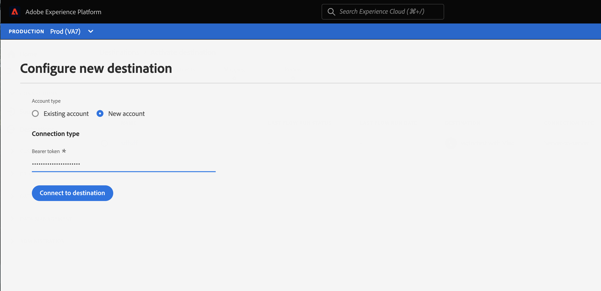

# Configurazione della destinazione di streaming {#destination-configuration}

## Panoramica {#overview}

Questa configurazione ti consente di indicare informazioni essenziali per la destinazione di streaming, come il nome della destinazione, la categoria, la descrizione e altro ancora. Le impostazioni di questa configurazione determinano anche come gli utenti di Experience Platform si autenticano nella destinazione, come vengono visualizzati nell’interfaccia utente di Experience Platform e le identità che possono essere esportate nella destinazione.

Questa configurazione collega anche le altre configurazioni necessarie per la tua destinazione al lavoro - server di destinazione e metadati del pubblico - a questa. Scopri come fare riferimento alle due configurazioni in una [sezione successiva](./destination-configuration.md#connecting-all-configurations).

Puoi configurare la funzionalità descritta in questo documento utilizzando `/authoring/destinations` Endpoint API. Leggi [Operazioni degli endpoint API delle destinazioni](./destination-configuration-api.md) per un elenco completo delle operazioni eseguibili sull&#39;endpoint.

## Esempio di configurazione dello streaming {#example-configuration}

Questa è un esempio di configurazione di una destinazione di streaming fittizia, Moviestar, che ha endpoint in quattro posizioni nel mondo. La destinazione appartiene alla categoria delle destinazioni mobili.

```json
{
   "name":"Moviestar",
   "description":"Moviestar is a fictional destination, used for this example.",
   "status":"TEST",
   "customerAuthenticationConfigurations":[
      {
         "authType":"BEARER"
      }
   ],
   "customerDataFields":[
      {
         "name":"endpointRegion",
         "type":"string",
         "title":"Select Endpoint",
         "description":"Moviestar manages several instances across the globe for REST endpoints that our customers are provisioned for. Select your endpoint in the dropdown list.",
         "isRequired":true,
         "enum":[
            "US",
            "EU",
            "APAC",
            "NZ"
         ]
      },
      {
         "name":"customerID",
         "type":"string",
         "title":"Moviestar Customer ID",
         "description":"Your customer ID in the Moviestar destination (e.g. abcdef).",
         "isRequired":true,
         "pattern":"^[A-Za-z]+$"
      }
   ],
   "uiAttributes":{
      "documentationLink":"http://www.adobe.com/go/destinations-moviestar-en",
      "category":"mobile",
      "connectionType":"Server-to-server",
      "frequency":"Streaming"
   },
   "identityNamespaces":{
      "external_id":{
         "acceptsAttributes":true,
         "acceptsCustomNamespaces":true,
         "acceptedGlobalNamespaces":{
            "Email":{
               
            }
         }
      },
      "another_id":{
         "acceptsAttributes":true,
         "acceptsCustomNamespaces":true
      }
   },
   "schemaConfig":{
      "profileRequired":false,
      "segmentRequired":true,
      "identityRequired":true
   },
   "destinationDelivery":[
      {
         "authenticationRule":"CUSTOMER_AUTHENTICATION",
         "destinationServerId":"9c77000a-4559-40ae-9119-a04324a3ecd4"
      }
   ],
   "segmentMappingConfig":{
      "mapExperiencePlatformSegmentName":false,
      "mapExperiencePlatformSegmentId":false,
      "mapUserInput":false,
      "audienceTemplateId":"cbf90a70-96b4-437b-86be-522fbdaabe9c"
   },
   "aggregation":{
      "aggregationType":"CONFIGURABLE_AGGREGATION",
      "configurableAggregation":{
         "splitUserById":true,
         "maxBatchAgeInSecs":2400,
         "maxNumEventsInBatch":5000,
         "aggregationKey":{
            "includeSegmentId":true,
            "includeSegmentStatus":true,
            "includeIdentity":true,
            "oneIdentityPerGroup":false,
            "groups":[
               {
                  "namespaces":[
                     "IDFA",
                     "GAID"
                  ]
               },
               {
                  "namespaces":[
                     "EMAIL"
                  ]
               }
            ]
         }
      }
   },
   "backfillHistoricalProfileData":true
}
```

| Parametro | Tipo | Descrizione |
|---------|----------|------|
| `name` | Stringa | Indica il titolo della destinazione nel catalogo Experience Platform. |
| `description` | Stringa | Immetti una descrizione della scheda di destinazione nel catalogo delle destinazioni Experience Platform. Mirare a non più di 4-5 frasi. |
| `status` | Stringa | Indica lo stato del ciclo di vita della scheda di destinazione. I valori accettati sono `TEST`, `PUBLISHED` e `DELETED`. Utilizzo `TEST` la prima volta che configuri la destinazione. |

{style=&quot;table-layout:auto&quot;}

## Configurazioni di autenticazione dei clienti {#customer-authentication-configurations}

Questa sezione nella configurazione delle destinazioni genera il [Configurare una nuova destinazione](/help/destinations/ui/connect-destination.md) nell’interfaccia utente di Experience Platform, in cui gli utenti collegano Experience Platform agli account che hanno con la tua destinazione. A seconda dell’opzione di autenticazione indicata nella `authType` la pagina dell’Experience Platform viene generata per gli utenti come segue:

### Autenticazione portatore

Quando configuri il tipo di autenticazione portatore, gli utenti devono inserire il token portatore ottenuto dalla destinazione.



### Autenticazione OAuth 2

Utenti selezionati **[!UICONTROL Connetti alla destinazione]** per attivare il flusso di autenticazione OAuth 2 nella destinazione, come mostrato nell’esempio seguente per la destinazione di tipi di pubblico personalizzati Twitter. Per informazioni dettagliate sulla configurazione dell’autenticazione OAuth 2 per l’endpoint di destinazione, consulta l’ [Destination SDK pagina di autenticazione OAuth 2](./oauth2-authentication.md).


| Parametro | Tipo | Descrizione |
|---------|----------|------|
| `customerAuthenticationConfigurations` | Stringa | Indica la configurazione utilizzata per autenticare i clienti Experience Platform nel server. Vedi `authType` di seguito per i valori accettati. |
| `authType` | Stringa | I valori accettati per le destinazioni di streaming sono:<ul><li>`BEARER`. Se la destinazione supporta l’autenticazione al portatore, imposta `"authType":"Bearer"` e  `"authenticationRule":"CUSTOMER_AUTHENTICATION"` in [sezione di consegna della destinazione](./destination-configuration.md).</li><li>`OAUTH2`. Se la destinazione supporta l’autenticazione OAuth 2, imposta `"authType":"OAUTH2"` e aggiungi i campi richiesti per OAuth 2, come mostrato nella [Destination SDK pagina di autenticazione OAuth 2](./oauth2-authentication.md). Inoltre, imposta `"authenticationRule":"CUSTOMER_AUTHENTICATION"` in [sezione di consegna della destinazione](./destination-configuration.md).</li> |

{style=&quot;table-layout:auto&quot;}

## Campi dati cliente {#customer-data-fields}

Usa questa sezione per chiedere agli utenti di compilare campi personalizzati, specifici per la tua destinazione, quando ti connetti alla destinazione nell’interfaccia utente di Experience Platform. La configurazione si riflette nel flusso di autenticazione come mostrato di seguito.


>[!TIP]
>
>È possibile accedere e utilizzare gli input dei clienti dai campi dei dati dei clienti nella modellazione. Utilizzare la macro `{{customerData.name}}`. Ad esempio, se chiedi agli utenti di inserire un campo ID cliente con il nome `userId`, è possibile accedervi in modalità temporanea utilizzando la macro `{{customerData.userId}}`. Visualizza un esempio di come un campo dati cliente viene utilizzato nell&#39;URL dell&#39;endpoint API, nella sezione [configurazione del server di destinazione](/help/destinations/destination-sdk/server-and-template-configuration.md#server-specs).

| Parametro | Tipo | Descrizione |
|---------|----------|------|
| `name` | Stringa | Specifica un nome per il campo personalizzato che stai introducendo. |
| `type` | Stringa | Indica il tipo di campo personalizzato che si sta introducendo. I valori accettati sono `string`, `object`, `integer`. |
| `title` | Stringa | Indica il nome del campo, come visualizzato dai clienti nell’interfaccia utente di Experience Platform. |
| `description` | Stringa | Immetti una descrizione del campo personalizzato. |
| `isRequired` | Booleano | Indica se questo campo è obbligatorio nel flusso di lavoro di configurazione della destinazione. |
| `enum` | Stringa | Esegue il rendering del campo personalizzato come menu a discesa ed elenca le opzioni disponibili per l’utente. |
| `pattern` | Stringa | Applica un pattern per il campo personalizzato, se necessario. Utilizzare espressioni regolari per applicare un pattern. Ad esempio, se gli ID cliente non includono numeri o caratteri di sottolineatura, immetti `^[A-Za-z]+$` in questo campo. |

{style=&quot;table-layout:auto&quot;}

## Attributi dell&#39;interfaccia utente {#ui-attributes}

Questa sezione fa riferimento agli elementi dell’interfaccia utente nella configurazione precedente che l’Adobe deve utilizzare per la destinazione nell’interfaccia utente di Adobe Experience Platform. Vedi sotto:


| Parametro | Tipo | Descrizione |
|---------|----------|------|
| `documentationLink` | Stringa | Si riferisce alla pagina della documentazione nel [Catalogo delle destinazioni](https://experienceleague.adobe.com/docs/experience-platform/destinations/catalog/overview.html?lang=en#catalog) per la tua destinazione. Utilizzo `http://www.adobe.com/go/destinations-YOURDESTINATION-en`, dove `YOURDESTINATION` è il nome della destinazione. Per una destinazione denominata Moviestar, puoi utilizzare `http://www.adobe.com/go/destinations-moviestar-en`. Questo collegamento funziona solo dopo che Adobe ha impostato la destinazione in tempo reale e la documentazione è stata pubblicata. |
| `category` | Stringa | Si riferisce alla categoria assegnata alla destinazione in Adobe Experience Platform. Per ulteriori informazioni, leggere [Categorie di destinazione](https://experienceleague.adobe.com/docs/experience-platform/destinations/destination-types.html). Utilizzare uno dei seguenti valori: `adobeSolutions, advertising, analytics, cdp, cloudStorage, crm, customerSuccess, database, dmp, ecommerce, email, emailMarketing, enrichment, livechat, marketingAutomation, mobile, personalization, protocols, social, streaming, subscriptions, surveys, tagManagers, voc, warehouses, payments`. <br> Al momento è possibile selezionare una sola categoria per destinazione. |
| `connectionType` | Stringa | `Server-to-server` al momento è l’unica opzione disponibile. |
| `frequency` | Stringa | Si riferisce al tipo di esportazione di dati supportato dalla destinazione. Valori supportati: <ul><li>`Streaming`</li><li>`Batch`</li></ul> |

{style=&quot;table-layout:auto&quot;}

## Configurazione dello schema nella fase di mappatura {#schema-configuration}


Utilizza i parametri in `schemaConfig` per abilitare il passaggio di mappatura del flusso di lavoro di attivazione della destinazione. Utilizzando i parametri descritti di seguito, puoi determinare se gli utenti di Experience Platform possono mappare gli attributi e/o le identità dello schema desiderato sul lato della destinazione.

| Parametro | Tipo | Descrizione |
|---------|----------|------|
| `profileFields` | Array | *Non mostrato nella configurazione di esempio precedente.* Quando si aggiungono predefiniti `profileFields`, gli utenti di Experience Platform possono mappare gli attributi di Platform agli attributi predefiniti sul lato della destinazione. |
| `profileRequired` | Booleano | Utilizzo `true` se gli utenti devono essere in grado di mappare gli attributi di profilo dall’Experience Platform agli attributi personalizzati sul lato della destinazione, come illustrato nella configurazione di esempio precedente. |
| `segmentRequired` | Booleano | Usa sempre `segmentRequired:true`. |
| `identityRequired` | Booleano | Utilizzo `true` se gli utenti devono essere in grado di mappare i namespace di identità dall&#39;Experience Platform allo schema desiderato. |

{style=&quot;table-layout:auto&quot;}

## Identità e attributi {#identities-and-attributes}

I parametri di questa sezione determinano le identità accettate dalla destinazione. Questa configurazione popola anche le identità e gli attributi di destinazione nel [fase di mappatura](/help/destinations/ui/activate-segment-streaming-destinations.md#mapping) dell’interfaccia utente di Experience Platform, in cui gli utenti mappano identità e attributi dai loro schemi XDM allo schema di destinazione.

Indica quale [!DNL Platform] i clienti di identità possono esportare nella tua destinazione. Alcuni esempi [!DNL Experience Cloud ID], e-mail con hash, ID dispositivo ([!DNL IDFA], [!DNL GAID]). Questi valori sono [!DNL Platform] spazi dei nomi delle identità che i clienti possono mappare a spazi dei nomi delle identità dalla destinazione. Puoi anche indicare se i clienti possono mappare i namespace personalizzati alle identità supportate dalla tua destinazione.

Gli spazi dei nomi di identità non richiedono una corrispondenza 1-to-1 tra [!DNL Platform] e la destinazione.
Ad esempio, i clienti possono mappare un [!DNL Platform] [!DNL IDFA] spazio dei nomi in un [!DNL IDFA] spazio dei nomi dalla destinazione, oppure possono mappare lo stesso [!DNL Platform] [!DNL IDFA] spazio dei nomi in un [!DNL Customer ID] spazio dei nomi nella destinazione.

Ulteriori informazioni nella sezione [Panoramica dello spazio dei nomi identità](https://experienceleague.adobe.com/docs/experience-platform/identity/namespaces.html?lang=it).


| Parametro | Tipo | Descrizione |
|---------|----------|------|
| `acceptsAttributes` | Booleano | Indica se la destinazione accetta attributi di profilo standard. Di solito, questi attributi sono evidenziati nella documentazione dei partner. |
| `acceptsCustomNamespaces` | Booleano | Indica se i clienti possono impostare spazi dei nomi personalizzati nella destinazione. |
| `transformation` | Stringa | *Non mostrato nella configurazione di esempio*. Utilizzato, ad esempio, quando [!DNL Platform] il cliente ha indirizzi e-mail semplici come attributo e la tua piattaforma accetta solo e-mail con hash. In questo oggetto, puoi modificare la trasformazione che deve essere applicata (ad esempio, trasformare l’e-mail in minuscolo e quindi hash). Ad esempio, vedi `requiredTransformation` in [riferimento API per la configurazione della destinazione](./destination-configuration-api.md#update). |
| `acceptedGlobalNamespaces` | - | Utilizzato per i casi in cui la piattaforma accetta [spazi dei nomi delle identità standard](https://experienceleague.adobe.com/docs/experience-platform/identity/namespaces.html?lang=en#standard-namespaces) (ad esempio, IDFA), in modo da poter limitare gli utenti di Platform a selezionare solo questi namespace di identità. |

{style=&quot;table-layout:auto&quot;}

## Consegna delle destinazioni {#destination-delivery}

| Parametro | Tipo | Descrizione |
|---------|----------|------|
| `authenticationRule` | Stringa | Indica come [!DNL Platform] i clienti si connettono alla destinazione. I valori accettati sono `CUSTOMER_AUTHENTICATION`, `PLATFORM_AUTHENTICATION`, `NONE`. <br> <ul><li>Utilizzo `CUSTOMER_AUTHENTICATION` se i clienti di Platform accedono al sistema tramite un nome utente e una password, un token portatore o un altro metodo di autenticazione. Ad esempio, puoi selezionare questa opzione se hai selezionato anche `authType: OAUTH2` o `authType:BEARER` in `customerAuthenticationConfigurations`. </li><li> Utilizzo `PLATFORM_AUTHENTICATION` se esiste un sistema di autenticazione globale tra l’Adobe e la destinazione e [!DNL Platform] il cliente non deve fornire credenziali di autenticazione per connettersi alla destinazione. In questo caso è necessario creare un oggetto credenziali utilizzando [Credenziali](./credentials-configuration-api.md) configurazione. </li><li>Utilizzo `NONE` se non è richiesta alcuna autenticazione per inviare dati alla piattaforma di destinazione. </li></ul> |
| `destinationServerId` | Stringa | La `instanceId` del [configurazione del server di destinazione](./destination-server-api.md) utilizzato per questa destinazione. |

{style=&quot;table-layout:auto&quot;}

## Configurazione della mappatura dei segmenti {#segment-mapping}


Questa sezione della configurazione di destinazione si riferisce al modo in cui i metadati del segmento come i nomi dei segmenti o gli ID devono essere condivisi tra l’Experience Platform e la destinazione.

Attraverso il `audienceTemplateId`, questa sezione collega anche questa configurazione con [configurazione dei metadati del pubblico](./audience-metadata-management.md).

I parametri mostrati nella configurazione di cui sopra sono descritti nel [riferimento API endpoint di destinazione](./destination-configuration-api.md).

## Criteri di aggregazione {#aggregation}


Questa sezione ti consente di impostare i criteri di aggregazione che Experience Platform deve utilizzare per esportare i dati nella destinazione.

Un criterio di aggregazione determina il modo in cui i profili esportati vengono combinati nelle esportazioni di dati. Le opzioni disponibili sono:
* Aggregazione degli sforzi migliori
* Aggregazione configurabile (mostrata nella configurazione precedente)

Leggi la sezione su [utilizzo di modelli](./message-format.md#using-templating) e [esempi chiave di aggregazione](./message-format.md#template-aggregation-key) per comprendere come includere il criterio di aggregazione nel modello di trasformazione del messaggio in base al criterio di aggregazione selezionato.

### Aggregazione degli sforzi migliori {#best-effort-aggregation}

>[!TIP]
>
>Utilizza questa opzione se l’endpoint API accetta meno di 100 profili per chiamata API.

Questa opzione funziona meglio per le destinazioni che preferiscono un minor numero di profili per richiesta e preferiscono più richieste con meno dati rispetto a meno richieste con più dati.

Utilizza la `maxUsersPerRequest` per specificare il numero massimo di profili che la destinazione può acquisire in una richiesta.

### Aggregazione configurabile {#configurable-aggregation}

Questa opzione funziona meglio se preferisci prendere batch di grandi dimensioni, con migliaia di profili sulla stessa chiamata. Questa opzione ti consente inoltre di aggregare i profili esportati in base a regole di aggregazione complesse.

Questa opzione consente di:

* Imposta il tempo massimo e il numero massimo di profili da aggregare prima che venga effettuata una chiamata API alla destinazione.
* Aggrega i profili esportati mappati alla destinazione in base a:
   * ID segmento;
   * Stato del segmento;
   * Identità o gruppi di identità.

>[!NOTE]
>
>Quando utilizzi l’opzione di aggregazione configurabile per la destinazione, fai attenzione ai valori minimo e massimo che puoi utilizzare per i due parametri `maxBatchAgeInSecs` (minimo 1.800 e massimo 3.600) e `maxNumEventsInBatch` (minimo 1.000, massimo 10.000).

Per spiegazioni dettagliate sui parametri di aggregazione, consulta la [Operazioni degli endpoint API delle destinazioni](./destination-configuration-api.md) pagina di riferimento, in cui è descritto ogni parametro.

## Qualifiche di profilo storiche {#profile-backfill}

È possibile utilizzare `backfillHistoricalProfileData` nella configurazione delle destinazioni per determinare se le qualifiche di profilo storico devono essere esportate nella destinazione.

| Parametro | Tipo | Descrizione |
|---------|----------|------|
| `backfillHistoricalProfileData` | Booleano | Controlla se i dati storici del profilo vengono esportati quando i segmenti vengono attivati nella destinazione. <br> <ul><li> `true`: [!DNL Platform] invia i profili utente storici qualificati per il segmento prima che il segmento venga attivato. </li><li> `false`: [!DNL Platform] include solo i profili utente qualificati per il segmento dopo l’attivazione del segmento. </li></ul> |

{style=&quot;table-layout:auto&quot;}

## Come questa configurazione connette tutte le informazioni necessarie per la destinazione {#connecting-all-configurations}

Alcune delle impostazioni di destinazione devono essere configurate tramite il [server di destinazione](./server-and-template-configuration.md) o [configurazione dei metadati del pubblico](./audience-metadata-management.md). La configurazione di destinazione qui descritta connette tutte queste impostazioni facendo riferimento alle altre due configurazioni come segue:

* Utilizza la `destinationServerId` per fare riferimento al server di destinazione e alla configurazione del modello impostata per la destinazione.
* Utilizza la `audienceMetadataId` per fare riferimento alla configurazione dei metadati del pubblico impostata per la destinazione.