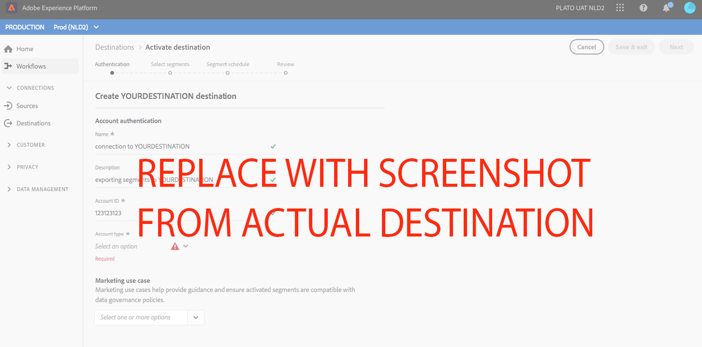
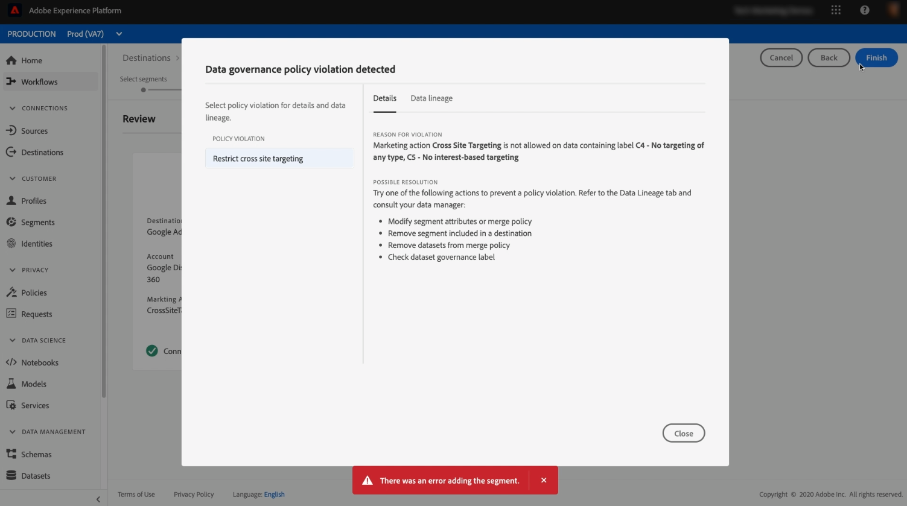

# DESTINAZIONE {#your-destination}

*Passando al modello, sostituisci o elimina tutti i paragrafi in corsivo (a partire da questo).*

*Per iniziare, aggiorna i metadati (titolo e descrizione) nella parte superiore della pagina. Ignora tutte le istanze di UICONTROL in questa pagina. Questo è un tag che aiuta i nostri processi di traduzione automatica a tradurre correttamente la pagina nelle diverse lingue supportate. Dopo l&#39;invio verranno aggiunti dei tag alla documentazione.*

## Panoramica {#overview}

*Fornisci una breve panoramica della tua azienda, compreso il valore che fornisce ai clienti. Includi un collegamento alla home page della documentazione del prodotto per ulteriori informazioni.*

>[!IMPORTANT]
>
>Questa pagina della documentazione è stata creata dal team *YOURDESTINATION*. Per qualsiasi richiesta di aggiornamento o di richiesta di aggiornamento, si prega di contattarli direttamente all&#39;indirizzo *Inserisci link o indirizzo e-mail dove è possibile raggiungere per gli aggiornamenti*

## Prerequisiti {#prerequisites}

*Aggiungi in questa sezione informazioni su qualsiasi cosa i clienti devono sapere prima di iniziare a configurare la destinazione nell’interfaccia utente di Adobe Experience Platform. Può trattarsi di:*

* *aggiunta a un elenco consentiti*
* *requisiti per l’hash delle e-mail*
* *tutte le specifiche dell&#39;account sul tuo lato*
* *come ottenere una chiave API per connettersi alla piattaforma*

*Se utile per i clienti, puoi collegarti alla documentazione pertinente.*

## Identità supportate {#supported-identities}

*Aggiungi in questa sezione informazioni sulle identità supportate dalla destinazione. Abbiamo precompilato la tabella con alcuni valori standard. Elimina i valori che non si applicano alla destinazione e tutti i valori non precompilati.*

** YOURDESTINATIONsupporta l’attivazione delle identità descritte nella tabella seguente. Ulteriori informazioni su [identità](https://experienceleague.adobe.com/docs/experience-platform/identity/namespaces.html?lang=en#getting-started).

| Identità di destinazione | Descrizione | Considerazioni |
|---|---|---|
| GAID | Google Advertising ID | Selezionare l&#39;identità di destinazione GAID quando l&#39;identità di origine è uno spazio dei nomi GAID. |
| IDFA | Apple ID per gli inserzionisti | Seleziona l’identità di destinazione IDFA quando l’identità di origine è uno spazio dei nomi IDFA. |
| ECID | Experience Cloud ID | Spazio dei nomi che rappresenta ECID. Questo namespace può essere indicato anche dai seguenti alias: &quot;Adobe Marketing Cloud ID&quot;, &quot;Adobe Experience Cloud ID&quot;, &quot;Adobe Experience Platform ID&quot;. Per ulteriori informazioni, consulta il seguente documento su [ECID](https://experienceleague.adobe.com/docs/experience-platform/identity/ecid.html) . |
| phone_sha256 | Hash dei numeri di telefono con l&#39;algoritmo SHA256 | Sia il testo normale che i numeri di telefono con hash SHA256 sono supportati da Adobe Experience Platform. Quando il campo di origine contiene attributi senza hash, seleziona l&#39;opzione **[!UICONTROL Applica trasformazione]** per fare in modo che [!DNL Platform] hash automaticamente i dati all&#39;attivazione. |
| email_lc_sha256 | Indirizzi e-mail con hash con l’algoritmo SHA256 | Gli indirizzi e-mail con hash SHA256 e di testo normale sono supportati da Adobe Experience Platform. Quando il campo di origine contiene attributi senza hash, seleziona l&#39;opzione **[!UICONTROL Applica trasformazione]** per fare in modo che [!DNL Platform] hash automaticamente i dati all&#39;attivazione. |
| extern_id | ID utente personalizzati | Seleziona questa identità di destinazione quando l’identità di origine è uno spazio dei nomi personalizzato. |

{style=&quot;table-layout:auto&quot;}

## Tipo di esportazione {#export-type}

**Esportazione segmento** : esporta tutti i membri di un segmento (pubblico) con gli identificatori (nome, numero di telefono o altri) utilizzati nella destinazione  ** YOURDESTINATION.

## Casi d’uso

Per comprendere meglio come e quando utilizzare la destinazione *YOURDESTINATION*, ecco alcuni esempi di casi d’uso che i clienti Adobe Experience Platform possono risolvere utilizzando questa destinazione.


### Caso d&#39;uso n. 1

*Per le piattaforme di messaggistica mobile:*

*Una piattaforma di noleggio e vendita di casa vuole inviare notifiche mobili ai dispositivi Android e iOS dei clienti per far loro sapere che ci sono 100 elenchi aggiornati nell&#39;area in cui hanno precedentemente cercato un noleggio.*

### Caso d&#39;uso n. 2

*Per le piattaforme di social network:*

*Un marchio di abbigliamento atletico vuole raggiungere i clienti esistenti attraverso i loro account social media. Il marchio di abbigliamento può acquisire indirizzi e-mail dal proprio CRM a Adobe Experience Platform, creare segmenti dai propri dati offline e inviare tali segmenti a YOURDESTINATION, per visualizzare annunci nei feed di social media dei propri clienti.*

## Collegati alla destinazione {#connect}

Per connetterti a questa destinazione, segui i passaggi descritti nel [tutorial sulla configurazione della destinazione](https://experienceleague.adobe.com/docs/experience-platform/destinations/ui/connect-destination.html).

### Parametri di connessione {#parameters}

Durante la [configurazione](https://experienceleague.adobe.com/docs/experience-platform/destinations/ui/connect-destination.html) di questa destinazione, è necessario fornire le seguenti informazioni:

*Aggiungi i campi che i clienti devono compilare al momento della configurazione di una nuova destinazione. Questi campi sono specifici della destinazione e dipendono dalla configurazione nell’SDK di Destinazione. I campi della destinazione potrebbero non corrispondere a quelli elencati di seguito.*

* **[!UICONTROL Nome]**: Nome con cui riconoscerai questa destinazione in futuro.
* **[!UICONTROL Descrizione]**: Una descrizione che ti aiuterà a identificare questa destinazione in futuro.
* **[!UICONTROL ID]** account: Il tuo ID account  ** YOURDESTINATION.


<!--

*Replace YOURDESTINATION with your destination name and TOBEFILLEDIN with the category that your destination belongs to.*

1. In **[!UICONTROL Destinations]** > **[!UICONTROL Catalog]**, scroll to the ***TOBEFILLEDIN*** category. Select ***YOURDESTINATION***, then select **[!UICONTROL Configure]**.


    >[!NOTE]
    >
    >If a connection with this destination already exists, you can see an **[!UICONTROL Activate]** button on the destination card. For more information about the difference between **[!UICONTROL Activate]** and **[!UICONTROL Configure]**, refer to the [Catalog](https://experienceleague.adobe.com/docs/experience-platform/destinations/ui/destinations-workspace.html#catalog) section of the destination workspace documentation.  

    

2. In the **Account** step, if you had previously set up a connection to your *YOURDESTINATION* destination, select **[!UICONTROL Existing Account]** and select your existing connection. Or, you can select **[!UICONTROL New Account]** to set up a new connection to *YOURDESTINATION*. Select **[!UICONTROL Connect to destination]** to log in and connect Adobe Experience Cloud to your *YOURDESTINATION* account.

    >[!NOTE]
    >
    >Adobe Experience Platform supports credentials validation in the authentication process and displays an error message if you input incorrect credentials to your ***YOURDESTINATION*** account. This ensures that you don't complete the workflow with incorrect credentials.

3. Once your credentials are confirmed and Adobe Experience Cloud is connected to your ***YOURDESTINATION*** account, you can select **[!UICONTROL Next]** to proceed to the **[!UICONTROL Setup]** step.

4. In the **[!UICONTROL Authentication]** step, enter a **[!UICONTROL Name]** and a **[!UICONTROL Description]** for your activation flow and fill your account ID. <br> Also in this step, you can select any marketing action that should apply to this destination. Marketing actions indicate the intent for which data will be exported to the destination. You can select from Adobe-defined marketing actions or you can create your own marketing action. For more information about marketing actions, see the [Data usage policies overview](https://experienceleague.adobe.com/docs/experience-platform/data-governance/policies/overview.html).

    

5. Your destination is now created. You can select **[!UICONTROL Save & Exit]** if you want to activate segments later on or you can select **[!UICONTROL Next]** to continue the workflow and select segments to activate. In either case, see the next section, [Activate segments](#activate-segments), for the rest of the workflow.

-->

## Attiva i segmenti in questa destinazione {#activate}

Leggi [Attiva profili e segmenti nelle destinazioni di esportazione dei segmenti in streaming](https://experienceleague.adobe.com/docs/experience-platform/destinations/ui/activate/activate-segment-streaming-destinations.html?lang=en) per istruzioni sull&#39;attivazione dei segmenti di pubblico in questa destinazione.

<!--

To activate segments to *YOURDESTINATION*, follow the steps below: 

1. In **[!UICONTROL Destinations > Browse]**, select the *YOURDESTINATION* destination where you want to activate your segments.

2. Click the name of the destination. This takes you to the Activate flow.
    
    Note that if an activation flow already exists for a destination, you can see the segments that are currently being sent to the destination. Select **[!UICONTROL Edit activation]** in the right rail and follow the steps below to modify the activation details.
3. Select **[!UICONTROL Activate]**;
4. In the **[!UICONTROL Activate destination]** workflow, on the **[!UICONTROL Select Segments]** page, select which segments to send to *YOURDESTINATION*.
    
5.  In the **[!UICONTROL Mapping]** step, select which attributes and identities from the source XDM schema to map to the target schema. Select **[!UICONTROL Add new mapping]** and browse your schema, select identity namespaces and map them to the corresponding target identity.  
 <br>&nbsp;
   *Plain text email address as primary identity*: If you have plain text (unhashed) email addresses as primary identity in your schema, select the email field in your **[!UICONTROL Source Attributes]** and map to the Email field in the right column under **[!UICONTROL Target Identities]**, as shown below. Set up a mapping between any other attributes you plan to use.
    <br>&nbsp;
6. On the **[!UICONTROL Segment schedule]** page, you can set the start date for sending data to the destination.
7. On the **[!UICONTROL Review]** page, you can see a summary of your selection. Select **[!UICONTROL Cancel]** to break up the flow, **[!UICONTROL Back]** to modify your settings, or **[!UICONTROL Finish]** to confirm your selection and start sending data to the destination.

>[!IMPORTANT]
>
>In this step, Adobe Experience Platform checks for data usage policy violations. Shown below is an example where a policy is violated. You cannot complete the segment activation workflow until you have resolved the violation. For information on how to resolve policy violations, see [Policy enforcement](https://experienceleague.adobe.com/docs/experience-platform/data-governance/enforcement/auto-enforcement.html#enforcement) in the data governance documentation section.
 


If no policy violations have been detected, select **[!UICONTROL Finish]** to confirm your selection and start sending data to the destination.


-->

## Dati esportati {#exported-data}

*Aggiungi una nota sulla modalità di esportazione dei dati nella destinazione. In questo modo, il cliente potrà assicurarsi che si sia correttamente integrato con la destinazione. Ad esempio, puoi fornire un esempio JSON come quello sottostante.*

```
{
  "person": {
    "email": "yourstruly@adobe.con"
  },
  "segmentMembership": {
    "ups": {
      "7841ba61-23c1-4bb3-a495-00d3g5fe1e93": {
        "lastQualificationTime": "2020-05-25T21:24:39Z",
        "status": "exited"
      },
      "59bd2fkd-3c48-4b18-bf56-4f5c5e6967ae": {
        "lastQualificationTime": "2020-05-25T23:37:33Z",
        "status": "existing"
      }
    }
  },
  "identityMap": {
    "ecid": [
      {
        "id": "14575006536349286404619648085736425115"
      },
      {
        "id": "66478888669296734530114754794777368480"
      }
    ],
    "email_lc_sha256": [
      {
        "id": "655332b5fa2aea4498bf7a290cff017cb4"
      },
      {
        "id": "66baf76ef9de8b42df8903f00e0e3dc0b7"
      }
    ]
  }
}
```

## Utilizzo e governance dei dati {#data-usage-governance}

Tutte le destinazioni [!DNL Adobe Experience Platform] sono conformi ai criteri di utilizzo dei dati durante la gestione dei dati. Per informazioni dettagliate su come [!DNL Adobe Experience Platform] impone la governance dei dati, consulta la [Panoramica sulla governance dei dati](https://experienceleague.adobe.com/docs/experience-platform/data-governance/home.html).

## Risorse aggiuntive {#additional-resources}

*Puoi fornire ulteriori collegamenti alla documentazione del prodotto o altre risorse che ritieni importanti per il successo del cliente.*
