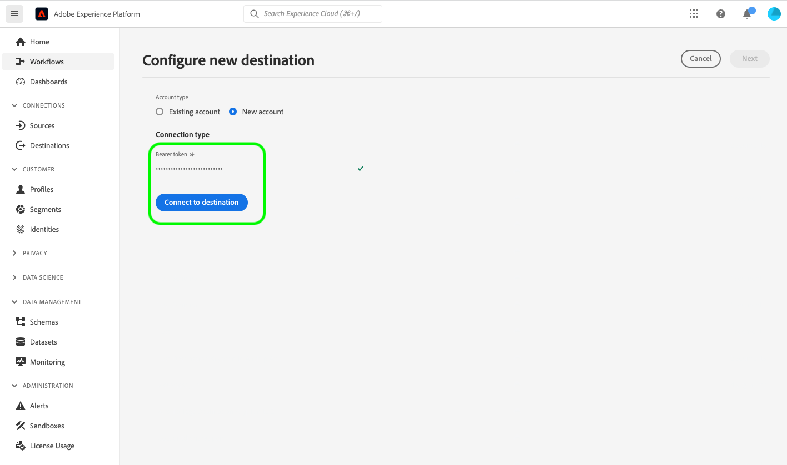

# Connessione destinazione {#your-destination}

*Durante l&#39;analisi di questo modello, sostituire o eliminare tutti i paragrafi in corsivo, a partire da questo.*

*Inizia aggiornando i metadati (titolo e descrizione) nella parte superiore della pagina. Ignora tutte le istanze di UICONTROL in questa pagina. Questo tag aiuta i nostri processi di traduzione automatica a tradurre correttamente la pagina nelle diverse lingue supportate. Dopo l’invio, aggiungeremo dei tag alla documentazione.*

>[!IMPORTANT]
>
>* Compila tutte le sezioni di questo modello nell&#39;ordine in cui sono descritte nel modello.
>* Questo modello viene aggiornato raramente in base al feedback ricevuto dai partner. Prima di iniziare a creare la documentazione per la destinazione, assicurati di aver scaricato [versione più recente del modello](../assets/docs-framework/yourdestination-template.zip).

## Panoramica {#overview}

*Fornisci una breve panoramica della tua azienda, compreso il valore che offre ai clienti. Includi un collegamento alla pagina Home della documentazione del prodotto, per ulteriori informazioni.*

>[!IMPORTANT]
>
>Il connettore di destinazione e la pagina della documentazione vengono creati e gestiti da *Destinazione* team. Per eventuali richieste di informazioni o richieste di aggiornamento, contattatele direttamente all&#39;indirizzo *Inserisci il collegamento o l’indirizzo e-mail a cui puoi accedere per aggiornamenti, ad esempio `support@YourDestination.com`.*

## Casi d’uso {#use-cases}

Per aiutarti a capire meglio come e quando utilizzare il *Destinazione* destinazione: di seguito sono riportati alcuni casi di utilizzo esemplificativi che i clienti di Adobe Experience Platform possono risolvere utilizzando questa destinazione.

### #1 del caso d’uso {#use-case-1}

*Per le piattaforme di messaggistica mobile:*

*Una piattaforma di noleggio e vendita a domicilio vuole inviare notifiche mobili ai dispositivi Android e iOS dei clienti per far sapere che ci sono 100 inserzioni aggiornate nella zona in cui prima hanno cercato un noleggio.*

### #2 del caso d’uso {#use-case-2}

*Per le piattaforme di social network:*

*Un marchio di abbigliamento sportivo vuole raggiungere i clienti esistenti attraverso i loro account di social media. Il marchio di abbigliamento può acquisire indirizzi e-mail dal proprio CRM per Adobe Experience Platform, creare tipi di pubblico dai propri dati offline e inviare tali tipi di pubblico a YourDestination, per visualizzare annunci nei feed di social media dei propri clienti.*

## Prerequisiti {#prerequisites}

*In questa sezione aggiungi informazioni su tutto ciò di cui i clienti devono essere a conoscenza prima di iniziare a impostare la destinazione nell’interfaccia utente di Adobe Experience Platform. Informazioni su:*

* *necessità di aggiunta a un elenco consentiti*
* *requisiti per l’hashing delle e-mail*
* *qualsiasi specifica dell’account a tuo favore*
* *come ottenere una chiave API per connettersi alla piattaforma*

*Puoi creare un collegamento alla documentazione rilevante, se utile per i clienti.*

## Identità supportate {#supported-identities}

*Aggiungi informazioni in questa sezione sulle identità supportate dalla destinazione. Abbiamo precompilato la tabella con alcuni valori standard. Elimina i valori non applicabili alla destinazione e/o aggiungi eventuali valori non precompilati.*

*Destinazione* supporta l’attivazione delle identità descritte nella tabella seguente. Ulteriori informazioni su [identità](/help/identity-service/features/namespaces.md).

| Identità di destinazione | Descrizione | Considerazioni |
|---|---|---|
| GAID | Google Advertising ID | Seleziona l’identità di destinazione GAID quando l’identità di origine è uno spazio dei nomi GAID. |
| IDFA | Apple ID per inserzionisti | Selezionare l&#39;identità di destinazione IDFA quando l&#39;identità di origine è uno spazio dei nomi IDFA. |
| ECID | Experience Cloud ID | Uno spazio dei nomi che rappresenta ECID. A questo spazio dei nomi possono fare riferimento anche i seguenti alias: &quot;Adobe Marketing Cloud ID&quot;, &quot;Adobe Experience Cloud ID&quot;, &quot;Adobe Experience Platform ID&quot;. Leggi il seguente documento su [ECID](/help/identity-service/features/ecid.md) per ulteriori informazioni. |
| phone_sha256 | Numeri di telefono con hash con algoritmo SHA256 | I numeri di telefono con hash SHA256 e testo normale sono supportati da Adobe Experience Platform. Quando il campo sorgente contiene attributi senza hash, seleziona la **[!UICONTROL Applica trasformazione]** opzione, per avere [!DNL Platform] esegui automaticamente l’hash dei dati all’attivazione. |
| email_lc_sha256 | Indirizzi e-mail con hash con algoritmo SHA256 | Adobe Experience Platform supporta sia gli indirizzi di posta elettronica in testo normale che quelli con hash SHA256. Quando il campo sorgente contiene attributi senza hash, seleziona la **[!UICONTROL Applica trasformazione]** opzione, per avere [!DNL Platform] esegui automaticamente l’hash dei dati all’attivazione. |
| extern_id | ID utente personalizzati | Seleziona questa identità di destinazione quando l&#39;identità di origine è uno spazio dei nomi personalizzato. |

{style="table-layout:auto"}

## Tipi di pubblico supportati {#supported-audiences}

*Aggiungi in questa sezione informazioni sui tipi di pubblico supportati dalla destinazione. Abbiamo precompilato la tabella con alcuni valori standard. Utilizza il `✓` e `X` caratteri per contrassegnare se il tipo di pubblico è supportato da questa destinazione.*

Questa sezione descrive quali tipi di pubblico puoi esportare in questa destinazione.

| Origine pubblico | Supportati | Descrizione |
---------|----------|----------|
| [!DNL Segmentation Service] | ✓ | Tipi di pubblico generati dall’Experience Platform [Servizio di segmentazione](../../../segmentation/home.md). |
| Caricamenti personalizzati | X | Tipi di pubblico [importato](../../../segmentation/ui/overview.md#import-audience) in Experienci Platform da file CSV. |

{style="table-layout:auto"}

## Tipo e frequenza di esportazione {#export-type-frequency}

*Nella tabella, mantieni solo le righe corrispondenti alla destinazione. Dovresti avere una riga per il tipo di esportazione e una riga per la frequenza di esportazione. Elimina i valori che non si applicano alla destinazione.*

Per informazioni sul tipo e sulla frequenza di esportazione della destinazione, consulta la tabella seguente.

| Elemento | Tipo | Note |
---------|----------|---------|
| Tipo di esportazione | **[!UICONTROL Esportazione pubblico]** | Stai esportando tutti i membri di un pubblico con gli identificatori (nome, numero di telefono o altri) utilizzati in *Destinazione* destinazione. |
| Tipo di esportazione | **[!UICONTROL Basato su profilo]** | Stai esportando tutti i membri di un pubblico, insieme ai campi dello schema desiderati (ad esempio: indirizzo e-mail, numero di telefono, cognome), come scelto nella schermata seleziona attributi profilo del [flusso di lavoro di attivazione della destinazione](/help/destinations/ui/activate-batch-profile-destinations.md#select-attributes). |
| Tipo di esportazione | **[!UICONTROL Esportazione set di dati]** | Stai esportando set di dati non elaborati, che non sono raggruppati o strutturati in base agli interessi o alle qualifiche del pubblico. |
| Frequenza di esportazione | **[!UICONTROL Streaming]** | Le destinazioni di streaming sono connessioni &quot;sempre attive&quot; basate su API. Non appena un profilo viene aggiornato in Experienci Platform in base alla valutazione del pubblico, il connettore invia l’aggiornamento a valle alla piattaforma di destinazione. Ulteriori informazioni su [destinazioni di streaming](/help/destinations/destination-types.md#streaming-destinations). |
| Frequenza di esportazione | **[!UICONTROL Batch]** | Le destinazioni batch esportano i file sulle piattaforme a valle con incrementi di tre, sei, otto, dodici o ventiquattro ore. Ulteriori informazioni su [destinazioni basate su file batch](/help/destinations/destination-types.md#file-based). |

{style="table-layout:auto"}

## Connettersi alla destinazione {#connect}

>[!IMPORTANT]
> 
>Per connettersi alla destinazione, è necessario **[!UICONTROL Visualizza destinazioni]** e **[!UICONTROL Gestire le destinazioni]** [autorizzazioni di controllo degli accessi](/help/access-control/home.md#permissions). Leggi le [panoramica sul controllo degli accessi](/help/access-control/ui/overview.md) oppure contatta l’amministratore del prodotto per ottenere le autorizzazioni necessarie.

Per connettersi a questa destinazione, seguire i passaggi descritti in [esercitazione sulla configurazione della destinazione](../../ui/connect-destination.md). Nel flusso di lavoro di configurazione della destinazione, compila i campi elencati nelle due sezioni seguenti.

### Autenticarsi nella destinazione {#authenticate}

*Aggiungi i campi che i clienti devono compilare per l’autenticazione nella destinazione. Questi campi sono specifici per la destinazione e dipendono dalla configurazione in Destination SDK. I campi della destinazione potrebbero non essere gli stessi elencati di seguito. Includi anche una schermata simile a quella di esempio mostrata di seguito.*

Per autenticare nella destinazione, compila i campi obbligatori e seleziona **[!UICONTROL Connetti alla destinazione]**.



* **[!UICONTROL Token Bearer]**: inserisci il token Bearer per l’autenticazione nella destinazione.

### Inserire i dettagli della destinazione {#destination-details}

*Aggiungi i campi che i clienti devono compilare durante la configurazione di una nuova destinazione. Questi campi sono specifici per la destinazione e dipendono dalla configurazione in Destination SDK. I campi della destinazione potrebbero non essere gli stessi elencati di seguito. Includi anche una schermata simile a quella di esempio mostrata di seguito.*

Per configurare i dettagli per la destinazione, compila i campi obbligatori e facoltativi seguenti. Un asterisco accanto a un campo nell’interfaccia utente indica che il campo è obbligatorio.


* **[!UICONTROL Nome]**: nome con cui riconoscerai questa destinazione in futuro.
* **[!UICONTROL Descrizione]**: descrizione che ti aiuterà a identificare questa destinazione in futuro.
* **[!UICONTROL ID account]**: il tuo *Destinazione* ID account.

### Abilita avvisi {#enable-alerts}

Puoi abilitare gli avvisi per ricevere notifiche sullo stato del flusso di dati verso la tua destinazione. Seleziona un avviso dall’elenco per abbonarti e ricevere notifiche sullo stato del flusso di dati. Per ulteriori informazioni sugli avvisi, consulta la guida su [abbonamento agli avvisi sulle destinazioni tramite l’interfaccia utente](../../ui/alerts.md).

Una volta completate le informazioni sulla connessione di destinazione, seleziona **[!UICONTROL Successivo]**.

## Attivare tipi di pubblico in questa destinazione {#activate}

>[!IMPORTANT]
> 
>* Per attivare i dati, è necessario **[!UICONTROL Visualizza destinazioni]**, **[!UICONTROL Attivare le destinazioni]**, **[!UICONTROL Visualizza profili]**, e **[!UICONTROL Visualizzare segmenti]** [autorizzazioni di controllo degli accessi](/help/access-control/home.md#permissions). Leggi le [panoramica sul controllo degli accessi](/help/access-control/ui/overview.md) oppure contatta l’amministratore del prodotto per ottenere le autorizzazioni necessarie.
>* Per esportare *identità*, è necessario **[!UICONTROL Visualizza grafico delle identità]** [autorizzazione per il controllo degli accessi](/help/access-control/home.md#permissions). <br> {width="100" zoomable="yes"}

*Elimina in base alle esigenze: se stai documentando una nuova destinazione di streaming, tieni il primo paragrafo seguente. Se stai documentando una nuova destinazione basata su file, mantieni il secondo paragrafo. Se stai documentando una destinazione che esporta set di dati, mantieni il terzo paragrafo.*

Letto [Attiva profili e tipi di pubblico nelle destinazioni di esportazione del pubblico in streaming](/help/destinations/ui/activate-segment-streaming-destinations.md) per istruzioni sull’attivazione dei tipi di pubblico in questa destinazione.

Letto [Attivare i dati del pubblico nelle destinazioni di esportazione del profilo batch](/help/destinations/ui/activate-batch-profile-destinations.md) per istruzioni sull’attivazione dei tipi di pubblico in questa destinazione.

Letto [(Beta) Esportare i set di dati](/help/destinations/ui/export-datasets.md) per istruzioni dettagliate sull’esportazione dei set di dati in questa destinazione.

### Mappare attributi e identità {#map}

*Aggiungi informazioni sulle mappature supportate tra i campi di origine e di destinazione nel passaggio Mappatura del flusso di lavoro di attivazione. La destinazione potrebbe supportare l’esportazione di attributi di profilo, spazi dei nomi delle identità o entrambi. Alcuni campi potrebbero essere obbligatori. Gli attributi di destinazione possono essere predefiniti o personalizzati. Richiama le avvertenze importanti e utilizza esempi, preferibilmente con schermate. Due esempi di pagine di destinazione che è possibile utilizzare come riferimento sono:*

* *[Pega](/help/destinations/catalog/personalization/pega.md#mapping-example)*
* *[Medallia](/help/destinations/catalog/voice/medallia-connector.md#map)*

## Dati esportati / Convalida esportazione dati {#exported-data}

*Aggiungi un paragrafo sulla modalità di esportazione dei dati nella destinazione. In questo modo il cliente può essere certo di essersi integrato correttamente con la destinazione. Ad esempio, puoi fornire un codice JSON di esempio simile a quello riportato di seguito. In alternativa, puoi fornire schermate e informazioni dall’interfaccia della destinazione che mostrano come i clienti dovrebbero aspettarsi che i tipi di pubblico si popolino nella piattaforma di destinazione.*

```
{
  "person": {
    "email": "yourstruly@adobe.com"
  },
  "segmentMembership": {
    "ups": {
      "7841ba61-23c1-4bb3-a495-00d3g5fe1e93": {
        "lastQualificationTime": "2020-05-25T21:24:39Z",
        "status": "exited"
      },
      "59bd2fkd-3c48-4b18-bf56-4f5c5e6967ae": {
        "lastQualificationTime": "2020-05-25T23:37:33Z",
        "status": "realized"
      }
    }
  },
  "identityMap": {
    "ecid": [
      {
        "id": "14575006536349286404619648085736425115"
      },
      {
        "id": "66478888669296734530114754794777368480"
      }
    ],
    "email_lc_sha256": [
      {
        "id": "655332b5fa2aea4498bf7a290cff017cb4"
      },
      {
        "id": "66baf76ef9de8b42df8903f00e0e3dc0b7"
      }
    ]
  }
}
```

## Utilizzo dei dati e governance {#data-usage-governance}

Tutti [!DNL Adobe Experience Platform] le destinazioni sono conformi ai criteri di utilizzo dei dati durante la gestione dei dati. Per informazioni dettagliate su come [!DNL Adobe Experience Platform] applica la governance dei dati, leggi [Panoramica sulla governance dei dati](/help/data-governance/home.md).

## Risorse aggiuntive {#additional-resources}

*Puoi fornire ulteriori collegamenti alla documentazione del prodotto o a qualsiasi altra risorsa ritenuta importante per il successo del cliente.*