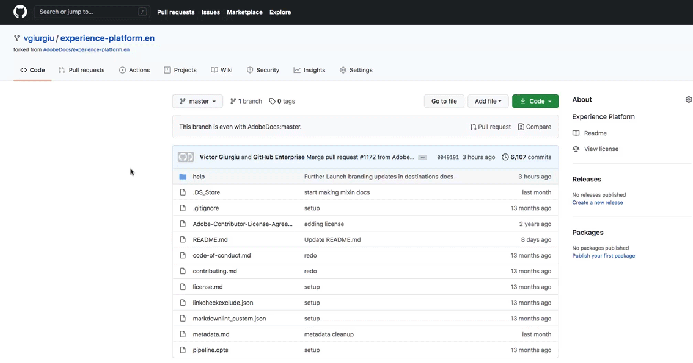

# Utilizza l’interfaccia web GitHub per creare una pagina della documentazione di destinazione {#github-interface}

Le istruzioni seguenti mostrano come utilizzare l’interfaccia web GitHub per creare la documentazione e inviare una richiesta di pull (PR). Prima di eseguire i passaggi qui indicati, assicurati di leggere [Documentare la destinazione in Destinazioni Adobe Experience Platform](./documentation-instructions.md).

>[!TIP]
>
>Consulta anche la documentazione di supporto nella guida per i collaboratori di Adobe:
>* [Installare gli strumenti di creazione Git e Markdown](https://experienceleague.adobe.com/docs/contributor/contributor-guide/setup/install-tools.html)
>* [Configurare localmente l’archivio Git per la documentazione](https://experienceleague.adobe.com/docs/contributor/contributor-guide/setup/local-repo.html)
>* [Flusso di lavoro dei contributi GitHub per modifiche principali](https://experienceleague.adobe.com/docs/contributor/contributor-guide/setup/full-workflow.html).

## Configurare l’ambiente di authoring GitHub {#set-up-environment}

1. Nel browser, passa a `https://github.com/AdobeDocs/experience-platform.en`.
2. A [fork](https://experienceleague.adobe.com/docs/contributor/contributor-guide/setup/local-repo.html#fork-the-repository) nell’archivio, fai clic su **Fork** come mostrato di seguito. In questo modo viene creata una copia dell’archivio di Experienci Platform nel tuo account GitHub.

   

3. Nel fork dell’archivio, crea un nuovo ramo per il progetto, come illustrato di seguito. Utilizza questo nuovo ramo per il tuo lavoro.

   

4. Nella struttura di cartelle GitHub dell’archivio con fork, passa a `experience-platform.en/help/destinations/catalog/[...]`, dove `[...]` è la categoria desiderata per la destinazione. Ad Experience Platform, se stai aggiungendo una destinazione di personalizzazione a, seleziona la `personalization` categoria. Seleziona **Aggiungi file > Crea nuovo file**.

   

5. Assegna un nome alla destinazione `YOURDESTINATION.md`, dove YOURDESTINATION è il nome della destinazione in Adobe Experience Platform. Ad esempio, se la tua società si chiama Moviestar, dovrai denominare il file `moviestar.md`.

## Creare la pagina della documentazione per la destinazione {#author-documentation}

1. Creerai il contenuto della pagina di destinazione in base al [modello self-service della documentazione](./self-service-template.md). **[Scarica](../assets/docs-framework/yourdestination-template.zip)** il modello e decomprimerlo per estrarre il `.md` modello di file.
2. Incollare e modificare il contenuto del modello con le informazioni rilevanti per la destinazione in un editor markdown online, ad esempio [dillinger.io](https://dillinger.io/). Seguire le istruzioni nel modello per i dettagli su cosa compilare e quali paragrafi possono essere rimossi.

   >[!TIP]
   >
   >Puoi chiudere la finestra del browser in qualsiasi momento e riaprirla in un secondo momento. Il tuo lavoro viene salvato automaticamente e ti aspetta quando riapri il browser.
3. Copia il contenuto dall’editor markdown nel nuovo file in GitHub.
4. Per qualsiasi schermata o immagine che intendi utilizzare, utilizza l’interfaccia GitHub per caricare i file in `experience-platform.en/help/destinations/assets/catalog/[...]`, dove `[...]` è la categoria desiderata per la destinazione. Ad Experience Platform, se stai aggiungendo una destinazione di personalizzazione a, seleziona la `personalization` categoria. Devi collegare alle immagini dalla pagina che stai creando. Consulta [istruzioni su come collegare le immagini](https://experienceleague.adobe.com/docs/contributor/contributor-guide/writing-essentials/linking.html#link-to-images).

   

5. Quando sei pronto, salva il file nel ramo.

## Inviare la documentazione per la revisione {#submit-review}

>[!TIP]
>
>Tieni presente che qui non è possibile interrompere nulla. Attenendoti alle istruzioni riportate in questa sezione, ti basta suggerire un aggiornamento della documentazione. L’aggiornamento suggerito verrà approvato o modificato dal team di documentazione di Adobe Experience Platform.

1. Dopo aver salvato il file e caricato le immagini desiderate, puoi aprire una richiesta di pull (PR) per unire il ramo di lavoro nel ramo principale dell’archivio della documentazione di Adobe. Assicurati che il ramo su cui hai lavorato sia selezionato e seleziona **Contribute > Apri richiesta pull**.

1. Assicurati che i rami di base e di confronto siano corretti. Aggiungi una nota alla PR, descrivendo l’aggiornamento, e seleziona **Creare una richiesta di pull**. Viene aperto un PR per unire il ramo di lavoro del fork nel ramo principale dell’archivio di Adobi.

   >[!TIP]
   >
   >Lascia **Consenti modifiche da parte dei gestori** è stata selezionata una casella di controllo che consente al team della documentazione di Adobe di apportare modifiche alla PR.

   

1. A questo punto, viene visualizzata una notifica che richiede di firmare il Contratto di licenza da collaboratore (CLA) di Adobe. Questo è un passaggio obbligatorio. Dopo aver firmato il contratto di licenza, aggiorna la pagina PR e invia la richiesta di pull.

1. Puoi confermare che la richiesta di pull è stata inviata esaminando **Richieste pull** scheda in `https://github.com/AdobeDocs/experience-platform.en`.

   

1. Grazie. Il team di documentazione di Adobe si rivolgerà al PR nel caso siano necessarie modifiche e ti informerà di quando la documentazione verrà pubblicata.

>[!TIP]
>
>Per aggiungere immagini e collegamenti alla documentazione e per eventuali altre domande su Markdown, leggi [Utilizzo di Markdown](https://experienceleague.adobe.com/docs/contributor/contributor-guide/writing-essentials/markdown.html) nella guida alla scrittura collaborativa di Adobe.
