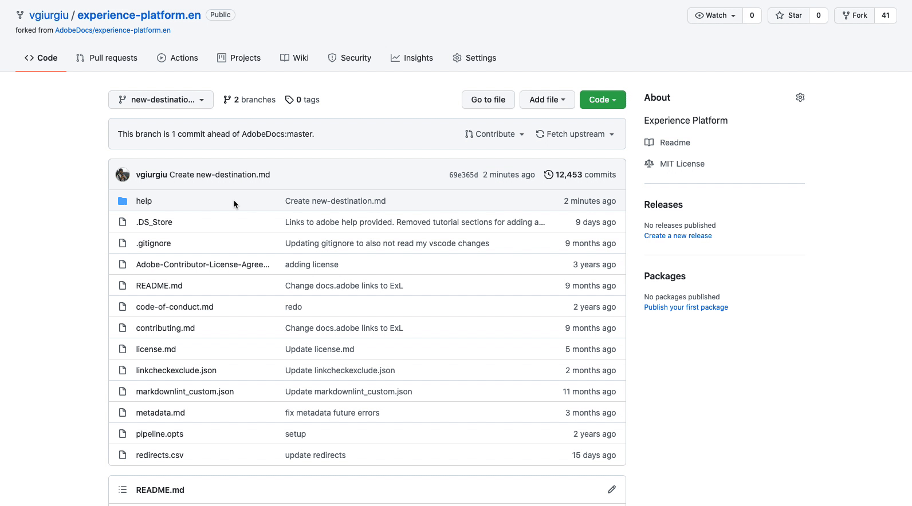

# Utilizza un editor di testo nell’ambiente locale per creare una pagina della documentazione di destinazione {#local-authoring}

Le istruzioni in questa pagina mostrano come utilizzare un editor di testo per lavorare nell’ambiente locale per creare la documentazione e inviare una richiesta di pull (PR). Prima di eseguire i passaggi qui indicati, assicurati di aver letto [Documento la tua destinazione in Destinazioni Adobe Experience Platform](./documentation-instructions.md).

>[!TIP]
>
>Consulta anche la documentazione di supporto nella guida per i collaboratori di Adobe:
>* [Installare gli strumenti di creazione Git e Markdown](https://experienceleague.adobe.com/docs/contributor/contributor-guide/setup/install-tools.html)
>* [Configurazione locale dell&#39;archivio Git per la documentazione](https://experienceleague.adobe.com/docs/contributor/contributor-guide/setup/local-repo.html)
>* [Flusso di lavoro dei contributi GitHub per modifiche principali](https://experienceleague.adobe.com/docs/contributor/contributor-guide/setup/full-workflow.html).

## Connessione a GitHub e configurazione dell’ambiente di authoring locale {#set-up-environment}

1. Nel browser, passa a `https://github.com/AdobeDocs/experience-platform.en`
2. Per [eseguire il fork](https://experienceleague.adobe.com/docs/contributor/contributor-guide/setup/local-repo.html#fork-the-repository) dell&#39;archivio, fare clic su **Effettuare il fork** come illustrato di seguito. In questo modo viene creata una copia dell’archivio di Experienci Platform nel tuo account GitHub.

   

3. Clona l’archivio nel computer locale. Seleziona **Codice > HTTPS > Apri con GitHub Desktop**, come illustrato di seguito. Verificare che sia installato [GitHub Desktop](https://desktop.github.com/). Per ulteriori informazioni, leggere [Creazione di un clone locale dell&#39;archivio](https://experienceleague.adobe.com/docs/contributor/contributor-guide/setup/local-repo.html#create-a-local-clone-of-the-repository) nella guida per i collaboratori Adobe.

   

4. Nella struttura del file locale, passa a `experience-platform.en/help/destinations/catalog/[...]`, dove `[...]` è la categoria desiderata per la destinazione. Se ad Experience Platform si aggiunge una destinazione di personalizzazione, selezionare la cartella `personalization`.

## Creare la pagina della documentazione per la destinazione {#author-documentation}

1. La pagina della documentazione è basata sul [modello di destinazione self-service](../docs-framework/self-service-template.md). Scarica il [modello di destinazione](../assets/docs-framework/yourdestination-template.zip). Decomprimere ed estrarre il file `yourdestination-template.md` nella directory indicata al passaggio 4.  Rinominare il file `YOURDESTINATION.md`, dove YOURDESTINATION è il nome della destinazione in Adobe Experience Platform. Se ad esempio la società si chiama Moviestar, il file verrà denominato `moviestar.md`.
2. Apri il nuovo file nel [editor di testo scelto](https://experienceleague.adobe.com/docs/contributor/contributor-guide/setup/install-tools.html#understand-markdown-editors). L&#39;Adobe consiglia di utilizzare [Visual Studio Code](https://code.visualstudio.com/) e installare l&#39;estensione di authoring Markdown dell&#39;Adobe. Per installare l&#39;estensione, aprire Visual Studio Code, selezionare la scheda **[!DNL Extensions]** a sinistra dello schermo e cercare `adobe markdown authoring`. Selezionare l&#39;estensione e fare clic su **[!DNL Install]**.
   
3. Modifica il modello con le informazioni rilevanti per la destinazione. Segui le istruzioni nel modello.
4. Per qualsiasi schermata o immagine che intendi aggiungere alla documentazione, vai a `GitHub/experience-platform.en/help/destinations/assets/catalog/[...]`, dove `[...]` è la categoria desiderata per la tua destinazione. Se ad Experience Platform si aggiunge una destinazione di personalizzazione, selezionare la cartella `personalization`. Crea una nuova cartella per la destinazione e salva qui le immagini. Devi creare un collegamento a tali elementi dalla pagina in cui vengono creati. Consulta [istruzioni su come collegare le immagini](https://experienceleague.adobe.com/docs/contributor/contributor-guide/writing-essentials/linking.html#link-to-images).
5. Quando si è pronti, salvare il file su cui si sta lavorando.

## Inviare la documentazione per la revisione {#submit-review}

>[!TIP]
>
>Tieni presente che qui non è possibile interrompere nulla. Attenendoti alle istruzioni riportate in questa sezione, ti basta suggerire un aggiornamento della documentazione. L’aggiornamento suggerito verrà approvato o modificato dal team di documentazione di Adobe Experience Platform.

1. In GitHub Desktop, crea un ramo di lavoro per gli aggiornamenti e seleziona **ramo Publish** per pubblicare il ramo in GitHub.

1. Nel desktop GitHub, [conferma](https://docs.github.com/en/free-pro-team@latest/github/getting-started-with-github/github-glossary#commit) il tuo lavoro, come mostrato di seguito.

   

1. In GitHub Desktop, [invia](https://docs.github.com/en/free-pro-team@latest/github/getting-started-with-github/github-glossary#push) il tuo lavoro al ramo [remoto](https://docs.github.com/en/free-pro-team@latest/github/getting-started-with-github/github-glossary#remote), come mostrato di seguito.

   

1. Nell’interfaccia web GitHub, apri una richiesta di pull (PR) per unire il ramo di lavoro nel ramo principale dell’archivio della documentazione di Adobe. Assicurati che il ramo su cui hai lavorato sia selezionato e seleziona **Contribute > Apri richiesta di pull**.

   

1. Assicurati che i rami di base e di confronto siano corretti. Aggiungi una nota alla PR con la descrizione dell&#39;aggiornamento e seleziona **Crea richiesta di pull**. Viene aperto un PR per unire il ramo di lavoro del fork nel ramo principale dell’archivio di Adobi.
   >[!TIP]
   >
   >Lascia selezionata la casella di controllo **Consenti modifiche da parte dei gestori** in modo che il team della documentazione di Adobe possa apportare modifiche all&#39;PR.

   

1. A questo punto, viene visualizzata una notifica che richiede di firmare il Contratto di licenza da collaboratore (CLA) di Adobe. Questo è un passaggio obbligatorio. Dopo aver firmato il contratto di licenza, aggiorna la pagina PR e invia la richiesta di pull.

1. Puoi confermare che la richiesta di pull è stata inviata esaminando la scheda **Richieste pull** in `https://github.com/AdobeDocs/experience-platform.en`.

1. Grazie. Il team di documentazione di Adobe si rivolgerà al PR nel caso siano necessarie modifiche e ti informerà di quando la documentazione verrà pubblicata.

>[!TIP]
>
>Per aggiungere immagini e collegamenti alla documentazione e per eventuali altre domande su Markdown, leggi [Utilizzo di Markdown](https://experienceleague.adobe.com/docs/contributor/contributor-guide/writing-essentials/markdown.html) nella guida alla scrittura collaborativa di Adobe.
