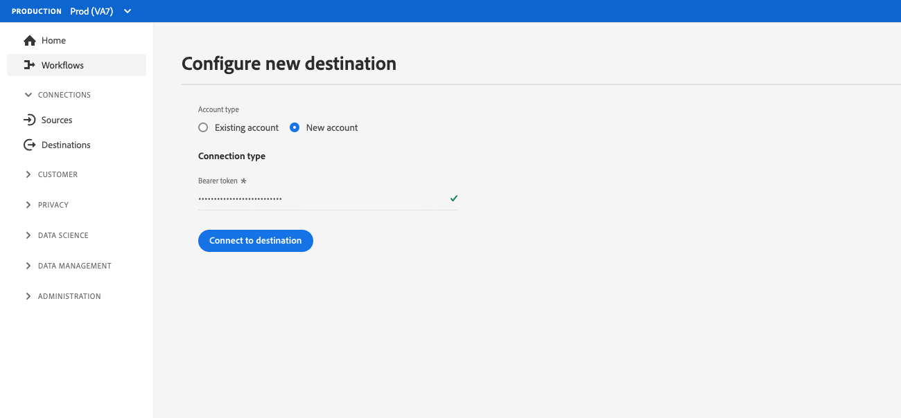

# Configurazione autenticazione cliente

Experienci Platform offre grande flessibilità nei protocolli di autenticazione disponibili per partner e clienti. Puoi configurare la tua destinazione per supportare qualsiasi metodo di autenticazione standard del settore, come [!DNL OAuth2], l’autenticazione del token Bearer, l’autenticazione della password e molto altro.

Questa pagina spiega come impostare la destinazione utilizzando il metodo di autenticazione preferito. In base alla configurazione di autenticazione utilizzata durante la creazione della destinazione, i clienti vedranno diversi tipi di pagine di autenticazione durante la connessione alla destinazione nell’interfaccia utente di Experienci Platform.

Per capire dove questo componente si inserisce in un’integrazione creata con Destination SDK, consulta il diagramma riportato di seguito. [opzioni di configurazione](../configuration-options.md) oppure consulta le seguenti pagine di panoramica sulla configurazione di destinazione:

* [Utilizzare Destination SDK per configurare una destinazione di streaming](../../guides/configure-destination-instructions.md#create-destination-configuration)
* [Utilizzare Destination SDK per configurare una destinazione basata su file](../../guides/configure-file-based-destination-instructions.md#create-destination-configuration)

Prima di poter esportare i dati da Platform alla destinazione, i clienti devono creare una nuova connessione tra Experienci Platform e la destinazione, seguendo i passaggi descritti nella [connessione di destinazione](../../../ui/connect-destination.md) esercitazione.

Quando [creazione di una destinazione](../../authoring-api/destination-configuration/create-destination-configuration.md) attraverso la Destination SDK, `customerAuthenticationConfigurations` definisce ciò che i clienti visualizzano in [schermata di autenticazione](../../../ui/connect-destination.md#authenticate). A seconda del tipo di autenticazione di destinazione, i clienti devono fornire vari dettagli di autenticazione, ad esempio:

* Per le destinazioni che utilizzano [autenticazione di base](#basic), gli utenti devono fornire un nome utente e una password direttamente nella pagina di autenticazione dell’interfaccia utente di Experienci Platform.
* Per le destinazioni che utilizzano [autenticazione bearer](#bearer), gli utenti devono fornire un token Bearer.
* Per le destinazioni che utilizzano [Autorizzazione OAuth2](#oauth2): gli utenti vengono reindirizzati alla pagina di accesso della tua destinazione, dove possono accedere con le loro credenziali.
* Per [Amazon S3](#s3) destinazioni, gli utenti devono fornire la propria [!DNL Amazon S3] chiave di accesso e chiave segreta.
* Per [BLOB di Azure](#blob) destinazioni, gli utenti devono fornire la propria [!DNL Azure Blob] stringa di connessione.

Puoi configurare i dettagli di autenticazione del cliente tramite `/authoring/destinations` endpoint. Consulta le seguenti pagine di riferimento API per esempi dettagliati di chiamate API, in cui puoi configurare i componenti mostrati in questa pagina.

* [Creare una configurazione di destinazione](../../authoring-api/destination-configuration/create-destination-configuration.md)
* [Aggiornare una configurazione di destinazione](../../authoring-api/destination-configuration/update-destination-configuration.md)

Questo articolo descrive tutte le configurazioni di autenticazione dei clienti supportate che è possibile utilizzare per la destinazione e mostra ciò che i clienti vedranno nell’interfaccia utente di Experienci Platform in base al metodo di autenticazione configurato per la destinazione.

>[!IMPORTANT]
>
>La configurazione dell’autenticazione del cliente non richiede la configurazione di alcun parametro. Puoi copiare e incollare i frammenti mostrati in questa pagina nelle chiamate API quando [creazione](../../authoring-api/destination-configuration/create-destination-configuration.md) o [aggiornamento](../../authoring-api/destination-configuration/update-destination-configuration.md) una configurazione di destinazione e gli utenti vedranno la schermata di autenticazione corrispondente nell’interfaccia utente di Platform.

>[!IMPORTANT]
>
>Tutti i nomi e i valori dei parametri supportati da Destination SDK sono **distinzione maiuscole/minuscole**. Per evitare errori di distinzione tra maiuscole e minuscole, utilizza i nomi e i valori dei parametri esattamente come mostrato nella documentazione.

## Tipi di integrazione supportati {#supported-integration-types}

Consulta la tabella seguente per informazioni dettagliate sui tipi di integrazioni che supportano le funzionalità descritte in questa pagina.

| Tipo di integrazione | Supporta la funzionalità |
|---|---|
| Integrazioni in tempo reale (streaming) | Sì |
| Integrazioni basate su file (batch) | Sì |

## Configurazione della regola di autenticazione {#authentication-rule}

Quando utilizzi una delle configurazioni di autenticazione del cliente descritte in questa pagina, imposta sempre `authenticationRule` parametro in [consegna di destinazione](destination-delivery.md) a `"CUSTOMER_AUTHENTICATION"`, come illustrato di seguito.

```json {line-numbers="true" highlight="4"
{
   "destinationDelivery":[
      {
         "authenticationRule":"CUSTOMER_AUTHENTICATION",
         "destinationServerId":"{{destinationServerId}}"
      }
   ]
}
```

## Autenticazione di base {#basic}

L’autenticazione di base è supportata per le integrazioni in tempo reale (streaming) in Experienci Platform.

Quando si configura il tipo di autenticazione di base, gli utenti devono immettere un nome utente e una password per connettersi alla destinazione.


Per impostare l’autenticazione di base per la destinazione, configura `customerAuthenticationConfigurations` sezione tramite `/destinations` endpoint come mostrato di seguito:

```json
"customerAuthenticationConfigurations":[
   {
      "authType":"BASIC"
   }
]
```

## Autenticazione Bearer {#bearer}

Quando configuri il tipo di autenticazione bearer, gli utenti devono immettere il token bearer ottenuto dalla destinazione.



Per impostare l&#39;autenticazione di tipo Bearer per la destinazione, configurare `customerAuthenticationConfigurations` sezione tramite `/destinations` endpoint come mostrato di seguito:

```json
"customerAuthenticationConfigurations":[
   {
      "authType":"BEARER"
   }
]
```

## Autenticazione OAuth 2 {#oauth2}

Gli utenti selezionano **[!UICONTROL Connetti alla destinazione]** per attivare il flusso di autenticazione OAuth 2 nella destinazione, come mostrato nell’esempio seguente per la destinazione Twitter Tipi di pubblico personalizzati. Per informazioni dettagliate sulla configurazione dell’autenticazione OAuth 2 per l’endpoint di destinazione, consulta la sezione dedicata [Destination SDK pagina di autenticazione OAuth 2](oauth2-authorization.md).


Per impostare [!DNL OAuth2] per la destinazione, configura il `customerAuthenticationConfigurations` sezione tramite `/destinations` endpoint come mostrato di seguito:

```json
"customerAuthenticationConfigurations":[
   {
      "authType":"OAUTH2"
   }
]
```

## Autenticazione Amazon S3 {#s3}

[!DNL Amazon S3] l’autenticazione è supportata per le destinazioni basate su file in Experienci Platform.

Quando configuri il tipo di autenticazione Amazon S3, agli utenti viene richiesto di immettere le credenziali S3.


Per impostare [!DNL Amazon S3] per la destinazione, configura il `customerAuthenticationConfigurations` sezione tramite `/destinations` endpoint come mostrato di seguito:

```json
"customerAuthenticationConfigurations":[
   {
      "authType":"S3"
   }
]
```

## Autenticazione BLOB di Azure  {#blob}

[!DNL Azure Blob Storage] l’autenticazione è supportata per le destinazioni basate su file in Experienci Platform.

Quando configuri il tipo di autenticazione BLOB di Azure, gli utenti devono immettere la stringa di connessione.


Per impostare [!DNL Azure Blob] per la destinazione, configura il `customerAuthenticationConfigurations` parametro in `/destinations` endpoint come mostrato di seguito:

```json
"customerAuthenticationConfigurations":[
   {
      "authType":"AZURE_CONNECTION_STRING"
   }
]
```

## [!DNL Azure Data Lake Storage] autenticazione {#adls}

[!DNL Azure Data Lake Storage] l’autenticazione è supportata per le destinazioni basate su file in Experienci Platform.

Quando si configura [!DNL Azure Data Lake Storage] tipo di autenticazione, gli utenti devono immettere le credenziali dell’entità servizio Azure e le informazioni sul tenant.

![Rendering interfaccia utente con [!DNL Azure Data Lake Storage] autenticazione](../../assets/functionality/destination-configuration/adls-authentication-ui.png)

Per impostare [!DNL Azure Data Lake Storage] (ADLS) per la destinazione, configura il `customerAuthenticationConfigurations` parametro in `/destinations` endpoint come mostrato di seguito:

```json
"customerAuthenticationConfigurations":[
   {
      "authType":"AZURE_SERVICE_PRINCIPAL"
   }
]
```

## SFTP con autenticazione tramite password

[!DNL SFTP] l’autenticazione con password è supportata per le destinazioni basate su file in Experienci Platform.

Quando configuri SFTP con il tipo di autenticazione tramite password, gli utenti devono immettere il nome utente e la password SFTP, nonché il dominio e la porta SFTP (la porta predefinita è 22).


Per impostare l’autenticazione SFTP con password per la destinazione, configura la `customerAuthenticationConfigurations` parametro in `/destinations` endpoint come mostrato di seguito:

```json
"customerAuthenticationConfigurations":[
   {
      "authType":"SFTP_WITH_PASSWORD"
   }
]
```

## SFTP con autenticazione della chiave SSH

[!DNL SFTP] autenticazione con [!DNL SSH] La chiave è supportata per le destinazioni basate su file in Experienci Platform.

Quando configuri SFTP con il tipo di autenticazione della chiave SSH, gli utenti devono immettere il nome utente SFTP e la chiave SSH, nonché il dominio SFTP e la porta (la porta predefinita è 22).


Per impostare l’autenticazione SFTP con chiave SSH per la destinazione, configura la `customerAuthenticationConfigurations` parametro in `/destinations` endpoint come mostrato di seguito:

```json
"customerAuthenticationConfigurations":[
   {
      "authType":"SFTP_WITH_SSH_KEY"
   }
]
```

## [!DNL Google Cloud Storage] autenticazione {#gcs}

[!DNL Google Cloud Storage] l’autenticazione è supportata per le destinazioni basate su file in Experienci Platform.

Quando si configura [!DNL Google Cloud Storage] tipo di autenticazione, gli utenti devono inserire il proprio [!DNL Google Cloud Storage] [!UICONTROL ID chiave di accesso] e [!UICONTROL chiave di accesso segreto].


Per impostare [!DNL Google Cloud Storage] per la destinazione, configura il `customerAuthenticationConfigurations` parametro in `/destinations` endpoint come mostrato di seguito:

```json
"customerAuthenticationConfigurations":[
   {
      "authType":"GOOGLE_CLOUD_STORAGE"
   }
]
```

## Passaggi successivi {#next-steps}

Dopo aver letto questo articolo, sarai in grado di comprendere meglio come configurare l’autenticazione utente sulla piattaforma di destinazione.

Per ulteriori informazioni sugli altri componenti di destinazione, consulta i seguenti articoli:

* [Autorizzazione OAuth2](oauth2-authorization.md)
* [Campi dati cliente](customer-data-fields.md)
* [Attributi dell’interfaccia utente](ui-attributes.md)
* [Configurazione dello schema](schema-configuration.md)
* [Configurazione dello spazio dei nomi dell’identità](identity-namespace-configuration.md)
* [Configurazioni di mappatura supportate](supported-mapping-configurations.md)
* [Consegna della destinazione](destination-delivery.md)
* [Configurazione dei metadati del pubblico](audience-metadata-configuration.md)
* [Criterio di aggregazione](aggregation-policy.md)
* [Configurazione batch](batch-configuration.md)
* [Qualifiche del profilo storico](historical-profile-qualifications.md)
