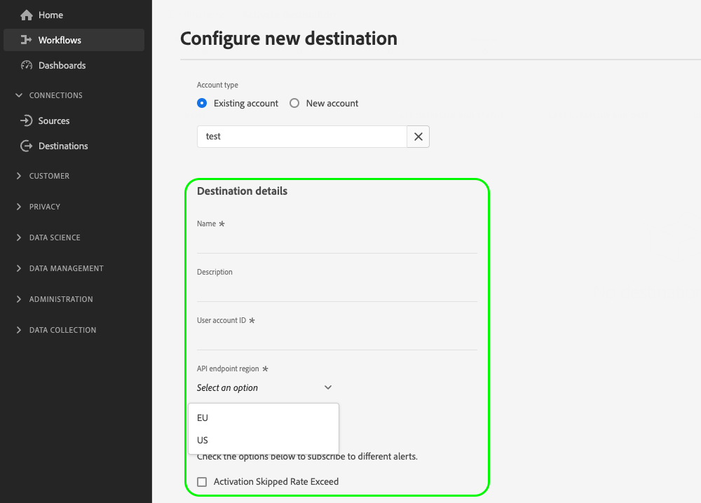

# Configurare l’input dell’utente tramite i campi dati del cliente

Quando ti connetti alla destinazione nell’interfaccia utente di Experience Platform, potrebbe essere necessario che gli utenti forniscano dettagli di configurazione specifici o che selezionino opzioni specifiche che rendano disponibili per loro. In Destination SDK, queste opzioni sono denominate campi dati cliente.

Per capire dove si trova questo componente in un’integrazione creata con Destination SDK, consulta il diagramma nella sezione [opzioni di configurazione](../configuration-options.md) documentazione o consulta le seguenti pagine di panoramica della configurazione di destinazione:

* [Utilizza Destination SDK per configurare una destinazione di streaming](../../guides/configure-destination-instructions.md#create-destination-configuration)
* [Utilizzare Destination SDK per configurare una destinazione basata su file](../../guides/configure-file-based-destination-instructions.md#create-destination-configuration)

## Casi di utilizzo per i campi dati cliente {#use-cases}

Utilizza i campi dati del cliente per diversi casi d’uso in cui è necessario che gli utenti inseriscano dati nell’interfaccia utente di Experience Platform. Ad esempio, utilizza i campi dati cliente quando gli utenti devono fornire:

* Nomi e percorsi dei bucket di archiviazione cloud per destinazioni basate su file.
* Formato accettato dai campi dati cliente.
* Tipi di compressione file disponibili tra cui gli utenti possono selezionare.
* Elenco degli endpoint disponibili per le integrazioni in tempo reale (streaming).

Puoi configurare i campi dati cliente tramite `/authoring/destinations` punto finale. Per esempi dettagliati sulle chiamate API , consulta le pagine di riferimento API seguenti dove puoi configurare i componenti mostrati in questa pagina.

* [Creare una configurazione di destinazione](../../authoring-api/destination-configuration/create-destination-configuration.md)
* [Aggiornare una configurazione di destinazione](../../authoring-api/destination-configuration/update-destination-configuration.md)

Questo articolo descrive tutti i tipi di configurazione dei campi dati del cliente supportati che puoi utilizzare per la tua destinazione e mostra cosa vedranno i clienti nell&#39;interfaccia utente di Experience Platform.

>[!IMPORTANT]
>
>Tutti i nomi e i valori dei parametri supportati da Destination SDK sono **distinzione tra maiuscole e minuscole**. Per evitare errori di distinzione tra maiuscole e minuscole, utilizza i nomi e i valori dei parametri esattamente come mostrato nella documentazione.

## Tipi di integrazione supportati {#supported-integration-types}

Per informazioni dettagliate sui tipi di integrazioni che supportano le funzionalità descritte in questa pagina, consulta la tabella seguente.

| Tipo di integrazione | Supporta funzionalità |
|---|---|
| Integrazioni in tempo reale (streaming) | Sì |
| Integrazioni basate su file (batch) | Sì |

## Parametri supportati {#supported-parameters}

Quando crei campi di dati del cliente personalizzati, puoi utilizzare i parametri descritti nella tabella seguente per configurarne il comportamento.

| Parametro | Tipo | Obbligatorio/facoltativo | Descrizione |
|---------|----------|------|---|
| `name` | Stringa | Obbligatorio | Specifica un nome per il campo personalizzato che stai introducendo. Questo nome non è visibile nell’interfaccia utente di Platform, a meno che il `title` campo vuoto o mancante. |
| `type` | Stringa | Obbligatorio | Indica il tipo di campo personalizzato che si sta introducendo. Valori accettati: <ul><li>`string`</li><li>`object`</li><li>`integer`</li></ul> |
| `title` | Stringa | Facoltativo | Indica il nome del campo, come visualizzato dai clienti nell’interfaccia utente di Platform. Se questo campo è vuoto o mancante, l’interfaccia utente eredita il nome del campo dal `name` valore. |
| `description` | Stringa | Facoltativo | Immetti una descrizione del campo personalizzato. Questa descrizione non è visibile nell’interfaccia utente di Platform. |
| `isRequired` | Booleano | Facoltativo | Indica se gli utenti devono fornire un valore per questo campo nel flusso di lavoro di configurazione della destinazione. |
| `pattern` | Stringa | Facoltativo | Applica un pattern per il campo personalizzato, se necessario. Utilizzare espressioni regolari per applicare un pattern. Ad esempio, se gli ID cliente non includono numeri o caratteri di sottolineatura, immetti `^[A-Za-z]+$` in questo campo. |
| `enum` | Stringa | Facoltativo | Esegue il rendering del campo personalizzato come menu a discesa ed elenca le opzioni disponibili per l’utente. |
| `default` | Stringa | Facoltativo | Definisce il valore predefinito da un `enum` elenco. |
| `hidden` | Booleano | Facoltativo | Indica se il campo dei dati del cliente viene visualizzato o meno nell&#39;interfaccia utente. |
| `unique` | Booleano | Facoltativo | Utilizza questo parametro quando devi creare un campo dati cliente il cui valore deve essere univoco in tutti i flussi dati di destinazione impostati dall&#39;organizzazione di un utente. Ad esempio, il **[!UICONTROL Alias di integrazione]** nel campo [Personalizzazione personalizzata](../../../catalog/personalization/custom-personalization.md) La destinazione deve essere univoca, il che significa che due flussi di dati separati per questa destinazione non possono avere lo stesso valore per questo campo. |
| `readOnly` | Booleano | Facoltativo | Indica se il cliente può modificare o meno il valore del campo. |

{style="table-layout:auto"}

Nell’esempio seguente, la `customerDataFields` La sezione definisce due campi che gli utenti devono inserire nell’interfaccia utente di Platform quando si connettono alla destinazione:

* `Account ID`: Un ID account utente per la piattaforma di destinazione.
* `Endpoint region`: L’endpoint regionale dell’API a cui si connetteranno. La `enum` crea un menu a discesa con i valori definiti all’interno di disponibili per gli utenti da selezionare.

```json
"customerDataFields":[
   {
      "name":"accountID",
      "title":"User account ID",
      "description":"User account ID for the destination platform.",
      "type":"string",
      "isRequired":true
   },
   {
      "name":"region",
      "title":"API endpoint region",
      "description":"The API endpoint region that the user should connect to.",
      "type":"string",
      "isRequired":true,
      "enum":[
         "EU"
         "US",
      ],
      "readOnly":false,
      "hidden":false
   }
]
```

L’esperienza di interfaccia utente risultante viene mostrata nell’immagine seguente.



## Nomi e descrizioni delle connessioni di destinazione {#names-description}

Quando crei una nuova destinazione, Destination SDK aggiunge automaticamente **[!UICONTROL Nome]** e **[!UICONTROL Descrizione]** nella schermata di connessione di destinazione nell’interfaccia utente di Platform. Come puoi vedere nell’esempio precedente, la **[!UICONTROL Nome]** e **[!UICONTROL Descrizione]** i campi vengono sottoposti a rendering nell’interfaccia utente senza essere inclusi nella configurazione dei campi dati del cliente.

>[!IMPORTANT]
>
>Se aggiungi **[!UICONTROL Nome]** e **[!UICONTROL Descrizione]** nella configurazione dei campi dati del cliente, gli utenti li vedranno duplicati nell’interfaccia utente.

## Ordinare i campi dati del cliente {#ordering}

L’ordine in cui aggiungi i campi dati del cliente nella configurazione di destinazione si riflette nell’interfaccia utente di Platform.

Ad esempio, la configurazione seguente si riflette di conseguenza nell’interfaccia utente, con le opzioni visualizzate nell’ordine **[!UICONTROL Nome]**, **[!UICONTROL Descrizione]**, **[!UICONTROL Nome blocco]**, **[!UICONTROL Percorso cartella]**, **[!UICONTROL Tipo di file]**, **[!UICONTROL Formato di compressione]**.

```json
"customerDataFields":[
{
   "name":"bucketName",
   "title":"Bucket name",
   "description":"Amazon S3 bucket name",
   "type":"string",
   "isRequired":true,
   "pattern":"(?=^.{3,63}$)(?!^(\\d+\\.)+\\d+$)(^(([a-z0-9]|[a-z0-9][a-z0-9\\-]*[a-z0-9])\\.)*([a-z0-9]|[a-z0-9][a-z0-9\\-]*[a-z0-9])$)",
   "readOnly":false,
   "hidden":false
},
{
   "name":"path",
   "title":"Folder path",
   "description":"Enter the path to your S3 bucket folder",
   "type":"string",
   "isRequired":true,
   "pattern":"^[0-9a-zA-Z\\/\\!\\-_\\.\\*\\''\\(\\)]*((\\%SEGMENT_(NAME|ID)\\%)?\\/?)+$",
   "readOnly":false,
   "hidden":false
},
{
   "name":"fileType",
   "title":"File Type",
   "description":"Select the exported file type.",
   "type":"string",
   "isRequired":true,
   "readOnly":false,
   "hidden":false,
   "enum":[
      "csv",
      "json",
      "parquet"
   ],
   "default":"csv"
},
{
   "name":"compression",
   "title":"Compression format",
   "description":"Select the desired file compression format.",
   "type":"string",
   "isRequired":true,
   "readOnly":false,
   "enum":[
      "SNAPPY",
      "GZIP",
      "DEFLATE",
      "NONE"
   ]
}
]
```


## Raggruppa campi di dati cliente {#grouping}

Puoi raggruppare più campi di dati cliente all’interno di una sezione. Quando si imposta la connessione alla destinazione nell’interfaccia utente, gli utenti possono visualizzare e beneficiare di un raggruppamento visivo di campi simili.

A questo scopo, utilizza `"type": "object"` per creare il gruppo e raccogliere i campi dati cliente desiderati all’interno di un `properties` , come illustrato nell’immagine seguente, dove il raggruppamento **[!UICONTROL Opzioni CSV]** viene evidenziato.

```json {line-numbers="true" highlight="6-28"}
"customerDataFields":[
   {
      "name":"csvOptions",
      "title":"CSV Options",
      "description":"Select your CSV options",
      "type":"object",
      "properties":[
         {
            "name":"delimiter",
            "title":"Delimiter",
            "description":"Select your Delimiter",
            "type":"string",
            "isRequired":false,
            "default":",",
            "namedEnum":[
               {
                  "name":"Comma (,)",
                  "value":","
               },
               {
                  "name":"Tab (\\t)",
                  "value":"\t"
               }
            ],
            "readOnly":false,
            "hidden":false
         }
      ]
   }
]
```


## Creazione di selettori a discesa per i campi dati del cliente {#dropdown-selectors}

Per le situazioni in cui desideri consentire agli utenti di selezionare tra più opzioni, ad esempio quale carattere deve essere utilizzato per delimitare i campi nei file CSV, puoi aggiungere campi a discesa all’interfaccia utente.

Per eseguire questa operazione, utilizza la variabile `namedEnum` come mostrato di seguito e configura un `default` per le opzioni che l&#39;utente può selezionare.

```json {line-numbers="true" highlight="15-24"}
"customerDataFields":[
   {
      "name":"csvOptions",
      "title":"CSV Options",
      "description":"Select your CSV options",
      "type":"object",
      "properties":[
         {
            "name":"delimiter",
            "title":"Delimiter",
            "description":"Select your Delimiter",
            "type":"string",
            "isRequired":false,
            "default":",",
            "namedEnum":[
               {
                  "name":"Comma (,)",
                  "value":","
               },
               {
                  "name":"Tab (\\t)",
                  "value":"\t"
               }
            ],
            "readOnly":false,
            "hidden":false
         }
      ]
   }
]
```


## Creazione di campi dati cliente condizionali {#conditional-options}

Puoi creare campi di dati del cliente condizionale, che vengono visualizzati nel flusso di lavoro di attivazione solo quando gli utenti selezionano una determinata opzione.

Ad esempio, è possibile creare opzioni di formattazione condizionale dei file da visualizzare solo quando gli utenti selezionano un tipo di esportazione di file specifico.

La configurazione seguente crea un raggruppamento condizionale per le opzioni di formattazione del file CSV. Le opzioni del file CSV vengono visualizzate solo quando l’utente seleziona CSV come tipo di file desiderato da esportare.

Per impostare un campo come condizionale, utilizza la variabile `conditional` come mostrato di seguito:

```json
"conditional": {
   "field": "fileType",
   "operator": "EQUALS",
   "value": "CSV"
}
```

In un contesto più ampio, puoi vedere le `conditional` campo utilizzato nella configurazione di destinazione seguente, accanto al `fileType` la stringa e `csvOptions` oggetto in cui è definito.

```json {line-numbers="true" highlight="3-15, 21-25"}
"customerDataFields":[
   {
      "name":"fileType",
      "title":"File Type",
      "description":"Select your file type",
      "type":"string",
      "isRequired":true,
      "enum":[
         "PARQUET",
         "CSV",
         "JSON"
      ],
      "readOnly":false,
      "hidden":false
   },
   {
      "name":"csvOptions",
      "title":"CSV Options",
      "description":"Select your CSV options",
      "type":"object",
      "conditional":{
         "field":"fileType",
         "operator":"EQUALS",
         "value":"CSV"
      },
      "properties":[
         {
            "name":"delimiter",
            "title":"Delimiter",
            "description":"Select your Delimiter",
            "type":"string",
            "isRequired":false,
            "default":",",
            "namedEnum":[
               {
                  "name":"Comma (,)",
                  "value":","
               },
               {
                  "name":"Tab (\\t)",
                  "value":"\t"
               }
            ],
            "readOnly":false,
            "hidden":false
         },
         {
            "name":"quote",
            "title":"Quote Character",
            "description":"Select your Quote character",
            "type":"string",
            "isRequired":false,
            "default":"",
            "namedEnum":[
               {
                  "name":"Double Quotes (\")",
                  "value":"\""
               },
               {
                  "name":"Null Character (\u0000)",
                  "value":"\u0000"
               }
            ],
            "readOnly":false,
            "hidden":false
         },
         {
            "name":"escape",
            "title":"Escape Character",
            "description":"Select your Escape character",
            "type":"string",
            "isRequired":false,
            "default":"\\",
            "namedEnum":[
               {
                  "name":"Back Slash (\\)",
                  "value":"\\"
               },
               {
                  "name":"Single Quote (')",
                  "value":"'"
               }
            ],
            "readOnly":false,
            "hidden":false
         },
         {
            "name":"emptyValue",
            "title":"Empty Value",
            "description":"Select the output value of blank fields",
            "type":"string",
            "isRequired":false,
            "default":"",
            "namedEnum":[
               {
                  "name":"Empty String",
                  "value":""
               },
               {
                  "name":"\"\"",
                  "value":"\"\""
               },
               {
                  "name":"null",
                  "value":"null"
               }
            ],
            "readOnly":false,
            "hidden":false
         },
         {
            "name":"nullValue",
            "title":"Null Value",
            "description":"Select the output value of 'null' fields",
            "type":"string",
            "isRequired":false,
            "default":"null",
            "namedEnum":[
               {
                  "name":"Empty String",
                  "value":""
               },
               {
                  "name":"\"\"",
                  "value":"\"\""
               },
               {
                  "name":"null",
                  "value":"null"
               }
            ],
            "readOnly":false,
            "hidden":false
         }
      ],
      "isRequired":false,
      "readOnly":false,
      "hidden":false
   }
]
```

Di seguito è riportata la schermata risultante dell’interfaccia utente, in base alla configurazione di cui sopra. Quando l’utente seleziona il tipo di file CSV, nell’interfaccia utente vengono visualizzate altre opzioni di formattazione che fanno riferimento al tipo di file CSV.


## Accesso ai campi dati del cliente formattati {#accessing-templatized-fields}

Quando la destinazione richiede l’input dell’utente, devi fornire agli utenti una selezione di campi di dati del cliente da compilare tramite l’interfaccia utente di Platform. Quindi devi configurare il server di destinazione in modo da leggere correttamente l’input dell’utente dai campi dei dati del cliente. Questa operazione viene eseguita tramite campi templatizzati.

I campi con modelli utilizzano il formato `{{customerData.fieldName}}`, dove `fieldName` è il nome del campo dati cliente da cui si leggono le informazioni. Tutti i campi dati del cliente formattati sono preceduti da `customerData.` e racchiusi tra parentesi `{{ }}`.

Ad esempio, prendiamo in considerazione la seguente configurazione di destinazione Amazon S3:

```json
"customerDataFields":[
   {
      "name":"bucketName",
      "title":"Enter the name of your Amazon S3 bucket",
      "description":"Amazon S3 bucket name",
      "type":"string",
      "isRequired":true,
      "pattern":"(?=^.{3,63}$)(?!^(\\d+\\.)+\\d+$)(^(([a-z0-9]|[a-z0-9][a-z0-9\\-]*[a-z0-9])\\.)*([a-z0-9]|[a-z0-9][a-z0-9\\-]*[a-z0-9])$)",
      "readOnly":false,
      "hidden":false
   },
   {
      "name":"path",
      "title":"Enter the path to your S3 bucket folder",
      "description":"Enter the path to your S3 bucket folder",
      "type":"string",
      "isRequired":true,
      "pattern":"^[0-9a-zA-Z\\/\\!\\-_\\.\\*\\''\\(\\)]*((\\%SEGMENT_(NAME|ID)\\%)?\\/?)+$",
      "readOnly":false,
      "hidden":false
   }
]
```

Questa configurazione richiede agli utenti di immettere il proprio [!DNL Amazon S3] nome del bucket e percorso della cartella nei rispettivi campi di dati del cliente.

Ad Experience Platform, per connettersi correttamente a [!DNL Amazon S3], il server di destinazione deve essere configurato per leggere i valori da questi due campi di dati del cliente, come mostrato di seguito:

```json
 "fileBasedS3Destination":{
      "bucketName":{
         "templatingStrategy":"PEBBLE_V1",
         "value":"{{customerData.bucketName}}"
      },
      "path":{
         "templatingStrategy":"PEBBLE_V1",
         "value":"{{customerData.path}}"
      }
   }
```

Valori templatizzati `{{customerData.bucketName}}` e `{{customerData.path}}` leggi i valori forniti dall’utente in modo che Experience Platform possa connettersi alla piattaforma di destinazione.

Per ulteriori informazioni su come configurare il server di destinazione per la lettura dei campi con modello, consulta la documentazione in [campi hardcoded rispetto a quelli templatizzati](../destination-server/server-specs.md#templatized-fields).

## Passaggi successivi {#next-steps}

Dopo aver letto questo articolo, dovresti avere una migliore comprensione di come consentire agli utenti di inserire informazioni nell’interfaccia utente di Experience Platform attraverso i campi dati dei clienti. Ora puoi anche selezionare il campo dati cliente appropriato per il tuo caso d’uso e configurare, ordinare e raggruppare i campi dati cliente nell’interfaccia utente di Platform.

Per ulteriori informazioni sugli altri componenti di destinazione, consulta i seguenti articoli:

* [Autenticazione dei clienti](customer-authentication.md)
* [Autenticazione OAuth2](oauth2-authentication.md)
* [Attributi dell&#39;interfaccia utente](ui-attributes.md)
* [Configurazione dello schema](schema-configuration.md)
* [Configurazione dello spazio dei nomi identità](identity-namespace-configuration.md)
* [Configurazioni di mappatura supportate](supported-mapping-configurations.md)
* [Consegna delle destinazioni](destination-delivery.md)
* [Configurazione dei metadati del pubblico](audience-metadata-configuration.md)
* [Criteri di aggregazione](aggregation-policy.md)
* [Configurazione batch](batch-configuration.md)
* [Qualifiche di profilo storiche](historical-profile-qualifications.md)