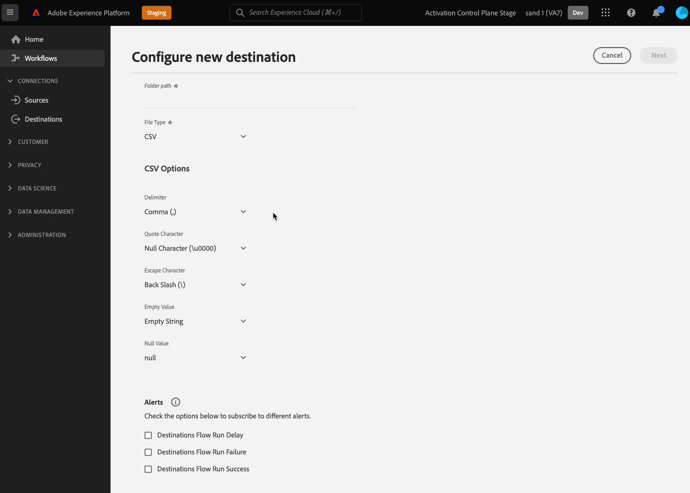

# Configurare l’input dell’utente tramite i campi dati del cliente

Quando ti connetti alla destinazione nell’interfaccia utente di Experienci Platform, potrebbe essere necessario che gli utenti forniscano dettagli di configurazione specifici o selezionino le opzioni specifiche che rendi disponibili. In Destination SDK, queste opzioni sono denominate campi dati del cliente.

Per capire dove questo componente si inserisce in un’integrazione creata con Destination SDK, consulta il diagramma riportato di seguito. [opzioni di configurazione](../configuration-options.md) oppure consulta le seguenti pagine di panoramica sulla configurazione di destinazione:

* [Utilizzare Destination SDK per configurare una destinazione di streaming](../../guides/configure-destination-instructions.md#create-destination-configuration)
* [Utilizzare Destination SDK per configurare una destinazione basata su file](../../guides/configure-file-based-destination-instructions.md#create-destination-configuration)

## Casi d’uso per i campi dati cliente {#use-cases}

Utilizza i campi dati del cliente per diversi casi d’uso in cui gli utenti devono inserire dati nell’interfaccia utente di Experienci Platform. Ad esempio, utilizza i campi dati del cliente quando gli utenti devono fornire:

* Nomi e percorsi dei bucket di archiviazione cloud, per destinazioni basate su file.
* Il formato accettato dai campi dati del cliente.
* Tipi di compressione file disponibili selezionabili dagli utenti.
* Elenchi degli endpoint disponibili per integrazioni in tempo reale (streaming).

Puoi configurare i campi dati del cliente tramite `/authoring/destinations` endpoint. Consulta le seguenti pagine di riferimento API per esempi dettagliati di chiamate API, in cui puoi configurare i componenti mostrati in questa pagina.

* [Creare una configurazione di destinazione](../../authoring-api/destination-configuration/create-destination-configuration.md)
* [Aggiornare una configurazione di destinazione](../../authoring-api/destination-configuration/update-destination-configuration.md)

Questo articolo descrive tutti i tipi di configurazione dei campi dati cliente supportati che è possibile utilizzare per la destinazione e mostra cosa vedranno i clienti nell’interfaccia utente di Experienci Platform.

>[!IMPORTANT]
>
>Tutti i nomi e i valori dei parametri supportati da Destination SDK sono **distinzione maiuscole/minuscole**. Per evitare errori di distinzione tra maiuscole e minuscole, utilizza i nomi e i valori dei parametri esattamente come mostrato nella documentazione.

## Tipi di integrazione supportati {#supported-integration-types}

Consulta la tabella seguente per informazioni dettagliate sui tipi di integrazioni che supportano le funzionalità descritte in questa pagina.

| Tipo di integrazione | Supporta la funzionalità |
|---|---|
| Integrazioni in tempo reale (streaming) | Sì |
| Integrazioni basate su file (batch) | Sì |

## Parametri supportati {#supported-parameters}

Quando crei campi dati del cliente personalizzati, puoi utilizzare i parametri descritti nella tabella seguente per configurarne il comportamento.

| Parametro | Tipo | Obbligatorio/facoltativo | Descrizione |
|---------|----------|------|---|
| `name` | Stringa | Obbligatorio | Immetti un nome per il campo personalizzato che stai presentando. Questo nome è visibile nell’interfaccia utente di Platform solo se `title` campo vuoto o mancante. |
| `type` | Stringa | Obbligatorio | Indica il tipo di campo personalizzato che si sta introducendo. Valori accettati: <ul><li>`string`</li><li>`object`</li><li>`integer`</li></ul> |
| `title` | Stringa | Facoltativo | Indica il nome del campo, così come viene visualizzato dai clienti nell’interfaccia utente di Platform. Se questo campo è vuoto o mancante, l’interfaccia utente eredita il nome del campo da `name` valore. |
| `description` | Stringa | Facoltativo | Fornisci una descrizione per il campo personalizzato. Questa descrizione non è visibile nell’interfaccia utente di Platform. |
| `isRequired` | Booleano | Facoltativo | Indica se gli utenti devono fornire un valore per questo campo nel flusso di lavoro di configurazione di destinazione. |
| `pattern` | Stringa | Facoltativo | Se necessario, applica un pattern per il campo personalizzato. Utilizza espressioni regolari per applicare un pattern. Ad esempio, se gli ID cliente non includono numeri o trattini bassi, immetti `^[A-Za-z]+$` in questo campo. |
| `enum` | Stringa | Facoltativo | Esegue il rendering del campo personalizzato come menu a discesa ed elenca le opzioni disponibili per l&#39;utente. |
| `default` | Stringa | Facoltativo | Definisce il valore predefinito da un `enum` elenco. |
| `hidden` | Booleano | Facoltativo | Indica se il campo dati del cliente viene visualizzato o meno nell’interfaccia utente. |
| `unique` | Booleano | Facoltativo | Utilizza questo parametro quando devi creare un campo dati cliente il cui valore deve essere univoco in tutti i flussi di dati di destinazione impostati dall’organizzazione di un utente. Ad esempio, il **[!UICONTROL Alias di integrazione]** campo in [Personalizzazione personalizzata](../../../catalog/personalization/custom-personalization.md) la destinazione deve essere univoca, il che significa che due flussi di dati separati verso questa destinazione non possono avere lo stesso valore per questo campo. |
| `readOnly` | Booleano | Facoltativo | Indica se il cliente può modificare il valore del campo. |

{style="table-layout:auto"}

Nell’esempio seguente, il `customerDataFields` Questa sezione definisce due campi che gli utenti devono inserire nell’interfaccia utente di Platform quando si connettono alla destinazione:

* `Account ID`: ID account utente per la piattaforma di destinazione.
* `Endpoint region`: endpoint regionale dell’API a cui si connetteranno. Il `enum` sezione crea un menu a discesa con i valori definiti in disponibile per la selezione da parte degli utenti.

```json
"customerDataFields":[
   {
      "name":"accountID",
      "title":"User account ID",
      "description":"User account ID for the destination platform.",
      "type":"string",
      "isRequired":true
   },
   {
      "name":"region",
      "title":"API endpoint region",
      "description":"The API endpoint region that the user should connect to.",
      "type":"string",
      "isRequired":true,
      "enum":[
         "EU"
         "US",
      ],
      "readOnly":false,
      "hidden":false
   }
]
```

L’esperienza dell’interfaccia utente risultante è illustrata nell’immagine seguente.


## Nomi e descrizioni delle connessioni di destinazione {#names-description}

Durante la creazione di una nuova destinazione, Destination SDK aggiunge automaticamente **[!UICONTROL Nome]** e **[!UICONTROL Descrizione]** nella schermata di connessione di destinazione nell’interfaccia utente di Platform. Come illustrato nell&#39;esempio precedente, **[!UICONTROL Nome]** e **[!UICONTROL Descrizione]** I campi vengono visualizzati nell’interfaccia utente senza essere inclusi nella configurazione dei campi dati del cliente.

>[!IMPORTANT]
>
>Se aggiungi **[!UICONTROL Nome]** e **[!UICONTROL Descrizione]** nella configurazione dei campi dati del cliente, gli utenti li vedranno duplicati nell’interfaccia utente.

## Campi dati cliente ordine {#ordering}

L’ordine in cui si aggiungono i campi dati del cliente nella configurazione di destinazione si riflette nell’interfaccia utente di Platform.

Ad esempio, la configurazione seguente si riflette di conseguenza nell’interfaccia utente, con le opzioni visualizzate nell’ordine **[!UICONTROL Nome]**, **[!UICONTROL Descrizione]**, **[!UICONTROL Nome bucket]**, **[!UICONTROL Percorso cartella]**, **[!UICONTROL Tipo di file]**, **[!UICONTROL Formato di compressione]**.

```json
"customerDataFields":[
{
   "name":"bucketName",
   "title":"Bucket name",
   "description":"Amazon S3 bucket name",
   "type":"string",
   "isRequired":true,
   "pattern":"(?=^.{3,63}$)(?!^(\\d+\\.)+\\d+$)(^(([a-z0-9]|[a-z0-9][a-z0-9\\-]*[a-z0-9])\\.)*([a-z0-9]|[a-z0-9][a-z0-9\\-]*[a-z0-9])$)",
   "readOnly":false,
   "hidden":false
},
{
   "name":"path",
   "title":"Folder path",
   "description":"Enter the path to your S3 bucket folder",
   "type":"string",
   "isRequired":true,
   "pattern":"^[0-9a-zA-Z\\/\\!\\-_\\.\\*\\''\\(\\)]*((\\%SEGMENT_(NAME|ID)\\%)?\\/?)+$",
   "readOnly":false,
   "hidden":false
},
{
   "name":"fileType",
   "title":"File Type",
   "description":"Select the exported file type.",
   "type":"string",
   "isRequired":true,
   "readOnly":false,
   "hidden":false,
   "enum":[
      "csv",
      "json",
      "parquet"
   ],
   "default":"csv"
},
{
   "name":"compression",
   "title":"Compression format",
   "description":"Select the desired file compression format.",
   "type":"string",
   "isRequired":true,
   "readOnly":false,
   "enum":[
      "SNAPPY",
      "GZIP",
      "DEFLATE",
      "NONE"
   ]
}
]
```


## Raggruppa campi dati cliente {#grouping}

Puoi raggruppare diversi campi di dati cliente all’interno di una sezione. Quando si imposta la connessione alla destinazione nell’interfaccia utente, gli utenti possono visualizzare e beneficiare di un raggruppamento visivo di campi simili.

A tale scopo, utilizza `"type": "object"` per creare il gruppo e raccogliere i campi di dati cliente desiderati all’interno di una `properties` come mostrato nell&#39;immagine seguente, dove il raggruppamento **[!UICONTROL Opzioni CSV]** viene evidenziato.

```json {line-numbers="true" highlight="6-28"}
"customerDataFields":[
   {
      "name":"csvOptions",
      "title":"CSV Options",
      "description":"Select your CSV options",
      "type":"object",
      "properties":[
         {
            "name":"delimiter",
            "title":"Delimiter",
            "description":"Select your Delimiter",
            "type":"string",
            "isRequired":false,
            "default":",",
            "namedEnum":[
               {
                  "name":"Comma (,)",
                  "value":","
               },
               {
                  "name":"Tab (\\t)",
                  "value":"\t"
               }
            ],
            "readOnly":false,
            "hidden":false
         }
      ]
   }
]
```


## Creare selettori a discesa per i campi dei dati del cliente {#dropdown-selectors}

Nelle situazioni in cui desideri consentire agli utenti di selezionare tra diverse opzioni, ad esempio il carattere da utilizzare per delimitare i campi nei file CSV, puoi aggiungere campi a discesa all’interfaccia utente.

A tale scopo, utilizza `namedEnum` come mostrato di seguito e configurare un `default` valore per le opzioni che l’utente può selezionare.

```json {line-numbers="true" highlight="15-24"}
"customerDataFields":[
   {
      "name":"csvOptions",
      "title":"CSV Options",
      "description":"Select your CSV options",
      "type":"object",
      "properties":[
         {
            "name":"delimiter",
            "title":"Delimiter",
            "description":"Select your Delimiter",
            "type":"string",
            "isRequired":false,
            "default":",",
            "namedEnum":[
               {
                  "name":"Comma (,)",
                  "value":","
               },
               {
                  "name":"Tab (\\t)",
                  "value":"\t"
               }
            ],
            "readOnly":false,
            "hidden":false
         }
      ]
   }
]
```



## Creare selettori a discesa dinamici per i campi dati del cliente {#dynamic-dropdown-selectors}

Nelle situazioni in cui desideri chiamare un’API in modo dinamico e utilizzare la risposta per popolare dinamicamente le opzioni in un menu a discesa, puoi utilizzare un selettore a discesa dinamico.

I selettori a discesa dinamici sono identici ai [selettori a discesa regolari](#dropdown-selectors) nell’interfaccia utente. L’unica differenza consiste nel fatto che i valori vengono recuperati in modo dinamico da un’API.

Per creare un selettore a discesa dinamico, devi configurare due componenti:

**Passaggio 1:** [Creare un server di destinazione](../../authoring-api/destination-server/create-destination-server.md#dynamic-dropdown-servers) con un `responseFields` modello per la chiamata API dinamica, come mostrato di seguito.

```json
{
   "name":"Server for dynamic dropdown",
   "destinationServerType":"URL_BASED",
   "urlBasedDestination":{
      "url":{
         "templatingStrategy":"PEBBLE_V1",
         "value":" <--YOUR-API-ENDPOINT-PATH--> "
      }
   },
   "httpTemplate":{
      "httpMethod":"GET",
      "headers":[
         {
            "header":"Authorization",
            "value":{
               "templatingStrategy":"PEBBLE_V1",
               "value":"My Bearer Token"
            }
         },
         {
            "header":"x-integration",
            "value":{
               "templatingStrategy":"PEBBLE_V1",
               "value":"{{customerData.integrationId}}"
            }
         },
         {
            "header":"Accept",
            "value":{
               "templatingStrategy":"NONE",
               "value":"application/json"
            }
         }
      ]
   },
   "responseFields":[
      {
         "templatingStrategy":"PEBBLE_V1",
         "value":"   {{ {'list': list} | toJson | raw }}",
         "name":"list"
      }
   ]
}
```

**Passaggio 2:** Utilizza il `dynamicEnum` come mostrato di seguito. Nell’esempio seguente, il `User` Il menu a discesa viene recuperato utilizzando dynamic server.


```json {line-numbers="true" highlight="13-21"}
"customerDataFields": [
  {
    "name": "integrationId",
    "title": "Integration ID",
    "type": "string",
    "isRequired": true
  },
  {
    "name": "userId",
    "title": "User",
    "type": "string",
    "isRequired": true,
    "dynamicEnum": {
      "queryParams": [
        "integrationId"
      ],
      "destinationServerId": "<~dynamic-field-server-id~>",
      "authenticationRule": "CUSTOMER_AUTHENTICATION",
      "value": "$.list",
      "responseFormat": "NAME_VALUE"
    }
  }
]
```

Imposta il `destinationServerId` all&#39;ID del server di destinazione creato al passaggio 1. Puoi visualizzare l’ID del server di destinazione nella risposta di [recuperare una configurazione del server di destinazione](../../authoring-api/destination-server/retrieve-destination-server.md) Chiamata API.

## Creare campi dati cliente nidificati {#nested-fields}

Puoi creare campi dati cliente nidificati per modelli di integrazione complessi. Questo consente di concatenare una serie di selezioni per il cliente.

Ad esempio, puoi aggiungere campi dati cliente nidificati per richiedere ai clienti di selezionare un tipo di integrazione con la destinazione, seguito immediatamente da un’altra selezione. La seconda selezione è un campo nidificato nel tipo di integrazione.

Per aggiungere un campo nidificato, utilizza `properties` come mostrato di seguito. Nell’esempio di configurazione seguente, puoi visualizzare tre diversi campi nidificati all’interno del **Yourdestination - Impostazioni specifiche per l’integrazione** campo dati cliente.

>[!TIP]
>
>A partire dalla versione di aprile 2024, è possibile impostare un’ `isRequired` parametro sui campi nidificati. Ad esempio, nel frammento di configurazione seguente, i primi due campi nidificati sono contrassegnati come obbligatori (riga xxx evidenziata) e i clienti non possono procedere a meno che non selezionino un valore per il campo. Ulteriori informazioni sui campi obbligatori in [parametri supportati](#supported-parameters) sezione.

```json {line-numbers="true" highlight="11,20"}
    {
      "name": "yourdestination",
      "title": "Yourdestination - Integration Specific Settings",
      "type": "object",
      "properties": [
        {
          "name": "agreement",
          "title": "Advertiser data destination terms agreement. Enter I AGREE.",
          "type": "string",
          "isRequired": true,
          "pattern": "I AGREE",
          "readOnly": false,
          "hidden": false
        },
        {
          "name": "account-name",
          "title": "Account name",
          "type": "string",
          "isRequired": true,
          "readOnly": false,
          "hidden": false
        },
        {
          "name": "email",
          "title": "Email address",
          "type": "string",
          "isRequired": false,
          "pattern": "^[\\w-\\.]+@([\\w-]+\\.)+[\\w-]{2,4}$",
          "readOnly": false,
          "hidden": false
        }
      ],
      "isRequired": false,
      "readOnly": false,
      "hidden": false,
```

## Creare campi dati cliente condizionali {#conditional-options}

Puoi creare campi dati cliente condizionali, che vengono visualizzati nel flusso di lavoro di attivazione solo quando gli utenti selezionano una determinata opzione.

Ad esempio, è possibile creare opzioni di formattazione condizionale dei file da visualizzare solo quando gli utenti selezionano un tipo di esportazione di file specifico.

La configurazione seguente crea un raggruppamento condizionale per le opzioni di formattazione del file CSV. Le opzioni del file CSV vengono visualizzate solo quando l’utente seleziona CSV come tipo di file desiderato per l’esportazione.

Per impostare un campo come condizionale, utilizzare `conditional` come mostrato di seguito:

```json
"conditional": {
   "field": "fileType",
   "operator": "EQUALS",
   "value": "CSV"
}
```

In un contesto più ampio, è possibile visualizzare `conditional` nella configurazione di destinazione seguente, insieme al campo `fileType` stringa e `csvOptions` oggetto in cui è definito. I campi condizionali sono definiti nella sezione `properties` parametro.

```json {line-numbers="true" highlight="3-15, 21-25"}
"customerDataFields":[
   {
      "name":"fileType",
      "title":"File Type",
      "description":"Select your file type",
      "type":"string",
      "isRequired":true,
      "enum":[
         "PARQUET",
         "CSV",
         "JSON"
      ],
      "readOnly":false,
      "hidden":false
   },
   {
      "name":"csvOptions",
      "title":"CSV Options",
      "description":"Select your CSV options",
      "type":"object",
      "conditional":{
         "field":"fileType",
         "operator":"EQUALS",
         "value":"CSV"
      },
      "properties":[
         {
            "name":"delimiter",
            "title":"Delimiter",
            "description":"Select your Delimiter",
            "type":"string",
            "isRequired":false,
            "default":",",
            "namedEnum":[
               {
                  "name":"Comma (,)",
                  "value":","
               },
               {
                  "name":"Tab (\\t)",
                  "value":"\t"
               }
            ],
            "readOnly":false,
            "hidden":false
         },
         {
            "name":"quote",
            "title":"Quote Character",
            "description":"Select your Quote character",
            "type":"string",
            "isRequired":false,
            "default":"",
            "namedEnum":[
               {
                  "name":"Double Quotes (\")",
                  "value":"\""
               },
               {
                  "name":"Null Character (\u0000)",
                  "value":"\u0000"
               }
            ],
            "readOnly":false,
            "hidden":false
         },
         {
            "name":"escape",
            "title":"Escape Character",
            "description":"Select your Escape character",
            "type":"string",
            "isRequired":false,
            "default":"\\",
            "namedEnum":[
               {
                  "name":"Back Slash (\\)",
                  "value":"\\"
               },
               {
                  "name":"Single Quote (')",
                  "value":"'"
               }
            ],
            "readOnly":false,
            "hidden":false
         },
         {
            "name":"emptyValue",
            "title":"Empty Value",
            "description":"Select the output value of blank fields",
            "type":"string",
            "isRequired":false,
            "default":"",
            "namedEnum":[
               {
                  "name":"Empty String",
                  "value":""
               },
               {
                  "name":"\"\"",
                  "value":"\"\""
               },
               {
                  "name":"null",
                  "value":"null"
               }
            ],
            "readOnly":false,
            "hidden":false
         },
         {
            "name":"nullValue",
            "title":"Null Value",
            "description":"Select the output value of 'null' fields",
            "type":"string",
            "isRequired":false,
            "default":"null",
            "namedEnum":[
               {
                  "name":"Empty String",
                  "value":""
               },
               {
                  "name":"\"\"",
                  "value":"\"\""
               },
               {
                  "name":"null",
                  "value":"null"
               }
            ],
            "readOnly":false,
            "hidden":false
         }
      ],
      "isRequired":false,
      "readOnly":false,
      "hidden":false
   }
]
```

Di seguito è riportata la schermata risultante dell’interfaccia utente, in base alla configurazione precedente. Quando l’utente seleziona il tipo di file CSV, nell’interfaccia utente vengono visualizzate ulteriori opzioni di formattazione relative al tipo di file CSV.


## Accesso ai campi dati cliente con modelli {#accessing-templatized-fields}

Quando la destinazione richiede l’input dell’utente, devi fornire agli utenti una selezione di campi dati del cliente che possono compilare tramite l’interfaccia utente di Platform. Quindi devi configurare il server di destinazione in modo da leggere correttamente l’input dell’utente dai campi dei dati del cliente. Questa operazione viene eseguita tramite campi con modelli.

I campi con modello utilizzano il formato `{{customerData.fieldName}}`, dove `fieldName` è il nome del campo dati cliente da cui si stanno leggendo le informazioni. Tutti i campi dati cliente con modello sono preceduti da `customerData.` e racchiusi tra parentesi graffe `{{ }}`.

Prendiamo ad esempio in considerazione la seguente configurazione di destinazione Amazon S3:

```json
"customerDataFields":[
   {
      "name":"bucketName",
      "title":"Enter the name of your Amazon S3 bucket",
      "description":"Amazon S3 bucket name",
      "type":"string",
      "isRequired":true,
      "pattern":"(?=^.{3,63}$)(?!^(\\d+\\.)+\\d+$)(^(([a-z0-9]|[a-z0-9][a-z0-9\\-]*[a-z0-9])\\.)*([a-z0-9]|[a-z0-9][a-z0-9\\-]*[a-z0-9])$)",
      "readOnly":false,
      "hidden":false
   },
   {
      "name":"path",
      "title":"Enter the path to your S3 bucket folder",
      "description":"Enter the path to your S3 bucket folder",
      "type":"string",
      "isRequired":true,
      "pattern":"^[0-9a-zA-Z\\/\\!\\-_\\.\\*\\''\\(\\)]*((\\%SEGMENT_(NAME|ID)\\%)?\\/?)+$",
      "readOnly":false,
      "hidden":false
   }
]
```

Questa configurazione richiede agli utenti di immettere le [!DNL Amazon S3] nome del bucket e percorso della cartella nei rispettivi campi dati del cliente.

Ad Experience Platform, per connettersi correttamente a [!DNL Amazon S3], il server di destinazione deve essere configurato per leggere i valori da questi due campi di dati cliente, come mostrato di seguito:

```json
 "fileBasedS3Destination":{
      "bucketName":{
         "templatingStrategy":"PEBBLE_V1",
         "value":"{{customerData.bucketName}}"
      },
      "path":{
         "templatingStrategy":"PEBBLE_V1",
         "value":"{{customerData.path}}"
      }
   }
```

I valori del modello `{{customerData.bucketName}}` e `{{customerData.path}}` leggi i valori forniti dall’utente in modo che Experienci Platform possa connettersi correttamente alla piattaforma di destinazione.

Per ulteriori informazioni su come configurare il server di destinazione per leggere i campi con modelli, consulta la documentazione su [campi hardcoded e template](../destination-server/server-specs.md#templatized-fields).

## Passaggi successivi {#next-steps}

Dopo aver letto questo articolo, dovresti capire meglio come consentire agli utenti di inserire informazioni nell’interfaccia utente di Experienci Platform tramite i campi dati del cliente. Ora sai anche come selezionare il campo dati cliente corretto per il caso d’uso e configurare, ordinare e raggruppare i campi dati cliente nell’interfaccia utente di Platform.

Per ulteriori informazioni sugli altri componenti di destinazione, consulta i seguenti articoli:

* [Autenticazione del cliente](customer-authentication.md)
* [Autorizzazione OAuth2](oauth2-authorization.md)
* [Attributi dell’interfaccia utente](ui-attributes.md)
* [Configurazione dello schema](schema-configuration.md)
* [Configurazione dello spazio dei nomi dell’identità](identity-namespace-configuration.md)
* [Configurazioni di mappatura supportate](supported-mapping-configurations.md)
* [Consegna della destinazione](destination-delivery.md)
* [Configurazione dei metadati del pubblico](audience-metadata-configuration.md)
* [Criterio di aggregazione](aggregation-policy.md)
* [Configurazione batch](batch-configuration.md)
* [Qualifiche del profilo storico](historical-profile-qualifications.md)
