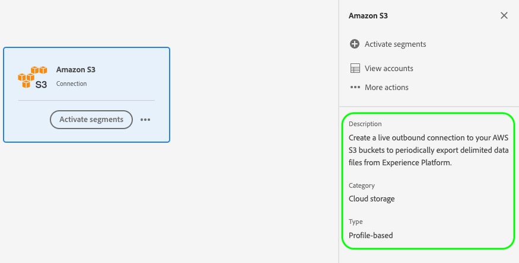
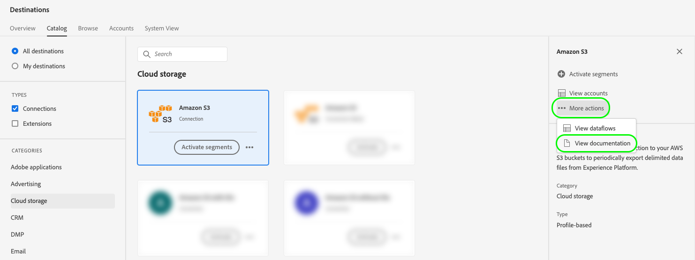

# Attributi dell’interfaccia utente

Gli attributi dell’interfaccia utente definiscono gli elementi visivi che Adobe deve visualizzare per la scheda di destinazione nell’interfaccia utente di Adobe Experience Platform, ad esempio un logo, un collegamento alla pagina della documentazione, una descrizione della destinazione e la relativa categoria e tipo.

Per capire dove questo componente si inserisce in un&#39;integrazione creata con Destination SDK, consulta il diagramma nella documentazione delle [opzioni di configurazione](../configuration-options.md) oppure vedi le seguenti pagine di panoramica sulla configurazione di destinazione:

* [Utilizzare Destination SDK per configurare una destinazione di streaming](../../guides/configure-destination-instructions.md#create-destination-configuration)
* [Utilizzare Destination SDK per configurare una destinazione basata su file](../../guides/configure-file-based-destination-instructions.md#create-destination-configuration)

Quando [crei una destinazione](../../authoring-api/destination-configuration/create-destination-configuration.md) tramite Destination SDK, la sezione `uiAttributes` definisce le seguenti proprietà visive della scheda di destinazione:

* URL della pagina della documentazione di destinazione nel [catalogo di destinazione](../../../catalog/overview.md).
* La categoria in cui la destinazione sarà visibile nell’interfaccia utente di Platform.
* La frequenza di esportazione dei dati per la destinazione.
* Il tipo di connessione di destinazione, ad esempio Amazon S3, BLOB di Azure e così via.
* L’URL in cui hai ospitato l’icona da visualizzare nella scheda del catalogo delle destinazioni.

È possibile configurare gli attributi dell&#39;interfaccia utente tramite l&#39;endpoint `/authoring/destinations`. Consulta le seguenti pagine di riferimento API per esempi dettagliati di chiamate API, in cui puoi configurare i componenti mostrati in questa pagina.

* [Creare una configurazione di destinazione](../../authoring-api/destination-configuration/create-destination-configuration.md)
* [Aggiornare una configurazione di destinazione](../../authoring-api/destination-configuration/update-destination-configuration.md)

Questo articolo descrive tutti gli attributi supportati dell’interfaccia utente che puoi utilizzare per la tua destinazione e mostra cosa vedranno i clienti nell’interfaccia utente di Experience Platform.



>[!IMPORTANT]
>
>Tutti i nomi e i valori dei parametri supportati da Destination SDK sono **con distinzione tra maiuscole e minuscole**. Per evitare errori di distinzione tra maiuscole e minuscole, utilizza i nomi e i valori dei parametri esattamente come mostrato nella documentazione.

## Tipi di integrazione supportati {#supported-integration-types}

Consulta la tabella seguente per informazioni dettagliate sui tipi di integrazioni che supportano le funzionalità descritte in questa pagina.

| Tipo di integrazione | Supporta la funzionalità |
|---|---|
| Integrazioni in tempo reale (streaming) | Sì |
| Integrazioni basate su file (batch) | Sì |

## Parametri supportati {#supported-parameters}

```json
"uiAttributes":{
      "documentationLink":"http://www.adobe.com/go/YOURDESTINATION-en",
      "category":"cloudStorage",
      "connectionType":"S3",
      "frequency":"batch",
      "isBeta":"true"
   }
```

### `documentationLink` {#documentation-link}

`documentationLink` è un parametro di stringa che fa riferimento alla pagina della documentazione nel [Catalogo destinazioni](../../../catalog/overview.md) per la tua destinazione. Ogni destinazione prodotta in Adobe Experience Platform deve avere una pagina di documentazione corrispondente. [Scopri come creare una pagina della documentazione di destinazione](../../docs-framework/documentation-instructions.md) per la tua destinazione. Tieni presente che questo non è richiesto per le destinazioni private/personalizzate.

Utilizzare il seguente formato: `http://www.adobe.com/go/destinations-YOURDESTINATION-en`, dove `YOURDESTINATION` è il nome della destinazione. Per una destinazione denominata Moviestar, si utilizza `http://www.adobe.com/go/destinations-moviestar-en`.

Gli utenti possono visualizzare e visitare il collegamento alla documentazione dalla pagina del catalogo delle destinazioni nell’interfaccia utente di. Devono passare alla scheda di destinazione, quindi selezionare **[!UICONTROL Altre azioni]** e **[!UICONTROL Visualizza documentazione]**, come illustrato nell&#39;immagine seguente.



>[!NOTE]
>
>Questo collegamento funziona solo dopo che Adobe ha impostato la destinazione in tempo reale e ha pubblicato la documentazione.

### `category` {#category}

`category` è un parametro di stringa che fa riferimento alla categoria assegnata alla tua destinazione in Adobe Experience Platform. Per ulteriori informazioni, leggere [Categorie di destinazione](../../../destination-types.md). Utilizzare uno dei valori seguenti: `adobeSolutions, advertising, analytics, cdp, cloudStorage, crm, customerSuccess, database, dmp, ecommerce, email, emailMarketing, enrichment, livechat, marketingAutomation, mobile, personalization, protocols, social, streaming, subscriptions, surveys, tagManagers, voc, warehouses, payments`.

Gli utenti possono visualizzare l’elenco delle categorie di destinazione sul lato sinistro della schermata nel catalogo di destinazione, come illustrato nell’immagine seguente.


### `connectionType` {#connection-type}

`connectionType` è un parametro di stringa che fa riferimento al tipo di connessione, a seconda della destinazione. Valori supportati: <ul><li>`Server-to-server`</li><li>`Cloud storage`</li><li>`Azure Blob`</li><li>`Azure Data Lake Storage`</li><li>`S3`</li><li>`SFTP`</li><li>`DLZ`</li></ul>

Gli utenti possono visualizzare il tipo di connessione di destinazione nella scheda [Sfoglia](../../../ui/destinations-workspace.md#browse) dell&#39;area di lavoro delle destinazioni.


### `frequency` {#frequency}

`frequency` è un parametro di stringa che fa riferimento al tipo di esportazione dei dati supportato dalla destinazione. Impostato su `Streaming` per le integrazioni basate su API, oppure su `Batch` quando si esportano file nelle destinazioni.

Gli utenti possono visualizzare il tipo di frequenza nella pagina **[!UICONTROL Il flusso di dati viene eseguito]** di ogni connessione di destinazione.


### `isBeta` {#isbeta}

Se la destinazione che stai creando con Destination SDK sarà disponibile per un numero limitato di clienti, puoi contrassegnare la scheda di destinazione dal catalogo di destinazione come versione beta.

A questo scopo, puoi utilizzare il parametro `isBeta: "true"` nella sezione degli attributi dell&#39;interfaccia utente della configurazione di destinazione per contrassegnare la scheda di destinazione in modo appropriato.


### `icon` {#icon}

È possibile aggiungere un&#39;icona del logo alla destinazione, come illustrato nell&#39;immagine seguente.


Per aggiungere un logo alla scheda di destinazione, devi condividere l&#39;immagine desiderata con il team di Adobi quando [invii la destinazione per la revisione](../../guides/submit-destination.md#logo).

## Passaggi successivi {#next-steps}

Dopo aver letto questo articolo, sarai in grado di capire meglio quali attributi dell’interfaccia utente puoi configurare per la tua destinazione e dove gli utenti potranno visualizzarli nell’interfaccia di Platform.

Per ulteriori informazioni sugli altri componenti di destinazione, consulta i seguenti articoli:

* [Autenticazione del cliente](customer-authentication.md)
* [Autorizzazione OAuth2](oauth2-authorization.md)
* [Campi dati cliente](customer-data-fields.md)
* [Configurazione dello schema](schema-configuration.md)
* [Configurazione dello spazio dei nomi dell’identità](identity-namespace-configuration.md)
* [Consegna della destinazione](destination-delivery.md)
* [Configurazione dei metadati del pubblico](audience-metadata-configuration.md)
* [Criterio di aggregazione](aggregation-policy.md)
* [Configurazione batch](batch-configuration.md)
* [Qualifiche del profilo storico](historical-profile-qualifications.md)
