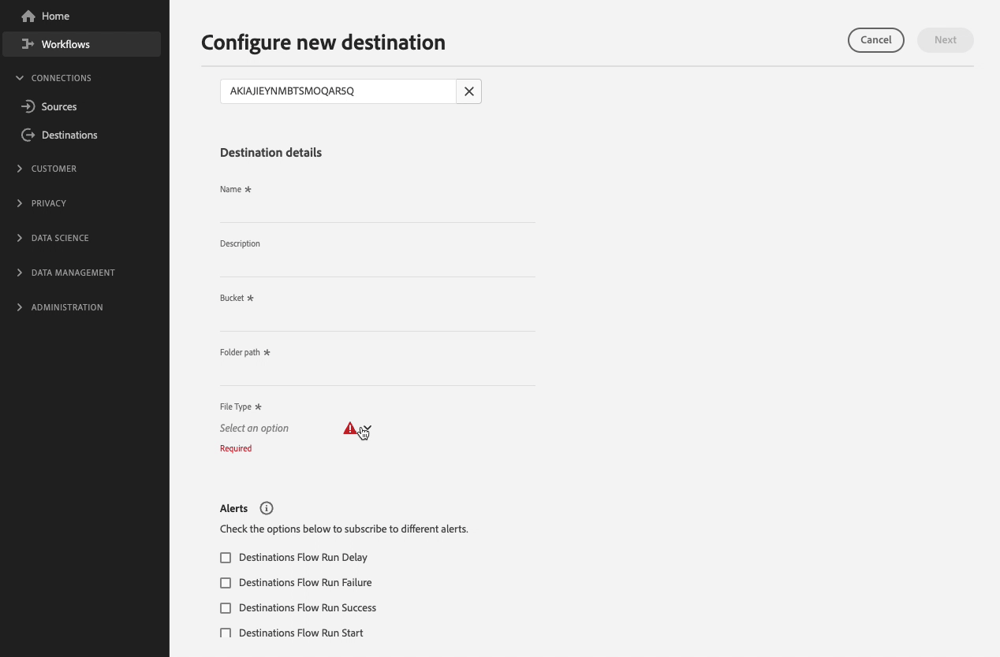

# Configurare le opzioni di formattazione per le destinazioni basate su file

## Panoramica {#overview}

La Destination SDK consente di regolare ampiamente le opzioni di formattazione e compressione dei file esportati, in modo da soddisfare qualsiasi requisito a valle nel percorso di archiviazione.

Questa pagina descrive come utilizzare Destination SDK per configurare le opzioni di formattazione per le destinazioni basate su file.

## Prerequisiti {#prerequisites}

Prima di passare ai passaggi descritti di seguito, leggere il [Guida introduttiva alla Destination SDK](../../getting-started.md) per informazioni su come ottenere le credenziali di autenticazione necessarie per l’Adobe I/O e altri prerequisiti per l’utilizzo con le API Destination SDK.

L’Adobe consiglia inoltre di leggere e acquisire familiarità con la seguente documentazione prima di procedere:

* Ogni opzione di formattazione del file disponibile è documentata a lungo in [configurazione della formattazione dei file](../../functionality/destination-server/file-formatting.md) sezione .
* Completa i passaggi per [configurare una destinazione basata su file](../../guides/configure-file-based-destination-instructions.md) utilizzando Destination SDK.

## Creare una configurazione del server e del file {#create-server-file-configuration}

Inizia utilizzando `/destination-server` endpoint per determinare quali opzioni di configurazione della formattazione file si desidera impostare per i file esportati.

Di seguito è riportato un esempio di configurazione di un server di destinazione per un [!DNL Amazon S3] destinazione, con diverse opzioni di formattazione selezionate.

**Formato API**

```http
POST platform.adobe.io/data/core/activation/authoring/destination-servers
```

**Richiesta**

```shell
curl -X POST https://platform.adobe.io/data/core/activation/authoring/destination-server \
 -H 'Authorization: Bearer {ACCESS_TOKEN}' \
 -H 'Content-Type: application/json' \
 -H 'x-gw-ims-org-id: {ORG_ID}' \
 -H 'x-api-key: {API_KEY}' \
 -H 'x-sandbox-name: {SANDBOX_NAME}' \
 -d '
{
{
  "name": "Amazon S3 Server with several CSV Options",
  "destinationServerType": "FILE_BASED_S3",
  "fileBasedS3Destination": {
    "bucket": {
      "templatingStrategy": "PEBBLE_V1",
      "value": "{{customerData.bucket}}"
    },
    "path": {
      "templatingStrategy": "PEBBLE_V1",
      "value": "{{customerData.path}}"
    }
  },
  "fileConfigurations": {
    "compression": {
      "templatingStrategy": "PEBBLE_V1",
      "value": "{{customerData.compression}}NONE"
    },
    "fileType": {
      "templatingStrategy": "PEBBLE_V1",
      "value": "{{customerData.fileType}}"
    },
    "csvOptions": {
      "sep": {
        "templatingStrategy": "PEBBLE_V1",
        "value": "{{customerData.csvOptions.delimiter}},"
      },
      "quote": {
        "templatingStrategy": "PEBBLE_V1",
        "value": "{{customerData.csvOptions.quote}}\""
      },
      "escape": {
        "templatingStrategy": "PEBBLE_V1",
        "value": "{{customerData.csvOptions.escape}}\\"
      },
      "nullValue": {
        "templatingStrategy": "PEBBLE_V1",
        "value": "{{customerData.csvOptions.nullValue}}null"
      },
      "emptyValue": {
        "templatingStrategy": "PEBBLE_V1",
        "value": "{{customerData.csvOptions.emptyValue}}"
      }
    }
  }
}
}'
```

## Aggiungi le opzioni di formattazione del file alla configurazione di destinazione {#create-destination-configuration}

>[!TIP]
>
>**Verificare l’interfaccia utente di Experience Platform**. Quando configuri le opzioni di formattazione dei file con le configurazioni illustrate nelle sezioni seguenti, controlla l’interfaccia utente di Experience Platform per sapere come viene eseguito il rendering di queste opzioni.

Dopo aver aggiunto le opzioni di formattazione desiderate al server di destinazione e alla configurazione di formattazione del file nel passaggio precedente, è ora possibile utilizzare il `/destinations` Endpoint API per aggiungere i campi desiderati come campi di dati del cliente alla configurazione di destinazione.

>[!IMPORTANT]
>
>Questo passaggio è facoltativo e determina solo quali opzioni di formattazione devono essere visualizzate agli utenti nell’interfaccia utente di Experience Platform. Se non si impostano le opzioni di formattazione dei file come campi di dati del cliente, le esportazioni dei file procederanno con i valori predefiniti configurati in [configurazione del server e dei file](#create-server-file-configuration).

In questo passaggio è possibile raggruppare le opzioni visualizzate nell’ordine desiderato, creare raggruppamenti personalizzati, campi a discesa e raggruppamenti condizionali in base ai tipi di file selezionati. Tutte queste impostazioni vengono visualizzate nella registrazione e nelle sezioni più avanti.



### Ordinare le opzioni di formattazione del file {#ordering}

L’ordine in cui si aggiungono le opzioni di formattazione dei file come campi di dati del cliente nella configurazione di destinazione si riflette nell’interfaccia utente. Ad esempio, la configurazione seguente si riflette di conseguenza nell’interfaccia utente, con le opzioni visualizzate nell’ordine **[!UICONTROL Delimitatore]**, **[!UICONTROL Carattere preventivo]**, **[!UICONTROL Carattere di escape]**, **[!UICONTROL Valore vuoto]**, **[!UICONTROL Valore Null]**.


```json
        {
            "name": "csvOptions",
            "title": "CSV Options",
            "description": "Select your CSV options",
            "type": "object",
            "properties": [
                {
                    "name": "delimiter",
                    "title": "Delimiter",
                    "description": "Select your Delimiter",
                    "type": "string",
                    "isRequired": false,
                    "default": ",",
                    "namedEnum": [
                        {
                            "name": "Comma (,)",
                            "value": ","
                        },
                        {
                            "name": "Tab (\\t)",
                            "value": "\t"
                        }
                    ],
                    "readOnly": false,
                    "hidden": false
                },
                {
                    "name": "quote",
                    "title": "Quote Character",
                    "description": "Select your Quote character",
                    "type": "string",
                    "isRequired": false,
                    "default": "\u0000",
                    "namedEnum": [
                        {
                            "name": "Double Quotes (\")",
                            "value": "\""
                        },
                        {
                            "name":"Null Character (\u0000)",
                            "value": ""
                        }
                    ],
                    "readOnly": false,
                    "hidden": false
                },
                {
                    "name": "escape",
                    "title": "Escape Character",
                    "description": "Select your Escape character",
                    "type": "string",
                    "isRequired": false,
                    "default": "\\",
                    "namedEnum": [
                        {
                            "name": "Back Slash (\\)",
                            "value": "\\"
                        },
                        {
                            "name": "Single Quote (')",
                            "value": "'"
                        }
                    ],
                    "readOnly": false,
                    "hidden": false
                },
                {
                    "name": "emptyValue",
                    "title": "Empty Value",
                    "description": "Select the output value of blank fields",
                    "type": "string",
                    "isRequired": false,
                    "default": "",
                    "namedEnum": [
                        {
                            "name": "Empty String",
                            "value": ""
                        },
                        {
                            "name": "\"\"",
                            "value": "\"\""
                        },
                        {
                            "name": "null",
                            "value": "null"
                        }
                    ],
                    "readOnly": false,
                    "hidden": false
                },
                {
                    "name": "nullValue",
                    "title": "Null Value",
                    "description": "Select the output value of 'null' fields",
                    "type": "string",
                    "isRequired": false,
                    "default": "null",
                    "namedEnum": [
                        {
                            "name": "Empty String",
                            "value": ""
                        },
                        {
                            "name": "\"\"",
                            "value": "\"\""
                        },
                        {
                            "name": "null",
                            "value": "null"
                        }
                    ],
                    "readOnly": false,
                    "hidden": false
                }
```

### Raggruppa le opzioni di formattazione del file {#grouping}

È possibile raggruppare diverse opzioni di formattazione all&#39;interno di una sezione. Quando si imposta la connessione alla destinazione nell’interfaccia utente, l’utente può visualizzare e beneficiare di un raggruppamento visivo di campi simili.

A questo scopo, utilizza `"type": "object"` per creare il gruppo e raccogliere le opzioni di formattazione desiderate in un `properties` , come mostrato nell’esempio seguente, dove il raggruppamento **[!UICONTROL Opzioni CSV]** viene evidenziato.

```json {line-numbers="true" start-number="100" highlight="106-128"}
"customerDataFields":[
[...]
{
   "name":"csvOptions",
   "title":"CSV Options",
   "description":"Select your CSV options",
   "type":"object",
   "properties":[
      {
         "name":"delimiter",
         "title":"Delimiter",
         "description":"Select your Delimiter",
         "type":"string",
         "isRequired":false,
         "default":",",
         "namedEnum":[
            {
               "name":"Comma (,)",
               "value":","
            },
            {
               "name":"Tab (\\t)",
               "value":"\t"
            }
         ],
         "readOnly":false,
         "hidden":false
      },
      [...]
   ]
}
[...]
]
```


### Crea selettori a discesa per le opzioni di formattazione del file {#dropdown-selectors}

Per le situazioni in cui desideri consentire agli utenti di selezionare tra più opzioni, ad esempio quale carattere deve essere utilizzato per delimitare i campi nei file CSV, puoi aggiungere campi a discesa all’interfaccia utente.

Per eseguire questa operazione, utilizza la variabile `namedEnum` come mostrato di seguito e configura un `default` per le opzioni che l&#39;utente può selezionare.

```json {line-numbers="true" start-number="100" highlight="114-124"}
[...]
"customerDataFields":[
[...]
{
   "name":"csvOptions",
   "title":"CSV Options",
   "description":"Select your CSV options",
   "type":"object",
   "properties":[
      {
         "name":"delimiter",
         "title":"Delimiter",
         "description":"Select your Delimiter",
         "type":"string",
         "isRequired":false,
         "default":",",
         "namedEnum":[
            {
               "name":"Comma (,)",
               "value":","
            },
            {
               "name":"Tab (\\t)",
               "value":"\t"
            }
         ],
         "readOnly":false,
         "hidden":false
      },
      [...]
   ]
}
[...]
]
```


### Creare opzioni di formattazione dei file condizionali {#conditional-options}

È possibile creare opzioni di formattazione condizionale dei file, che vengono visualizzate nel flusso di lavoro di attivazione solo quando l’utente seleziona un determinato tipo di file da esportare. Ad esempio, la configurazione seguente crea un raggruppamento condizionale per le opzioni di file CSV. Le opzioni del file CSV vengono visualizzate solo quando l’utente seleziona CSV come tipo di file desiderato da esportare.

Per impostare un campo come condizionale, utilizza la variabile `conditional` come mostrato di seguito:

```json
            "conditional": {
                "field": "fileType",
                "operator": "EQUALS",
                "value": "CSV"
            }
```

In un contesto più ampio, puoi vedere le `conditional` campo utilizzato nella configurazione di destinazione seguente, accanto al `fileType` la stringa e `csvOptions` oggetto in cui è definito.

```json
        {
            "name": "fileType",
            "title": "File Type",
            "description": "Select your file type",
            "type": "string",
            "isRequired": true,
            "enum": [
                "PARQUET",
                "CSV",
                "JSON"
            ],
            "readOnly": false,
            "hidden": false
        },
        {
            "name": "csvOptions",
            "title": "CSV Options",
            "description": "Select your CSV options",
            "type": "object",
            "conditional": {
                "field": "fileType",
                "operator": "EQUALS",
                "value": "CSV"
            },            
            "properties": [
                {
                    "name": "delimiter",
                    "title": "Delimiter",
                    "description": "Select your Delimiter",
                    "type": "string",
                    "isRequired": false,
                    "default": ",",
                    "namedEnum": [
                        {
                            "name": "Comma (,)",
                            "value": ","
                        },
                        {
                            "name": "Tab (\\t)",
                            "value": "\t"
                        }
                    ],
                    "readOnly": false,
                    "hidden": false
                },
                {
                    "name": "quote",
                    "title": "Quote Character",
                    "description": "Select your Quote character",
                    "type": "string",
                    "isRequired": false,
                    "default": "",
                    "namedEnum": [
                        {
                            "name": "Double Quotes (\")",
                            "value": "\""
                        },
                        {
                            "name":"Null Character (\u0000)",
                            "value": "\u0000"
                        }
                    ],
                    "readOnly": false,
                    "hidden": false
                },
                {
                    "name": "escape",
                    "title": "Escape Character",
                    "description": "Select your Escape character",
                    "type": "string",
                    "isRequired": false,
                    "default": "\\",
                    "namedEnum": [
                        {
                            "name": "Back Slash (\\)",
                            "value": "\\"
                        },
                        {
                            "name": "Single Quote (')",
                            "value": "'"
                        }
                    ],
                    "readOnly": false,
                    "hidden": false
                },
                {
                    "name": "emptyValue",
                    "title": "Empty Value",
                    "description": "Select the output value of blank fields",
                    "type": "string",
                    "isRequired": false,
                    "default": "",
                    "namedEnum": [
                        {
                            "name": "Empty String",
                            "value": ""
                        },
                        {
                            "name": "\"\"",
                            "value": "\"\""
                        },
                        {
                            "name": "null",
                            "value": "null"
                        }
                    ],
                    "readOnly": false,
                    "hidden": false
                },
                {
                    "name": "nullValue",
                    "title": "Null Value",
                    "description": "Select the output value of 'null' fields",
                    "type": "string",
                    "isRequired": false,
                    "default": "null",
                    "namedEnum": [
                        {
                            "name": "Empty String",
                            "value": ""
                        },
                        {
                            "name": "\"\"",
                            "value": "\"\""
                        },
                        {
                            "name": "null",
                            "value": "null"
                        }
                    ],
                    "readOnly": false,
                    "hidden": false
                }
            ],
            "isRequired": false,
            "readOnly": false,
            "hidden": false
        }
```

Di seguito è riportata la schermata risultante dell’interfaccia utente, in base alla configurazione di cui sopra. Quando l’utente seleziona il tipo di file CSV, nell’interfaccia utente vengono visualizzate altre opzioni di formattazione che fanno riferimento al tipo di file CSV.


### Richiesta API completa che include tutte le opzioni visualizzate sopra

La richiesta API seguente combina in un’unica configurazione tutte le opzioni descritte nelle sezioni precedenti.

**Richiesta**

```shell
curl -X POST https://platform.adobe.io/data/core/activation/authoring/destinations \
 -H 'Authorization: Bearer {ACCESS_TOKEN}' \
 -H 'Content-Type: application/json' \
 -H 'x-gw-ims-org-id: {ORG_ID}' \
 -H 'x-api-key: {API_KEY}' \
 -H 'x-sandbox-name: {SANDBOX_NAME}' \
 -d '
{
  "name": "My S3 Destination",
  "description": "Test destination",
  "status": "TEST",
  "sources": [
    "UNIFIED_PROFILE"
  ],
  "customerAuthenticationConfigurations": [
    {
      "authType": "S3"
    }
  ],
  "customerDataFields": [
    {
      "name": "bucket",
      "type": "string",
      "title": "Bucket",
      "description": "Enter your S3 Bucket",
      "isRequired": true
    },
    {
      "name": "path",
      "type": "string",
      "title": "Path",
      "description": "Enter your S3 Path",
      "isRequired": true
    },
    {
      "name": "fileType",
      "type": "string",
      "enum": [
        "CSV",
        "JSON",
        "PARQUET"
      ],
      "title": "File Type",
      "description": "Select your file type",
      "isRequired": true
    },
    {
      "name": "csvOptions",
      "type": "object",
      "title": "CSV Options",
      "description": "Select your CSV options",
      "conditional": {
        "field": "fileType",
        "operator": "EQUALS",
        "value": "CSV"
      },
      "properties": [
        {
          "name": "delimiter",
          "type": "string",
          "title": "Delimiter",
          "description": "Select your Delimiter",
          "namedEnum": [
            {
              "name": "Comma (,)",
              "value": ","
            },
            {
              "name": "Tab (\\t)",
              "value": "\t"
            }
          ],
          "default": ","
        },
        {
          "name": "quote",
          "type": "string",
          "title": "Quote Character",
          "description": "Select your Quote character",
          "namedEnum": [
            {
              "name": "Double Quotes (\")",
              "value": "\""
            },
            {
              "name": "Null Character (\\u0000)",
              "value": "\u0000"
            }
          ],
          "default": "\u0000"
        },
        {
          "name": "escape",
          "type": "string",
          "title": "Escape Character",
          "description": "Select your Escape character",
          "namedEnum": [
            {
              "name": "Back Slash (\\)",
              "value": "\\"
            },
            {
              "name": "Single Quote (')",
              "value": "'"
            }
          ],
          "default": "\\"
        },
        {
          "name": "emptyValue",
          "type": "string",
          "title": "Empty Value",
          "description": "Select the output value of blank fields",
          "namedEnum": [
            {
              "name": "null",
              "value": "null"
            },
            {
              "name": "Empty String",
              "value": ""
            },
            {
              "name": "\"\"",
              "value": "\"\""
            }
          ],
          "default": ""
        },
        {
          "name": "nullValue",
          "type": "string",
          "title": "Null Value",
          "description": "Select the output value of 'null' fields",
          "namedEnum": [
            {
              "name": "null",
              "value": "null"
            },
            {
              "name": "Empty String",
              "value": ""
            },
            {
              "name": "\"\"",
              "value": "\"\""
            }
          ],
          "default": "null"
        }
      ]
    }
  ],
  "uiAttributes": {
    "documentationLink": "https://www.adobe.com/go/aep",
    "category": "cloudStorage",
    "connectionType": "Server-to-server",
    "frequency": "Batch",
    "monitoringSupported": true,
    "flowRunsSupported": true
  },
  "schemaConfig": {
    "profileRequired": true,
    "segmentRequired": true,
    "identityRequired": true
  },
  "batchConfig": {
    "allowMandatoryFieldSelection": true,
    "allowDedupeKeyFieldSelection": true,
    "defaultExportMode": "DAILY_FULL_EXPORT",
    "allowedExportMode": [
      "DAILY_FULL_EXPORT",
      "FIRST_FULL_THEN_INCREMENTAL"
    ],
    "allowedScheduleFrequency": [
      "DAILY",
      "EVERY_3_HOURS",
      "EVERY_6_HOURS",
      "EVERY_8_HOURS",
      "EVERY_12_HOURS",
      "ONCE"
    ],
    "defaultFrequency": "DAILY",
    "defaultStartTime": "00:00",
    "filenameConfig": {
      "allowedFilenameAppendOptions": [
        "SEGMENT_NAME",
        "DESTINATION_INSTANCE_ID",
        "DESTINATION_INSTANCE_NAME",
        "ORGANIZATION_NAME",
        "SANDBOX_NAME",
        "DATETIME",
        "CUSTOM_TEXT"
      ],
      "defaultFilenameAppendOptions": [
        "DATETIME"
      ],
      "defaultFilename": "%DESTINATION%_%SEGMENT_ID%"
    }
  },
  "destinationDelivery": [
    {
      "deliveryMatchers": [
        {
          "type": "SOURCE",
          "value": [
            "batch"
          ]
        }
      ],
      "authenticationRule": "CUSTOMER_AUTHENTICATION",
      "destinationServerId": "<server-id>"
    }
  ]
}'
```

Una risposta corretta restituisce la configurazione di destinazione, incluso l’identificatore univoco (`instanceId`) della configurazione.

## Limitazioni note {#known-limitations}

Una certa combinazione di opzioni di formattazione dei file può portare a risultati di esportazione indesiderati dei file.
L’Adobe consiglia di non selezionare la seguente combinazione di opzioni CSV:

```
nullValue -> ""
quote -> "
emptyValue -> ""
```

Per esemplificare la limitazione, considera l’esportazione di un file con i valori seguenti:

| nome | cognome | paese | Stato |
|---------|----------|---------|--------|
| Michael | Rosa | USA | NY |
| James | Smith |  | null |

{style="table-layout:auto"}

In questo modo si otterrebbe un output come mostrato di seguito. Il valore nullo della tabella viene esportato in modo errato come virgolette di escape.

```csv
Michael,Rose,USA,NY 
James,Smith,"","\"\""
```

## Passaggi successivi {#next-steps}

Leggendo questo articolo, ora sai come impostare opzioni di formattazione personalizzata per i file esportati, utilizzando Destination SDK. Successivamente, il team può utilizzare [flusso di lavoro di attivazione per destinazioni basate su file](../../../ui/activate-batch-profile-destinations.md) per esportare i dati nella destinazione.
