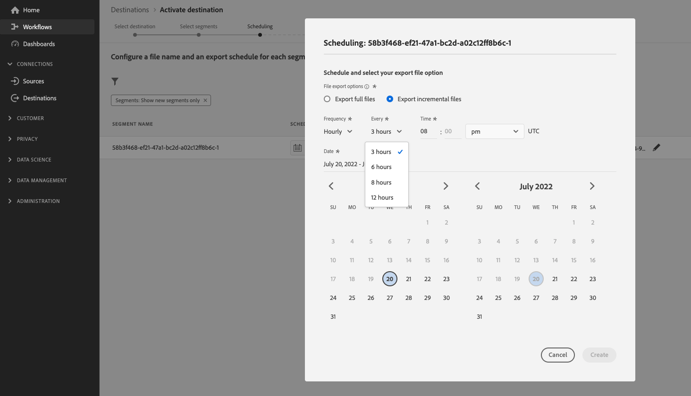
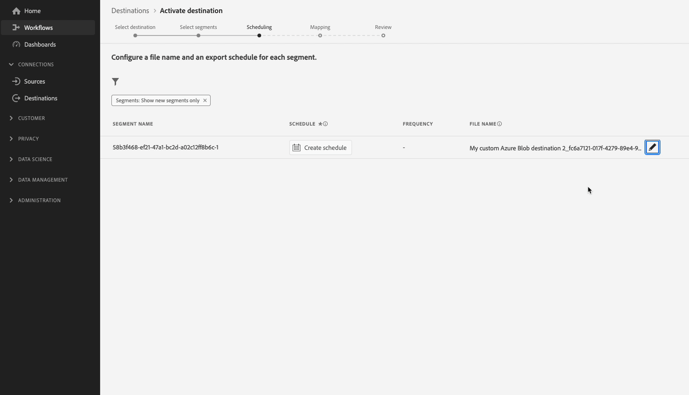

# Configurare una destinazione SFTP con opzioni di formattazione file predefinite e configurazione del nome file personalizzato

## Panoramica {#overview}

Questa pagina descrive come utilizzare Destination SDK per configurare una destinazione SFTP con una destinazione predefinita [opzioni di formattazione file](configure-file-formatting-options.md) e un personalizzato [configurazione del nome file](../../functionality/destination-configuration/batch-configuration.md#file-name-configuration).

Questa pagina mostra tutte le opzioni di configurazione disponibili per le destinazioni SFTP. Puoi modificare le configurazioni mostrate nei passaggi seguenti o eliminare alcune parti delle configurazioni, in base alle esigenze.

Per descrizioni dettagliate dei parametri utilizzati di seguito, vedi [opzioni di configurazione nell’SDK delle destinazioni](../../functionality/configuration-options.md).

## Prerequisiti {#prerequisites}

Prima di procedere con i passaggi descritti di seguito, leggere la [Destination SDK introduzione](../../getting-started.md) per informazioni su come ottenere le credenziali di autenticazione Adobe I/O necessarie e altri prerequisiti per lavorare con le API Destination SDK.

## Passaggio 1: creare una configurazione di server e file {#create-server-file-configuration}

Iniziare utilizzando `/destination-server` endpoint a [creare una configurazione di server e file](../../authoring-api/destination-server/create-destination-server.md).

**Formato API**

```http
POST platform.adobe.io/data/core/activation/authoring/destination-servers
```

**Richiesta**

La richiesta seguente crea una nuova configurazione del server di destinazione, configurata dai parametri forniti nel payload.
Il payload seguente include una configurazione SFTP generica, con impostazioni predefinite [Formattazione file CSV](../../functionality/destination-server/file-formatting.md) parametri di configurazione che gli utenti possono definire nell’interfaccia utente di Experienci Platform.

```shell
curl -X POST https://platform.adobe.io/data/core/activation/authoring/destination-server \
 -H 'Authorization: Bearer {ACCESS_TOKEN}' \
 -H 'Content-Type: application/json' \
 -H 'x-gw-ims-org-id: {ORG_ID}' \
 -H 'x-api-key: {API_KEY}' \
 -H 'x-sandbox-name: {SANDBOX_NAME}' \
 -d '
{
    "name": "SFTP destination with predefined CSV formatting options",
    "destinationServerType": "FILE_BASED_SFTP",
    "fileBasedSFTPDestination": {
        "hostname": {
            "templatingStrategy": "NONE",
            "value": "{{customerData.hostname}}"
        },
        "rootDirectory": {
            "templatingStrategy": "PEBBLE_V1",
            "value": "{{customerData.remotePath}}"
        },
        "port": 22
    },
    "fileConfigurations": {
        "compression": {
            "templatingStrategy": "PEBBLE_V1",
            "value": "{{customerData.compression}}"
        },
        "fileType": {
            "templatingStrategy": "PEBBLE_V1",
            "value": "{{customerData.fileType}}"
        },
        "csvOptions": {
            "quote": {
                "templatingStrategy": "NONE",
                "value": "\""
            },
            "quoteAll": {
                "templatingStrategy": "NONE",
                "value": "false"
            },
            "escape": {
                "templatingStrategy": "NONE",
                "value": "\\"
            },
            "escapeQuotes": {
                "templatingStrategy": "NONE",
                "value": "true"
            },
            "header": {
                "templatingStrategy": "NONE",
                "value": "true"
            },
            "ignoreLeadingWhiteSpace": {
                "templatingStrategy": "NONE",
                "value": "true"
            },
            "ignoreTrailingWhiteSpace": {
                "templatingStrategy": "NONE",
                "value": "true"
            },
            "nullValue": {
                "templatingStrategy": "NONE",
                "value": ""
            },
            "dateFormat": {
                "templatingStrategy": "NONE",
                "value": "yyyy-MM-dd"
            },
            "timestampFormat": {
                "templatingStrategy": "NONE",
                "value": "yyyy-MM-dd'T':mm:ss[.SSS][XXX]"
            },
            "charToEscapeQuoteEscaping": {
                "templatingStrategy": "NONE",
                "value": "\\"
            },
            "emptyValue": {
                "templatingStrategy": "NONE",
                "value": ""
            }
        }
    }
}'
```

In caso di esito positivo, la risposta restituisce la nuova configurazione del server di destinazione, incluso l’identificatore univoco (`instanceId`) della configurazione. Memorizza questo valore come richiesto nel passaggio successivo.

## Passaggio 2: creare la configurazione di destinazione {#create-destination-configuration}

Dopo aver creato la configurazione del server di destinazione e della formattazione del file nel passaggio precedente, ora puoi utilizzare `/destinations` Endpoint API per creare una configurazione di destinazione.

Per connettere la configurazione del server in [passaggio 1](#create-server-file-configuration) in questa configurazione di destinazione, sostituisci il `destinationServerId` nella richiesta API seguente con il valore ottenuto durante la creazione del server di destinazione in [passaggio 1](#create-server-file-configuration).

**Formato API**

```http
POST platform.adobe.io/data/core/activation/authoring/destinations
```

**Richiesta**

```shell
curl -X POST https://platform.adobe.io/data/core/activation/authoring/destinations \
 -H 'Authorization: Bearer {ACCESS_TOKEN}' \
 -H 'Content-Type: application/json' \
 -H 'x-gw-ims-org-id: {ORG_ID}' \
 -H 'x-api-key: {API_KEY}' \
 -H 'x-sandbox-name: {SANDBOX_NAME}' \
 -d '
{
   "name":"SFTP destination with predefined CSV formatting options",
   "description":"SFTP destination with predefined CSV formatting options",
   "status":"TEST",
   "customerAuthenticationConfigurations":[
      {
         "authType":"SFTP_WITH_PASSWORD"
      },
      {
         "authType":"SFTP_WITH_SSH_KEY"
      }
   ],
   "customerEncryptionConfigurations":[
       
   ],
   "customerDataFields":[
      {
         "name":"remotePath",
         "title":"Root directory",
         "description":"Enter root directory",
         "type":"string",
         "isRequired":true,
         "readOnly":false,
         "hidden":false
      },
      {
         "name":"hostname",
         "title":"Hostname",
         "description":"Enter hostname",
         "type":"string",
         "isRequired":true,
         "readOnly":false,
         "hidden":false
      }
   ],
   "uiAttributes":{
      "documentationLink":"https://www.adobe.com/go/destinations-sftp-en",
      "category":"SFTP",
      "connectionType":"SFTP",
      "monitoringSupported":true,
      "flowRunsSupported":true,
      "frequency":"Batch"
   },
   "destinationDelivery":[
      {
         "deliveryMatchers":[
            {
               "type":"SOURCE",
               "value":[
                  "batch"
               ]
            }
         ],
         "authenticationRule":"CUSTOMER_AUTHENTICATION",
         "destinationServerId":"{{instanceID of your destination server}}"
      }
   ],
   "schemaConfig":{
      "profileRequired":true,
      "segmentRequired":true,
      "identityRequired":true
   },
   "batchConfig":{
      "allowMandatoryFieldSelection":true,
      "allowDedupeKeyFieldSelection":true,
      "defaultExportMode":"DAILY_FULL_EXPORT",
      "allowedExportMode":[
         "DAILY_FULL_EXPORT",
         "FIRST_FULL_THEN_INCREMENTAL"
      ],
      "allowedScheduleFrequency":[
         "DAILY",
         "EVERY_3_HOURS",
         "EVERY_6_HOURS",
         "EVERY_8_HOURS",
         "EVERY_12_HOURS",
         "ONCE"
      ],
      "defaultFrequency":"DAILY",
      "defaultStartTime":"00:00",
      "filenameConfig":{
         "allowedFilenameAppendOptions":[
            "SEGMENT_NAME",
            "DESTINATION_INSTANCE_ID",
            "DESTINATION_INSTANCE_NAME",
            "ORGANIZATION_NAME",
            "SANDBOX_NAME",
            "DATETIME",
            "CUSTOM_TEXT"
         ],
         "defaultFilenameAppendOptions":[
            "DATETIME"
         ],
         "defaultFilename":"%DESTINATION%_%SEGMENT_ID%"
      },
      "backfillHistoricalProfileData":true
   }
}'
```

In caso di esito positivo, la risposta restituisce la nuova configurazione di destinazione, incluso l’identificatore univoco (`instanceId`) della configurazione. Memorizza questo valore in quanto è necessario se devi effettuare ulteriori richieste HTTP per aggiornare la configurazione di destinazione.

## Passaggio 3: verificare l’interfaccia utente di Experienci Platform {#verify-ui}

In base alle configurazioni di cui sopra, nel catalogo di Experience Platform verrà ora visualizzata una nuova scheda di destinazione privata da utilizzare.


Nelle immagini e nelle registrazioni seguenti, notare come le opzioni nella [flusso di lavoro di attivazione per destinazioni basate su file](/help/destinations/ui/activate-batch-profile-destinations.md) corrisponde alle opzioni selezionate nella configurazione di destinazione.

Durante la compilazione dei dettagli sulla destinazione, noterai come i campi visualizzati sono campi dati personalizzati impostati nella configurazione.

>[!TIP]
>
>L’ordine in cui si aggiungono i campi dati personalizzati alla configurazione di destinazione non si riflette nell’interfaccia utente. I campi dati personalizzati vengono sempre visualizzati nell’ordine indicato nella registrazione schermata seguente.


Quando pianifichi gli intervalli di esportazione, osserva come i campi visualizzati sono quelli impostati in `batchConfig` configurazione.


Quando visualizzi le opzioni di configurazione del nome file, osserva come i campi visualizzati rappresentano `filenameConfig` opzioni impostate nella configurazione.


Se si desidera modificare uno dei campi sopra indicati, ripetere [passaggio uno](#create-server-file-configuration) e [due](#create-destination-configuration) per modificare le configurazioni in base alle tue esigenze.

## Passaggio 4: (facoltativo) pubblica la destinazione {#publish-destination}

>[!NOTE]
>
>Questo passaggio non è necessario se stai creando una destinazione privata per il tuo utilizzo e non stai cercando di pubblicarla nel catalogo delle destinazioni affinché altri clienti la possano utilizzare.

Dopo aver configurato la destinazione, utilizza [API di pubblicazione della destinazione](../../publishing-api/create-publishing-request.md) per inviare la configurazione all&#39;Adobe per la revisione.

## Passaggio 5: (facoltativo) documenta la destinazione {#document-destination}

>[!NOTE]
>
>Questo passaggio non è necessario se stai creando una destinazione privata per il tuo utilizzo e non stai cercando di pubblicarla nel catalogo delle destinazioni affinché altri clienti la possano utilizzare.

Se si è un fornitore di software indipendente (ISV) o un integratore di sistemi (SI) che crea un [integrazione di produzione](../../overview.md#productized-custom-integrations), utilizza [processo di documentazione self-service](../../docs-framework/documentation-instructions.md) per creare una pagina di documentazione del prodotto per la destinazione in [catalogo delle destinazioni di Experience Platform](../../../catalog/overview.md).

## Passaggi successivi {#next-steps}

Una volta letto questo articolo, sai come creare una destinazione SFTP personalizzata utilizzando Destination SDK. Successivamente, il tuo team può utilizzare [flusso di lavoro di attivazione per destinazioni basate su file](../../../ui/activate-batch-profile-destinations.md) per esportare i dati nella destinazione.
