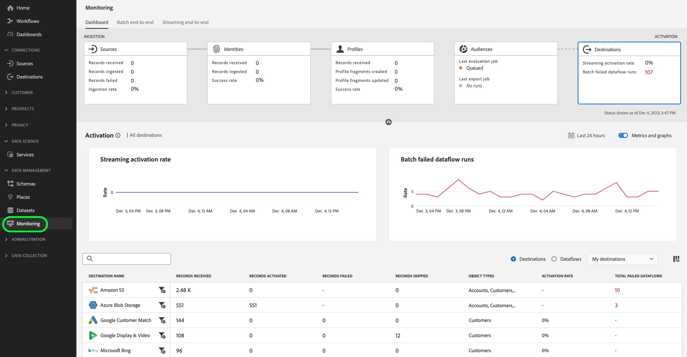

# Panoramica di [!DNL Destinations] {#overview}

**[!DNL Destinations]** sono integrazioni predefinite con piattaforme di destinazione che consentono l’attivazione diretta dei dati da Adobe Experience Platform. Puoi utilizzare le destinazioni per attivare i dati noti e sconosciuti per campagne di marketing cross-channel, campagne e-mail, pubblicità mirata e molti altri casi d’uso.

## Destinazioni e origini {#destinations-and-sources}

Una delle funzionalità principali di Experienci Platform è l&#39;acquisizione dei dati di terze parti e l&#39;attivazione per le esigenze aziendali. Utilizza [origini](../sources/home.md) per assimilare i dati in Experience Platform e destinazioni per esportare i dati da Experience Platform.

## Passaggi di destinazione {#steps}

* Scegli da un [catalogo self-service](./catalog/overview.md) di tutte le destinazioni disponibili in Experienci Platform.
* Utilizza le destinazioni per inviare tipi di pubblico o set di dati a piattaforme di automazione marketing, piattaforme di pubblicità digitale e altro ancora.
* Pianifica le esportazioni di dati nelle destinazioni preferite a intervalli regolari.

## Controlli {#controls}

I controlli nell&#39;area di lavoro [destinazioni](./ui/destinations-workspace.md) consentono di:

* Sfoglia il catalogo delle piattaforme di destinazione in cui puoi attivare i tuoi dati;
* Creare, modificare, attivare e disattivare flussi di dati per le destinazioni nel catalogo;
* Creare un account in un percorso di archiviazione o collegare Experience Platform all’account nella piattaforma di destinazione;
* Seleziona i tipi di pubblico o i set di dati da attivare nelle destinazioni;
* Seleziona i [campi Experience Data Model (XDM)](../xdm/home.md) da esportare durante l&#39;attivazione di tipi di pubblico in determinate destinazioni, ad esempio destinazioni di e-mail marketing, piattaforme CRM, posizioni di archiviazione cloud e altro ancora.
* Attiva diversi tipi di profili e tipi di pubblico per le destinazioni: persone, account e potenziali clienti.

## Tipi e categorie di destinazione {#types-and-categories}

Ad Experience Platform, puoi attivare i dati in vari tipi di destinazioni, per soddisfare i casi di utilizzo dell&#39;attivazione. Le destinazioni variano dalle integrazioni basate su API alle integrazioni con i sistemi di ricezione di file, le destinazioni di ricerca dei profili e altro ancora. Per informazioni dettagliate su tutte le destinazioni disponibili, leggere la [panoramica sui tipi e sulle categorie di destinazione](./destination-types.md).

## Destinazioni Adobe e create dai partner {#adobe-and-partner-built-destinations}

Alcuni dei connettori nel catalogo delle destinazioni di Experience Platform vengono creati e gestiti da Adobe, mentre altri vengono creati e gestiti da società partner che utilizzano [Destination SDK](/help/destinations/destination-sdk/overview.md). Una nota nella parte superiore della pagina della documentazione per ogni connettore creato da un partner indica se una destinazione è stata creata e gestita dal partner. Il [connettore Amazon S3](/help/destinations/catalog/cloud-storage/amazon-s3.md), ad esempio, viene creato da Adobe, mentre il [connettore TikTok](/help/destinations/catalog/social/tiktok.md) viene creato e gestito dal team TikTok.

Per i connettori creati e gestiti dal partner, ciò significa che i problemi con il connettore potrebbero dover essere risolti dal team partner (metodo di contatto fornito nella nota nella pagina della documentazione). In caso di problemi con i connettori creati e gestiti da Adobe, contatta il rappresentante dell&#39;Adobe o l&#39;Assistenza clienti.

## Controlli di accesso e destinazioni {#access-controls}

La funzionalità Destinazioni in Experience Platform funziona con le autorizzazioni di controllo di accesso di Adobe Experience Platform. A seconda del livello di autorizzazione dell&#39;utente, è possibile visualizzare, gestire e attivare le destinazioni. Per informazioni sulle singole autorizzazioni, vai a [controllo di accesso in Adobe Experience Platform](../access-control/home.md) e scorri verso il basso fino alla tabella nella parte inferiore della pagina.

Nella tabella seguente vengono descritte le combinazioni di autorizzazioni e autorizzazioni necessarie per eseguire determinate azioni sulle destinazioni.

| Livello di autorizzazione | Descrizione |
| ---- | ---- |
| **[!UICONTROL View Destinations]** | Per accedere alla scheda delle destinazioni nell&#39;interfaccia utente di Experience Platform, è necessario disporre dell&#39;autorizzazione **[!UICONTROL View Destinations]** [per il controllo degli accessi](/help/access-control/home.md#permissions). |
| **[!UICONTROL View Destinations]**, **[!UICONTROL Manage Destinations]** | Per connettersi alle destinazioni, sono necessarie le **[!UICONTROL View Destinations]** e le **[!UICONTROL Manage Destinations]** [autorizzazioni di controllo di accesso](/help/access-control/home.md#permissions). |
| **[!UICONTROL View Destinations]**, **[!UICONTROL Activate Destinations]**, **[!UICONTROL View Profiles]** e **[!UICONTROL View Segments]** | Per attivare i gruppi di destinatari nelle destinazioni e abilitare il [passaggio di mappatura](ui/activate-batch-profile-destinations.md#mapping) del flusso di lavoro, sono necessarie le **[!UICONTROL View Destinations]**, **[!UICONTROL Activate Destinations]**, **[!UICONTROL View Profiles]** e le **[!UICONTROL View Segments]** [autorizzazioni di controllo dell&#39;accesso](/help/access-control/home.md#permissions). |
| **[!UICONTROL View Destinations]**, **[!UICONTROL Activate Segments without Mapping]**, **[!UICONTROL View Profiles]** e **[!UICONTROL View Segments]** | Per aggiungere o rimuovere tipi di pubblico dai flussi di dati esistenti senza avere accesso al [passaggio di mappatura](ui/activate-batch-profile-destinations.md#mapping) del flusso di lavoro, sono necessarie le **[!UICONTROL View Destinations]**, **[!UICONTROL Activate Segments without Mapping]**, **[!UICONTROL View Profiles]** e **[!UICONTROL View Segments]** [autorizzazioni di controllo di accesso](/help/access-control/home.md#permissions). |
| **[!UICONTROL View Destinations]**, **[!UICONTROL Manage and Activate Dataset Destinations]** | Per esportare i set di dati nelle destinazioni, sono necessarie le **[!UICONTROL View Destinations]** e le **[!UICONTROL Manage and Activate Dataset Destinations]** [autorizzazioni di controllo di accesso](/help/access-control/home.md#permissions). |
| **[!UICONTROL View Identity Graph]** | Per esportare *identità* nelle destinazioni, è necessaria l&#39;autorizzazione **[!UICONTROL View Identity Graph]** [controllo di accesso](/help/access-control/home.md#permissions).   {width="100" zoomable="yes"} |

{style="table-layout:auto"}

Nel diagramma seguente vengono visualizzate le autorizzazioni necessarie in base alle operazioni che si desidera eseguire sulle destinazioni.

Per ulteriori informazioni sui controlli di accesso, vedere la [Guida utente del controllo di accesso](../access-control/ui/overview.md).

### Controllo dell&#39;accesso basato su attributi per le destinazioni {#attribute-based-access}

Il controllo dell’accesso basato su attributi in Adobe Experience Platform consente agli amministratori di controllare l’accesso a oggetti e/o funzionalità specifici in base agli attributi.

Con il controllo degli accessi basato su attributi, puoi applicare configurazioni di mappatura ai campi per i quali disponi delle autorizzazioni di. Inoltre, non è possibile esportare i dati in una destinazione se non si dispone dell’accesso a tutti i campi del set di dati.

Per ulteriori informazioni sul funzionamento delle destinazioni con i controlli di accesso basati su attributi, leggere la [panoramica sul controllo di accesso basato su attributi](../access-control/abac/overview.md#destinations).

## Rimozione del profilo dalle destinazioni {#profile-removal}

Quando un profilo viene rimosso da un pubblico attivato su una destinazione, viene rimosso anche dal pubblico corrispondente nella piattaforma di destinazione. Se, ad esempio, un profilo viene rimosso da un gruppo di destinatari precedentemente attivato in LinkedIn, tale profilo verrà rimosso dall&#39;elemento [!UICONTROL LinkedIn Matched Audience] associato.

La rimozione del profilo dalle destinazioni (o rimozione dai segmenti) avviene con la stessa frequenza della segmentazione. Non appena un profilo viene rimosso da un pubblico in Experience Platform, il successivo flusso di dati pianificato per la destinazione riflette tale modifica e rimuove il profilo dal pubblico di destinazione.

La velocità effettiva alla quale la rimozione del profilo ha effetto nella piattaforma di destinazione può variare in base al comportamento di acquisizione ed elaborazione della destinazione.

## Controllo delle destinazioni {#destinations-monitoring}

Dopo aver stabilito una connessione a una destinazione e aver completato il flusso di lavoro di attivazione, puoi monitorare le esportazioni di dati nel sistema di ricezione. Per ulteriori informazioni, leggere la [guida sul monitoraggio dei flussi di dati per le destinazioni nell&#39;interfaccia utente](/help/dataflows/ui/monitor-destinations.md).

È inoltre possibile verificare se i dati vengono inviati correttamente alla destinazione. La maggior parte delle pagine della documentazione di destinazione nel catalogo dispone di una *sezione Convalida esportazione dati*, che indica come verificare nella piattaforma di destinazione che i dati siano stati importati correttamente dall&#39;Experience Platform. Visualizza un esempio di questa sezione per la [destinazione Amazon Ads](/help/destinations/catalog/advertising/amazon-ads.md#exported-data).

## Restrizioni sulla governance dei dati per l&#39;attivazione dei dati per le destinazioni {#data-governance}

La governance dei dati viene applicata per le destinazioni di Experience Platform tramite:

* *Azioni di marketing* che è possibile selezionare nel flusso di lavoro di creazione delle destinazioni;
* *Criteri per l&#39;utilizzo dei dati* che impediscono l&#39;attivazione di dati contenenti determinate etichette di utilizzo a destinazioni con determinate azioni di marketing.

Per ulteriori informazioni sulle [azioni di marketing](../data-governance/policies/overview.md) e sulla [risoluzione delle violazioni dei criteri per i dati](../data-governance/enforcement/auto-enforcement.md), vedere la documentazione sulla governance dei dati nell&#39;Experience Platform.

Per ulteriori informazioni sulla selezione delle azioni di marketing nel flusso di lavoro di creazione della destinazione, vedere le pagine seguenti relative ai diversi tipi di destinazione nell&#39;Experience Platform:

* [Destinazioni pubblicitarie - Google Ad Manager](./catalog/advertising/google-ad-manager.md)
* [Destinazioni Advertising - Google Ads](./catalog/advertising/google-ads-destination.md)
* [Destinazioni Advertising - Google Display &amp; Video 360](./catalog/advertising/google-dv360.md)
* [Destinazioni account Advertising - Bombora ABM Audience Connection](./catalog/advertising/bombora.md)
* [Destinazioni account Advertising - Connessione Demandbase](./catalog/advertising/demandbase.md)
* [Destinazioni di archiviazione cloud](./catalog/cloud-storage/overview.md)
* [Destinazioni di e-mail marketing](./catalog/email-marketing/overview.md)
* [Destinazioni social](./catalog/social/overview.md)

Per ulteriori informazioni sulle violazioni dei criteri per i dati nel flusso di lavoro di attivazione del pubblico, vedi il passaggio **[!UICONTROL Review]** nelle seguenti guide:

* [Attiva i dati del pubblico nelle destinazioni di esportazione del pubblico in streaming](./ui/activate-segment-streaming-destinations.md#review)
* [Attivare i dati del pubblico nelle destinazioni di esportazione del profilo di streaming](./ui/activate-streaming-profile-destinations.md#review)
* [Attivare i dati del pubblico nelle destinazioni di esportazione del profilo batch](./ui/activate-batch-profile-destinations.md#review)

## Termini e condizioni {#terms-and-conditions}

Utilizzando una delle destinazioni etichettate come beta (&quot;Beta&quot;), con il presente documento confermi che la Beta è fornita ***&quot;così come è&quot; senza alcuna garanzia di tipo***.

Adobe non si assume alcun obbligo di mantenere, correggere, aggiornare, modificare o altrimenti supportare la versione beta. Si consiglia all’Utente di utilizzare Informazioni e di non fare affidamento in alcun modo sul corretto funzionamento o sulle prestazioni di tale Beta e/o dei materiali di accompagnamento. La versione beta è considerata Informazioni riservate di Adobe.

Qualsiasi &quot;Feedback&quot; (informazioni relative alla versione beta che includono, a titolo esemplificativo ma non esaustivo, problemi o difetti riscontrati durante l’utilizzo della versione beta, suggerimenti, miglioramenti e raccomandazioni) fornito dall’Utente ad Adobe Adobe viene assegnato a Adobe, inclusi tutti i diritti, i titoli e gli interessi relativi a tale Feedback.

Invia feedback aperto o crea un ticket di supporto per condividere i suggerimenti o segnalare un bug, cercare un miglioramento delle funzioni.