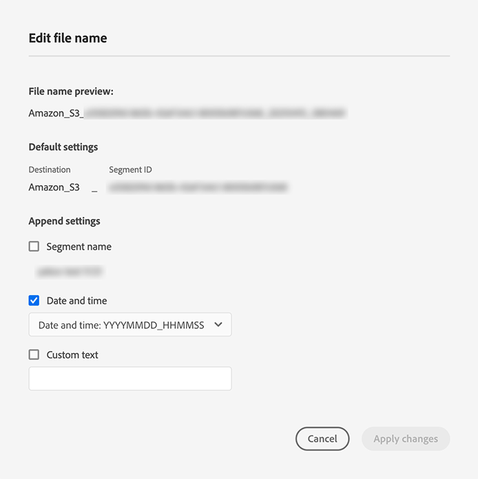

# Attivare i dati del pubblico nelle destinazioni di esportazione del profilo batch

>[!IMPORTANT]
> 
>Per attivare i dati, è necessario **[!UICONTROL Gestire le destinazioni]**, **[!UICONTROL Attivare le destinazioni]**, **[!UICONTROL Visualizza profili]** e **[!UICONTROL Visualizzare i segmenti]** [autorizzazioni di controllo accessi](/help/access-control/home.md#permissions). Leggi la sezione [panoramica sul controllo degli accessi](/help/access-control/ui/overview.md) oppure contatta l’amministratore del prodotto per ottenere le autorizzazioni richieste.

## Panoramica {#overview}

Questo articolo spiega il flusso di lavoro necessario per attivare i dati del pubblico nelle destinazioni basate su profili batch di Adobe Experience Platform, come l’archiviazione cloud e le destinazioni di marketing via e-mail.

## Prerequisiti {#prerequisites}

Per attivare i dati nelle destinazioni, è necessario aver completato l&#39;operazione [connesso a una destinazione](./connect-destination.md). Se non lo hai già fatto, vai alla [catalogo delle destinazioni](../catalog/overview.md), sfoglia le destinazioni supportate e configura la destinazione che desideri utilizzare.

## Seleziona la destinazione {#select-destination}

1. Vai a **[!UICONTROL Connessioni > Destinazioni]**, quindi seleziona la **[!UICONTROL Catalogo]** scheda .

   

1. Seleziona **[!UICONTROL Attivare i segmenti]** sulla scheda corrispondente alla destinazione in cui desideri attivare i segmenti, come illustrato di seguito.

   

1. Seleziona la connessione di destinazione che desideri utilizzare per attivare i segmenti, quindi seleziona **[!UICONTROL Successivo]**.

   

1. Passa alla sezione successiva in [seleziona i segmenti](#select-segments).

## Selezionare i segmenti {#select-segments}

Utilizza le caselle di controllo a sinistra dei nomi dei segmenti per selezionare i segmenti che desideri attivare nella destinazione, quindi seleziona **[!UICONTROL Successivo]**.


## Esportazione di segmenti programmata {#scheduling}

>[!CONTEXTUALHELP]
>id="platform_destinations_activate_schedule"
>title="Pianificazione"
>abstract="Utilizza l’icona a forma di matita per impostare il tipo di esportazione del file (file completi o incrementali) e la frequenza di esportazione."
>additional-url="https://www.adobe.com/go/destinations-profile-batch-en" text="Ulteriori informazioni nella documentazione"

[!DNL Adobe Experience Platform] esporta i dati per le destinazioni di marketing e archiviazione cloud sotto forma di [!DNL CSV] file. In **[!UICONTROL Pianificazione]** È possibile configurare la pianificazione e i nomi dei file per ciascun segmento che si sta esportando. La configurazione della pianificazione è obbligatoria, ma il nome del file è facoltativo.

>[!IMPORTANT]
> 
>[!DNL Adobe Experience Platform] divide automaticamente i file di esportazione a 5 milioni di record (righe) per file. Ogni riga rappresenta un profilo.
>
>I nomi dei file divisi vengono aggiunti con un numero che indica che il file fa parte di un’esportazione più grande, in quanto tale: `filename.csv`, `filename_2.csv`, `filename_3.csv`.

Seleziona la **[!UICONTROL Crea pianificazione]** corrispondente al segmento da inviare alla destinazione.


### Esportare file completi {#export-full-files}

>[!CONTEXTUALHELP]
>id="platform_destinations_activate_exportoptions"
>title="Opzioni di esportazione file"
>abstract="Seleziona **Esportare file completi** per esportare uno snapshot completo di tutti i profili idonei per il segmento. Seleziona **Esportare file incrementali** per esportare solo i profili qualificati per il segmento dall’ultima esportazione. <br> La prima esportazione di file incrementali include tutti i profili idonei per il segmento, che agiscono come backfill. I file incrementali futuri includono solo i profili qualificati per il segmento a partire dalla prima esportazione di file incrementali."
>additional-url="https://experienceleague.adobe.com/docs/experience-platform/destinations/ui/activate/activate-batch-profile-destinations.html#export-incremental-files" text="Esportare file incrementali"

>[!CONTEXTUALHELP]
>id="platform_destinations_activationchaining_aftersegmentevaluation"
>title="Attiva dopo la valutazione dei segmenti"
>abstract="L’attivazione viene eseguita immediatamente dopo il completamento del processo di segmentazione giornaliera. In questo modo i profili più aggiornati vengono esportati."

>[!CONTEXTUALHELP]
>id="platform_destinations_activationchaining_scheduled"
>title="Attivazione pianificata"
>abstract="L&#39;attivazione viene eseguita a un&#39;ora fissa del giorno."

>[!CONTEXTUALHELP]
>id="platform_destinations_activationchaining_activatenow"
>title="Attiva on-demand"
>abstract="Selezionare questo controllo per fornire un’esportazione completa di file oltre a qualsiasi esportazione pianificata in precedenza. L’esportazione del file viene attivata immediatamente."

Seleziona **[!UICONTROL Esportare file completi]** per attivare l’esportazione di un file contenente uno snapshot completo di tutte le qualifiche di profilo per il segmento selezionato.


1. Utilizza la **[!UICONTROL Frequenza]** selettore per selezionare la frequenza di esportazione:

   * **[!UICONTROL Una volta]**: pianificare un&#39;esportazione di file completi on-demand una sola volta.
   * **[!UICONTROL Giornaliero]**: pianifica esportazioni di file completi una volta al giorno, ogni giorno, al momento specificato.

1. Utilizza la **[!UICONTROL Time]** per selezionare se l’esportazione deve essere eseguita immediatamente dopo la valutazione del segmento o su base pianificata, a un’ora specificata. Quando selezioni **[!UICONTROL Pianificato]** puoi utilizzare il selettore per scegliere l’ora del giorno, in [!DNL UTC] formato, quando deve aver luogo l&#39;esportazione.

   >[!NOTE]
   >
   >La **[!UICONTROL Dopo la valutazione dei segmenti]** l’opzione descritta di seguito è attualmente disponibile solo per alcuni clienti Beta.

   Utilizza la **[!UICONTROL Dopo la valutazione dei segmenti]** opzione per eseguire il processo di attivazione immediatamente dopo il completamento del processo di segmentazione batch giornaliero di Platform. In questo modo, quando il processo di attivazione viene eseguito, i profili più aggiornati vengono esportati nella destinazione.

   <!-- Batch segmentation currently runs at {{insert time of day}} and lasts for an average {{x hours}}. Adobe reserves the right to modify this schedule. -->

   
Utilizza la **[!UICONTROL Pianificato]** per fare in modo che il processo di attivazione venga eseguito a un orario fisso. In questo modo i dati del profilo di Experience Platform vengono esportati allo stesso tempo ogni giorno, ma i profili esportati potrebbero non essere i più aggiornati, a seconda che il processo di segmentazione del batch sia stato completato prima che il processo di attivazione inizi.

   

   >[!IMPORTANT]
   >
   >A causa del modo in cui vengono configurati i processi di Experience Platform interni, la prima esportazione di file incrementali o completi potrebbe non contenere tutti i dati di backfill. <br> <br> Per garantire un’esportazione completa e più aggiornata dei dati di backfill sia per i file completi che per quelli incrementali, l’Adobe consiglia di impostare l’orario di esportazione del primo file dopo le 12:00 GMT del giorno successivo. Questa limitazione sarà affrontata nelle prossime versioni.

1. Utilizza la **[!UICONTROL Data]** selettore per scegliere il giorno o l’intervallo in cui deve aver luogo l’esportazione. Per le esportazioni giornaliere, la best practice prevede di impostare la data di inizio e di fine in modo che corrisponda alla durata delle campagne nelle piattaforme downstream.

   >[!IMPORTANT]
   >
   > Quando si seleziona un intervallo di esportazione, l’ultimo giorno dell’intervallo non viene incluso nelle esportazioni. Ad esempio, se selezioni un intervallo tra il 4 e l’11 gennaio, l’ultima esportazione di file avrà luogo il 10 gennaio.

1. Seleziona **[!UICONTROL Crea]** per salvare la pianificazione.

### Esportare file incrementali {#export-incremental-files}

Seleziona **[!UICONTROL Esportare file incrementali]** per attivare un’esportazione in cui il primo file è uno snapshot completo di tutte le qualifiche di profilo per il segmento selezionato e i file successivi sono qualifiche di profilo incrementali a partire dall’esportazione precedente.

>[!IMPORTANT]
>
>Il primo file incrementale esportato include tutti i profili idonei per un segmento, che funzionano come backfill.


1. Utilizza la **[!UICONTROL Frequenza]** selettore per selezionare la frequenza di esportazione:

   * **[!UICONTROL Giornaliero]**: pianifica esportazioni incrementali di file una volta al giorno, ogni giorno, al momento specificato.
   * **[!UICONTROL Orario]**: pianificare esportazioni di file incrementali ogni 3, 6, 8 o 12 ore.

1. Utilizza la **[!UICONTROL Time]** selettore per scegliere l’ora del giorno, in [!DNL UTC] formato, quando deve aver luogo l&#39;esportazione.

   >[!IMPORTANT]
   >
   >A causa del modo in cui vengono configurati i processi di Experience Platform interni, la prima esportazione di file incrementali o completi potrebbe non contenere tutti i dati di backfill. <br> <br> Per garantire un’esportazione completa e più aggiornata dei dati di backfill sia per i file completi che per quelli incrementali, l’Adobe consiglia di impostare l’orario di esportazione del primo file dopo le 12:00 GMT del giorno successivo. Questa limitazione sarà affrontata nelle prossime versioni.

1. Utilizza la **[!UICONTROL Data]** selettore per scegliere l’intervallo in cui deve avvenire l’esportazione. È consigliabile impostare la data di inizio e di fine in modo che corrisponda alla durata delle campagne nelle piattaforme downstream.

   >[!IMPORTANT]
   >
   >L’ultimo giorno dell’intervallo non è incluso nelle esportazioni. Ad esempio, se selezioni un intervallo tra il 4 e l’11 gennaio, l’ultima esportazione di file avrà luogo il 10 gennaio.

1. Seleziona **[!UICONTROL Crea]** per salvare la pianificazione.

### Configurare i nomi dei file {#file-names}

>[!CONTEXTUALHELP]
>id="platform_destinations_activate_filename"
>title="Configura nome file"
>abstract="Per le destinazioni basate su file, viene generato un nome file univoco per segmento. Utilizza l’editor dei nomi file per creare e modificare un nome file univoco o per mantenere il nome predefinito."

I nomi file predefiniti sono costituiti dal nome di destinazione, dall’ID del segmento e da un indicatore di data e ora. Ad esempio, puoi modificare i nomi dei file esportati per distinguere tra campagne diverse o per far sì che il tempo di esportazione dei dati sia aggiunto ai file.

Seleziona l’icona a forma di matita per aprire una finestra modale e modificare i nomi dei file. I nomi dei file sono limitati a 255 caratteri.

>[!NOTE]
>
>L’immagine seguente mostra come è possibile modificare i nomi dei file per le destinazioni Amazon S3, ma il processo è identico per tutte le destinazioni batch (ad esempio SFTP o Azure Blob Storage).


Nell’editor dei nomi dei file, puoi selezionare diversi componenti da aggiungere al nome del file.



Impossibile rimuovere il nome di destinazione e l’ID del segmento dai nomi dei file. Oltre a questi, puoi aggiungere quanto segue:

* **[!UICONTROL Nome del segmento]**: Puoi aggiungere il nome del segmento al nome del file.
* **[!UICONTROL Data e ora]**: Seleziona tra l’aggiunta di un `MMDDYYYY_HHMMSS` o un timestamp Unix a 10 cifre dell’ora in cui i file vengono generati. Scegliere una di queste opzioni se si desidera che i file abbiano un nome file dinamico generato con ogni esportazione incrementale.
* **[!UICONTROL Testo personalizzato]**: Aggiungi testo personalizzato ai nomi dei file.

Seleziona **[!UICONTROL Applica modifiche]** per confermare la selezione.

>[!IMPORTANT]
> 
>Se non si seleziona il **[!UICONTROL Data e ora]** i nomi dei file saranno statici e il nuovo file esportato sovrascriverà il file precedente nel percorso di archiviazione con ogni esportazione. Quando esegui un processo di importazione ricorrente da un percorso di archiviazione in una piattaforma di marketing e-mail, questa è l’opzione consigliata.

Al termine della configurazione di tutti i segmenti, seleziona **[!UICONTROL Successivo]** per continuare.

## Selezionare gli attributi del profilo {#select-attributes}

Per le destinazioni basate su profili, devi selezionare gli attributi di profilo da inviare alla destinazione.


1. In **[!UICONTROL Seleziona attributi]** pagina, seleziona **[!UICONTROL Aggiungi nuovo campo]**.

   

1. Seleziona la freccia a destra del **[!UICONTROL Campo schema]** voce.

   

1. In **[!UICONTROL Seleziona campo]** seleziona gli attributi XDM da inviare alla destinazione, quindi scegli **[!UICONTROL Seleziona]**.

   

1. Per aggiungere altre mappature, ripeti i passaggi da uno a tre.

>[!NOTE]
>
> Adobe Experience Platform precompila la selezione con quattro attributi consigliati e di uso comune dallo schema: `person.name.firstName`, `person.name.lastName`, `personalEmail.address`, `segmentMembership.status`.

Le esportazioni di file variano nei seguenti modi, a seconda che `segmentMembership.status` è selezionato:
* Se la `segmentMembership.status` campo selezionato, i file esportati includono **[!UICONTROL Attivo]** membri nello snapshot completo iniziale e **[!UICONTROL Attivo]** e **[!UICONTROL Scaduto]** membri nelle esportazioni incrementali successive.
* Se la `segmentMembership.status` campo non selezionato, i file esportati includono solo **[!UICONTROL Attivo]** membri nello snapshot completo iniziale e nelle esportazioni incrementali successive.


### Attributi obbligatori {#mandatory-attributes}

>[!CONTEXTUALHELP]
>id="platform_destinations_activate_mandatorykey"
>title="Informazioni sugli attributi obbligatori"
>abstract="Seleziona gli attributi dello schema XDM che tutti i profili esportati devono includere. I profili senza la chiave obbligatoria non vengono esportati nella destinazione . Se non selezioni una chiave obbligatoria, vengono esportati tutti i profili qualificati, indipendentemente dai relativi attributi."
>additional-url="http://www.adobe.com/go/destinations-mandatory-attributes-en" text="Ulteriori informazioni nella documentazione"

Un attributo obbligatorio è una casella di controllo abilitata dall’utente che assicura che tutti i record del profilo contengano l’attributo selezionato. Ad esempio: tutti i profili esportati contengono un indirizzo e-mail. &#x200B;

Puoi contrassegnare gli attributi come obbligatori per garantire che [!DNL Platform] esporta solo i profili che includono l’attributo specifico. Di conseguenza, può essere utilizzato come ulteriore forma di filtro. Contrassegnare un attributo come obbligatorio è **not** obbligatorio.

Se non selezioni un attributo obbligatorio, vengono esportati tutti i profili qualificati, indipendentemente dai relativi attributi.

È consigliabile che uno degli attributi sia un [identificatore univoco](../../destinations/catalog/email-marketing/overview.md#identity) dallo schema. Per ulteriori informazioni sugli attributi obbligatori, consulta la sezione relativa all’identità in [Destinazioni di marketing e-mail](../../destinations/catalog/email-marketing/overview.md#identity) documentazione.

### Chiavi di deduplicazione {#deduplication-keys}

>[!CONTEXTUALHELP]
>id="platform_destinations_activate_deduplicationkey"
>title="Informazioni sulle chiavi di deduplicazione"
>abstract="Elimina più record dello stesso profilo nei file di esportazione selezionando una chiave di deduplicazione. Seleziona un singolo spazio dei nomi o fino a due attributi di schema XDM come chiave di deduplicazione. La mancata selezione di una chiave di deduplicazione può causare la presenza di voci di profilo duplicate nei file di esportazione."
>additional-url="http://www.adobe.com/go/destinations-deduplication-keys-en" text="Ulteriori informazioni nella documentazione"

Una chiave di deduplicazione è una chiave primaria definita dall’utente che determina l’identità in base alla quale gli utenti desiderano che i loro profili vengano deduplicati. &#x200B;

Le chiavi di deduplicazione eliminano la possibilità di avere più record dello stesso profilo in un unico file di esportazione.

Esistono tre modi per utilizzare le chiavi di deduplicazione in [!DNL Platform]:

* Utilizzo di un singolo spazio dei nomi di identità come [!UICONTROL chiave di deduplicazione]
* Utilizzo di un singolo attributo di profilo da un [!DNL XDM] profilo come [!UICONTROL chiave di deduplicazione]
* Utilizzo di una combinazione di due attributi di profilo da un [!DNL XDM] profilo come chiave composita

>[!IMPORTANT]
>
> È possibile esportare un singolo namespace di identità in una destinazione e lo spazio dei nomi viene impostato automaticamente come chiave di deduplicazione. L’invio di più namespace a una destinazione non è supportato.
> 
> Non è possibile utilizzare una combinazione di namespace identità e attributi di profilo come chiavi di deduplicazione.

### Esempio di deduplicazione {#deduplication-example}

Questo esempio illustra il funzionamento della deduplicazione, a seconda delle chiavi di deduplicazione selezionate.

Consideriamo i due profili seguenti.

**Profilo A**

```json
{
  "identityMap": {
    "Email": [
      {
        "id": "johndoe_1@example.com"
      },
      {
        "id": "johndoe_2@example.com"
      }
    ]
  },
  "segmentMembership": {
    "ups": {
      "fa5c4622-6847-4199-8dd4-8b7c7c7ed1d6": {
        "status": "existing",
        "lastQualificationTime": "2021-03-10 10:03:08"
      }
    }
  },
  "person": {
    "name": {
      "lastName": "Doe",
      "firstName": "John"
    }
  },
  "personalEmail": {
    "address": "johndoe@example.com"
  }
}
```

**Profilo B**

```json
{
  "identityMap": {
    "Email": [
      {
        "id": "johndoe_1@example.com"
      },
      {
        "id": "johndoe_2@example.com"
      }
    ]
  },
  "segmentMembership": {
    "ups": {
      "fa5c4622-6847-4199-8dd4-8b7c7c7ed1d6": {
        "status": "existing",
        "lastQualificationTime": "2021-04-10 11:33:28"
      }
    }
  },
  "person": {
    "name": {
      "lastName": "D",
      "firstName": "John"
    }
  },
  "personalEmail": {
    "address": "johndoe@example.com"
  }
}
```

### Caso di utilizzo della deduplicazione 1: nessuna deduplicazione {#deduplication-use-case-1}

Senza la deduplicazione, il file di esportazione conterrebbe le seguenti voci.

| personalEmail | firstName | lastName |
|---|---|---|
| johndoe@example.com | John | Doe |
| johndoe@example.com | John | D |


### Caso di utilizzo della deduplicazione 2: deduplicazione basata sullo spazio dei nomi identità {#deduplication-use-case-2}

Presupponendo una deduplicazione da parte della [!DNL Email] spazio dei nomi, il file di esportazione conterrà le seguenti voci. Il profilo B è l’ultimo ad essere qualificato per il segmento, quindi è l’unico ad essere esportato.

| E-mail* | personalEmail | firstName | lastName |
|---|---|---|---|
| johndoe_1@example.com | johndoe@example.com | John | D |
| johndoe_2@example.com | johndoe@example.com | John | D |

### Caso di utilizzo della deduplicazione 3: deduplicazione basata su un singolo attributo di profilo {#deduplication-use-case-3}

Presupponendo una deduplicazione da parte della `personal Email` attributo , il file di esportazione conterrà la seguente voce. Il profilo B è l’ultimo ad essere qualificato per il segmento, quindi è l’unico ad essere esportato.

| personalEmail* | firstName | lastName |
|---|---|---|
| johndoe@example.com | John | D |


### Caso di utilizzo della deduplicazione 4: deduplicazione basata su due attributi di profilo {#deduplication-use-case-4}

Supponendo la deduplicazione da parte della chiave composita `personalEmail + lastName`, il file di esportazione conterrebbe le seguenti voci.

| personalEmail* | lastName* | firstName |
|---|---|---|
| johndoe@example.com | D | John |
| johndoe@example.com | Doe | John |


Adobe consiglia di selezionare uno spazio dei nomi di identità, ad esempio un [!DNL CRM ID] o indirizzo e-mail come chiave di deduplicazione, per garantire che tutti i record di profilo siano identificati in modo univoco.

>[!NOTE]
> 
>Se sono state applicate etichette di utilizzo dei dati a determinati campi all’interno di un set di dati (anziché all’intero set di dati), l’applicazione di tali etichette a livello di campo all’attivazione si verifica nelle seguenti condizioni:
>
>* I campi vengono utilizzati nella definizione del segmento.
>* I campi sono configurati come attributi proiettati per la destinazione di destinazione.
>
> Ad esempio, se il campo `person.name.firstName` dispone di alcune etichette di utilizzo dei dati in conflitto con l&#39;azione di marketing della destinazione; nel passaggio di revisione viene visualizzata una violazione dei criteri di utilizzo dei dati. Per ulteriori informazioni, consulta [Governance dei dati in Adobe Experience Platform](../../rtcdp/privacy/data-governance-overview.md#destinations).

## Revisione {#review}

Sulla **[!UICONTROL Revisione]** per visualizzare un riepilogo della selezione. Seleziona **[!UICONTROL Annulla]** per interrompere il flusso, **[!UICONTROL Indietro]** per modificare le impostazioni, oppure **[!UICONTROL Fine]** per confermare la selezione e iniziare a inviare dati alla destinazione.

>[!IMPORTANT]
>
>In questo passaggio, Adobe Experience Platform verifica la presenza di violazioni dei criteri di utilizzo dei dati. Di seguito è riportato un esempio di violazione di un criterio. Non puoi completare il flusso di lavoro di attivazione dei segmenti finché non avrai risolto la violazione. Per informazioni su come risolvere le violazioni dei criteri, vedi [Applicazione delle politiche](../../rtcdp/privacy/data-governance-overview.md#enforcement) nella sezione documentazione sulla governance dei dati .


Se non sono state rilevate violazioni dei criteri, seleziona **[!UICONTROL Fine]** per confermare la selezione e iniziare a inviare dati alla destinazione.


## Verificare l’attivazione dei segmenti {#verify}


Per le destinazioni di e-mail marketing e di cloud storage, Adobe Experience Platform crea un `.csv` nel percorso di archiviazione fornito. Attendi la creazione di un nuovo file nel percorso di archiviazione ogni giorno. Il formato predefinito del file è:
`<destinationName>_segment<segmentID>_<timestamp-yyyymmddhhmmss>.csv`

I file che si riceverebbero in tre giorni consecutivi potrebbero essere così:

```console
Salesforce_Marketing_Cloud_segment12341e18-abcd-49c2-836d-123c88e76c39_20200408061804.csv
Salesforce_Marketing_Cloud_segment12341e18-abcd-49c2-836d-123c88e76c39_20200409052200.csv
Salesforce_Marketing_Cloud_segment12341e18-abcd-49c2-836d-123c88e76c39_20200410061130.csv
```

La presenza di questi file nel percorso di archiviazione è la conferma di un&#39;attivazione riuscita. Per comprendere la struttura dei file esportati, puoi [scaricare un file .csv di esempio](../assets/common/sample_export_file_segment12341e18-abcd-49c2-836d-123c88e76c39_20200408061804.csv). Questo file di esempio include gli attributi del profilo `person.firstname`, `person.lastname`, `person.gender`, `person.birthyear`e `personalEmail.address`.
