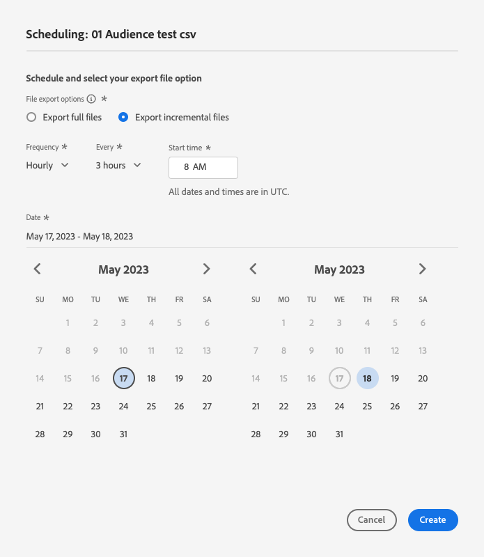
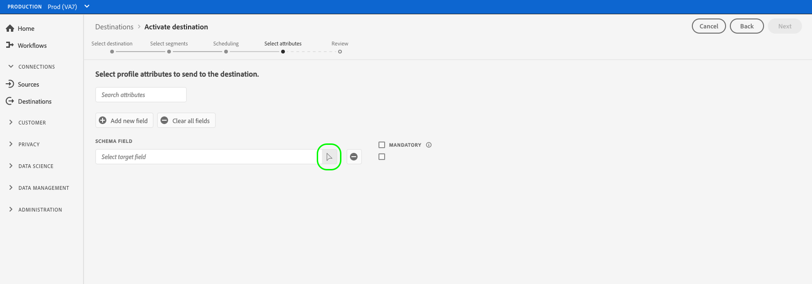

# Attivare i dati del pubblico nelle destinazioni di esportazione del profilo batch

>[!IMPORTANT]
> 
>Per attivare i dati, è necessario **[!UICONTROL Gestire le destinazioni]**, **[!UICONTROL Attivare le destinazioni]**, **[!UICONTROL Visualizza profili]**, e **[!UICONTROL Visualizzare segmenti]** [autorizzazioni di controllo degli accessi](/help/access-control/home.md#permissions). Leggi le [panoramica sul controllo degli accessi](/help/access-control/ui/overview.md) oppure contatta l’amministratore del prodotto per ottenere le autorizzazioni necessarie.
>
>Alcuni clienti che partecipano al programma beta con funzionalità di esportazione dei file migliorate vedono la nuova **[!UICONTROL Mappatura]** come parte del flusso di lavoro di attivazione per [nuove destinazioni di archiviazione cloud beta](/help/release-notes/2022/october-2022.md#destinations). Si prega inoltre di notare quanto segue: [limitazioni note](#known-limitations) come parte della versione.

## Panoramica {#overview}

Questo articolo spiega il flusso di lavoro necessario per attivare i dati sul pubblico nelle destinazioni basate su profili batch di Adobe Experience Platform, ad esempio l’archiviazione cloud e le destinazioni del marketing via e-mail.

## Prerequisiti {#prerequisites}

Per attivare i dati nelle destinazioni, è necessario aver completato [connesso a una destinazione](./connect-destination.md). Se non lo hai già fatto, accedi al [catalogo delle destinazioni](../catalog/overview.md), sfoglia le destinazioni supportate e configura la destinazione che desideri utilizzare.

## Seleziona la destinazione {#select-destination}

1. Vai a **[!UICONTROL Connessioni > Destinazioni]**, e seleziona la **[!UICONTROL Catalogo]** scheda.

   

1. Seleziona **[!UICONTROL Attivare segmenti]** sulla scheda corrispondente alla destinazione in cui desideri attivare i segmenti, come illustrato nell’immagine seguente.

   

1. Seleziona la connessione di destinazione da utilizzare per attivare i segmenti, quindi fai clic su **[!UICONTROL Successivo]**.

   

1. Passa alla sezione successiva a [seleziona i segmenti](#select-segments).

## Seleziona i segmenti {#select-segments}

Utilizza le caselle di controllo a sinistra dei nomi dei segmenti per selezionare i segmenti da attivare nella destinazione, quindi seleziona **[!UICONTROL Successivo]**.


## Pianificare l’esportazione di segmenti {#scheduling}

>[!CONTEXTUALHELP]
>id="platform_destinations_activate_schedule"
>title="Pianificazione"
>abstract="Utilizza l’icona a forma di matita per impostare il tipo di esportazione del file (file completi o incrementali) e la frequenza di esportazione."

[!DNL Adobe Experience Platform] esporta dati per e-mail marketing e destinazioni di archiviazione cloud sotto forma di [!DNL CSV] file. In **[!UICONTROL Pianificazione]** pagina, puoi configurare la pianificazione e i nomi dei file per ciascun segmento che stai esportando. La configurazione della pianificazione è obbligatoria, ma il nome del file è facoltativo.

>[!IMPORTANT]
> 
>[!DNL Adobe Experience Platform] divide automaticamente i file di esportazione in 5 milioni di record (righe) per file. Ogni riga rappresenta un profilo.
>
>Ai nomi dei file suddivisi viene aggiunto un numero che indica che il file fa parte di un’esportazione più grande: `filename.csv`, `filename_2.csv`, `filename_3.csv`.

Seleziona la **[!UICONTROL Crea pianificazione]** corrispondente al segmento che desideri inviare alla destinazione.


### Esporta file completi {#export-full-files}

>[!CONTEXTUALHELP]
>id="platform_destinations_activate_exportoptions"
>title="Opzioni di esportazione file"
>abstract="Seleziona **Esporta file completi** per esportare uno snapshot completo di tutti i profili idonei per il segmento. Seleziona **Esporta file incrementali** per esportare solo i profili qualificati per il segmento dall’ultima esportazione. <br> La prima esportazione di file incrementale include tutti i profili idonei per il segmento, che fungono da retrocompilazione. I file incrementali futuri includono solo i profili qualificati per il segmento dalla prima esportazione di file incrementali."
>additional-url="https://experienceleague.adobe.com/docs/experience-platform/destinations/ui/activate/activate-batch-profile-destinations.html#export-incremental-files" text="Esporta file incrementali"

>[!CONTEXTUALHELP]
>id="platform_destinations_activationchaining_aftersegmentevaluation"
>title="Attiva dopo la valutazione del segmento"
>abstract="L’attivazione viene eseguita immediatamente dopo il completamento del processo di segmentazione giornaliero. In questo modo vengono esportati i profili più aggiornati."

>[!CONTEXTUALHELP]
>id="platform_destinations_activationchaining_scheduled"
>title="Attivazione pianificata"
>abstract="L’attivazione viene eseguita a un’ora fissa del giorno."

Seleziona **[!UICONTROL Esporta file completi]** per attivare l’esportazione di un file contenente un’istantanea completa di tutte le qualifiche di profilo per il segmento selezionato.


1. Utilizza il **[!UICONTROL Frequenza]** per selezionare la frequenza di esportazione:

   * **[!UICONTROL Una volta]**: pianifica un’esportazione di file completi una tantum su richiesta.
   * **[!UICONTROL Giornaliero]**: pianifica le esportazioni di file completi una volta al giorno, ogni giorno, all’ora specificata.

1. Utilizza il **[!UICONTROL Ora]** attiva per selezionare se l’esportazione deve avvenire immediatamente dopo la valutazione del segmento o su base pianificata, a un orario specificato. Quando si seleziona **[!UICONTROL Pianificato]** , è possibile utilizzare il selettore per scegliere l’ora del giorno, in [!DNL UTC] , quando deve essere effettuata l&#39;esportazione.

   >[!NOTE]
   >
   >Il **[!UICONTROL Dopo la valutazione del segmento]** L’opzione descritta di seguito è attualmente disponibile solo per alcuni clienti Beta.

   Utilizza il **[!UICONTROL Dopo la valutazione del segmento]** opzione per eseguire il processo di attivazione subito dopo il completamento del processo di segmentazione batch giornaliero di Platform. In questo modo, quando viene eseguito il processo di attivazione, i profili più aggiornati vengono esportati nella destinazione.

   <!-- Batch segmentation currently runs at {{insert time of day}} and lasts for an average {{x hours}}. Adobe reserves the right to modify this schedule. -->

   
Utilizza il **[!UICONTROL Pianificato]** per l&#39;esecuzione del processo di attivazione a un orario fisso. In questo modo i dati del profilo Experience Platform vengono esportati ogni giorno alla stessa ora, ma i profili esportati potrebbero non essere quelli più aggiornati, a seconda che il processo di segmentazione batch sia stato completato prima che il processo di attivazione abbia inizio.

   

   >[!IMPORTANT]
   >
   >A causa del modo in cui vengono configurati i processi di Experience Platform interni, la prima esportazione di file incrementale o completa potrebbe non contenere tutti i dati di backfill. <br> <br> Per garantire un’esportazione dei dati di backfill completa e più aggiornata sia per i file completi che per quelli incrementali, l’Adobe consiglia di impostare l’ora della prima esportazione dei file dopo le 12:00 GMT del giorno successivo. Questa limitazione sarà affrontata nelle versioni future.

1. Utilizza il **[!UICONTROL Data]** selettore per scegliere il giorno o l’intervallo in cui deve aver luogo l’esportazione. Per le esportazioni giornaliere, si consiglia di impostare la data di inizio e la data di fine in base alla durata delle campagne nelle piattaforme a valle.

   >[!IMPORTANT]
   >
   > Quando si seleziona un intervallo di esportazione, l’ultimo giorno dell’intervallo non viene incluso nelle esportazioni. Ad esempio, se selezioni un intervallo tra il 4 e l’11 gennaio, l’ultima esportazione di file avrà luogo il 10 gennaio.

1. Seleziona **[!UICONTROL Crea]** per salvare la pianificazione.

### Esporta file incrementali {#export-incremental-files}

Seleziona **[!UICONTROL Esporta file incrementali]** per attivare un’esportazione in cui il primo file è uno snapshot completo di tutte le qualifiche di profilo per il segmento selezionato e i file successivi sono qualifiche di profilo incrementali dall’esportazione precedente.

>[!IMPORTANT]
>
>Il primo file incrementale esportato include tutti i profili idonei per un segmento, che fungono da retrocompilazione.



1. Utilizza il **[!UICONTROL Frequenza]** per selezionare la frequenza di esportazione:

   * **[!UICONTROL Giornaliero]**: pianifica le esportazioni di file incrementali una volta al giorno, ogni giorno, all’ora specificata.
   * **[!UICONTROL Ogni ora]**: pianifica le esportazioni di file incrementali ogni 3, 6, 8 o 12 ore.

1. Utilizza il **[!UICONTROL Ora]** per scegliere l’ora del giorno, in [!DNL UTC] , quando deve essere effettuata l&#39;esportazione.

   >[!IMPORTANT]
   >
   >A causa del modo in cui vengono configurati i processi di Experience Platform interni, la prima esportazione di file incrementale o completa potrebbe non contenere tutti i dati di backfill. <br> <br> Per garantire un’esportazione dei dati di backfill completa e più aggiornata sia per i file completi che per quelli incrementali, l’Adobe consiglia di impostare l’ora della prima esportazione dei file dopo le 12:00 GMT del giorno successivo. Questa limitazione sarà affrontata nelle versioni future.

1. Utilizza il **[!UICONTROL Data]** per scegliere l&#39;intervallo di esecuzione dell&#39;esportazione. Si consiglia di impostare la data di inizio e di fine in modo che sia allineata alla durata delle campagne nelle piattaforme a valle.

   >[!IMPORTANT]
   >
   >L&#39;ultimo giorno dell&#39;intervallo non è incluso nelle esportazioni. Ad esempio, se selezioni un intervallo tra il 4 e l’11 gennaio, l’ultima esportazione di file avrà luogo il 10 gennaio.

1. Seleziona **[!UICONTROL Crea]** per salvare la pianificazione.

### Configura nomi file {#file-names}

>[!CONTEXTUALHELP]
>id="platform_destinations_activate_filename"
>title="Configura nome file"
>abstract="Per le destinazioni basate su file, viene generato un nome file univoco per segmento. Utilizza l’editor nome file per creare e modificare un nome file univoco o mantenere il nome predefinito."

Per la maggior parte delle destinazioni, i nomi di file predefiniti sono costituiti dal nome della destinazione, dall’ID del segmento e da un indicatore di data e ora. Ad esempio, puoi modificare i nomi dei file esportati per distinguere tra diverse campagne o per aggiungere ai file il tempo di esportazione dei dati. Tieni presente che alcuni sviluppatori di destinazione potrebbero scegliere di visualizzare diverse opzioni di aggiunta dei nomi di file predefiniti per le loro destinazioni.

Seleziona l’icona della matita per aprire una finestra modale e modificare i nomi dei file. I nomi dei file non possono superare i 255 caratteri.

>[!NOTE]
>
>L&#39;immagine seguente mostra come modificare i nomi dei file per [!DNL Amazon S3] ma il processo è identico per tutte le destinazioni batch (ad esempio SFTP, [!DNL Azure Blob Storage], o [!DNL Google Cloud Storage]).


Nell’editor dei nomi di file puoi selezionare diversi componenti da aggiungere al nome del file.


Il nome di destinazione e l’ID segmento non possono essere rimossi dai nomi dei file. Oltre a questi, puoi aggiungere quanto segue:

| Opzione nome file | Descrizione |
|---------|----------|
| **[!UICONTROL Nome segmento]** | Nome del segmento esportato. |
| **[!UICONTROL Data e ora]** | Seleziona se aggiungere un `MMDDYYYY_HHMMSS` o un timestamp Unix a 10 cifre del momento in cui vengono generati i file. Scegliete una di queste opzioni se desiderate che i file abbiano un nome di file dinamico generato con ogni esportazione incrementale. |
| **[!UICONTROL Testo personalizzato]** | Qualsiasi testo personalizzato che si desidera aggiungere ai nomi dei file. |
| **[!UICONTROL ID destinazione]** | ID del flusso di dati di destinazione utilizzato per esportare il segmento. <br> **Nota**: questa opzione di aggiunta nome file è disponibile solo per i clienti beta che partecipano al programma beta con funzionalità di esportazione file migliorata. Contatta il tuo rappresentante di Adobe o l’Assistenza clienti per accedere al programma beta. |
| **[!UICONTROL Nome destinazione]** | Nome del flusso di dati di destinazione utilizzato per esportare il segmento. <br> **Nota**: questa opzione di aggiunta nome file è disponibile solo per i clienti beta che partecipano al programma beta con funzionalità di esportazione file migliorata. Contatta il tuo rappresentante di Adobe o l’Assistenza clienti per accedere al programma beta. |
| **[!UICONTROL Nome organizzazione]** | Il nome della tua organizzazione in Experience Platform. <br> **Nota**: questa opzione di aggiunta nome file è disponibile solo per i clienti beta che partecipano al programma beta con funzionalità di esportazione file migliorata. Contatta il tuo rappresentante di Adobe o l’Assistenza clienti per accedere al programma beta. |
| **[!UICONTROL Nome della sandbox]** | ID della sandbox utilizzata per esportare il segmento. <br> **Nota**: questa opzione di aggiunta nome file è disponibile solo per i clienti beta che partecipano al programma beta con funzionalità di esportazione file migliorata. Contatta il tuo rappresentante di Adobe o l’Assistenza clienti per accedere al programma beta. |

{style="table-layout:auto"}

Seleziona **[!UICONTROL Applica modifiche]** per confermare la selezione.

>[!IMPORTANT]
> 
>Se non selezioni il **[!UICONTROL Data e ora]** componente, i nomi dei file saranno statici e il nuovo file esportato sovrascriverà il file precedente nel percorso di archiviazione con ogni esportazione. Questa è l’opzione consigliata quando si esegue un processo di importazione ricorrente da un percorso di archiviazione a una piattaforma di e-mail marketing.

Dopo aver configurato tutti i segmenti, seleziona **[!UICONTROL Successivo]** per continuare.

## Seleziona attributi profilo {#select-attributes}

Per le destinazioni basate su profili, devi selezionare gli attributi del profilo che desideri inviare alla destinazione target.

1. In **[!UICONTROL Seleziona attributi]** pagina, seleziona **[!UICONTROL Aggiungi nuovo campo]**.

   

1. Selezionare la freccia a destra della **[!UICONTROL Campo schema]** voce.

   

1. In **[!UICONTROL Seleziona campo]** , seleziona gli attributi XDM o gli spazi dei nomi di identità che desideri inviare alla destinazione, quindi scegli **[!UICONTROL Seleziona]**.

   

1. Per aggiungere altre mappature, ripeti i passaggi da uno a tre.

>[!NOTE]
>
> Adobe Experience Platform compila la selezione con quattro attributi consigliati e comunemente utilizzati dallo schema: `person.name.firstName`, `person.name.lastName`, `personalEmail.address`, `segmentMembership.status`.

>[!IMPORTANT]
>
>A causa di una limitazione nota, al momento non è possibile utilizzare **[!UICONTROL Seleziona campo]** finestra da aggiungere `segmentMembership.status` alle esportazioni di file. È invece necessario incollare manualmente il valore `xdm: segmentMembership.status` nel campo schema, come illustrato di seguito.
>
>

Le esportazioni di file variano nei seguenti modi, a seconda che `segmentMembership.status` è selezionato:
* Se il `segmentMembership.status` è selezionato, i file esportati includono **[!UICONTROL Attivo]** membri nello snapshot completo iniziale e **[!UICONTROL Attivo]** e **[!UICONTROL Scaduto]** membri nelle esportazioni incrementali successive.
* Se il `segmentMembership.status` non è selezionato, i file esportati includono solo **[!UICONTROL Attivo]** membri nello snapshot completo iniziale e nelle esportazioni incrementali successive.


### Attributi obbligatori {#mandatory-attributes}

>[!CONTEXTUALHELP]
>id="platform_destinations_activate_mandatorykey"
>title="Informazioni sugli attributi obbligatori"
>abstract="Seleziona gli attributi dello schema XDM da includere in tutti i profili esportati. I profili senza la chiave obbligatoria non vengono esportati nella destinazione. Se non selezioni una chiave obbligatoria, vengono esportati tutti i profili qualificati, indipendentemente dai loro attributi."

Un attributo obbligatorio è una casella di controllo abilitata dall’utente che garantisce che tutti i record di profilo contengano l’attributo selezionato. Ad esempio: tutti i profili esportati contengono un indirizzo e-mail.&#x200B;

Puoi contrassegnare gli attributi come obbligatori per garantire che [!DNL Platform] esporta solo i profili che includono l’attributo specifico. Di conseguenza, può essere utilizzato come forma aggiuntiva di filtro. Contrassegno di un attributo come obbligatorio **non** obbligatorio.

Se non si seleziona un attributo obbligatorio, vengono esportati tutti i profili qualificati, indipendentemente dai loro attributi.

È consigliabile che uno degli attributi sia un [identificatore univoco](../../destinations/catalog/email-marketing/overview.md#identity) dallo schema. Per ulteriori informazioni sugli attributi obbligatori, consulta la sezione Identity nel [Destinazioni di e-mail marketing](../../destinations/catalog/email-marketing/overview.md#identity) documentazione.

### Chiavi di deduplicazione {#deduplication-keys}

>[!CONTEXTUALHELP]
>id="platform_destinations_activate_deduplicationkey"
>title="Informazioni sulle chiavi di deduplicazione"
>abstract="Eliminare più record dello stesso profilo nei file di esportazione selezionando una chiave di deduplicazione. Seleziona un singolo spazio dei nomi o fino a due attributi dello schema XDM come chiave di deduplicazione. La mancata selezione di una chiave di deduplicazione può causare la duplicazione delle voci di profilo nei file di esportazione."

Una chiave di deduplicazione è una chiave primaria definita dall’utente che determina l’identità in base alla quale gli utenti desiderano deduplicare i propri profili&#x200B;

Le chiavi di deduplicazione eliminano la possibilità di avere più record dello stesso profilo in un unico file di esportazione.

È possibile utilizzare le chiavi di deduplicazione in tre modi [!DNL Platform]:

* Utilizzo di un singolo spazio dei nomi dell’identità come [!UICONTROL chiave di deduplicazione]
* Utilizzo di un singolo attributo di profilo da un [!DNL XDM] profilo come [!UICONTROL chiave di deduplicazione]
* Utilizzo di una combinazione di due attributi di profilo da un [!DNL XDM] profilo come chiave composita

>[!IMPORTANT]
>
> Puoi esportare un singolo spazio dei nomi delle identità in una destinazione e lo spazio dei nomi viene impostato automaticamente come chiave di deduplicazione. L’invio di più spazi dei nomi a una destinazione non è supportato.
> 
> Non è possibile utilizzare una combinazione di spazi dei nomi di identità e attributi di profilo come chiavi di deduplicazione.

### Esempio di deduplicazione {#deduplication-example}

Questo esempio illustra il funzionamento della deduplicazione, a seconda delle chiavi di deduplicazione selezionate.

Prendiamo in considerazione i due profili seguenti.

**Profilo A**

```json
{
  "identityMap": {
    "Email": [
      {
        "id": "johndoe_1@example.com"
      },
      {
        "id": "johndoe_2@example.com"
      }
    ]
  },
  "segmentMembership": {
    "ups": {
      "fa5c4622-6847-4199-8dd4-8b7c7c7ed1d6": {
        "status": "existing",
        "lastQualificationTime": "2021-03-10 10:03:08"
      }
    }
  },
  "person": {
    "name": {
      "lastName": "Doe",
      "firstName": "John"
    }
  },
  "personalEmail": {
    "address": "johndoe@example.com"
  }
}
```

**Profilo B**

```json
{
  "identityMap": {
    "Email": [
      {
        "id": "johndoe_1@example.com"
      },
      {
        "id": "johndoe_2@example.com"
      }
    ]
  },
  "segmentMembership": {
    "ups": {
      "fa5c4622-6847-4199-8dd4-8b7c7c7ed1d6": {
        "status": "existing",
        "lastQualificationTime": "2021-04-10 11:33:28"
      }
    }
  },
  "person": {
    "name": {
      "lastName": "D",
      "firstName": "John"
    }
  },
  "personalEmail": {
    "address": "johndoe@example.com"
  }
}
```

### Caso di utilizzo 1: nessuna deduplicazione {#deduplication-use-case-1}

Se non si utilizza alcuna deduplicazione, il file di esportazione conterrà le seguenti voci.

| personalEmail | firstName | lastName |
|---|---|---|
| johndoe@example.com | John | Doe |
| johndoe@example.com | John | D |


### Caso di utilizzo 2: deduplicazione basata sullo spazio dei nomi delle identità {#deduplication-use-case-2}

Presupponendo la deduplicazione da parte di [!DNL Email] namespace, il file di esportazione conterrebbe le seguenti voci. Il profilo B è l’ultimo che si è qualificato per il segmento, quindi è l’unico che viene esportato.

| E-mail* | personalEmail | firstName | lastName |
|---|---|---|---|
| johndoe_1@example.com | johndoe@example.com | John | D |
| johndoe_2@example.com | johndoe@example.com | John | D |

### Caso di utilizzo 3: deduplicazione basata su un singolo attributo di profilo {#deduplication-use-case-3}

Presupponendo la deduplicazione da parte di `personal Email` , il file di esportazione conterrà la seguente voce. Il profilo B è l’ultimo che si è qualificato per il segmento, quindi è l’unico che viene esportato.

| personalEmail* | firstName | lastName |
|---|---|---|
| johndoe@example.com | John | D |


### Caso di utilizzo 4: deduplicazione basata su due attributi di profilo {#deduplication-use-case-4}

Presupponendo la deduplicazione tramite la chiave composita `personalEmail + lastName`, il file di esportazione conterrà le seguenti voci.

| personalEmail* | lastName* | firstName |
|---|---|---|
| johndoe@example.com | D | John |
| johndoe@example.com | Doe | John |


L’Adobe consiglia di selezionare uno spazio dei nomi dell’identità come [!DNL CRM ID] o e-mail come chiave di deduplicazione, per garantire che tutti i record di profilo siano identificati in modo univoco.

>[!NOTE]
> 
>Se sono state applicate etichette di utilizzo dei dati a determinati campi all’interno di un set di dati (anziché all’intero set di dati), l’applicazione di tali etichette a livello di campo all’attivazione avviene nelle seguenti condizioni:
>
>* I campi vengono utilizzati nella definizione del segmento.
>* I campi sono configurati come attributi previsti per la destinazione target.
>
> Ad esempio, se il campo `person.name.firstName` presenta alcune etichette di utilizzo dei dati in conflitto con l’azione di marketing della destinazione; nel passaggio di revisione verrebbe mostrata una violazione dei criteri di utilizzo dei dati. Per ulteriori informazioni, consulta [Governance dei dati in Adobe Experience Platform](../../rtcdp/privacy/data-governance-overview.md#destinations).

## Mappatura (Beta) {#mapping}

>[!IMPORTANT]
> 
>Alcuni clienti beta possono visualizzare e migliorare **[!UICONTROL Mappatura]** passaggio che sostituisce il [Seleziona attributi profilo](#select-attributes) passaggio descritto più sopra. Questo nuovo **[!UICONTROL Mappatura]** Questo passaggio consente di modificare le intestazioni dei file esportati con qualsiasi nome personalizzato.
> 
> La funzionalità e la documentazione sono soggette a modifiche. Contatta il tuo rappresentante di Adobe o l’Assistenza clienti per accedere a questo programma beta.

In questo passaggio, devi selezionare gli attributi del profilo che desideri aggiungere ai file esportati nella destinazione di destinazione. Per selezionare gli attributi e le identità del profilo per l&#39;esportazione:

1. In **[!UICONTROL Mappatura]** pagina, seleziona **[!UICONTROL Aggiungi nuovo campo]**.

   

1. Selezionare la freccia a destra della **[!UICONTROL Campo di origine]** voce.

   

1. In **[!UICONTROL Seleziona campo di origine]** , selezionare gli attributi di profilo e le identità che si desidera includere nei file esportati nella destinazione, quindi scegliere **[!UICONTROL Seleziona]**.

   >[!TIP]
   > 
   >È possibile utilizzare il campo di ricerca per limitare la selezione, come illustrato nell&#39;immagine seguente.

   


1. Il campo selezionato per l&#39;esportazione viene ora visualizzato nella vista di mappatura. Se lo desideri, puoi modificare il nome dell’intestazione nel file esportato. A questo scopo, seleziona l’icona nel campo di destinazione.

   

1. In **[!UICONTROL Seleziona campo di destinazione]** , digita il nome desiderato dell’intestazione nel file esportato, quindi scegli **[!UICONTROL Seleziona]**.

   

1. Il campo selezionato per l&#39;esportazione viene ora visualizzato nella vista di mappatura e l&#39;intestazione modificata viene visualizzata nel file esportato.

   

1. (Facoltativo) Puoi selezionare il campo esportato come [chiave obbligatoria](#mandatory-keys) o un [chiave di deduplicazione](#deduplication-keys).

   

1. Per aggiungere altri campi per l’esportazione, ripeti i passaggi precedenti.

### Limitazioni note {#known-limitations}

Il nuovo **[!UICONTROL Mappatura]** La pagina presenta le seguenti limitazioni note:

#### L’attributo di appartenenza al segmento non può essere selezionato tramite il flusso di lavoro di mappatura

A causa di una limitazione nota, al momento non è possibile utilizzare **[!UICONTROL Seleziona campo]** finestra da aggiungere `segmentMembership.status` alle esportazioni di file. È invece necessario incollare manualmente il valore `xdm: segmentMembership.status` nel campo schema, come illustrato di seguito.


Le esportazioni di file variano nei seguenti modi, a seconda che `segmentMembership.status` è selezionato:
* Se il `segmentMembership.status` è selezionato, i file esportati includono **[!UICONTROL Attivo]** membri nello snapshot completo iniziale e **[!UICONTROL Attivo]** e **[!UICONTROL Scaduto]** membri nelle esportazioni incrementali successive.
* Se il `segmentMembership.status` non è selezionato, i file esportati includono solo **[!UICONTROL Attivo]** membri nello snapshot completo iniziale e nelle esportazioni incrementali successive.

#### Al momento non è possibile selezionare gli spazi dei nomi delle identità per le esportazioni

La selezione degli spazi dei nomi delle identità per l’esportazione, come illustrato nell’immagine seguente, non è attualmente supportata. La selezione di qualsiasi spazio dei nomi di identità per l’esportazione genererà un errore in **[!UICONTROL Revisione]** passaggio.


Come soluzione alternativa temporanea, se devi aggiungere spazi dei nomi di identità ai file esportati durante la versione beta, puoi effettuare le seguenti operazioni:
* Utilizza le destinazioni dell’archiviazione cloud legacy per i flussi di dati in cui desideri includere spazi dei nomi di identità nelle esportazioni
* Carica le identità come attributi in Experience Platform, quindi esportale nelle destinazioni dell’archiviazione cloud.

## Revisione {#review}

Il giorno **[!UICONTROL Revisione]** pagina, è possibile visualizzare un riepilogo della selezione. Seleziona **[!UICONTROL Annulla]** per interrompere il flusso, **[!UICONTROL Indietro]** per modificare le impostazioni, oppure **[!UICONTROL Fine]** per confermare la selezione e iniziare a inviare dati alla destinazione.


### Valutazione dei criteri di consenso {#consent-policy-evaluation}

>[!CONTEXTUALHELP]
>id="platform_governance_policies_viewApplicableConsentPolicies"
>title="Visualizza i criteri di consenso applicabili"
>abstract="Se la tua organizzazione ha acquistato **Schermo sanitario Adobe** o **Adobe Privacy &amp; Security Shield**, seleziona **[!UICONTROL Visualizza i criteri di consenso applicabili]** per vedere quali criteri di consenso vengono applicati e quanti profili sono inclusi nell’attivazione in seguito a tali criteri. Questo controllo è disattivato se la società non ha accesso agli SKU sopra menzionati."

Se la tua organizzazione ha acquistato **Schermo sanitario Adobe** o **Adobe Privacy &amp; Security Shield**, seleziona **[!UICONTROL Visualizza i criteri di consenso applicabili]** per vedere quali criteri di consenso vengono applicati e quanti profili sono inclusi nell’attivazione in seguito a tali criteri. Ulteriori informazioni [valutazione dei criteri di consenso](/help/data-governance/enforcement/auto-enforcement.md#consent-policy-evaluation) per ulteriori informazioni.

### Controlli dei criteri di utilizzo dei dati {#data-usage-policy-checks}

In **[!UICONTROL Revisione]** step, Experience Platform controlla anche eventuali violazioni dei criteri di utilizzo dei dati. Di seguito è riportato un esempio di violazione di una policy. Non puoi completare il flusso di lavoro di attivazione dei segmenti finché non risolvi la violazione. Per informazioni su come risolvere le violazioni dei criteri, vedere [violazioni dei criteri di utilizzo dei dati](/help/data-governance/enforcement/auto-enforcement.md#data-usage-violation) nella sezione documentazione sulla governance dei dati.


### Filtrare segmenti {#filter-segments}

Inoltre, in questo passaggio puoi utilizzare i filtri disponibili nella pagina per visualizzare solo i segmenti la cui pianificazione o mappatura è stata aggiornata come parte di questo flusso di lavoro. Puoi anche scegliere quali colonne della tabella visualizzare.


Se si è soddisfatti della selezione e non sono state rilevate violazioni dei criteri, selezionare **[!UICONTROL Fine]** per confermare la selezione e iniziare a inviare dati alla destinazione.

## Verifica attivazione segmento {#verify}

Per le destinazioni di e-mail marketing e di archiviazione cloud, Adobe Experience Platform crea una `.csv` nel percorso di archiviazione fornito. È necessario creare un nuovo file nel percorso di archiviazione in base alla pianificazione impostata nel flusso di lavoro. Di seguito è riportato il formato di file predefinito, ma è possibile [modifica i componenti del nome file](#file-names):
`<destinationName>_segment<segmentID>_<timestamp-yyyymmddhhmmss>.csv`

Ad esempio, se hai selezionato una frequenza di esportazione giornaliera, i file che riceverai in tre giorni consecutivi potrebbero essere simili al seguente:

```console
Salesforce_Marketing_Cloud_segment12341e18-abcd-49c2-836d-123c88e76c39_20200408061804.csv
Salesforce_Marketing_Cloud_segment12341e18-abcd-49c2-836d-123c88e76c39_20200409052200.csv
Salesforce_Marketing_Cloud_segment12341e18-abcd-49c2-836d-123c88e76c39_20200410061130.csv
```

La presenza di questi file nel percorso di archiviazione conferma la riuscita dell’attivazione. Per comprendere la struttura dei file esportati, è possibile: [scarica un esempio di file .csv](../assets/common/sample_export_file_segment12341e18-abcd-49c2-836d-123c88e76c39_20200408061804.csv). Questo file di esempio include gli attributi del profilo `person.firstname`, `person.lastname`, `person.gender`, `person.birthyear`, e `personalEmail.address`.
