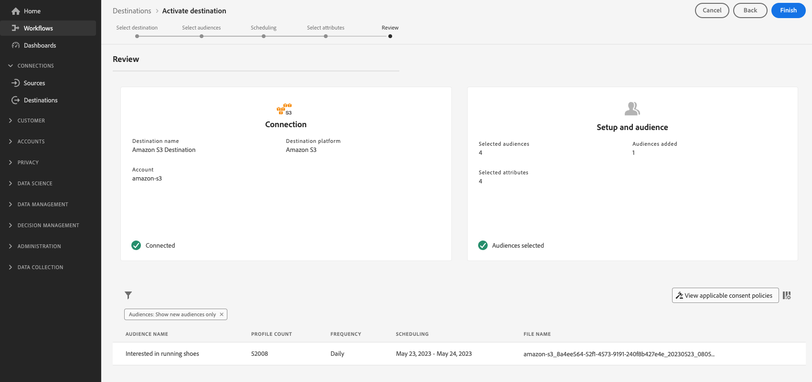

# Attivare i dati del pubblico nelle destinazioni di esportazione del profilo batch

## Panoramica {#overview}

Questo articolo spiega il flusso di lavoro necessario per attivare i dati del pubblico nelle destinazioni basate su profili batch di Adobe Experience Platform, come l’archiviazione cloud e le destinazioni di marketing via e-mail.

## Prerequisiti {#prerequisites}

Per attivare i dati nelle destinazioni, è necessario che [sia stato collegato correttamente a una destinazione](./connect-destination.md). Se non lo hai già fatto, vai al [catalogo delle destinazioni](../catalog/overview.md), sfoglia le destinazioni supportate e configura la destinazione che desideri utilizzare.

## Seleziona la destinazione {#select-destination}

1. Vai a **[!UICONTROL Connessioni > Destinazioni]** e seleziona la scheda **[!UICONTROL Sfoglia]** .

   

1. Seleziona il pulsante **[!UICONTROL Aggiungi segmenti]** corrispondente alla destinazione in cui desideri attivare i segmenti, come illustrato nell’immagine seguente.

   

1. Passa alla sezione successiva in [seleziona i segmenti](#select-segments).

## Selezionare i segmenti {#select-segments}

Usa le caselle di controllo a sinistra dei nomi dei segmenti per selezionare i segmenti che desideri attivare nella destinazione, quindi seleziona **[!UICONTROL Avanti]**.


## Esportazione di segmenti programmata {#scheduling}

[!DNL Adobe Experience Platform] esporta dati per destinazioni di marketing e archiviazione cloud e-mail sotto forma di  [!DNL CSV] file. Nella pagina **[!UICONTROL Pianificazione]**, puoi configurare la pianificazione e i nomi dei file per ciascun segmento che stai esportando. La configurazione della pianificazione è obbligatoria, ma il nome del file è facoltativo.

>[!IMPORTANT]
> 
>[!DNL Adobe Experience Platform] divide automaticamente i file di esportazione a 5 milioni di record (righe) per file. Ogni riga rappresenta un profilo.
>
>I nomi dei file divisi vengono aggiunti con un numero che indica che il file fa parte di un’esportazione più grande, in quanto tale: `filename.csv`, `filename_2.csv`, `filename_3.csv`.

Seleziona il pulsante **[!UICONTROL Crea pianificazione]** corrispondente al segmento da inviare alla destinazione.


### Esportare file completi {#export-full-files}

Seleziona **[!UICONTROL Esporta file completi]** per attivare l&#39;esportazione di un file contenente un&#39;istantanea completa di tutte le qualifiche di profilo per il segmento selezionato.


1. Utilizza il selettore **[!UICONTROL Frequenza]** per selezionare la frequenza di esportazione:

   * **[!UICONTROL Una volta]**: pianificare un&#39;esportazione di file completi on-demand una sola volta.
   * **[!UICONTROL Giornaliero]**: pianifica esportazioni di file completi una volta al giorno, ogni giorno, al momento specificato.

1. Utilizza il selettore **[!UICONTROL Tempo]** per scegliere l&#39;ora del giorno, in formato [!DNL UTC], in cui deve aver luogo l&#39;esportazione.

   >[!IMPORTANT]
   >
   >A causa del modo in cui vengono configurati i processi di Experience Platform interni, la prima esportazione di file incrementali o completi potrebbe non contenere tutti i dati di backfill. <br> <br> Per garantire un’esportazione completa e più aggiornata dei dati di backfill sia per i file completi che per quelli incrementali, l’Adobe consiglia di impostare l’orario di esportazione del primo file dopo le 12:00 GMT del giorno successivo. Si tratta di una limitazione che verrà affrontata nelle prossime versioni.

1. Utilizza il selettore **[!UICONTROL Data]** per scegliere il giorno o l&#39;intervallo in cui deve aver luogo l&#39;esportazione.
1. Seleziona **[!UICONTROL Crea]** per salvare la pianificazione.


### Esportare file incrementali {#export-incremental-files}

Seleziona **[!UICONTROL Esporta file incrementali]** per attivare un&#39;esportazione in cui il primo file è uno snapshot completo di tutte le qualifiche di profilo per il segmento selezionato e i file successivi sono qualifiche di profilo incrementali a partire dall&#39;esportazione precedente.

>[!IMPORTANT]
>
>Il primo file incrementale esportato include tutti i profili idonei per un segmento, che funzionano come backfill.


1. Utilizza il selettore **[!UICONTROL Frequenza]** per selezionare la frequenza di esportazione:

   * **[!UICONTROL Giornaliero]**: pianifica esportazioni incrementali di file una volta al giorno, ogni giorno, al momento specificato.
   * **[!UICONTROL Orario]**: pianificare esportazioni di file incrementali ogni 3, 6, 8 o 12 ore.

2. Utilizza il selettore **[!UICONTROL Tempo]** per scegliere l&#39;ora del giorno, in formato [!DNL UTC], in cui deve aver luogo l&#39;esportazione.

   >[!IMPORTANT]
   >
   >A causa del modo in cui vengono configurati i processi di Experience Platform interni, la prima esportazione di file incrementali o completi potrebbe non contenere tutti i dati di backfill. <br> <br> Per garantire un’esportazione completa e più aggiornata dei dati di backfill sia per i file completi che per quelli incrementali, l’Adobe consiglia di impostare l’orario di esportazione del primo file dopo le 12:00 GMT del giorno successivo. Si tratta di una limitazione che verrà affrontata nelle prossime versioni.

3. Utilizza il selettore **[!UICONTROL Data]** per scegliere il giorno o l&#39;intervallo in cui deve aver luogo l&#39;esportazione.
4. Seleziona **[!UICONTROL Crea]** per salvare la pianificazione.

### Configurare i nomi dei file {#file-names}

I nomi file predefiniti sono costituiti dal nome di destinazione, dall’ID del segmento e da un indicatore di data e ora. Ad esempio, puoi modificare i nomi dei file esportati per distinguere tra campagne diverse o per far sì che il tempo di esportazione dei dati sia aggiunto ai file.

Seleziona l’icona a forma di matita per aprire una finestra modale e modificare i nomi dei file. I nomi dei file sono limitati a 255 caratteri.


Nell’editor dei nomi dei file, puoi selezionare diversi componenti da aggiungere al nome del file.


Impossibile rimuovere il nome di destinazione e l’ID del segmento dai nomi dei file. Oltre a questi, puoi aggiungere quanto segue:

* **[!UICONTROL Nome]** del segmento: Puoi aggiungere il nome del segmento al nome del file.
* **[!UICONTROL Data e ora]**: Seleziona tra l’aggiunta di un  `MMDDYYYY_HHMMSS` formato o di una marca temporale Unix a 10 cifre dell’ora in cui vengono generati i file. Scegliere una di queste opzioni se si desidera che i file abbiano un nome file dinamico generato con ogni esportazione incrementale.
* **[!UICONTROL Testo]** personalizzato: Aggiungi testo personalizzato ai nomi dei file.

Seleziona **[!UICONTROL Applica modifiche]** per confermare la selezione.

>[!IMPORTANT]
> 
>Se non si seleziona il componente **[!UICONTROL Data e ora]**, i nomi dei file saranno statici e il nuovo file esportato sovrascriverà il file precedente nel percorso di archiviazione con ogni esportazione. Quando esegui un processo di importazione ricorrente da un percorso di archiviazione in una piattaforma di marketing e-mail, questa è l’opzione consigliata.

Al termine della configurazione di tutti i segmenti, seleziona **[!UICONTROL Avanti]** per continuare.

## Selezionare gli attributi del profilo {#select-attributes}

Per le destinazioni basate su profili, devi selezionare gli attributi di profilo da inviare alla destinazione.


1. Nella pagina **[!UICONTROL Seleziona attributi]**, seleziona **[!UICONTROL Aggiungi nuovo campo]**.

   

1. Selezionare la freccia a destra della voce **[!UICONTROL Campo schema]**.

   

1. Nella pagina **[!UICONTROL Seleziona campo]** , seleziona gli attributi XDM che desideri inviare alla destinazione, quindi scegli **[!UICONTROL Seleziona]**.

   


1. Per aggiungere altre mappature, ripeti i passaggi da 1 a 3.


>[!NOTE]
>
> Adobe Experience Platform precompila la selezione con quattro attributi consigliati e di uso comune dallo schema: `person.name.firstName`, `person.name.lastName`, `personalEmail.address`, `segmentMembership.status`.

Le esportazioni di file variano nei seguenti modi, a seconda che sia selezionato `segmentMembership.status`:
* Se il campo `segmentMembership.status` è selezionato, i file esportati includono i membri **[!UICONTROL Active]** nello snapshot completo iniziale e i membri **[!UICONTROL Active]** e **[!UICONTROL Expired]** nelle esportazioni incrementali successive.
* Se il campo `segmentMembership.status` non è selezionato, i file esportati includono solo i membri **[!UICONTROL Active]** nello snapshot completo iniziale e nelle esportazioni incrementali successive.


### Attributi obbligatori {#mandatory-attributes}

>[!CONTEXTUALHELP]
>id="platform_destinations_activate_mandatorykey"
>title="Informazioni sugli attributi obbligatori"
>abstract="Seleziona gli attributi dello schema XDM che tutti i profili esportati devono includere. I profili senza la chiave obbligatoria non vengono esportati nella destinazione . Se non selezioni una chiave obbligatoria, vengono esportati tutti i profili qualificati, indipendentemente dai relativi attributi."
>additional-url="http://www.adobe.com/go/destinations-mandatory-attributes-en" text="Ulteriori informazioni nella documentazione"

Un attributo obbligatorio è una casella di controllo abilitata dall’utente che assicura che tutti i record di profilo contengano l’attributo selezionato. Ad esempio: tutti i profili esportati contengono un indirizzo e-mail. &#x200B;

Puoi contrassegnare gli attributi come obbligatori per garantire che [!DNL Platform] esporti solo i profili che includono l’attributo specifico. Di conseguenza, può essere utilizzato come ulteriore forma di filtro. La marcatura di un attributo come obbligatorio è **non** obbligatoria.

Se non selezioni un attributo obbligatorio, vengono esportati tutti i profili qualificati, indipendentemente dai relativi attributi.

È consigliabile che uno degli attributi sia un [identificatore univoco](../../destinations/catalog/email-marketing/overview.md#identity) dallo schema. Per ulteriori informazioni sugli attributi obbligatori, consulta la sezione identità nella documentazione [Destinazioni di marketing e-mail](../../destinations/catalog/email-marketing/overview.md#identity) .

### Chiavi di deduplicazione {#deduplication-keys}

>[!CONTEXTUALHELP]
>id="platform_destinations_activate_deduplicationkey"
>title="Informazioni sulle chiavi di deduplicazione"
>abstract="Elimina più record dello stesso profilo nei file di esportazione selezionando una chiave di deduplicazione. Seleziona un singolo spazio dei nomi o fino a due attributi di schema XDM come chiave di deduplicazione. La mancata selezione di una chiave di deduplicazione può causare la presenza di voci di profilo duplicate nei file di esportazione."
>additional-url="http://www.adobe.com/go/destinations-deduplication-keys-en" text="Ulteriori informazioni nella documentazione"

Una chiave di deduplicazione è una chiave primaria definita dall’utente che determina l’identità in base alla quale gli utenti desiderano che i loro profili vengano deduplicati &#x200B;.

Le chiavi di deduplicazione eliminano la possibilità di avere più record dello stesso profilo in un unico file di esportazione.

Esistono tre modi per utilizzare le chiavi di deduplicazione in [!DNL Platform]:

* Utilizzo di un singolo spazio dei nomi di identità come chiave di deduplicazione [!UICONTROL a1/>]
* Utilizzo di un singolo attributo di profilo da un profilo [!DNL XDM] come chiave di deduplicazione 
* Utilizzo di una combinazione di due attributi di profilo da un profilo [!DNL XDM] come chiave composita

>[!IMPORTANT]
>
> È possibile esportare un singolo namespace di identità in una destinazione e lo spazio dei nomi viene impostato automaticamente come chiave di deduplicazione. L’invio di più namespace a una destinazione non è supportato.
> 
> Non è possibile utilizzare una combinazione di namespace identità e attributi di profilo come chiavi di deduplicazione.

### Esempio di deduplicazione {#deduplication-example}

Questo esempio illustra il funzionamento della deduplicazione, a seconda delle chiavi di deduplicazione selezionate.

Consideriamo i due profili seguenti.

**Profilo A**

```json
{
  "identityMap": {
    "Email": [
      {
        "id": "johndoe_1@example.com"
      },
      {
        "id": "johndoe_2@example.com"
      }
    ]
  },
  "segmentMembership": {
    "ups": {
      "fa5c4622-6847-4199-8dd4-8b7c7c7ed1d6": {
        "status": "existing",
        "lastQualificationTime": "2021-03-10 10:03:08"
      }
    }
  },
  "person": {
    "name": {
      "lastName": "Doe",
      "firstName": "John"
    }
  },
  "personalEmail": {
    "address": "johndoe@example.com"
  }
}
```

**Profilo B**

```json
{
  "identityMap": {
    "Email": [
      {
        "id": "johndoe_1@example.com"
      },
      {
        "id": "johndoe_2@example.com"
      }
    ]
  },
  "segmentMembership": {
    "ups": {
      "fa5c4622-6847-4199-8dd4-8b7c7c7ed1d6": {
        "status": "existing",
        "lastQualificationTime": "2021-04-10 11:33:28"
      }
    }
  },
  "person": {
    "name": {
      "lastName": "D",
      "firstName": "John"
    }
  },
  "personalEmail": {
    "address": "johndoe@example.com"
  }
}
```

### Caso di utilizzo della deduplicazione 1: nessuna deduplicazione {#deduplication-use-case-1}

Senza la deduplicazione, il file di esportazione conterrebbe le seguenti voci.

| personalEmail | firstName | lastName |
|---|---|---|
| johndoe@example.com | John | Doe |
| johndoe@example.com | John | D |


### Caso di utilizzo della deduplicazione 2: deduplicazione basata sullo spazio dei nomi identità {#deduplication-use-case-2}

Supponendo la deduplicazione dello spazio dei nomi [!DNL Email], il file di esportazione conterrà le seguenti voci. Il profilo B è l’ultimo ad essere qualificato per il segmento, quindi è l’unico ad essere esportato.

| E-mail* | personalEmail | firstName | lastName |
|---|---|---|---|
| johndoe_1@example.com | johndoe@example.com | John | D |
| johndoe_2@example.com | johndoe@example.com | John | D |

### Caso di utilizzo della deduplicazione 3: deduplicazione basata su un singolo attributo di profilo {#deduplication-use-case-3}

Supponendo la deduplicazione dell’attributo `personal Email` , il file di esportazione conterrà la voce seguente. Il profilo B è l’ultimo ad essere qualificato per il segmento, quindi è l’unico ad essere esportato.

| personalEmail* | firstName | lastName |
|---|---|---|
| johndoe@example.com | John | D |


### Caso di utilizzo della deduplicazione 4: deduplicazione basata su due attributi di profilo {#deduplication-use-case-4}

Supponendo la deduplicazione della chiave composita `personalEmail + lastName`, il file di esportazione conterrà le seguenti voci.

| personalEmail* | lastName* | firstName |
|---|---|---|
| johndoe@example.com | D | John |
| johndoe@example.com | Doe | John |


Adobe consiglia di selezionare uno spazio dei nomi di identità, ad esempio un [!DNL CRM ID] o un indirizzo e-mail, come chiave di deduplicazione, per garantire che tutti i record di profilo siano identificati in modo univoco.

>[!NOTE]
> 
>Se sono state applicate etichette di utilizzo dei dati a determinati campi all’interno di un set di dati (anziché all’intero set di dati), l’applicazione di tali etichette a livello di campo all’attivazione si verifica nelle seguenti condizioni:
>
>* I campi vengono utilizzati nella definizione del segmento.
>* I campi sono configurati come attributi proiettati per la destinazione di destinazione.

>
> Ad esempio, se nel campo `person.name.firstName` sono presenti alcune etichette di utilizzo dei dati in conflitto con l’azione di marketing della destinazione, nel passaggio di revisione viene visualizzata una violazione dei criteri di utilizzo dei dati. Per ulteriori informazioni, consulta [Governance dei dati in Adobe Experience Platform](../../rtcdp/privacy/data-governance-overview.md#destinations).

## Revisione {#review}

Nella pagina **[!UICONTROL Rivedi]** puoi visualizzare un riepilogo della selezione. Seleziona **[!UICONTROL Annulla]** per interrompere il flusso, **[!UICONTROL Indietro]** per modificare le impostazioni oppure **[!UICONTROL Fine]** per confermare la selezione e iniziare a inviare dati alla destinazione.

>[!IMPORTANT]
>
>In questo passaggio, Adobe Experience Platform verifica la presenza di violazioni dei criteri di utilizzo dei dati. Di seguito è riportato un esempio di violazione di un criterio. Non puoi completare il flusso di lavoro di attivazione dei segmenti finché non avrai risolto la violazione. Per informazioni su come risolvere le violazioni dei criteri, consulta [Applicazione dei criteri](../../rtcdp/privacy/data-governance-overview.md#enforcement) nella sezione relativa alla governance dei dati .


Se non sono state rilevate violazioni dei criteri, selezionare **[!UICONTROL Fine]** per confermare la selezione e iniziare a inviare dati alla destinazione.



## Verificare l’attivazione dei segmenti {#verify}


Per le destinazioni di e-mail marketing e l’archiviazione cloud, Adobe Experience Platform crea un file `.csv` delimitato da tabulazioni nel percorso di archiviazione fornito. Attendi la creazione di un nuovo file nel percorso di archiviazione ogni giorno. Il formato predefinito del file è:
`<destinationName>_segment<segmentID>_<timestamp-yyyymmddhhmmss>.csv`

I file che si riceverebbero in tre giorni consecutivi potrebbero essere così:

```console
Salesforce_Marketing_Cloud_segment12341e18-abcd-49c2-836d-123c88e76c39_20200408061804.csv
Salesforce_Marketing_Cloud_segment12341e18-abcd-49c2-836d-123c88e76c39_20200409052200.csv
Salesforce_Marketing_Cloud_segment12341e18-abcd-49c2-836d-123c88e76c39_20200410061130.csv
```

La presenza di questi file nel percorso di archiviazione è la conferma di un&#39;attivazione riuscita. Per comprendere come sono strutturati i file esportati, è possibile [scaricare un file .csv di esempio](../assets/common/sample_export_file_segment12341e18-abcd-49c2-836d-123c88e76c39_20200408061804.csv). Questo file di esempio include gli attributi del profilo `person.firstname`, `person.lastname`, `person.gender`, `person.birthyear` e `personalEmail.address`.
