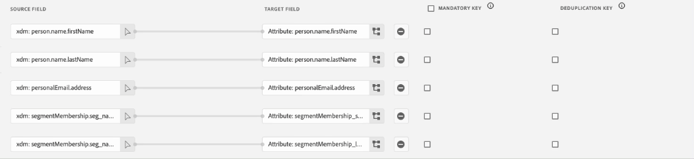
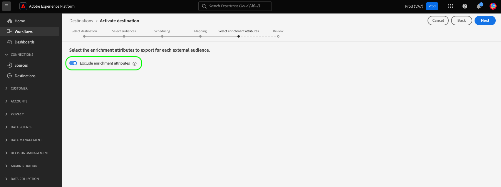

# Attivare i tipi di pubblico per le destinazioni di esportazione dei profili in batch

>[!IMPORTANT]
> 
> * Per attivare i tipi di pubblico e abilitare il [passaggio di mappatura](#mapping) del flusso di lavoro, sono necessari **[!UICONTROL Visualizza destinazioni]**, **[!UICONTROL Attiva destinazioni]**, **[!UICONTROL Visualizza profili]** e **[!UICONTROL Visualizza segmenti]** [Autorizzazioni di controllo di accesso](/help/access-control/home.md#permissions).
> * Per attivare i tipi di pubblico senza passare attraverso il [passaggio di mappatura](#mapping) del flusso di lavoro, è necessario **[!UICONTROL Visualizza destinazioni]**, **[!UICONTROL Attiva segmento senza mappatura]**, **[!UICONTROL Visualizza profili]** e **[!UICONTROL Visualizza segmenti]** [Autorizzazioni di controllo di accesso](/help/access-control/home.md#permissions).
>* Per esportare *identità*, è necessario disporre dell&#39;autorizzazione **[!UICONTROL Visualizza grafo identità]** [Controllo di accesso](/help/access-control/home.md#permissions). <br> {width="100" zoomable="yes"}
> 
> Leggi la [panoramica sul controllo degli accessi](/help/access-control/ui/overview.md) o contatta l&#39;amministratore del prodotto per ottenere le autorizzazioni necessarie.

## Panoramica {#overview}

Questo articolo illustra i workflow necessari per attivare i tipi di pubblico in Adobe Experience Platform di creare un batch di destinazioni basate su file di profilo, ad esempio l&#39;archiviazione cloud e le destinazioni marketing via e-mail.

## Prerequisiti {#prerequisites}

Per attivare i tipi di pubblico verso le destinazioni, devi esserti connesso correttamente [a una destinazione](./connect-destination.md). Se non l&#39;hai già fatto, passa al [catalogo](../catalog/overview.md) delle destinazioni, sfoglia le destinazioni supportate e configura la destinazione che desideri utilizzare.

## Formati di file supportati per l’esportazione {#supported-file-formats-export}

Per l&#39;esportazione dei tipi di pubblico sono supportati i seguenti formati:

* CSV
* JSON
* Parquet

L&#39;esportazione dei file CSV offre maggiore flessibilità in termini di come si desidera strutturare i file esportati. Ulteriori informazioni sulla [configurazione della formattazione dei file per i file CSV](/help/destinations/ui/batch-destinations-file-formatting-options.md#file-configuration).

Selezionare il formato di file desiderato per l&#39;esportazione quando [si crea una connessione alla destinazione](/help/destinations/ui/connect-destination.md) basata su file.

## Seleziona la destinazione {#select-destination}

1. Vai a **[!UICONTROL Connessioni > Destinazioni]** e seleziona la scheda **[!UICONTROL Catalogo]**.

   

1. Seleziona **[!UICONTROL Attiva pubblico]** nel scheda corrispondente alla destinazione in cui desideri attivare il pubblico, come mostrato nell&#39;immagine seguente.

   

1. Seleziona la connessione di destinazione da utilizzare per attivare i tipi di pubblico, quindi seleziona **[!UICONTROL Successivo]**.

   

1. Passa alla sezione successiva per [selezionare il pubblico](#select-audiences).

## Seleziona i tipi di pubblico {#select-audiences}

Per selezionare i tipi di pubblico che si desidera attivare nella destinazione, utilizzare le caselle di controllo a sinistra dei nomi dei tipi di pubblico, quindi selezionare **[!UICONTROL Avanti]**.

Puoi scegliere tra più tipi di pubblico, a seconda della loro origine:

* **[!UICONTROL Servizio]** di segmentazione: Audiences generato in Experience Platform dal servizio di segmentazione. Per ulteriori informazioni, consulta la [documentazione](../../segmentation/ui/overview.md) Segmentazione.
* **[!UICONTROL Caricamento personalizzato]**: pubblico generato al di fuori di Experience Platform e caricato in Experience Platform come file CSV. Per ulteriori informazioni sui tipi di pubblico esterni, consulta la documentazione su [importazione di un pubblico](../../segmentation/ui/audience-portal.md#import-audience). La selezione dei tipi di pubblico provenienti da **[!UICONTROL Caricamenti personalizzati]** abilita automaticamente il passaggio [Seleziona attributi di arricchimento](#select-enrichment-attributes).
* Altri tipi di pubblico, provenienti da altre soluzioni Adobe, ad esempio [!DNL Audience Manager].

>[!IMPORTANT]
>
>Quando si attivano tipi di pubblico per caricamento personalizzati su destinazioni basate su file in batch, esiste un limite di 10 tipi di pubblico che è possibile attivare in un flusso di dati.


>[!TIP]
>
>Per rimuovere i tipi di pubblico dai flussi di attivazione esistenti, utilizza la **[!UICONTROL pagina Activation dati]** . Per maggiori dettagli, leggi la sezione su come [rimuovere più tipi di pubblico dai flussi](../ui/destination-details-page.md#bulk-remove) di attivazione.

## Pianificare l’esportazione del pubblico {#scheduling}

>[!CONTEXTUALHELP]
>id="platform_destinations_activate_schedule"
>title="Pianificazione"
>abstract="Utilizza l’icona della matita per impostare il tipo di esportazione dei file (file completi o incrementali) e la frequenza di esportazione."

[!DNL Adobe Experience Platform] esporta i dati per le destinazioni di e-mail marketing e archiviazione cloud come [tipi di file diversi](#supported-file-formats-export). **[!UICONTROL Nella pagina Pianificazione]** potete configurare i programmare e i nomi dei file per ciascun pubblico esportato.

Experience Platform imposta automaticamente un programmare predefinito per ogni esportazione di file. È possibile modificare il programmare predefinito in base alle proprie esigenze, selezionando l&#39;icona a forma di matita accanto a ciascun programmare e definendo un programmare personalizzato.


Per modificare più pianificazioni contemporaneamente, seleziona i tipi di pubblico utilizzando le caselle di controllo sul lato sinistro dello schermo, quindi seleziona **[!UICONTROL Modifica programmare]**. I programmare configurati verranno quindi applicati a tutti i file esportati per i tipi di pubblico selezionati.


>[!TIP]
>
>Puoi modificare le pianificazioni di attivazione del pubblico per i **[!UICONTROL flussi di attivazione esistenti dalla pagina Activation dati]** . Per ulteriori informazioni, consulta la documentazione relativa [alle pianificazioni di](../ui/destination-details-page.md#bulk-edit-schedule) attivazione della modifica in serie.

>[!IMPORTANT]
>
>[!DNL Adobe Experience Platform] Divide automaticamente i file di esportazione in 5 milioni di record (righe) per file. Ogni riga rappresenta un profilo.
>
>Ai nomi dei file suddivisi viene aggiunto un numero che indica che il file fa parte di un&#39;esportazione più ampia, in quanto segue: `filename.csv`, `filename_2.csv`, `filename_3.csv`.

### Esportare file completi {#export-full-files}

>[!CONTEXTUALHELP]
>id="platform_destinations_activate_exportoptions"
>title="Opzioni di esportazione file"
>abstract="Seleziona **Esporta file completi** per esportare uno snapshot completo di tutti i profili idonei per il pubblico. Seleziona **Esporta file incrementali** per esportare solo i profili qualificati per il pubblico dall’ultima esportazione. <br> La prima esportazione di file incrementali include tutti i profili idonei per il pubblico, agendo come backfill. I file incrementali futuri includono solo i profili qualificati per il pubblico successivamente alla prima esportazione di file incrementali."
>additional-url="https://experienceleague.adobe.com/docs/experience-platform/destinations/ui/activate/activate-batch-profile-destinations.html?lang=it#export-incremental-files" text="Esportare file incrementali"

>[!CONTEXTUALHELP]
>id="platform_destinations_activationchaining_aftersegmentevaluation"
>title="Attivare dopo la valutazione dei tipi di pubblico"
>abstract="L’attivazione viene eseguita subito dopo il completamento del processo di segmentazione giornaliera, affinché vengano esportati i profili più aggiornati."

>[!CONTEXTUALHELP]
>id="platform_destinations_activationchaining_scheduled"
>title="Attivazione pianificata"
>abstract="L’attivazione viene eseguita a un orario fisso della giornata."

Seleziona **[!UICONTROL Esporta file completi]** per attivare l&#39;esportazione di un file contenente uno snapshot completo di tutte le qualifiche di profilo per il pubblico selezionato.


1. Utilizza il selettore **[!UICONTROL Frequenza]** per selezionare la frequenza di esportazione:

   * **[!UICONTROL Una volta]**: pianifica un&#39;esportazione di file completa una tantum.
   * **[!UICONTROL Giornaliero]**: pianifica esportazioni di file completi una volta al giorno, ogni giorno, al momento specificato.

2. Utilizza l&#39;interruttore **[!UICONTROL Ora]** per selezionare se l&#39;esportazione deve avvenire immediatamente dopo la valutazione del pubblico o su base pianificata, a un orario specificato. Quando si seleziona l&#39;opzione **[!UICONTROL Pianificato]** , è possibile utilizzare il selettore per scegliere l&#39;ora del giorno, in [!DNL UTC] formato, in cui deve avvenire l&#39;esportazione.

   Utilizzare l&#39;opzione **[!UICONTROL Valutazione dopo il segmento]** per eseguire il processo di attivazione immediatamente dopo il completamento del processo batch Segmentazione Experience Platform giornaliero. Questa opzione garantisce che, durante l&#39;esecuzione del processo di attivazione, i profili più aggiornati vengano esportati nella destinazione. Questo potrebbe comportare l&#39;esportazione di un pubblico più volte al giorno, in base alle tue azioni.

   >[!IMPORTANT]
   >
   >Se si esegue una [valutazione del pubblico](../../segmentation/ui/audience-portal.md#flexible-audience-evaluation) su tipi di pubblico già impostati per essere attivati dopo la valutazione del segmento, i tipi di pubblico verranno attivati al termine del processo di valutazione del pubblico flessibile, indipendentemente da ogni processo di attivazione giornaliero precedente. Questo potrebbe comportare l&#39;esportazione dei tipi di pubblico più volte al giorno, in base alle tue azioni.

   <!-- Batch segmentation currently runs at {{insert time of day}} and lasts for an average {{x hours}}. Adobe reserves the right to modify this schedule. -->

   Utilizzare l&#39;opzione **[!UICONTROL Pianificato]** per eseguire il processo di attivazione a un&#39;ora fissa. Questa opzione assicura che i dati del profilo di Experience Platform vengano esportati ogni giorno alla stessa ora. Tuttavia, i profili esportati potrebbero non essere quelli più aggiornati, a seconda che il processo di segmentazione batch sia stato completato prima dell’avvio del processo di attivazione.

   

   >[!IMPORTANT]
   >
   >Quando esegui la mappatura di un pubblico creato nelle ultime 24 ore e valutato tramite [segmentazione batch](../../segmentation/methods/batch-segmentation.md), imposta la pianificazione dell&#39;esportazione giornaliera in modo che inizi non prima del giorno successivo. In questo modo, il processo di valutazione batch giornaliero viene eseguito per primo e si esportano dati completi sul pubblico.

3. Utilizza il **[!UICONTROL selettore Data]** per scegliere il giorno o l&#39;intervallo in cui deve avvenire l&#39;esportazione. Per le esportazioni giornaliere, la migliore pratica è quella di impostare la data di inizio e di fine in modo che l&#39;allineamento con la durata delle campagne nelle piattaforme a valle.

   >[!IMPORTANT]
   >
   > Quando si seleziona un intervallo di esportazione, l’ultimo giorno dell’intervallo non viene incluso nelle esportazioni. Ad esempio, se selezioni un intervallo tra il 4 e l’11 gennaio, l’ultima esportazione di file avrà luogo il 10 gennaio.

4. Seleziona **[!UICONTROL Crea]** per salvare la pianificazione.

### Esportare file incrementali

>[!CONTEXTUALHELP]
>id="platform_destinations_activate_something"
>title="Configurare il nome file"
>abstract="Per le destinazioni basate su file, viene generato un nome di file univoco per pubblico. Utilizza l’editor dei nomi dei file per creare e modificare un nome di file univoco oppure mantieni il nome predefinito."

Selezionare **[!UICONTROL Esporta file incrementali]** per attivare un&#39;esportazione in cui il primo file è uno snapshot completo di tutte le qualifiche di profilo per il pubblico selezionato e i file successivi sono qualifiche di profilo incrementali dall&#39;esportazione precedente.

>[!IMPORTANT]
>
>Il primo file incrementale esportato include tutti i profili idonei per un pubblico, che fungono da retrocompilazione.


1. Utilizza il selettore **[!UICONTROL Frequenza]** per selezionare la frequenza di esportazione:

   * **[!UICONTROL Giornaliero]**: pianifica le esportazioni di file incrementali una volta al giorno, ogni giorno, al momento specificato.
   * **[!UICONTROL Ogni ora]**: programmare esportazione incrementale dei file ogni 3, 6, 8 o 12 ore.

2. Utilizza il selettore **[!UICONTROL Ora]** per scegliere l&#39;ora del giorno, in formato [!DNL UTC], in cui eseguire l&#39;esportazione.

3. Utilizza il selettore **[!UICONTROL Data]** per scegliere l&#39;intervallo in cui deve essere eseguita l&#39;esportazione. Si consiglia di impostare la data di inizio e di fine in modo che sia allineata alla durata delle campagne nelle piattaforme a valle.

   >[!IMPORTANT]
   >
   >L&#39;ultimo giorno dell&#39;intervallo non è incluso nelle esportazioni. Ad esempio, se selezioni un intervallo tra il 4 e l’11 gennaio, l’ultima esportazione di file avrà luogo il 10 gennaio.

4. Seleziona **[!UICONTROL Crea]** per salvare la pianificazione.

### Configurare nomi file {#configure-file-names}

>[!CONTEXTUALHELP]
>id="platform_destinations_activate_filename"
>title="Configurare il nome file"
>abstract="Per le destinazioni basate su file, viene generato un nome di file univoco per pubblico. Utilizza l’editor dei nomi dei file per creare e modificare un nome di file univoco oppure mantieni il nome predefinito."

Per la maggior parte delle destinazioni, i nomi di file predefiniti sono costituiti da nome di destinazione, ID pubblico e un indicatore di data e ora. Ad esempio, è possibile modificare i nomi dei file esportati per distinguere tra diverse campagne o per aggiungere ai file il tempo di esportazione dei dati. Si noti che alcuni sviluppatori di destinazioni potrebbero scegliere di visualizzare opzioni di aggiunta di nomi di file predefiniti diversi per le loro destinazioni.

Per aprire una finestra modale e modificare i nomi dei file, seleziona l&#39;icona a forma di matita. File nomi sono limitati a 255 caratteri.

>[!NOTE]
>
>L&#39;immagine seguente mostra come i nomi dei file possono essere modificati per [!DNL Amazon S3] le destinazioni, ma il processo è identico per tutte le destinazioni batch (ad esempio SFTP, [!DNL Azure Blob Storage], o [!DNL Google Cloud Storage]).


Nel editor nome file, è possibile selezionare diversi componenti da aggiungere al nome file.


Il nome di destinazione e l’ID del pubblico non possono essere rimossi dai nomi dei file. Oltre a queste opzioni, è possibile aggiungere le seguenti opzioni:

| Opzione File nome | Descrizione |
|---------|----------|
| **[!UICONTROL Nome del pubblico]** | Nome del pubblico esportato. |
| **[!UICONTROL Data e ora]** | Selezionare se aggiungere un formato `MMDDYYYY_HHMMSS` o un timestamp UNIX a 10 cifre dell&#39;ora di generazione dei file. Scegliete una di queste opzioni se desiderate che i file abbiano un nome di file dinamico generato con ogni esportazione incrementale. |
| **[!UICONTROL Testo personalizzato]** | Qualsiasi testo personalizzato che si desidera aggiungere ai nomi dei file. |
| **[!UICONTROL ID destinazione]** | ID del flusso di dati di destinazione utilizzato per esportare il pubblico. |
| **[!UICONTROL Nome destinazione]** | Il nome del flusso di dati di destinazione utilizzato per esportare il pubblico. |
| **[!UICONTROL Nome organizzazione]** | Nome della tua organizzazione in Experience Platform. |
| **[!UICONTROL Nome sandbox]** | ID della sandbox utilizzato per esportare il pubblico. |

{style="table-layout:auto"}

Per modificare più nomi di file contemporaneamente, selezionare il pubblico utilizzando le caselle di controllo sul lato sinistro dello schermo, quindi selezionare **[!UICONTROL Modifica nome file]**. Le opzioni di nome file configurate verranno quindi applicate a tutti i file esportati per i tipi di pubblico selezionati.


Seleziona **[!UICONTROL Applica modifiche]** per confermare la selezione.

>[!IMPORTANT]
> 
>Se non si seleziona il **[!UICONTROL componente Data e ora]** , i nomi dei file saranno statici e il nuovo file esportato sovrascriverà il file precedente nella posizione di archiviazione a ogni esportazione. Quando si esegue un processo di importazione periodico da una posizione di archiviazione in una piattaforma marketing via e-mail, questa è l&#39;opzione consigliata.

Una volta terminata la configurazione di tutti i tipi di pubblico, seleziona **[!UICONTROL Successivo]** per continuare.

## Mappatura {#mapping}

In questo passaggio, è necessario selezionare gli attributi del profilo che si desidera aggiungere ai file esportati nella destinazione destinazione. Per selezionare gli attributi e le identità del profilo da esportare:

1. **[!UICONTROL Nella pagina Mappatura]**, selezionare **[!UICONTROL Aggiungi nuova mappatura]**.

   

1. Selezionare la freccia a destra della voce **[!UICONTROL Campo Source]**.

   

1. **[!UICONTROL Nella pagina Seleziona campo]** sorgente, seleziona gli attributi e le identità del profilo che desideri includere nei file esportati nella destinazione, quindi scegli **[!UICONTROL Seleziona]**.

   >[!TIP]
   > 
   >È possibile utilizzare il campo ricerca per restringere la selezione, come mostrato nell&#39;immagine seguente.

   Utilizza l&#39;opzione **[!UICONTROL Mostra solo campi con dati]** per visualizzare solo i campi schema compilati con valori. Per impostazione predefinita, vengono visualizzati solo i campi schema compilati.

   


1. Il campo selezionato per l&#39;esportazione viene ora visualizzato nella vista mappatura. Se lo si desidera, è possibile modificare il nome dell&#39;intestazione nel file esportato. A tale scopo, selezionare l&#39;icona nel campo destinazione.

   

1. Nella pagina **[!UICONTROL Seleziona campo di destinazione]**, digita il nome desiderato dell&#39;intestazione nel file esportato, quindi scegli **[!UICONTROL Seleziona]**.

   

1. Il campo selezionato per l&#39;esportazione viene ora visualizzato nella vista di mappatura e l&#39;intestazione modificata viene visualizzata nel file esportato.

   

1. (Facoltativo) L’ordine dei campi mappati nell’interfaccia utente viene visualizzato in base all’ordine delle colonne nel file CSV esportato, dall’alto verso il basso, con la riga in alto che corrisponde alla colonna più a sinistra nel file CSV. Puoi riordinare i campi mappati in qualsiasi modo, trascinando e rilasciando le righe di mappatura, come mostrato di seguito.

   >[!NOTE]
   >
   >Questa funzione è in versione beta ed è disponibile solo per alcuni clienti. Per richiedere l’accesso a questa funzione, contatta il rappresentante del tuo Adobe.

   

1. (Facoltativo) È possibile selezionare il campo esportato come [chiave obbligatoria o chiave [di deduplicazione](#deduplication-keys)](#mandatory-keys).

   

1. Per aggiungere altri campi per l&#39;esportazione, ripeti i passaggi precedenti.

### Attributi obbligatori {#mandatory-attributes}

>[!CONTEXTUALHELP]
>id="platform_destinations_activate_mandatorykey"
>title="Informazioni sugli attributi obbligatori"
>abstract="Seleziona gli attributi dello schema XDM che tutti i profili esportati devono includere. I profili senza la chiave obbligatoria non vengono esportati nella destinazione. Se non selezioni una chiave obbligatoria, vengono esportati tutti i profili qualificati, indipendentemente dagli attributi."

Un attributo obbligatorio è una casella di controllo abilitata per utente che garantisce che tutti i record di profilo contengano l&#39;attributo selezionato. Ad esempio: tutti i profili esportati contengono un indirizzo e-mail.

È possibile contrassegnare gli attributi come obbligatori per assicurarsi che [!DNL Experience Platform] vengano esportati solo i profili che includono l&#39;attributo specifico. Di conseguenza, può essere utilizzato come ulteriore forma di filtraggio. Contrassegnare un attributo come obbligatorio non **è** obbligatorio.

Se non si seleziona un attributo obbligatorio, tutti i profili qualificati, indipendentemente dai relativi attributi.

È consigliabile che uno degli attributi sia un [identificatore](../../destinations/catalog/email-marketing/overview.md#identity) univoco dello schema. Per ulteriori informazioni sugli attributi obbligatori, consulta la sezione relativa all&#39;identità nella documentazione relativa alle [destinazioni marketing](../../destinations/catalog/email-marketing/overview.md#identity) e-mail.

### Chiavi di deduplicazione {#deduplication-keys}

>[!CONTEXTUALHELP]
>id="platform_destinations_activate_deduplicationkey"
>title="Informazioni sulle chiavi di deduplicazione"
>abstract="Seleziona una chiave di deduplicazione per elimina più record dello stesso profilo nei file di esportazione. Come chiave di deduplicazione, seleziona un singolo spazio dei nomi o fino a due attributi di schema XDM. Se non selezioni una chiave di deduplicazione, i file di esportazione potrebbero contenere voci di profilo duplicate."

Una chiave di deduplicazione è una chiave primaria definita da utente che determina l&#39;identità in base alla quale gli utenti desiderano che i loro profili vengano deduplicati.

Le chiavi di deduplicazione eliminano la possibilità di avere più record dello stesso profilo in un unico file di esportazione.

Esistono tre modi per utilizzare le chiavi di deduplica in [!DNL Experience Platform]:

* Utilizzo di un singolo spazio dei nomi delle identità come [!UICONTROL chiave di deduplicazione]
* Utilizzo di un singolo attributo di profilo da un profilo [!DNL XDM] come [!UICONTROL chiave di deduplicazione]
* Utilizzo di una combinazione di due attributi di profilo da un profilo [!DNL XDM] come chiave composita

>[!IMPORTANT]
>
> Puoi esportare un singolo spazio dei nomi delle identità in una destinazione e lo spazio dei nomi viene impostato automaticamente come chiave di deduplicazione. L’invio di più spazi dei nomi a una destinazione non è supportato.
> 
> Non è possibile utilizzare una combinazione di spazi dei nomi di identità e attributi di profilo come chiavi di deduplicazione.

### Esempio di deduplicazione {#deduplication-example}

Questo esempio illustra il funzionamento della deduplicazione, a seconda delle chiavi di deduplicazione selezionate.

Prendiamo in considerazione i due profili seguenti.

**Profilo A**

```json
{
  "identityMap": {
    "Email": [
      {
        "id": "johndoe_1@example.com"
      },
      {
        "id": "doejohn_1@example.com"
      }
    ]
  },
  "segmentMembership": {
    "ups": {
      "fa5c4622-6847-4199-8dd4-8b7c7c7ed1d6": {
        "status": "realized",
        "lastQualificationTime": "2021-03-10 10:03:08"
      }
    }
  },
  "person": {
    "name": {
      "lastName": "Doe",
      "firstName": "John"
    }
  },
  "personalEmail": {
    "address": "johndoe@example.com"
  }
}
```

**Profilo B**

```json
{
  "identityMap": {
    "Email": [
      {
        "id": "johndoe_2@example.com"
      },
      {
        "id": "doejohn_2@example.com"
      }
    ]
  },
  "segmentMembership": {
    "ups": {
      "fa5c4622-6847-4199-8dd4-8b7c7c7ed1d6": {
        "status": "realized",
        "lastQualificationTime": "2021-04-10 11:33:28"
      }
    }
  },
  "person": {
    "name": {
      "lastName": "D",
      "firstName": "John"
    }
  },
  "personalEmail": {
    "address": "johndoe@example.com"
  }
}
```

### Caso di utilizzo 1: nessuna deduplicazione {#deduplication-use-case-1}

Se non si utilizza alcuna deduplicazione, il file di esportazione conterrà le seguenti voci.

| E-mail personale | firstName | cognome |
|---|---|---|
| johndoe@example.com | John | Cerva |
| johndoe@example.com | John | D |


### Caso di utilizzo 2: deduplicazione basata sullo spazio dei nomi delle identità {#deduplication-use-case-2}

Se si presuppone la deduplicazione da parte dello spazio dei nomi [!DNL Email], il file di esportazione conterrà le seguenti voci. Il profilo B è l’ultimo che si è qualificato per il pubblico, quindi è l’unico che viene esportato.

| E-mail* | E-mail personale | firstName | cognome |
|---|---|---|---|
| johndoe_2@example.com | johndoe@example.com | John | D |
| doejohn_2@example.com | johndoe@example.com | John | D |

### Caso di utilizzo 3: deduplicazione basata su un singolo attributo di profilo {#deduplication-use-case-3}

Se si presuppone la deduplicazione tramite l&#39;attributo `personal Email`, il file di esportazione conterrà la voce seguente. Il profilo B è l’ultimo che si è qualificato per il pubblico, quindi è l’unico che viene esportato.

| e-mail personale* | firstName | cognome |
|---|---|---|
| johndoe@example.com | John | D |


### Caso d&#39;uso di deduplicazione 4: deduplicazione basata su due attributi di profilo {#deduplication-use-case-4}

Supponendo la deduplicazione da parte della chiave `personalEmail + lastName`composita, il file di esportazione conterrebbe le seguenti voci.

| e-mail personale* | cognome* | firstName |
|---|---|---|
| johndoe@example.com | D | John |
| johndoe@example.com | Cerva | John |

Adobe Systems consiglia di selezionare un namespace identità, ad esempio un [!DNL CRM ID] indirizzo e-mail o un indirizzo e-mail, come chiave di deduplicazione, per garantire che tutti i record del profilo siano identificati in modo univoco.

### Comportamento di deduplica per profili con la stessa marca temporale {#deduplication-same-timestamp}

Durante l’esportazione di profili in destinazioni basate su file, la deduplica garantisce che venga esportato un solo profilo quando più profili condividono la stessa chiave di deduplica e la stessa marca temporale di riferimento. Questa marca temporale rappresenta il momento in cui il iscrizione di pubblico o il grafico dell&#39;identità di un profilo sono stati aggiornati l&#39;ultima volta. Per ulteriori informazioni sulle modalità di aggiornamento ed esportazione dei profili, vedere il documento sul comportamento](https://experienceleague.adobe.com/en/docs/experience-platform/destinations/how-destinations-work/profile-export-behavior#what-determines-a-data-export-and-what-is-included-in-the-export-2) di esportazione dei [profili.

#### Considerazioni chiave

* **Selezione deterministica**: quando più profili hanno chiavi di deduplicazione identiche e lo stesso timestamp di riferimento, la logica di deduplicazione determina il profilo da esportare ordinando i valori delle altre colonne selezionate (esclusi i tipi complessi come array, mappe o oggetti). I valori ordinati vengono valutati in ordine lessicografico e viene selezionato il primo profilo.

* **Scenario di esempio**

Considera i seguenti dati, in cui la chiave di deduplicazione è la colonna `Email`:

| E-mail* | nome | cognome | timestamp |
|---|---|---|---|  
| `test1@test.com` | John | Morris | 2024-10-12T09:50 |
| `test1@test.com` | John | Cerva | 2024-10-12T09:50 |
| `test2@test.com` | Franco | Fabbro | 2024-10-12T09:50 |

{style="table-layout:auto"}

Dopo la deduplicazione, il file di esportazione conterrà:

| E-mail* | first_name | last_name | timestamp |
|---|---|---|---|  
| `test1@test.com` | John | Cerva | 2024-10-12T09:50 |
| `test2@test.com` | Franco | Fabbro | 2024-10-12T09:50 |

{style="table-layout:auto"}

**Spiegazione**: Per `test1@test.com`, entrambi i profili condividono la stessa chiave di deduplicazione e lo stesso timestamp. L&#39;algoritmo ordina i valori delle `first_name` colonne e `last_name` in modo lessicografico. Poiché i nomi sono identici, il pareggio viene risolto usando la colonna, dove &quot;Doe&quot; viene prima di `last_name` &quot;Morris&quot;.

**Affidabilità migliorata**: questo processo di deduplicazione aggiornato garantisce che le esecuzioni successive con le stesse coordinate producano sempre gli stessi risultati, migliorando la coerenza.

### Eseguire trasformazioni dei dati tramite campi calcolati {#calculated-fields}

È possibile utilizzare il controllo [Campi calcolati](/help/destinations/ui/data-transformations-calculated-fields.md) per eseguire varie trasformazioni di dati sui dati esportati in destinazioni basate su file.

### Limitazioni note {#known-limitations}

La nuova pagina **[!UICONTROL Mapping]** presenta le seguenti limitazioni note:

#### Impossibile selezionare l’attributo di appartenenza del pubblico tramite il flusso di lavoro di mappatura

A causa di un limite noto, al momento non è possibile utilizzare la finestra **[!UICONTROL Seleziona campo]** per aggiungere `segmentMembership.seg_namespace.seg_id.status` alle esportazioni di file. È invece necessario incollare manualmente il valore `xdm: segmentMembership.seg_namespace.seg_id.status` nel campo schema, come illustrato di seguito.


>[!NOTE]
>
>Per cloud destinazioni di archiviazione, per impostazione predefinita vengono aggiunti alla mappatura i seguenti attributi:
>
>* `segmentMembership.seg_namespace.seg_id.status`
>* `segmentMembership.seg_namespace.seg_id.lastQualificationTime`

File esportazioni variano nei seguenti modi, a seconda che `segmentMembership.seg_namespace.seg_id.status` sia stata selezionata:

* Se il campo è selezionato, i `segmentMembership.seg_namespace.seg_id.status` file esportati includono **[!UICONTROL i membri attivi]** nello snapshot completo iniziale e i nuovi **[!UICONTROL membri attivi]** e **[!UICONTROL scaduti]** nelle esportazioni incrementali successive.
* Se il campo non è selezionato, i `segmentMembership.seg_namespace.seg_id.status` file esportati includono solo **[!UICONTROL i membri attivi]** nello snapshot completo iniziale e nelle successive esportazioni incrementali.

Ulteriori informazioni sul comportamento di esportazione dei [profili per le](/help/destinations/how-destinations-work/profile-export-behavior.md#file-based-destinations) destinazioni basate su file.

#### Al momento non è possibile selezionare gli spazi dei nomi delle identità per le esportazioni

La selezione dei namespace identità per l&#39;esportazione, come mostrato nell&#39;immagine seguente, non è attualmente supportata. La selezione di qualsiasi namespace identità per l&#39;esportazione genererà un errore nel passaggio Revisione ****.


Come soluzione temporanea, se è necessario aggiungere spazi dei nomi identità ai file esportati durante la versione beta, è possibile:
* Usa le destinazioni di archiviazione cloud legacy per i flussi di dati in cui desideri includere gli spazi dei nomi identità nelle esportazioni
* Carica le identità come attributi in Experience Platform, per poi esportarle nelle destinazioni dell’archiviazione cloud.

## Selezionare gli attributi del profilo {#select-attributes}

>[!IMPORTANT]
> 
>Tutte le destinazioni di archiviazione cloud nel catalogo possono visualizzare un passaggio](#mapping) di mappatura] migliorato [[!UICONTROL che sostituisce il **[!UICONTROL passaggio Seleziona attributi]** descritto in questa sezione.
>
>Questo **[!UICONTROL passaggio Seleziona attributi]** viene ancora visualizzato per le destinazioni Adobe Campaign, Oracle Responsys, Oracle Eloqua e Salesforce Marketing Cloud marketing via e-mail.

Per le destinazioni basate su profilo, è necessario selezionare gli attributi del profilo che si desidera inviare alla destinazione destinazione.

1. **[!UICONTROL Nella pagina Seleziona attributi]** selezionare **[!UICONTROL Aggiungi nuovo campo]**.

   

2. Selezionare la freccia a destra della voce del **[!UICONTROL campo]** Schema.

   

3. **[!UICONTROL Nella pagina Seleziona campo]**, seleziona gli attributi XDM o gli spazi dei nomi identità che desideri inviare alla destinazione, quindi scegli **[!UICONTROL Seleziona]**.

   

4. Per aggiungere altre mappature, ripetere i passaggi da uno a tre.

>[!NOTE]
>
> Adobe Experience Platform compila la selezione con quattro attributi consigliati e comunemente utilizzati dallo schema: `person.name.firstName`, `person.name.lastName`, `personalEmail.address`, `segmentMembership.seg_namespace.seg_id.status`.


>[!IMPORTANT]
>
>A causa di un limite noto, al momento non è possibile utilizzare la finestra **[!UICONTROL Seleziona campo]** per aggiungere `segmentMembership.seg_namespace.seg_id.status` alle esportazioni di file. È invece necessario incollare manualmente il valore `xdm: segmentMembership.seg_namespace.seg_id.status` nel campo schema, come illustrato di seguito.
>
>

File esportazioni variano nei seguenti modi, a seconda `segmentMembership.seg_namespace.seg_id.status` che sia selezionata:
* Se il campo è selezionato, i `segmentMembership.seg_namespace.seg_id.status` file esportati includono **[!UICONTROL i membri attivi]** nello snapshot completo iniziale e **[!UICONTROL i membri attivi]** e **[!UICONTROL scaduti]** nelle esportazioni incrementali successive.
* Se il campo non è selezionato, i `segmentMembership.seg_namespace.seg_id.status` file esportati includono solo **[!UICONTROL i membri attivi]** nello snapshot completo iniziale e nelle successive esportazioni incrementali.

## Selezionare attributi di arricchimento {#select-enrichment-attributes}

>[!CONTEXTUALHELP]
>id="platform_destinations_activate_exclude_enrichment_attributes"
>title="Escludi attributi di arricchimento"
>abstract="Abilita questa opzione per esportare i profili dai tipi di pubblico personalizzati caricati selezionati alla tua destinazione, escludendo tutti i loro attributi."

>[!IMPORTANT]
>
>Questo passaggio viene visualizzato solo se hai selezionato **[!UICONTROL Tipi di pubblico per caricamento personalizzato]** durante il passaggio [Selezione pubblico](#select-audiences).

Gli attributi di arricchimento corrispondono ai tipi di pubblico caricati personalizzati acquisiti in Experience Platform come **[!UICONTROL Caricamenti personalizzati]**. In questo passaggio puoi selezionare gli attributi da esportare nella destinazione per ogni pubblico esterno selezionato.


Per selezionare gli attributi di arricchimento per ciascun pubblico esterno, segui i passaggi seguenti:

1. Nella colonna **[!UICONTROL Attributi di arricchimento]** selezionare il pulsante  (Modifica).
1. Selezionare **[!UICONTROL Aggiungi attributo di arricchimento]**. Viene visualizzato un nuovo campo schema vuoto.
   
1. Selezionate la pulsante a destra del campo vuoto per aprire la schermata di selezione del campo.
1. Seleziona gli attributi che desideri esportare per il pubblico.
   
1. Dopo aver aggiunto tutti gli attributi che desiderate esportare, selezionate **[!UICONTROL Salva e chiudete]**.
1. Ripeti questi passaggi per ogni pubblico esterno.

Se desideri attivare tipi di pubblico esterni nelle destinazioni senza esportare alcun attributo, abilita l&#39;opzione **[!UICONTROL Escludi attributi di arricchimento]**. Questa opzione esporta i profili dai tipi di pubblico esterni, ma nessuno degli attributi corrispondenti viene inviato alla destinazione.



Seleziona **[!UICONTROL Avanti]** per passare al passaggio [Rivedi](#review).

## Rivisione {#review}

>[!NOTE]
> 
>Se sono state applicate etichette di utilizzo dei dati a determinati campi all’interno di un set di dati (anziché all’intero set di dati), l’applicazione di tali etichette a livello di campo all’attivazione avviene nelle seguenti condizioni:
>
>* I campi vengono utilizzati nella definizione del pubblico.
>* I campi sono configurati come attributi previsti per la destinazione target.
>
> Ad esempio, se il campo `person.name.firstName` contiene alcune etichette di utilizzo dei dati in conflitto con l&#39;azione di marketing della destinazione, nel passaggio di revisione verrà visualizzata una violazione dei criteri di utilizzo dei dati. Per ulteriori informazioni, vedere [Governance dei dati in Adobe Experience Platform](../../rtcdp/privacy/data-governance-overview.md#destinations).

Nella pagina **[!UICONTROL Rivedi]** puoi visualizzare un riepilogo della selezione. Seleziona **[!UICONTROL Annulla]** per interrompere il flusso, **[!UICONTROL Indietro]** per modificare le impostazioni oppure **[!UICONTROL Fine]** per confermare la selezione e iniziare a inviare dati alla destinazione.


### Valutazione dei criteri di consenso {#consent-policy-evaluation}

>[!CONTEXTUALHELP]
>id="platform_governance_policies_viewApplicableConsentPolicies"
>title="Visualizzare i criteri di consenso applicabili"
>abstract="Se l’organizzazione ha acquistato **Adobe Healthcare Shield** o **Adobe Privacy &amp; Security Shield**, seleziona **[!UICONTROL Visualizza i criteri di consenso applicabili]** per vedere quali criteri di consenso vengono applicati e quanti profili vengono inclusi di conseguenza nell’attivazione. Questa opzione è disabilitata se la tua azienda non ha accesso alle SKU menzionate qui sopra."

Se l’organizzazione ha acquistato **Adobe Healthcare Shield** o **Adobe Privacy &amp; Security Shield**, seleziona **[!UICONTROL Visualizza i criteri di consenso applicabili]** per vedere quali criteri di consenso vengono applicati e quanti profili vengono inclusi di conseguenza nell’attivazione. Per ulteriori informazioni, leggi le informazioni sulla [valutazione](/help/data-governance/enforcement/auto-enforcement.md#consent-policy-evaluation) del consenso regola del consenso.

### Controlli regola sull&#39;utilizzo dei dati {#data-usage-policy-checks}

Nella fase di revisione ]**, Experience Platform verifica inoltre la presenza di eventuali violazioni dell&#39;utilizzo regola dell&#39;utilizzo**[!UICONTROL  dei dati. Di seguito è riportato un esempio in cui viene violato un regola. Non puoi completare il workflow di attivazione del pubblico finché non hai risolto la violazione. Per informazioni su come risolvere le violazioni dei criteri, leggere le [violazioni dei criteri di utilizzo dei dati](/help/data-governance/enforcement/auto-enforcement.md#data-usage-violation) nella sezione relativa alla governance dei dati.


### Filtra tipi di pubblico {#filter-audiences}

Inoltre, in questo passaggio puoi utilizzare i filtri disponibili nella pagina per visualizzare solo i tipi di pubblico la cui programmare o mappatura è stata aggiornata nell&#39;ambito di questo workflow. È inoltre possibile alternare le colonne della tabella che si desidera visualizzare.


Se si è soddisfatti della selezione e non sono state rilevate violazioni dei criteri, selezionare **[!UICONTROL Fine]** per confermare la selezione e iniziare a inviare dati alla destinazione.

## Verificare l&#39;attivazione del pubblico {#verify}

Quando si esportano i tipi di pubblico verso destinazioni di archiviazione cloud, Adobe Experience Platform crea un file o un file nel `.json``.parquet` percorso di `.csv`archiviazione fornito. Aspettati che un nuovo file venga creato nel tuo percorso di archiviazione in base al programmare impostato nel workflow. Il formato di file predefinito è mostrato di seguito, ma è possibile [modificare i componenti del nome](#file-names) file:`<destinationName>_segment<segmentID>_<timestamp-yyyymmddhhmmss>.csv`

Ad esempio, se hai selezionato una frequenza di esportazione giornaliera, i file che riceverai per tre giorni consecutivi potrebbero essere like questo:

```console
Salesforce_Marketing_Cloud_segment12341e18-abcd-49c2-836d-123c88e76c39_20200408061804.csv
Salesforce_Marketing_Cloud_segment12341e18-abcd-49c2-836d-123c88e76c39_20200409052200.csv
Salesforce_Marketing_Cloud_segment12341e18-abcd-49c2-836d-123c88e76c39_20200410061130.csv
```

La presenza di questi file nel percorso di archiviazione è la conferma della corretta attivazione. Per comprendere la struttura dei file esportati, è possibile [scaricare un file](../assets/common/sample_export_file_segment12341e18-abcd-49c2-836d-123c88e76c39_20200408061804.csv) .csv di esempio. Questo file di esempio include gli attributi `person.firstname`del profilo , `person.lastname`, `person.gender`, `person.birthyear`e `personalEmail.address`.
