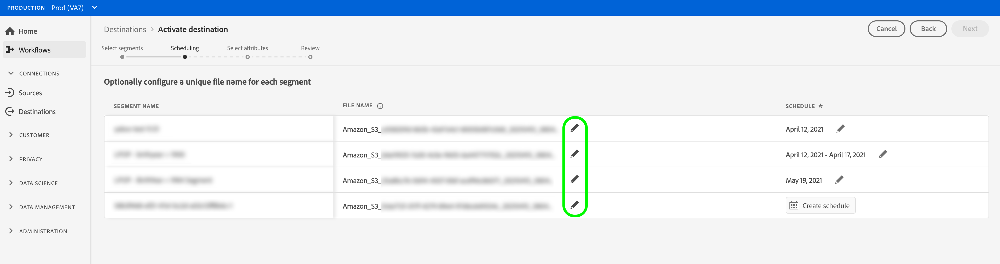
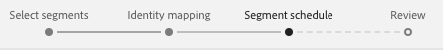

# Attivare profili e segmenti in una destinazione

## Panoramica {#overview}

Attiva i dati in [!DNL Adobe Experience Platform] mappando i segmenti sulle destinazioni. A questo scopo, segui i passaggi seguenti.

## Prerequisiti {#prerequisites}

Per attivare i dati nelle destinazioni, è necessario aver collegato correttamente [una destinazione](./connect-destination.md). Se non lo hai già fatto, vai al [catalogo delle destinazioni](../catalog/overview.md), sfoglia le destinazioni supportate e configura una o più destinazioni.

## Attivare i dati {#activate-data}

I passaggi nel flusso di lavoro di attivazione variano leggermente tra i tipi di destinazione. Il flusso di lavoro completo per tutti i tipi di destinazione è descritto di seguito.

## Selezionare la destinazione in cui attivare i dati {#select-destination}

Si applica a: Tutte le destinazioni

Nell&#39;interfaccia utente di Adobe Experience Platform, passa a **[!UICONTROL Destinazioni]** > **[!UICONTROL Sfoglia]** e fai clic sul pulsante **[!UICONTROL Attiva]** corrispondente alla destinazione in cui desideri attivare i segmenti, come illustrato nell&#39;immagine seguente.


Segui i passaggi della sezione successiva per selezionare i segmenti da attivare.

## [!UICONTROL Seleziona ] segmenti, passaggio {#select-segments}

Si applica a: Tutte le destinazioni


Nel flusso di lavoro **[!UICONTROL Attiva destinazione]**, nella pagina **[!UICONTROL Seleziona segmenti]** , seleziona uno o più segmenti da attivare nella destinazione. Seleziona **[!UICONTROL Avanti]** per passare al passaggio successivo.


##  Mappingstep {#mapping}

>[!CONTEXTUALHELP]
>id="platform_destinations_activate_applytransformation"
>title="Applica trasformazione"
>abstract="Seleziona questa opzione quando utilizzi campi sorgente con hash non crittografati per fare in modo che Adobe Experience Platform li hash automaticamente all’attivazione."

Si applica a: destinazioni social e destinazione pubblicitaria Google Customer Match


Per le destinazioni social, devi selezionare gli attributi di origine o i namespace di identità da mappare come identità di destinazione nella destinazione.

## Esempio: attivazione dei dati sul pubblico in [!DNL Facebook Custom Audience] {#example-facebook}

Di seguito è riportato un esempio di mappatura corretta dell&#39;identità durante l&#39;attivazione dei dati sul pubblico in [!DNL Facebook].

Selezione dei campi di origine:

* Seleziona lo spazio dei nomi `Email` come identità di origine se gli indirizzi e-mail utilizzati non sono con hash.
* Seleziona lo spazio dei nomi `Email_LC_SHA256` come identità di origine se hai hashing gli indirizzi e-mail dei clienti durante l’inserimento dei dati in [!DNL Platform], in base a [!DNL Facebook] [requisiti di hashing e-mail](../catalog/social/facebook.md#email-hashing-requirements).
* Seleziona lo spazio dei nomi `PHONE_E.164` come identità di origine se i dati sono costituiti da numeri di telefono non crittografati. [!DNL Platform] cancellerà i numeri di telefono per conformarsi ai  [!DNL Facebook] requisiti.
* Seleziona lo spazio dei nomi `Phone_SHA256` come identità di origine se hai hashing i numeri di telefono durante l’inserimento dei dati in [!DNL Platform], in base ai [!DNL Facebook] [requisiti di hashing del numero di telefono](../catalog/social/facebook.md#phone-number-hashing-requirements).
* Seleziona lo spazio dei nomi `IDFA` come identità di origine se i dati sono costituiti da [!DNL Apple] ID dispositivo.
* Seleziona lo spazio dei nomi `GAID` come identità di origine se i dati sono costituiti da [!DNL Android] ID dispositivo.
* Seleziona lo spazio dei nomi `Custom` come identità di origine se i dati sono costituiti da un altro tipo di identificatori.

Selezione dei campi di destinazione:

* Selezionare lo spazio dei nomi `Email_LC_SHA256` come identità di destinazione quando gli spazi dei nomi di origine sono `Email` o `Email_LC_SHA256`.
* Selezionare lo spazio dei nomi `Phone_SHA256` come identità di destinazione quando gli spazi dei nomi di origine sono `PHONE_E.164` o `Phone_SHA256`.
* Selezionare i namespace `IDFA` o `GAID` come identità di destinazione quando i namespace di origine sono `IDFA` o `GAID`.
* Seleziona lo spazio dei nomi `Extern_ID` come identità di destinazione quando lo spazio dei nomi di origine è personalizzato.


I dati provenienti da spazi dei nomi senza hash vengono automaticamente hashing da [!DNL Platform] al momento dell’attivazione.

I dati di origine degli attributi non vengono crittografati automaticamente. Quando il campo di origine contiene attributi senza hash, seleziona l&#39;opzione **[!UICONTROL Applica trasformazione]** per fare in modo che [!DNL Platform] hash automaticamente i dati all&#39;attivazione.


 

## Esempio: attivazione dei dati sul pubblico in [!DNL Google Customer Match] {#example-gcm}

Questo è un esempio di mappatura corretta dell&#39;identità durante l&#39;attivazione dei dati sul pubblico in [!DNL Google Customer Match].

Selezione dei campi di origine:

* Seleziona lo spazio dei nomi `Email` come identità di origine se gli indirizzi e-mail utilizzati non sono con hash.
* Seleziona lo spazio dei nomi `Email_LC_SHA256` come identità di origine se hai hashing gli indirizzi e-mail dei clienti durante l’inserimento dei dati in [!DNL Platform], in base a [!DNL Google Customer Match] [requisiti di hashing e-mail](../catalog/social/../advertising/google-customer-match.md).
* Seleziona lo spazio dei nomi `PHONE_E.164` come identità di origine se i dati sono costituiti da numeri di telefono non crittografati. [!DNL Platform] cancellerà i numeri di telefono per conformarsi ai  [!DNL Google Customer Match] requisiti.
* Seleziona lo spazio dei nomi `Phone_SHA256_E.164` come identità di origine se hai hashing i numeri di telefono durante l’inserimento dei dati in [!DNL Platform], in base ai [!DNL Facebook] [requisiti di hashing del numero di telefono](../catalog/social/../advertising/google-customer-match.md).
* Seleziona lo spazio dei nomi `IDFA` come identità di origine se i dati sono costituiti da [!DNL Apple] ID dispositivo.
* Seleziona lo spazio dei nomi `GAID` come identità di origine se i dati sono costituiti da [!DNL Android] ID dispositivo.
* Seleziona lo spazio dei nomi `Custom` come identità di origine se i dati sono costituiti da un altro tipo di identificatori.

Selezione dei campi di destinazione:

* Selezionare lo spazio dei nomi `Email_LC_SHA256` come identità di destinazione quando gli spazi dei nomi di origine sono `Email` o `Email_LC_SHA256`.
* Selezionare lo spazio dei nomi `Phone_SHA256_E.164` come identità di destinazione quando gli spazi dei nomi di origine sono `PHONE_E.164` o `Phone_SHA256_E.164`.
* Selezionare i namespace `IDFA` o `GAID` come identità di destinazione quando i namespace di origine sono `IDFA` o `GAID`.
* Seleziona lo spazio dei nomi `User_ID` come identità di destinazione quando lo spazio dei nomi di origine è personalizzato.


I dati provenienti da spazi dei nomi senza hash vengono automaticamente hashing da [!DNL Platform] al momento dell’attivazione.

I dati di origine degli attributi non vengono crittografati automaticamente. Quando il campo di origine contiene attributi senza hash, seleziona l&#39;opzione **[!UICONTROL Applica trasformazione]** per fare in modo che [!DNL Platform] hash automaticamente i dati all&#39;attivazione.


## **** Passaggio di pianificazione {#scheduling}

Si applica a: Destinazioni e-mail marketing e archiviazione cloud


[!DNL Adobe Experience Platform] esporta dati per destinazioni di marketing e archiviazione cloud e-mail sotto forma di  [!DNL CSV] file. Nel passaggio **[!UICONTROL Pianificazione]**, puoi configurare la pianificazione e i nomi dei file per ciascun segmento che stai esportando. La configurazione della pianificazione è obbligatoria, ma il nome del file è facoltativo.

>[!IMPORTANT]
> 
>[!DNL Adobe Experience Platform] divide automaticamente i file di esportazione a 5 milioni di record (righe) per file. Ogni riga rappresenta un profilo.
>
>I nomi dei file divisi vengono aggiunti con un numero che indica che il file fa parte di un’esportazione più grande, in quanto tale: `filename.csv`, `filename_2.csv`, `filename_3.csv`.

Seleziona il pulsante **[!UICONTROL Crea pianificazione]** corrispondente al segmento da inviare alla destinazione.


### Esportare file completi {#export-full-files}

Seleziona **[!UICONTROL Esporta file completi]** per fare in modo che i file esportati contengano uno snapshot completo di tutti i profili idonei per quel segmento.


1. Utilizza il selettore **[!UICONTROL Frequenza]** per scegliere tra le esportazioni una tantum (**[!UICONTROL Una volta]**) o **[!UICONTROL Giornaliero]**. L’esportazione di un file completo **[!UICONTROL Daily]** esporta il file ogni giorno dalla data di inizio alla data di fine alle 12:00 UTC (7:00 PM EST).
2. Utilizza il selettore **[!UICONTROL Tempo]** per scegliere l&#39;ora del giorno, in formato [!DNL UTC], in cui deve aver luogo l&#39;esportazione. L’esportazione di un file **[!UICONTROL Giornaliero]** esporta il file ogni giorno dalla data di inizio alla data di fine al momento in cui lo selezioni.

   >[!IMPORTANT]
   >
   >L’opzione per esportare i file in un determinato momento è attualmente in versione beta ed è disponibile solo per un numero selezionato di clienti.
   ><br> <br> A causa del modo in cui vengono configurati i processi di Experience Platform interni, la prima esportazione di file incrementali o completi potrebbe non contenere tutti i dati di backfill necessari.  <br> <br> Per garantire un’esportazione completa e più aggiornata dei dati di backfill sia per i file completi che per quelli incrementali, ti consigliamo di impostare l’orario di esportazione del primo file dopo le 12:00 GMT del giorno successivo. Si tratta di una limitazione che verrà affrontata nelle prossime versioni.

3. Utilizza il selettore **[!UICONTROL Data]** per scegliere il giorno o l&#39;intervallo in cui deve aver luogo l&#39;esportazione.
4. Seleziona **[!UICONTROL Crea]** per salvare la pianificazione.


### Esportare file incrementali {#export-incremental-files}

Seleziona **[!UICONTROL Esporta file incrementali]** per fare in modo che i file esportati contengano solo i profili qualificati per quel segmento dall&#39;ultima esportazione.

>[!IMPORTANT]
>
>Il primo file incrementale esportato include tutti i profili idonei per un segmento, che funzionano come backfill.


1. Utilizza il selettore **[!UICONTROL Frequenza]** per scegliere tra le esportazioni **[!UICONTROL Giornaliero]** o **[!UICONTROL Orario]**. L’esportazione di un file incrementale **[!UICONTROL Giornaliero]** esporta il file ogni giorno dalla data di inizio alla data di fine alle 12:00 UTC (7:00 AM EST).
   * Quando selezioni **[!UICONTROL Ogni ora]**, utilizza il selettore **[!UICONTROL Ogni]** per scegliere tra le opzioni **[!UICONTROL 3]**, **[!UICONTROL 6]**, **[!UICONTROL 8]** e **[!UICONTROL 12]** ora.

      >[!IMPORTANT]
      >
      >L’opzione per esportare i file incrementali ogni 3, 6, 8 o 12 ore è attualmente in versione beta ed è disponibile solo per un numero selezionato di clienti. I clienti non beta possono esportare file incrementali una volta al giorno.

2. Utilizza il selettore **[!UICONTROL Tempo]** per scegliere l&#39;ora del giorno, in formato [!DNL UTC], in cui deve aver luogo l&#39;esportazione.

   >[!IMPORTANT]
   >
   >L’opzione per selezionare l’ora del giorno per l’esportazione è disponibile solo per un numero selezionato di clienti. <br> <br> A causa del modo in cui vengono configurati i processi di Experience Platform interni, la prima esportazione di file incrementali o completi potrebbe non contenere tutti i dati di backfill necessari.  <br> <br> Per garantire un’esportazione completa e più aggiornata dei dati di backfill sia per i file completi che per quelli incrementali, ti consigliamo di impostare l’orario di esportazione del primo file dopo le 12:00 GMT del giorno successivo. Si tratta di una limitazione che verrà affrontata nelle prossime versioni.

3. Utilizza il selettore **[!UICONTROL Data]** per scegliere il giorno o l&#39;intervallo in cui deve aver luogo l&#39;esportazione.
4. Seleziona **[!UICONTROL Crea]** per salvare la pianificazione.

### Configurare i nomi dei file {#file-names}

I nomi file predefiniti sono costituiti dal nome di destinazione, dall’ID del segmento e da un indicatore di data e ora. Ad esempio, puoi modificare i nomi dei file esportati per distinguere tra campagne diverse o per far sì che il tempo di esportazione dei dati sia aggiunto ai file.

Seleziona l’icona a forma di matita per aprire una finestra modale e modificare i nomi dei file. I nomi dei file sono limitati a 255 caratteri.



Nell’editor dei nomi dei file, puoi selezionare diversi componenti da aggiungere al nome del file.


Impossibile rimuovere il nome di destinazione e l’ID del segmento dai nomi dei file. Oltre a questi, puoi aggiungere quanto segue:

* **[!UICONTROL Nome]** del segmento: Puoi aggiungere il nome del segmento al nome del file.
* **[!UICONTROL Data e ora]**: Seleziona tra l’aggiunta di un  `MMDDYYYY_HHMMSS` formato o di una marca temporale Unix a 10 cifre dell’ora in cui vengono generati i file. Scegliere una di queste opzioni se si desidera che i file abbiano un nome file dinamico generato con ogni esportazione incrementale.
* **[!UICONTROL Testo]** personalizzato: Aggiungi testo personalizzato ai nomi dei file.

Seleziona **[!UICONTROL Applica modifiche]** per confermare la selezione.

>[!IMPORTANT]
> 
>Se non si seleziona il componente **[!UICONTROL Data e ora]**, i nomi dei file saranno statici e il nuovo file esportato sovrascriverà il file precedente nel percorso di archiviazione con ogni esportazione. Quando esegui un processo di importazione ricorrente da un percorso di archiviazione in una piattaforma di marketing e-mail, questa è l’opzione consigliata.

Al termine della configurazione di tutti i segmenti, seleziona **[!UICONTROL Avanti]** per continuare.

## **[!UICONTROL Segment]** schedulestep {#segment-schedule}

Si applica a: destinazioni pubblicitarie, destinazioni social



Nella pagina **[!UICONTROL Programmazione segmenti]** puoi impostare la data di inizio per l’invio dei dati alla destinazione e la frequenza di invio dei dati alla destinazione.

>[!IMPORTANT]
>
>Per le destinazioni social, in questo passaggio devi selezionare l’origine del pubblico. Puoi passare al passaggio successivo solo dopo aver selezionato una delle opzioni nell’immagine seguente.


>[!IMPORTANT]
>
>Per Customer Match di Google, è necessario fornire l&#39; [!UICONTROL ID app] in questo passaggio, quando si attivano i segmenti [!DNL IDFA] o [!DNL GAID].


## **[!UICONTROL Passaggio Seleziona]** attributi {#select-attributes}

Si applica a: destinazioni e-mail marketing e cloud storage


Nella pagina **[!UICONTROL Seleziona attributi]** , seleziona **[!UICONTROL Aggiungi nuovo campo]** e scegli gli attributi che desideri inviare alla destinazione.

>[!NOTE]
>
> Adobe Experience Platform precompila la selezione con quattro attributi consigliati e di uso comune dallo schema: `person.name.firstName`, `person.name.lastName`, `personalEmail.address`, `segmentMembership.status`.

Le esportazioni di file variano nei seguenti modi, a seconda che sia selezionato `segmentMembership.status`:
* Se il campo `segmentMembership.status` è selezionato, i file esportati includono i membri **[!UICONTROL Active]** nello snapshot completo iniziale e i membri **[!UICONTROL Active]** e **[!UICONTROL Expired]** nelle esportazioni incrementali successive.
* Se il campo `segmentMembership.status` non è selezionato, i file esportati includono solo i membri **[!UICONTROL Active]** nello snapshot completo iniziale e nelle esportazioni incrementali successive.


### Attributi obbligatori {#mandatory-attributes}

>[!CONTEXTUALHELP]
>id="platform_destinations_activate_mandatorykey"
>title="Informazioni sugli attributi obbligatori"
>abstract="Seleziona gli attributi dello schema XDM che tutti i profili esportati devono includere. I profili senza la chiave obbligatoria non vengono esportati nella destinazione . Se non selezioni una chiave obbligatoria, vengono esportati tutti i profili qualificati, indipendentemente dai relativi attributi."
>additional-url="http://www.adobe.com/go/destinations-mandatory-attributes-en" text="Ulteriori informazioni nella documentazione"

Puoi contrassegnare gli attributi come obbligatori per garantire che [!DNL Platform] esporti solo i profili che includono l’attributo specifico. Di conseguenza, può essere utilizzato come ulteriore forma di filtro. La marcatura di un attributo come obbligatorio è **non** obbligatoria.

Se non selezioni un attributo obbligatorio, vengono esportati tutti i profili qualificati, indipendentemente dai relativi attributi.

È consigliabile che uno degli attributi sia un [identificatore univoco](../../destinations/catalog/email-marketing/overview.md#identity) dallo schema. Per ulteriori informazioni sugli attributi obbligatori, consulta la sezione identità nella documentazione [Destinazioni di marketing e-mail](../../destinations/catalog/email-marketing/overview.md#identity) .

### Chiavi di deduplicazione {#deduplication-keys}

>[!CONTEXTUALHELP]
>id="platform_destinations_activate_deduplicationkey"
>title="Informazioni sulle chiavi di deduplicazione"
>abstract="Elimina più record dello stesso profilo nei file di esportazione selezionando una chiave di deduplicazione. Seleziona un singolo spazio dei nomi o fino a due attributi di schema XDM come chiave di deduplicazione. La mancata selezione di una chiave di deduplicazione può causare la presenza di voci di profilo duplicate nei file di esportazione."
>additional-url="http://www.adobe.com/go/destinations-deduplication-keys-en" text="Ulteriori informazioni nella documentazione"

>[!IMPORTANT]
>
>L’opzione per utilizzare le chiavi di deduplicazione è attualmente in versione beta ed è disponibile solo per un numero selezionato di clienti.

Le chiavi di deduplicazione eliminano la possibilità di avere più record dello stesso profilo in un unico file di esportazione.

Esistono tre modi per utilizzare le chiavi di deduplicazione in [!DNL Platform]:

* Utilizzo di un singolo spazio dei nomi di identità come chiave di deduplicazione [!UICONTROL a1/>]
* Utilizzo di un singolo attributo di profilo da un profilo [!DNL XDM] come chiave di deduplicazione 
* Utilizzo di una combinazione di due attributi di profilo da un profilo [!DNL XDM] come chiave composita

>[!IMPORTANT]
>
> È possibile esportare un singolo namespace di identità in una destinazione e lo spazio dei nomi viene impostato automaticamente come chiave di deduplicazione. L’invio di più namespace a una destinazione non è supportato.
> 
> Non è possibile utilizzare una combinazione di namespace identità e attributi di profilo come chiavi di deduplicazione.

### Esempio di deduplicazione {#deduplication-example}

Questo esempio illustra il funzionamento della deduplicazione, a seconda delle chiavi di deduplicazione selezionate.

Consideriamo i due profili seguenti.

**Profilo A**

```json
{
  "identityMap": {
    "Email": [
      {
        "id": "johndoe_1@example.com"
      },
      {
        "id": "johndoe_2@example.com"
      }
    ]
  },
  "segmentMembership": {
    "ups": {
      "fa5c4622-6847-4199-8dd4-8b7c7c7ed1d6": {
        "status": "existing",
        "lastQualificationTime": "2021-03-10 10:03:08"
      }
    }
  },
  "person": {
    "name": {
      "lastName": "Doe",
      "firstName": "John"
    }
  },
  "personalEmail": {
    "address": "johndoe@example.com"
  }
}
```

**Profilo B**

```json
{
  "identityMap": {
    "Email": [
      {
        "id": "johndoe_1@example.com"
      },
      {
        "id": "johndoe_2@example.com"
      }
    ]
  },
  "segmentMembership": {
    "ups": {
      "fa5c4622-6847-4199-8dd4-8b7c7c7ed1d6": {
        "status": "existing",
        "lastQualificationTime": "2021-04-10 11:33:28"
      }
    }
  },
  "person": {
    "name": {
      "lastName": "D",
      "firstName": "John"
    }
  },
  "personalEmail": {
    "address": "johndoe@example.com"
  }
}
```

### Caso di utilizzo della deduplicazione 1: nessuna deduplicazione

Senza la deduplicazione, il file di esportazione conterrebbe le seguenti voci.

| personalEmail | firstName | lastName |
|---|---|---|
| johndoe@example.com | John | Doe |
| johndoe@example.com | John | D |


### Caso di utilizzo della deduplicazione 2: deduplicazione basata sullo spazio dei nomi identità

Supponendo la deduplicazione dello spazio dei nomi [!DNL Email], il file di esportazione conterrà le seguenti voci. Il profilo B è l’ultimo ad essere qualificato per il segmento, quindi è l’unico ad essere esportato.

| E-mail* | personalEmail | firstName | lastName |
|---|---|---|---|
| johndoe_1@example.com | johndoe@example.com | John | D |
| johndoe_2@example.com | johndoe@example.com | John | D |

### Caso di utilizzo della deduplicazione 3: deduplicazione basata su un singolo attributo di profilo

Supponendo la deduplicazione dell’attributo `personal Email` , il file di esportazione conterrà la voce seguente. Il profilo B è l’ultimo ad essere qualificato per il segmento, quindi è l’unico ad essere esportato.

| personalEmail* | firstName | lastName |
|---|---|---|
| johndoe@example.com | John | D |


### Caso di utilizzo della deduplicazione 4: deduplicazione basata su due attributi di profilo (chiave di deduplicazione composita)

Supponendo la deduplicazione della chiave composita `personalEmail + lastName`, il file di esportazione conterrà le seguenti voci.

| personalEmail* | lastName* | firstName |
|---|---|---|
| johndoe@example.com | D | John |
| johndoe@example.com | Doe | John |


Adobe consiglia di selezionare uno spazio dei nomi di identità, ad esempio un [!DNL CRM ID] o un indirizzo e-mail, come chiave di deduplicazione, per garantire che tutti i record di profilo siano identificati in modo univoco.

>[!NOTE]
> 
>Se sono state applicate etichette di utilizzo dei dati a determinati campi all’interno di un set di dati (anziché all’intero set di dati), l’applicazione di tali etichette a livello di campo all’attivazione si verifica nelle seguenti condizioni:
>
>* I campi vengono utilizzati nella definizione del segmento.
>* I campi sono configurati come attributi proiettati per la destinazione di destinazione.

>
> 
Ad esempio, se nel campo `person.name.firstName` sono presenti alcune etichette di utilizzo dei dati in conflitto con l’azione di marketing della destinazione, nel passaggio di revisione viene visualizzata una violazione dei criteri di utilizzo dei dati. Per ulteriori informazioni, consulta [Governance dei dati in Adobe Experience Platform](../../rtcdp/privacy/data-governance-overview.md#destinations).

## **** Passaggio revisione {#review}

Si applica a: tutte le destinazioni


Nella pagina **[!UICONTROL Rivedi]** puoi visualizzare un riepilogo della selezione. Seleziona **[!UICONTROL Annulla]** per interrompere il flusso, **[!UICONTROL Indietro]** per modificare le impostazioni oppure **[!UICONTROL Fine]** per confermare la selezione e iniziare a inviare dati alla destinazione.

>[!IMPORTANT]
>
>In questo passaggio, Adobe Experience Platform verifica la presenza di violazioni dei criteri di utilizzo dei dati. Di seguito è riportato un esempio di violazione di un criterio. Non puoi completare il flusso di lavoro di attivazione dei segmenti finché non avrai risolto la violazione. Per informazioni su come risolvere le violazioni dei criteri, consulta [Applicazione dei criteri](../../rtcdp/privacy/data-governance-overview.md#enforcement) nella sezione relativa alla governance dei dati .


Se non sono state rilevate violazioni dei criteri, selezionare **[!UICONTROL Fine]** per confermare la selezione e iniziare a inviare dati alla destinazione.


## Verifica che l’attivazione del segmento sia avvenuta correttamente {#verify-activation}

### Destinazioni e-mail marketing e archiviazione cloud {#esp-and-cloud-storage}

Per le destinazioni di e-mail marketing e l’archiviazione cloud, Adobe Experience Platform crea un file `.csv` delimitato da tabulazioni nel percorso di archiviazione fornito. Attendi la creazione di un nuovo file nel percorso di archiviazione ogni giorno. Il formato predefinito del file è:
`<destinationName>_segment<segmentID>_<timestamp-yyyymmddhhmmss>.csv`

I file che si riceverebbero in tre giorni consecutivi potrebbero essere così:

```console
Salesforce_Marketing_Cloud_segment12341e18-abcd-49c2-836d-123c88e76c39_20200408061804.csv
Salesforce_Marketing_Cloud_segment12341e18-abcd-49c2-836d-123c88e76c39_20200409052200.csv
Salesforce_Marketing_Cloud_segment12341e18-abcd-49c2-836d-123c88e76c39_20200410061130.csv
```

La presenza di questi file nel percorso di archiviazione è la conferma di un&#39;attivazione riuscita. Per comprendere come sono strutturati i file esportati, è possibile [scaricare un file .csv di esempio](../assets/common/sample_export_file_segment12341e18-abcd-49c2-836d-123c88e76c39_20200408061804.csv). Questo file di esempio include gli attributi del profilo `person.firstname`, `person.lastname`, `person.gender`, `person.birthyear` e `personalEmail.address`.

## Destinazioni pubblicitarie

Controlla il tuo account nella rispettiva destinazione pubblicitaria a cui stai attivando i tuoi dati. Se l&#39;attivazione ha avuto successo, i tipi di pubblico vengono popolati nella piattaforma pubblicitaria.

## Destinazioni social

Per [!DNL Facebook], una corretta attivazione implica la creazione programmatica di un pubblico personalizzato [!DNL Facebook] in [[!UICONTROL Facebook Ads Manager]](https://www.facebook.com/adsmanager/manage/). L’appartenenza al segmento nel pubblico verrà aggiunta e rimossa man mano che gli utenti sono qualificati o non qualificati per i segmenti attivati.

>[!TIP]
>
>L’integrazione tra Adobe Experience Platform e [!DNL Facebook] supporta le versioni precedenti del pubblico. Tutte le qualifiche dei segmenti storici vengono inviate a [!DNL Facebook] quando attivi i segmenti nella destinazione.

## Disattiva attivazione {#disable-activation}

Per disabilitare un flusso di attivazione esistente, segui i passaggi seguenti:

1. Seleziona **[!UICONTROL Destinazioni]** nella barra di navigazione a sinistra, quindi fai clic sulla scheda **[!UICONTROL Sfoglia]** e fai clic sul nome della destinazione.
2. Fai clic sul controllo **[!UICONTROL Enabled]** nella barra a destra per modificare lo stato del flusso di attivazione.
3. Nella finestra **Aggiorna stato flusso dati**, selezionare **Conferma** per disabilitare il flusso di attivazione.
