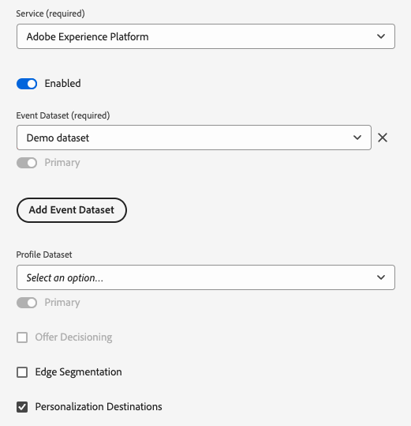

# Cercare in tempo reale gli attributi del profilo sul bordo

Adobe Experience Platform utilizza [Real-Time Customer Profile](../../profile/home.md) come unica origine di verità per tutti i dati del profilo. Per un recupero rapido dei dati in tempo reale, utilizza [profili edge](../../profile/edge-profiles.md), che sono profili leggeri distribuiti in [Edge Network](../../collection/home.md#edge). Questo consente casi d’uso di personalizzazione rapidi e in tempo reale.

## Casi d’uso {#use-cases}

Di seguito sono riportati due casi di utilizzo in cui la ricerca dei profili edge può essere utile.

* **Real-Time Personalization**: recupera rapidamente le informazioni sul profilo dal profilo Edge per personalizzare l&#39;esperienza di un utente sul sito Web.
* **Assistenza clienti**: recupera le informazioni sul profilo in tempo reale quando un cliente chiama un agente del centro di assistenza.

Questa pagina descrive i passaggi da seguire per cercare i dati del profilo edge in tempo reale, per fornire esperienze di personalizzazione o per informare le regole decisionali tramite le applicazioni a valle.

## Terminologia e prerequisiti {#prerequisites}

Quando configuri il caso d’uso descritto in questa pagina, utilizzerai i seguenti componenti di Platform:

* [Datastream](../../datastreams/overview.md): un datastream riceve i dati evento in ingresso da Web SDK e risponde con i dati del profilo Edge.
* [Criteri di unione](../../segmentation/ui/segment-builder.md#merge-policies): verrà creato un criterio di unione [!UICONTROL Attivo su Edge] per garantire che i profili edge utilizzino i dati di profilo corretti.
* [Connessione Personalization personalizzata](../catalog/personalization/custom-personalization.md): verrà configurata una nuova connessione di personalizzazione personalizzata che invierà gli attributi del profilo all&#39;Edge Network.
* [Edge Network API](../../server-api/overview.md): utilizzerai la funzionalità Edge Network API [raccolta dati interattiva](../../server-api/interactive-data-collection.md) per recuperare rapidamente gli attributi del profilo dai profili edge.

## Guardrail prestazioni {#guardrails}

I casi di utilizzo della ricerca di profili Edge sono soggetti ai guardrail di prestazioni specifici descritti nella tabella seguente. Per ulteriori dettagli sui guardrail API Edge Network, consulta la [pagina della documentazione](https://developer.adobe.com/data-collection-apis/docs/getting-started/guardrails/) relativa ai guardrail.

| Servizio Edge Network | Segmentazione di Edge | Richieste al secondo |
|---------|----------|---------|
| [Destinazione personalizzazione personalizzata](../catalog/personalization/custom-personalization.md) tramite [API Edge Network](https://developer.adobe.com/data-collection-apis/docs/api/) | Sì | 1500 |
| [Destinazione personalizzazione personalizzata](../catalog/personalization/custom-personalization.md) tramite [API Edge Network](https://developer.adobe.com/data-collection-apis/docs/api/) | No | 1500 |

## Passaggio 1: creare e configurare un flusso di dati {#create-datastream}

Segui i passaggi descritti nella documentazione relativa alla [configurazione dello stream di dati](../../datastreams/configure.md#create-a-datastream) per creare un nuovo stream di dati con le seguenti impostazioni del **[!UICONTROL servizio]**:

* **[!UICONTROL Servizio]**: [!UICONTROL Adobe Experience Platform]
* **[!UICONTROL Destinazioni Personalization]**: abilitato
* **[!UICONTROL Segmentazione Edge]**: se hai bisogno della segmentazione Edge, abilita questa opzione. Se ti interessa cercare solo gli attributi del profilo sul server Edge di, ma non desideri eseguire alcuna segmentazione in base ai profili Edge di, lascia questa opzione disabilitata.


  <!-- >[!IMPORTANT]
    >
    >Enabling edge segmentation limits the maximum number of lookup requests to 1500 request per second. If you need a higher request throughput, disable edge segmentation for your datastream. See the [guardrails documentation](../guardrails.md#edge-destinations-activation) for detailed information. -->

  


## Passaggio 2: configurare i tipi di pubblico per la valutazione Edge {#audience-edge-evaluation}

La ricerca degli attributi del profilo sul server Edge richiede la configurazione dei tipi di pubblico per la valutazione Edge.

Assicurarsi che il criterio di unione [Attivo su Edge](../../segmentation/ui/segment-builder.md#merge-policies) sia impostato come predefinito per i tipi di pubblico che si intende attivare. Il criterio di unione [!DNL Active-On-Edge] garantisce che i tipi di pubblico vengano valutati costantemente [sul server Edge](../../segmentation/ui/edge-segmentation.md) e siano disponibili per casi di utilizzo di personalizzazione in tempo reale.

Segui le istruzioni relative alla [creazione di un criterio di unione](../../profile/merge-policies/ui-guide.md#create-a-merge-policy) e assicurati di attivare/disattivare il criterio di unione **[!UICONTROL Attivo su Edge]**.

>[!IMPORTANT]
>
>Se i tipi di pubblico utilizzano un criterio di unione diverso, non sarà possibile recuperare gli attributi del profilo dal server Edge e non sarà possibile eseguire la ricerca del profilo Edge.

## Passaggio 3: invia i dati dell’attributo del profilo all’Edge Network{#configure-custom-personalization-connection}

Per cercare in tempo reale i profili edge, inclusi gli attributi e i dati di iscrizione al pubblico, è necessario rendere disponibili i dati nell’Edge Network. A questo scopo, devi creare una connessione a una destinazione di **[!UICONTROL Personalization personalizzato con attributi]** e attivare i tipi di pubblico, inclusi gli attributi che desideri cercare nei profili edge.

+++ Configurare una connessione Personalization con attributi personalizzata

Segui l&#39;esercitazione [creazione connessione di destinazione](../ui/connect-destination.md) per istruzioni dettagliate su come creare una nuova connessione di destinazione.

Durante la configurazione della nuova destinazione, seleziona lo stream di dati creato nel [passaggio 1](#create-datastream) nel campo **[!UICONTROL ID stream di dati]**. Per **[!UICONTROL Integration alias]** è possibile utilizzare qualsiasi valore che consenta di identificare questa connessione di destinazione in futuro, come il nome della destinazione.


+++

+++Attiva i tipi di pubblico nella connessione Personalization personalizzato con attributi

Dopo aver creato una connessione **[!UICONTROL Personalization personalizzato con attributi]**, puoi inviare i dati del profilo all&#39;Edge Network.

>[!IMPORTANT]
> 
> * Per attivare i dati e abilitare il [passaggio di mappatura](#mapping) del flusso di lavoro, sono necessari **[!UICONTROL Visualizza destinazioni]**, **[!UICONTROL Attiva destinazioni]**, **[!UICONTROL Visualizza profili]** e **[!UICONTROL Visualizza segmenti]** [Autorizzazioni di controllo di accesso](/help/access-control/home.md#permissions).
> 
> Leggi la [panoramica sul controllo degli accessi](/help/access-control/ui/overview.md) o contatta l&#39;amministratore del prodotto per ottenere le autorizzazioni necessarie.

1. Vai a **[!UICONTROL Connessioni > Destinazioni]** e seleziona la scheda **[!UICONTROL Catalogo]**.

   

1. Trova la scheda di destinazione **[!UICONTROL Personalization personalizzato con attributi]**, quindi seleziona **[!UICONTROL Attiva pubblico]**, come illustrato nell&#39;immagine seguente.

   

1. Seleziona la connessione di destinazione configurata in precedenza, quindi seleziona **[!UICONTROL Avanti]**.

   

1. Seleziona i tipi di pubblico. Utilizza le caselle di controllo a sinistra dei nomi del pubblico per selezionare i tipi di pubblico che desideri attivare nella destinazione, quindi seleziona **[!UICONTROL Successivo]**.

   Puoi scegliere tra più tipi di pubblico, a seconda della loro origine:

   * **[!UICONTROL Servizio di segmentazione]**: tipi di pubblico generati in Experience Platform dal servizio di segmentazione. Per ulteriori dettagli, consulta la [documentazione sulla segmentazione](../../segmentation/ui/overview.md).
   * **[!UICONTROL Caricamento personalizzato]**: pubblico generato al di fuori di Experience Platform e caricato in Platform come file CSV. Per ulteriori informazioni sui tipi di pubblico esterni, consulta la documentazione su [importazione di un pubblico](../../segmentation/ui/overview.md#import-audience).
   * Altri tipi di pubblico, provenienti da altre soluzioni Adobe, ad esempio [!DNL Audience Manager].

     

1. Selezionare gli attributi di profilo che si desidera rendere disponibili per i profili di spigolo.

   * **Selezionare gli attributi di origine**. Per aggiungere gli attributi di origine, seleziona il controllo **[!UICONTROL Aggiungi nuovo campo]** nella colonna **[!UICONTROL Campo Source]** e cerca o passa al campo attributo XDM desiderato, come illustrato di seguito.

     

   * **Selezionare gli attributi di destinazione**. Per aggiungere attributi di destinazione, selezionare il controllo **[!UICONTROL Aggiungi nuovo campo]** nella colonna **[!UICONTROL Campo di destinazione]** e digitare il nome dell&#39;attributo personalizzato a cui si desidera mappare l&#39;attributo di origine.

     


Al termine della mappatura degli attributi del profilo, selezionare **[!UICONTROL Avanti]**.

Nella pagina **[!UICONTROL Rivedi]** puoi visualizzare un riepilogo della selezione. Seleziona **[!UICONTROL Annulla]** per interrompere il flusso, **[!UICONTROL Indietro]** per modificare le impostazioni oppure **[!UICONTROL Fine]** per confermare la selezione e iniziare a inviare i dati del profilo all&#39;Edge Network.


+++

+++Valutazione dei criteri di consenso

Se l’organizzazione ha acquistato **Adobe Healthcare Shield** o **Adobe Privacy &amp; Security Shield**, seleziona **[!UICONTROL Visualizza i criteri di consenso applicabili]** per vedere quali criteri di consenso vengono applicati e quanti profili vengono inclusi di conseguenza nell’attivazione. Leggi informazioni sulla [valutazione dei criteri di consenso](/help/data-governance/enforcement/auto-enforcement.md#consent-policy-evaluation) per ulteriori informazioni.

**Controlli dei criteri di utilizzo dati**

Nel passaggio **[!UICONTROL Rivedi]**, Experience Platform controlla anche eventuali violazioni dei criteri di utilizzo dei dati. Di seguito è riportato un esempio di violazione di una policy. Non puoi completare il flusso di lavoro di attivazione del pubblico finché non hai risolto la violazione. Per informazioni su come risolvere le violazioni dei criteri, leggere le [violazioni dei criteri di utilizzo dei dati](/help/data-governance/enforcement/auto-enforcement.md#data-usage-violation) nella sezione relativa alla governance dei dati.


+++

+++Filtrare i tipi di pubblico

Nel passaggio **[!UICONTROL Rivedi]** puoi utilizzare i filtri disponibili nella pagina per visualizzare solo i tipi di pubblico la cui pianificazione o mappatura è stata aggiornata come parte di questo flusso di lavoro. Puoi anche scegliere quali colonne della tabella visualizzare.


Se si è soddisfatti della selezione e non sono state rilevate violazioni dei criteri, selezionare **[!UICONTROL Fine]** per confermare la selezione.

+++

## Passaggio 4: Cercare gli attributi del profilo sullo spigolo {#configure-edge-profile-lookup}

A questo punto dovresti aver completato [la configurazione dello stream di dati](#create-datastream), [hai creato una nuova connessione di destinazione Personalization con attributi personalizzati](#configure-destination) e hai utilizzato questa connessione per [inviare gli attributi del profilo](#activate-audiences) che potrai cercare nell&#39;Edge Network.

Il passaggio successivo consiste nel configurare la soluzione di personalizzazione per recuperare gli attributi del profilo dai profili edge.

>[!IMPORTANT]
>
>Gli attributi del profilo possono contenere dati sensibili. Per proteggere questi dati, è necessario recuperare gli attributi del profilo tramite l&#39;[API Edge Network](../../server-api/overview.md). Inoltre, per autenticare le chiamate API, è necessario recuperare gli attributi del profilo tramite l&#39;endpoint di raccolta dati interattivo [Edge Network API](../../server-api/interactive-data-collection.md).
><br>Se non segui i requisiti di cui sopra, la personalizzazione sarà basata solo sull’iscrizione al pubblico e gli attributi di profilo non saranno disponibili.

Lo stream di dati configurato nel [passaggio 1](#create-datastream) è ora pronto per accettare i dati dell&#39;evento in arrivo e rispondere con le informazioni del profilo Edge.

Configura l’integrazione per recuperare le informazioni del profilo edge, come illustrato negli esempi seguenti.

### Richiesta {#request}

Per recuperare i dati del profilo Edge, invia una chiamata `POST` vuota all&#39;endpoint `/interact`, con l&#39;identità primaria per la quale stai cercando gli attributi di profilo inclusi nell&#39;evento, come mostrato di seguito.

```shell
curl -X POST "https://server.adobedc.net/ee/v2/interact?dataStreamId={DATASTREAM_ID}" 
-H "Authorization: Bearer {TOKEN}" 
-H "x-gw-ims-org-id: {ORG_ID}" 
-H "x-api-key: {API_KEY}" 
-H "Content-Type: application/json" 
-d '{
    "event":
    {
        "xdm": {
            "identityMap": {
                "Email": [
                    {  
                        "id":"test123@adobetest.com",
                        "primary":true
                    }
                ]
            }
        }
    }
    
}'
```

| Parametro | Tipo | Obbligatorio | Descrizione |
| --- | --- | --- | --- |
| `dataStreamId` | `String` | Sì. | ID dello stream di dati creato in [passaggio 1](#create-datastream). |

### Risposta {#response}

In caso di esito positivo, la risposta restituisce lo stato HTTP `200 OK`, con un oggetto `Handle` che include informazioni simili a quelle riportate nelle schede seguenti, a seconda che il profilo si trovi o meno sul server Edge di.

>[!NOTE]
>
>Le risposte API sono modulari e l&#39;oggetto `handle` può includere più oggetti `payload` di vari tipi. Le informazioni relative alla ricerca del profilo perimetrale sono raggruppate nell&#39;oggetto `payload` con `"type": "activation:pull"`,

>[!BEGINTABS]

>[!TAB Il profilo esiste nel perimetro]

Se il profilo esiste sul server Edge di, a seconda degli attributi del profilo e dei tipi di pubblico attivati sul server Edge di, puoi aspettarti una risposta con attributi e appartenenze a tipi di pubblico simili a quelli riportati di seguito.

```json
{
  "requestId": "3c600138-d785-42ca-a025-bb725f4b5da9",
  "handle": [
    {
      "payload": [
        {
          "type": "profileLookup",
          "destinationId": "9218b727-ec59-4a46-b8b9-05503f138c5d",
          "alias": "rk-demo-custom-personalization-XXXX",
          "attributes": {
            "zip": {
              "value": "19000"
            },
            "firstName": {
              "value": "Test"
            },
            "lastName": {
              "value": "User123"
            },
            "gender": {
              "value": "male"
            },
            "city": {
              "value": "Philadelphia"
            },
            "state": {
              "value": "PA"
            },
            "email": {
              "value": "test123@adobetest.com"
            }
          },
          "segments": [
            {
              "id": "85018bd8-7ad1-4e17-ae30-8389c04bd3c0",
              "namespace": "ups"
            },
            {
              "id": "d09a8159-8b30-4178-b2f2-7a8c5e3168d9",
              "namespace": "ups"
            }
          ]
        }
      ],
      "type": "activation:pull",
      "eventIndex": 0
    }
  ]
}
```

L&#39;oggetto `handle` fornisce le informazioni descritte nella tabella seguente.

| Parametro | Descrizione |
|---------|----------|
| `payload` | L&#39;oggetto `payload` che include le informazioni di ricerca edge. La risposta può contenere più oggetti `payload` aggiuntivi, non correlati alla ricerca Edge. |
| `type` | I payload sono raggruppati nella risposta per tipo. Il tipo di payload per la ricerca del profilo edge è sempre impostato su `profileLookup`. |
| `destinationId` | ID dell&#39;istanza di connessione **[!UICONTROL Custom Personalization]** creata in [passaggio 3](#configure-custom-personalization-connection). |
| `alias` | Alias della connessione di destinazione, configurato dall&#39;utente quando crea la connessione di destinazione [Personalization](../catalog/personalization/custom-personalization.md) personalizzata. |
| `attributes` | Questo array include gli attributi del profilo edge dei tipi di pubblico attivati nel [passaggio 3](#configure-custom-personalization-connection). |
| `segments` | Questo array include i tipi di pubblico attivati in [passaggio 3](#configure-custom-personalization-connection). |
| `type` | `handle` oggetti sono raggruppati per tipo. Per i casi di utilizzo di ricerca di profili edge, il tipo dell&#39;oggetto `handle` è sempre `activation:pull`. |
| `eventIndex` | L’Edge Network riceve eventi dal client sotto forma di array. L’ordine degli eventi nell’array viene mantenuto durante l’elaborazione e rispecchiato da questo indice. L&#39;indicizzazione degli eventi inizia con `0`. |

>[!TAB Il profilo non esiste nel perimetro]

Se il profilo non esiste sul server Edge di, la risposta sarà simile a quella riportata di seguito.

```json
{
  "requestId": "531b541a-4541-419e-ac99-fd7e452f0c0f",
  "handle": [
    {
      "payload": [],
      "type": "activation:pull",
      "eventIndex": 0
    }
  ]
}
```

L&#39;oggetto `handle` fornisce le informazioni descritte nella tabella seguente.

| Parametro | Descrizione |
|---------|----------|
| `payload` | Quando il profilo non è presente nel perimetro, l&#39;oggetto `payload` è vuoto. |
| `type` | `payload` oggetti sono raggruppati per tipo. Per i casi di utilizzo di ricerca di profili edge, il tipo dell&#39;oggetto `payload` è sempre `activation:pull`. |
| `eventIndex` | L’Edge Network riceve eventi dal client sotto forma di array. L’ordine degli eventi nell’array viene mantenuto durante l’elaborazione e rispecchiato da questo indice. L&#39;indicizzazione degli eventi inizia con `0`. |

>[!ENDTABS]

>[!SUCCESS]
>
>Se hai configurato correttamente l’integrazione, ora puoi accedere ai dati del profilo Edge e puoi utilizzare gli attributi e l’appartenenza al pubblico dei profili Edge per attivare la personalizzazione in tempo reale nel motore di personalizzazione a valle.

## Conclusione {#conclusion}

Seguendo i passaggi precedenti, puoi cercare in modo efficiente gli attributi del profilo edge in tempo reale, abilitando esperienze personalizzate e processi decisionali informati tramite le applicazioni a valle.
