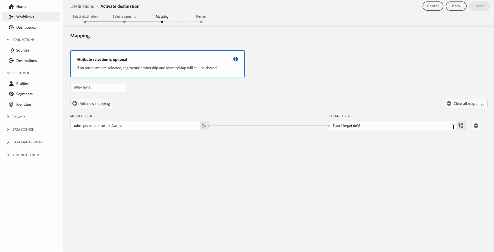
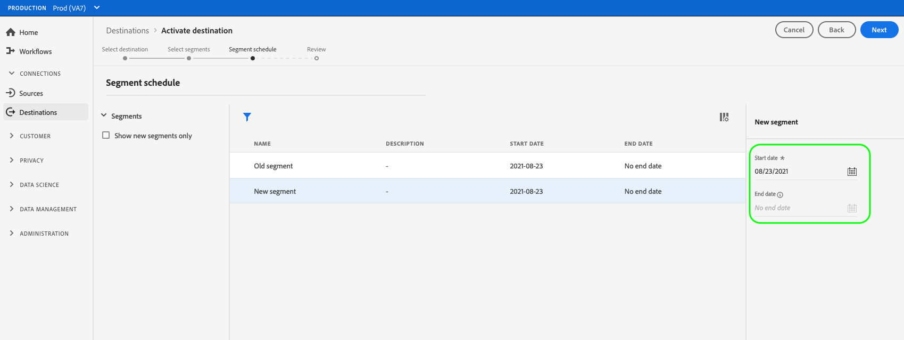

# Attivare i dati del pubblico nelle destinazioni delle richieste di profilo

>[!IMPORTANT]
> 
> * Per attivare i dati e abilitare [passaggio di mappatura](#mapping) del flusso di lavoro, è necessario **[!UICONTROL Gestire le destinazioni]**, **[!UICONTROL Attivare le destinazioni]**, **[!UICONTROL Visualizza profili]**, e **[!UICONTROL Visualizzare segmenti]** [autorizzazioni di controllo degli accessi](/help/access-control/home.md#permissions).
> * Per attivare i dati senza passare attraverso [passaggio di mappatura](#mapping) del flusso di lavoro, è necessario **[!UICONTROL Gestire le destinazioni]**, **[!UICONTROL Attiva segmento senza mappatura]**, **[!UICONTROL Visualizza profili]**, e **[!UICONTROL Visualizzare segmenti]** [autorizzazioni di controllo degli accessi](/help/access-control/home.md#permissions).
> 
> Leggi le [panoramica sul controllo degli accessi](/help/access-control/ui/overview.md) oppure contatta l’amministratore del prodotto per ottenere le autorizzazioni necessarie.

## Panoramica {#overview}

Questo articolo spiega il flusso di lavoro necessario per attivare i dati sul pubblico nelle destinazioni delle richieste di profilo di Adobe Experience Platform. Se usato insieme a [segmentazione Edge](../../segmentation/ui/edge-segmentation.md), queste destinazioni abilitano i casi d’uso per la personalizzazione della stessa pagina e della pagina successiva nelle tue proprietà web e mobili. Ulteriori informazioni su [abilitazione dei casi di utilizzo di personalizzazione della stessa pagina e della pagina successiva](/help/destinations/ui/configure-personalization-destinations.md).

Esempi di destinazioni di richieste di profilo sono [Adobe Target](../../destinations/catalog/personalization/adobe-target-connection.md) e [Personalizzazione personalizzata](../../destinations/catalog/personalization/custom-personalization.md) connessioni.

## Prerequisiti {#prerequisites}

Per attivare i dati nelle destinazioni, è necessario aver completato [connesso a una destinazione](./connect-destination.md). Se non lo hai già fatto, accedi al [catalogo delle destinazioni](../catalog/overview.md), sfoglia le destinazioni di personalizzazione supportate e configura la destinazione che desideri utilizzare.

### Criterio di unione segmenti {#merge-policy}

Attualmente, le destinazioni delle richieste di profilo supportano solo l’attivazione di segmenti che utilizzano [Criterio di unione Attivo su Edge](../../segmentation/ui/segment-builder.md#merge-policies) impostato come predefinito.

## Seleziona la destinazione {#select-destination}

1. Vai a **[!UICONTROL Connessioni > Destinazioni]**, e seleziona la **[!UICONTROL Catalogo]** scheda.

   

1. Seleziona **[!UICONTROL Attivare segmenti]** sulla scheda corrispondente alla destinazione di personalizzazione in cui desideri attivare i segmenti, come illustrato nell’immagine seguente.

   

1. Seleziona la connessione di destinazione da utilizzare per attivare i segmenti, quindi fai clic su **[!UICONTROL Successivo]**.

   

1. Passa alla sezione successiva a [seleziona i segmenti](#select-segments).

## Seleziona i segmenti {#select-segments}

Utilizza le caselle di controllo a sinistra dei nomi dei segmenti per selezionare i segmenti da attivare nella destinazione, quindi seleziona **[!UICONTROL Successivo]**.

## Attributi mappa (Beta) {#map-attributes}

>[!IMPORTANT]
>
>Il passaggio di mappatura, che abilita la personalizzazione basata su attributi per [Adobe Target](/help/destinations/catalog/personalization/adobe-target-connection.md) e [destinazioni di personalizzazione generiche](/help/destinations/catalog/personalization/custom-personalization.md), è attualmente in versione beta e la tua organizzazione potrebbe non averne ancora accesso. Questa documentazione è soggetta a modifiche.

Seleziona gli attributi in base ai quali desideri abilitare i casi di utilizzo di personalizzazione per i tuoi utenti. Ciò significa che se il valore di un attributo cambia o se un attributo viene aggiunto a un profilo, tale profilo diventerà un membro del segmento e verrà attivato nella destinazione di personalizzazione.

L’aggiunta di attributi è facoltativa e puoi comunque procedere al passaggio successivo e abilitare la personalizzazione della stessa pagina e della pagina successiva senza selezionare gli attributi. Se non aggiungi attributi in questo passaggio, la personalizzazione verrà comunque eseguita in base all’appartenenza ai segmenti e alle qualifiche della mappa di identità per i profili.

### Seleziona attributi sorgente {#select-source-attributes}

Per aggiungere attributi di origine, selezionare **[!UICONTROL Aggiungi nuovo campo]** controllo sul **[!UICONTROL Campo di origine]** e cerca o passa al campo dell’attributo XDM desiderato, come mostrato di seguito.

### Seleziona attributi di destinazione {#select-target-attributes}

>[!NOTE]
>
>Alcune destinazioni richiedono di selezionare solo gli attributi di origine, mentre altre richiedono sia gli attributi di origine che quelli di destinazione.
>
>Attualmente, il [Adobe Target V2](../catalog/personalization/adobe-target-connection.md) la destinazione richiede solo attributi di origine, mentre [Personalizzazione personalizzata con attributi](../catalog/personalization/custom-personalization.md) richiede sia attributi di origine che di destinazione.

Per aggiungere attributi di destinazione, selezionare **[!UICONTROL Aggiungi nuovo campo]** controllo sul **[!UICONTROL Campo di destinazione]** e digitare il nome dell&#39;attributo personalizzato a cui si desidera mappare l&#39;attributo di origine.

## Pianificare l’esportazione di segmenti {#scheduling}

Per impostazione predefinita, il [!UICONTROL Pianificazione del segmento] mostra solo i segmenti appena selezionati scelti nel flusso di attivazione corrente.

Per visualizzare tutti i segmenti attivati nella destinazione, utilizza l’opzione di filtro e disattiva il **[!UICONTROL Mostra solo i nuovi segmenti]** filtro.

Il giorno **[!UICONTROL Pianificazione del segmento]** , seleziona ogni segmento, quindi utilizza la **[!UICONTROL Data di inizio]** e **[!UICONTROL Data di fine]** selettori per configurare l’intervallo di tempo per l’invio di dati alla destinazione.

Seleziona **[!UICONTROL Successivo]** per passare al [!UICONTROL Revisione] pagina.

## Revisione {#review}

Il giorno **[!UICONTROL Revisione]** pagina, è possibile visualizzare un riepilogo della selezione. Seleziona **[!UICONTROL Annulla]** per interrompere il flusso, **[!UICONTROL Indietro]** per modificare le impostazioni, oppure **[!UICONTROL Fine]** per confermare la selezione e iniziare a inviare dati alla destinazione.

### Valutazione dei criteri di consenso {#consent-policy-evaluation}

Se l’organizzazione ha acquistato **Adobe Healthcare Shield** o **Adobe Privacy &amp; Security Shield**, seleziona **[!UICONTROL Visualizza i criteri di consenso applicabili]** per vedere quali criteri di consenso vengono applicati e quanti profili vengono inclusi di conseguenza nell’attivazione. Ulteriori informazioni [valutazione dei criteri di consenso](/help/data-governance/enforcement/auto-enforcement.md#consent-policy-evaluation) per ulteriori informazioni.

### Controlli dei criteri di utilizzo dei dati {#data-usage-policy-checks}

In **[!UICONTROL Revisione]** step, Experience Platform controlla anche eventuali violazioni dei criteri di utilizzo dei dati. Di seguito è riportato un esempio di violazione di una policy. Non puoi completare il flusso di lavoro di attivazione dei segmenti finché non risolvi la violazione. Per informazioni su come risolvere le violazioni dei criteri, vedere [violazioni dei criteri di utilizzo dei dati](/help/data-governance/enforcement/auto-enforcement.md#data-usage-violation) nella sezione documentazione sulla governance dei dati.

### Filtrare segmenti {#filter-segments}

Inoltre, in questo passaggio puoi utilizzare i filtri disponibili nella pagina per visualizzare solo i segmenti la cui pianificazione o mappatura è stata aggiornata come parte di questo flusso di lavoro. Puoi anche scegliere quali colonne della tabella visualizzare.

Se si è soddisfatti della selezione e non sono state rilevate violazioni dei criteri, selezionare **[!UICONTROL Fine]** per confermare la selezione e iniziare a inviare dati alla destinazione.

<!--

Commenting out this part since destination monitoring is not available currently for the Adobe Target and Custom Personalization destinations.

## Verify segment activation {#verify}

Check the [destination monitoring documentation](../../dataflows/ui/monitor-destinations.md) for detailed information on how to monitor the flow of data to your destinations.

-->