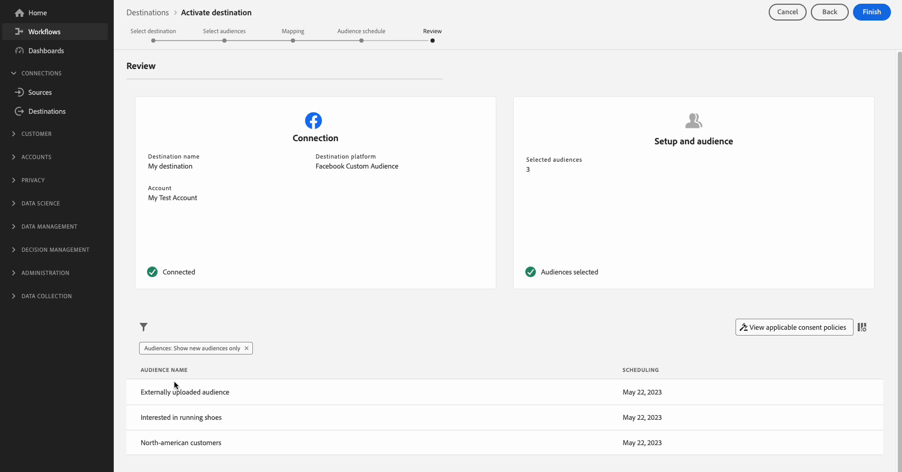

# Attivare i tipi di pubblico nelle destinazioni di streaming

>[!IMPORTANT]
> 
> * Per attivare i tipi di pubblico e abilitare [passaggio di mappatura](#mapping) del flusso di lavoro, è necessario **[!UICONTROL Gestire le destinazioni]**, **[!UICONTROL Attivare le destinazioni]**, **[!UICONTROL Visualizza profili]**, e **[!UICONTROL Visualizzare segmenti]** [autorizzazioni di controllo degli accessi](/help/access-control/home.md#permissions).
> * Per attivare i tipi di pubblico senza passare attraverso [passaggio di mappatura](#mapping) del flusso di lavoro, è necessario **[!UICONTROL Gestire le destinazioni]**, **[!UICONTROL Attiva segmento senza mappatura]**, **[!UICONTROL Visualizza profili]**, e **[!UICONTROL Visualizzare segmenti]** [autorizzazioni di controllo degli accessi](/help/access-control/home.md#permissions).
> 
> Leggi le [panoramica sul controllo degli accessi](/help/access-control/ui/overview.md) oppure contatta l’amministratore del prodotto per ottenere le autorizzazioni necessarie.

## Panoramica {#overview}

Questo articolo spiega il flusso di lavoro necessario per attivare i tipi di pubblico nelle destinazioni di streaming di Adobe Experience Platform.

## Prerequisiti {#prerequisites}

Per attivare i tipi di pubblico nelle destinazioni, è necessario aver completato [connesso a una destinazione](./connect-destination.md). Se non lo hai già fatto, accedi al [catalogo delle destinazioni](../catalog/overview.md), sfoglia le destinazioni supportate e configura la destinazione che desideri utilizzare.

## Seleziona la destinazione {#select-destination}

1. Vai a **[!UICONTROL Connessioni > Destinazioni]**, e seleziona la **[!UICONTROL Catalogo]** scheda.

   

1. Seleziona **[!UICONTROL Attiva tipi di pubblico]** sulla scheda corrispondente alla destinazione in cui desideri attivare i tipi di pubblico, come illustrato nell’immagine seguente.

   

1. Seleziona la connessione di destinazione da utilizzare per attivare i tipi di pubblico, quindi fai clic su **[!UICONTROL Successivo]**.

   

1. Passa alla sezione successiva a [seleziona i tipi di pubblico](#select-audiences).

## Seleziona i tipi di pubblico {#select-audiences}

Per selezionare i tipi di pubblico da attivare nella destinazione, utilizza le caselle di controllo a sinistra dei nomi dei tipi di pubblico, quindi seleziona **[!UICONTROL Successivo]**.

Puoi scegliere tra più tipi di pubblico, a seconda della loro origine:

* **[!UICONTROL Servizio di segmentazione]**: tipi di pubblico generati all’interno di Experience Platform dal servizio di segmentazione. Consulta la [documentazione sulla segmentazione](../../segmentation/ui/overview.md) per ulteriori dettagli.
* **[!UICONTROL Caricamento personalizzato]**: tipi di pubblico generati al di fuori di Experience Platform e caricati in Platform come file CSV. Per ulteriori informazioni sui tipi di pubblico esterni, consulta la documentazione su [importazione di un pubblico](../../segmentation/ui/overview.md#import-audience).
* Altri tipi di pubblico, derivanti da altre soluzioni di Adobe, quali [!DNL Audience Manager].

## Mappare attributi e identità {#mapping}

>[!IMPORTANT]
>
>Questo passaggio si applica solo ad alcune destinazioni di streaming del pubblico. Se nella destinazione non è presente un **[!UICONTROL Mappatura]** passaggio, vai a [pianificazione del pubblico](#scheduling).

Alcune destinazioni di streaming del pubblico richiedono la selezione di attributi di origine o spazi dei nomi di identità da mappare come identità di destinazione nella destinazione.

1. In **[!UICONTROL Mappatura]** pagina, seleziona **[!UICONTROL Aggiungi nuova mappatura]**.

   

1. Selezionare la freccia a destra della **[!UICONTROL Campo di origine]** voce.

   

1. In **[!UICONTROL Seleziona campo di origine]** , utilizza la **[!UICONTROL Seleziona attributi]** o **[!UICONTROL Seleziona lo spazio dei nomi dell’identità]** opzioni per passare tra le due categorie di campi sorgente disponibili. Dal menu [!DNL XDM] attributi del profilo e spazi dei nomi di identità, seleziona quelli che desideri mappare sulla destinazione, quindi scegli **[!UICONTROL Seleziona]**.

   

1. Seleziona il pulsante a destra del **[!UICONTROL Campo di destinazione]** voce.

   

1. In **[!UICONTROL Seleziona campo di destinazione]** , selezionare lo spazio dei nomi dell&#39;identità di destinazione a cui si desidera mappare il campo di origine e scegliere **[!UICONTROL Seleziona]**.

   

1. Per aggiungere altre mappature, ripetere i passaggi da 1 a 5.

### Applicar trasformazione {#apply-transformation}

>[!CONTEXTUALHELP]
>id="platform_destinations_activate_applytransformation"
>title="Applicar trasformazione"
>abstract="Seleziona questa opzione quando utilizzi campi di origine senza hash per fare in modo che Adobe Experience Platform ne esegua automaticamente l’hashing all’attivazione."

Quando mappi gli attributi di origine senza hash agli attributi di destinazione per i quali la destinazione prevede l&#39;hashing (ad esempio: `email_lc_sha256` o `phone_sha256`), controlla **Applica trasformazione** opzione per fare in modo che Adobe Experience Platform esegua automaticamente l’hash degli attributi sorgente all’attivazione.

## Pianificare l’esportazione del pubblico {#scheduling}

>[!CONTEXTUALHELP]
>id="platform_destinations_activate_enddate"
>title="End date (Data di fine)"
>abstract="L’aggiunta di una data di fine per la pianificazione del pubblico non è disponibile."

Per impostazione predefinita, il **[!UICONTROL Pianificazione del pubblico]** Questa pagina mostra solo i tipi di pubblico appena selezionati che hai scelto nel flusso di attivazione corrente.

Per visualizzare tutti i tipi di pubblico attivati nella destinazione, utilizza l’opzione di filtro e disattiva il **[!UICONTROL Mostra solo i nuovi tipi di pubblico]** filtro.

1. Il giorno **[!UICONTROL Pianificazione del pubblico]** , seleziona ogni pubblico, quindi utilizza la **[!UICONTROL Data di inizio]** e **[!UICONTROL Data di fine]** selettori per configurare l’intervallo di tempo per l’invio di dati alla destinazione.

   

   * Alcune destinazioni richiedono la selezione di **[!UICONTROL Origine del pubblico]** per ogni pubblico, utilizzando il menu a discesa sotto i selettori del calendario. Se la destinazione non include questo selettore, salta questo passaggio.

     

   * Alcune destinazioni richiedono la mappatura manuale [!DNL Platform] pubblico alla controparte nella destinazione target. A questo scopo, seleziona ogni pubblico, quindi inserisci l’ID del pubblico corrispondente dalla piattaforma di destinazione in **[!UICONTROL ID mappatura]** campo. Se la destinazione non include questo campo, salta questo passaggio.

     

   * Alcune destinazioni richiedono l’immissione di un **[!UICONTROL ID app]** durante l&#39;attivazione [!DNL IDFA] o [!DNL GAID] pubblico. Se la destinazione non include questo campo, salta questo passaggio.

     

1. Seleziona **[!UICONTROL Successivo]** per passare al [!UICONTROL Revisione] pagina.

## Revisione {#review}

Il giorno **[!UICONTROL Revisione]** pagina, è possibile visualizzare un riepilogo della selezione. Seleziona **[!UICONTROL Annulla]** per interrompere il flusso, **[!UICONTROL Indietro]** per modificare le impostazioni, oppure **[!UICONTROL Fine]** per confermare la selezione e iniziare a inviare dati alla destinazione.

### Valutazione dei criteri di consenso {#consent-policy-evaluation}

Se l’organizzazione ha acquistato **Adobe Healthcare Shield** o **Adobe Privacy &amp; Security Shield**, seleziona **[!UICONTROL Visualizza i criteri di consenso applicabili]** per vedere quali criteri di consenso vengono applicati e quanti profili vengono inclusi di conseguenza nell’attivazione. Ulteriori informazioni [valutazione dei criteri di consenso](/help/data-governance/enforcement/auto-enforcement.md#consent-policy-evaluation) per ulteriori informazioni.

### Controlli dei criteri di utilizzo dei dati {#data-usage-policy-checks}

In **[!UICONTROL Revisione]** step, Experience Platform controlla anche eventuali violazioni dei criteri di utilizzo dei dati. Di seguito è riportato un esempio di violazione di una policy. Non puoi completare il flusso di lavoro di attivazione del pubblico finché non hai risolto la violazione. Per informazioni su come risolvere le violazioni dei criteri, vedere [violazioni dei criteri di utilizzo dei dati](/help/data-governance/enforcement/auto-enforcement.md#data-usage-violation) nella sezione documentazione sulla governance dei dati.

### Filtrare i tipi di pubblico {#filter-audiences}

Inoltre, in questo passaggio puoi utilizzare i filtri disponibili nella pagina per visualizzare solo i tipi di pubblico la cui pianificazione o mappatura è stata aggiornata come parte di questo flusso di lavoro. Puoi anche scegliere quali colonne della tabella visualizzare.

Se si è soddisfatti della selezione e non sono state rilevate violazioni dei criteri, selezionare **[!UICONTROL Fine]** per confermare la selezione e iniziare a inviare dati alla destinazione.

## Verificare l’attivazione del pubblico {#verify}

Controlla la [documentazione di monitoraggio della destinazione](../../dataflows/ui/monitor-destinations.md) per informazioni dettagliate su come monitorare il flusso di dati verso le destinazioni.

<!-- 
For [!DNL Facebook Custom Audience], a successful activation means that a [!DNL Facebook] custom audience would be created programmatically in [[!UICONTROL Facebook Ads Manager]](https://www.facebook.com/adsmanager/manage/). Audience membership in the audience would be added and removed as users are qualified or disqualified for the activated audiences.

>[!TIP]
>
>The integration between Adobe Experience Platform and [!DNL Facebook] supports historical audience backfills. All historical audience qualifications are sent to [!DNL Facebook] when you activate the audiences to the destination.
-->
