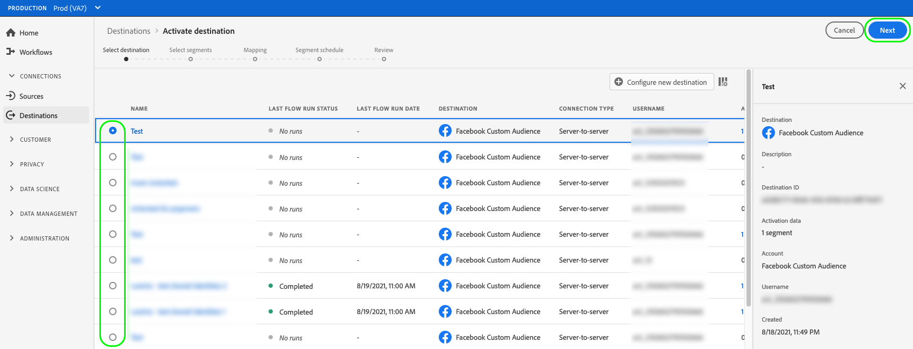
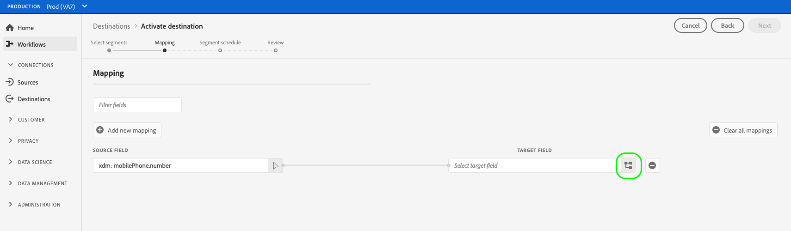

# Attivare i dati del pubblico nelle destinazioni di esportazione dei segmenti in streaming

>[!IMPORTANT]
> 
>Per attivare i dati, è necessario **[!UICONTROL Gestire le destinazioni]**, **[!UICONTROL Attivare le destinazioni]**, **[!UICONTROL Visualizza profili]** e **[!UICONTROL Visualizzare i segmenti]** [autorizzazioni di controllo accessi](/help/access-control/home.md#permissions). Leggi la sezione [panoramica sul controllo degli accessi](/help/access-control/ui/overview.md) oppure contatta l’amministratore del prodotto per ottenere le autorizzazioni richieste.

## Panoramica {#overview}

Questo articolo spiega il flusso di lavoro necessario per attivare i dati del pubblico nelle destinazioni di streaming dei segmenti di Adobe Experience Platform.

## Prerequisiti {#prerequisites}

Per attivare i dati nelle destinazioni, è necessario aver completato l&#39;operazione [connesso a una destinazione](./connect-destination.md). Se non lo hai già fatto, vai alla [catalogo delle destinazioni](../catalog/overview.md), sfoglia le destinazioni supportate e configura la destinazione che desideri utilizzare.

## Seleziona la destinazione {#select-destination}

1. Vai a **[!UICONTROL Connessioni > Destinazioni]**, quindi seleziona la **[!UICONTROL Catalogo]** scheda .

   

1. Seleziona **[!UICONTROL Attivare i segmenti]** sulla scheda corrispondente alla destinazione in cui desideri attivare i segmenti, come illustrato di seguito.

   

1. Seleziona la connessione di destinazione che desideri utilizzare per attivare i segmenti, quindi seleziona **[!UICONTROL Successivo]**.

   

1. Passa alla sezione successiva in [seleziona i segmenti](#select-segments).

## Selezionare i segmenti {#select-segments}

Utilizza le caselle di controllo a sinistra dei nomi dei segmenti per selezionare i segmenti che desideri attivare nella destinazione, quindi seleziona **[!UICONTROL Successivo]**.

## Mappare attributi e identità {#mapping}

>[!IMPORTANT]
>
>Questo passaggio si applica solo ad alcune destinazioni di streaming di segmenti. Se la destinazione non ha un **[!UICONTROL Mappatura]** passaggio, passa a [Esportazione di segmenti programmata](#scheduling).

Alcune destinazioni di streaming di segmenti richiedono di selezionare gli attributi di origine o i namespace di identità da mappare come identità di destinazione nella destinazione.

1. In **[!UICONTROL Mappatura]** pagina, seleziona **[!UICONTROL Aggiungi nuova mappatura]**.

   

1. Seleziona la freccia a destra del **[!UICONTROL Campo di origine]** voce.

   

1. In **[!UICONTROL Selezionare il campo di origine]** , utilizza **[!UICONTROL Seleziona attributi]** o **[!UICONTROL Seleziona spazio dei nomi identità]** opzioni per passare tra le due categorie di campi di origine disponibili. Da disponibile [!DNL XDM] attributi di profilo e namespace di identità, seleziona quelli da mappare alla destinazione, quindi scegli **[!UICONTROL Seleziona]**.

   

1. Seleziona il pulsante a destra del **[!UICONTROL Campo di destinazione]** voce.

   

1. In **[!UICONTROL Selezionare il campo di destinazione]** selezionare lo spazio dei nomi dell’identità di destinazione in cui si desidera mappare il campo di origine e scegliere **[!UICONTROL Seleziona]**.

   

1. Per aggiungere altre mappature, ripeti i passaggi da 1 a 5.

### Applica trasformazione {#apply-transformation}

>[!CONTEXTUALHELP]
>id="platform_destinations_activate_applytransformation"
>title="Applica trasformazione"
>abstract="Seleziona questa opzione quando utilizzi campi sorgente con hash non crittografati per fare in modo che Adobe Experience Platform li hash automaticamente all’attivazione."
>additional-url="https://experienceleague.adobe.com/docs/experience-platform/destinations/ui/activate/activate-segment-streaming-destinations.html#apply-transformation" text="Ulteriori informazioni nella documentazione"

Quando mappi attributi di origine con hash non crittografati su attributi di destinazione per cui si prevede di eseguire l’hashing della destinazione (ad esempio: `email_lc_sha256` o `phone_sha256`), controlla il **Applica trasformazione** per fare in modo che Adobe Experience Platform esegua automaticamente l’hash degli attributi di origine all’attivazione.

## Esportazione di segmenti programmata {#scheduling}

>[!CONTEXTUALHELP]
>id="platform_destinations_activate_enddate"
>title="End date (Data di fine)"
>abstract="L’aggiunta di una data di fine per la pianificazione dei segmenti non è disponibile."
>additional-url="https://www.adobe.com/go/destinations-activate-segment-scheduling-en" text="Ulteriori informazioni nella documentazione"

Per impostazione predefinita, la [!UICONTROL Pianificazione del segmento] mostra solo i segmenti appena selezionati selezionati selezionati nel flusso di attivazione corrente.

Per visualizzare tutti i segmenti che vengono attivati nella destinazione, utilizza l’opzione di filtro e disattiva il **[!UICONTROL Mostra solo nuovi segmenti]** filtro.

1. Sulla **[!UICONTROL Pianificazione del segmento]** , seleziona ogni segmento, quindi utilizza la **[!UICONTROL Data di inizio]** e **[!UICONTROL Data di fine]** selettori per configurare l’intervallo di tempo per l’invio di dati alla destinazione.

   

   * Alcune destinazioni richiedono la selezione del **[!UICONTROL Origine del pubblico]** per ogni segmento, utilizzando il menu a discesa sotto i selettori del calendario. Se la destinazione non include questo selettore, salta questo passaggio.

      

   * Alcune destinazioni richiedono la mappatura manuale [!DNL Platform] segmenti alla loro controparte nella destinazione di destinazione. A questo scopo, seleziona ogni segmento, quindi inserisci l’ID del segmento corrispondente dalla piattaforma di destinazione nel **[!UICONTROL ID mappatura]** campo . Se la destinazione non include questo campo, salta questo passaggio.

      

   * Alcune destinazioni richiedono l’immissione di un **[!UICONTROL ID app]** quando si attiva [!DNL IDFA] o [!DNL GAID] segmenti. Se la destinazione non include questo campo, salta questo passaggio.

      

1. Seleziona **[!UICONTROL Successivo]** per passare al [!UICONTROL Revisione] pagina.

## Revisione {#review}

Sulla **[!UICONTROL Revisione]** per visualizzare un riepilogo della selezione. Seleziona **[!UICONTROL Annulla]** per interrompere il flusso, **[!UICONTROL Indietro]** per modificare le impostazioni, oppure **[!UICONTROL Fine]** per confermare la selezione e iniziare a inviare dati alla destinazione.

>[!IMPORTANT]
>
>In questo passaggio, Adobe Experience Platform verifica la presenza di violazioni dei criteri di utilizzo dei dati. Di seguito è riportato un esempio di violazione di un criterio. Non puoi completare il flusso di lavoro di attivazione dei segmenti finché non avrai risolto la violazione. Per informazioni su come risolvere le violazioni dei criteri, vedi [Applicazione delle politiche](../../rtcdp/privacy/data-governance-overview.md#enforcement) nella sezione documentazione sulla governance dei dati .

Se non sono state rilevate violazioni dei criteri, seleziona **[!UICONTROL Fine]** per confermare la selezione e iniziare a inviare dati alla destinazione.

## Verificare l’attivazione dei segmenti {#verify}

Controlla la [documentazione sul monitoraggio della destinazione](../../dataflows/ui/monitor-destinations.md) per informazioni dettagliate su come monitorare il flusso di dati verso le destinazioni.

<!-- 
For [!DNL Facebook Custom Audience], a successful activation means that a [!DNL Facebook] custom audience would be created programmatically in [[!UICONTROL Facebook Ads Manager]](https://www.facebook.com/adsmanager/manage/). Segment membership in the audience would be added and removed as users are qualified or disqualified for the activated segments.

>[!TIP]
>
>The integration between Adobe Experience Platform and [!DNL Facebook] supports historical audience backfills. All historical segment qualifications are sent to [!DNL Facebook] when you activate the segments to the destination.
-->
