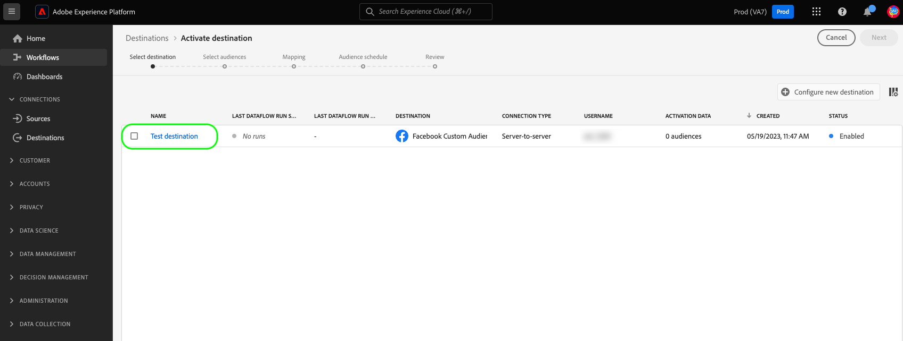
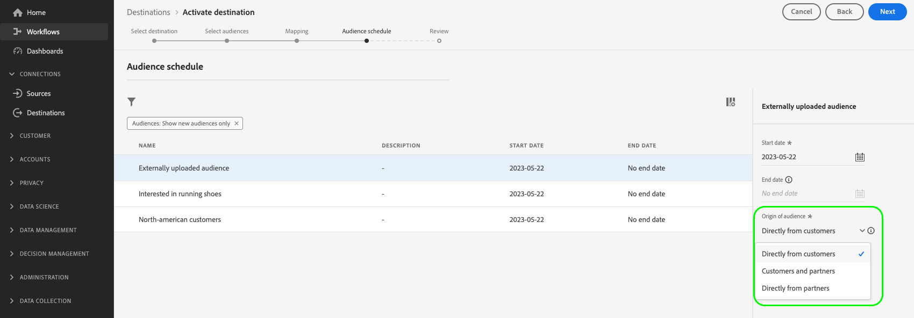

# Attiva i dati del pubblico nelle destinazioni di esportazione di segmenti di streaming

>[!IMPORTANT]
> 
>Per attivare i dati, è necessario **[!UICONTROL Gestire le destinazioni]**, **[!UICONTROL Attivare le destinazioni]**, **[!UICONTROL Visualizza profili]**, e **[!UICONTROL Visualizzare segmenti]** [autorizzazioni di controllo degli accessi](/help/access-control/home.md#permissions). Leggi le [panoramica sul controllo degli accessi](/help/access-control/ui/overview.md) oppure contatta l’amministratore del prodotto per ottenere le autorizzazioni necessarie.

## Panoramica {#overview}

Questo articolo spiega il flusso di lavoro necessario per attivare i dati sul pubblico nelle destinazioni di streaming dei segmenti di Adobe Experience Platform.

## Prerequisiti {#prerequisites}

Per attivare i dati nelle destinazioni, è necessario aver completato [connesso a una destinazione](./connect-destination.md). Se non lo hai già fatto, accedi al [catalogo delle destinazioni](../catalog/overview.md), sfoglia le destinazioni supportate e configura la destinazione che desideri utilizzare.

## Seleziona la destinazione {#select-destination}

1. Vai a **[!UICONTROL Connessioni > Destinazioni]**, e seleziona la **[!UICONTROL Catalogo]** scheda.

   

1. Seleziona **[!UICONTROL Attivare segmenti]** sulla scheda corrispondente alla destinazione in cui desideri attivare i segmenti, come illustrato nell’immagine seguente.

   

1. Seleziona la connessione di destinazione da utilizzare per attivare i segmenti, quindi fai clic su **[!UICONTROL Successivo]**.

   

1. Passa alla sezione successiva a [seleziona i segmenti](#select-segments).

## Seleziona i segmenti {#select-segments}

Utilizza le caselle di controllo a sinistra dei nomi dei segmenti per selezionare i segmenti da attivare nella destinazione, quindi seleziona **[!UICONTROL Successivo]**.

## Mappare attributi e identità {#mapping}

>[!IMPORTANT]
>
>Questo passaggio si applica solo ad alcune destinazioni di streaming dei segmenti. Se nella destinazione non è presente un **[!UICONTROL Mappatura]** passaggio, vai a [Pianificare l’esportazione di segmenti](#scheduling).

Alcune destinazioni di streaming dei segmenti richiedono la selezione di attributi di origine o spazi dei nomi di identità da mappare come identità di destinazione nella destinazione.

1. In **[!UICONTROL Mappatura]** pagina, seleziona **[!UICONTROL Aggiungi nuova mappatura]**.

   

1. Selezionare la freccia a destra della **[!UICONTROL Campo di origine]** voce.

   

1. In **[!UICONTROL Seleziona campo di origine]** , utilizza la **[!UICONTROL Seleziona attributi]** o **[!UICONTROL Seleziona lo spazio dei nomi dell’identità]** opzioni per passare tra le due categorie di campi sorgente disponibili. Dal menu [!DNL XDM] attributi del profilo e spazi dei nomi di identità, seleziona quelli che desideri mappare sulla destinazione, quindi scegli **[!UICONTROL Seleziona]**.

   

1. Seleziona il pulsante a destra del **[!UICONTROL Campo di destinazione]** voce.

   

1. In **[!UICONTROL Seleziona campo di destinazione]** , selezionare lo spazio dei nomi dell&#39;identità di destinazione a cui si desidera mappare il campo di origine e scegliere **[!UICONTROL Seleziona]**.

   

1. Per aggiungere altre mappature, ripetere i passaggi da 1 a 5.

### Applica trasformazione {#apply-transformation}

>[!CONTEXTUALHELP]
>id="platform_destinations_activate_applytransformation"
>title="Applica trasformazione"
>abstract="Seleziona questa opzione quando utilizzi campi sorgente senza hash, per fare in modo che Adobe Experience Platform li inserisca automaticamente nell&#39;hashing al momento dell&#39;attivazione."

Quando mappi gli attributi di origine senza hash agli attributi di destinazione per i quali la destinazione prevede l&#39;hashing (ad esempio: `email_lc_sha256` o `phone_sha256`), controlla **Applica trasformazione** opzione per fare in modo che Adobe Experience Platform esegua automaticamente l’hash degli attributi sorgente all’attivazione.

## Pianificare l’esportazione di segmenti {#scheduling}

>[!CONTEXTUALHELP]
>id="platform_destinations_activate_enddate"
>title="End date (Data di fine)"
>abstract="L’aggiunta di una data di fine per la pianificazione dei segmenti non è disponibile."

Per impostazione predefinita, il [!UICONTROL Pianificazione del segmento] mostra solo i segmenti appena selezionati scelti nel flusso di attivazione corrente.

Per visualizzare tutti i segmenti attivati nella destinazione, utilizza l’opzione di filtro e disattiva il **[!UICONTROL Mostra solo i nuovi segmenti]** filtro.

1. Il giorno **[!UICONTROL Pianificazione del segmento]** , seleziona ogni segmento, quindi utilizza la **[!UICONTROL Data di inizio]** e **[!UICONTROL Data di fine]** selettori per configurare l’intervallo di tempo per l’invio di dati alla destinazione.

   

   * Alcune destinazioni richiedono la selezione di **[!UICONTROL Origine del pubblico]** per ogni segmento, utilizzando il menu a discesa sotto i selettori del calendario. Se la destinazione non include questo selettore, salta questo passaggio.

      

   * Alcune destinazioni richiedono la mappatura manuale [!DNL Platform] segmenti alla loro controparte nella destinazione target. A questo scopo, seleziona ogni segmento, quindi inserisci l’ID del segmento corrispondente dalla piattaforma di destinazione in **[!UICONTROL ID mappatura]** campo. Se la destinazione non include questo campo, salta questo passaggio.

      

   * Alcune destinazioni richiedono l’immissione di un **[!UICONTROL ID app]** durante l&#39;attivazione [!DNL IDFA] o [!DNL GAID] segmenti. Se la destinazione non include questo campo, salta questo passaggio.

      

1. Seleziona **[!UICONTROL Successivo]** per passare al [!UICONTROL Revisione] pagina.

## Revisione {#review}

Il giorno **[!UICONTROL Revisione]** pagina, è possibile visualizzare un riepilogo della selezione. Seleziona **[!UICONTROL Annulla]** per interrompere il flusso, **[!UICONTROL Indietro]** per modificare le impostazioni, oppure **[!UICONTROL Fine]** per confermare la selezione e iniziare a inviare dati alla destinazione.

### Valutazione dei criteri di consenso {#consent-policy-evaluation}

Se la tua organizzazione ha acquistato **Schermo sanitario Adobe** o **Adobe Privacy &amp; Security Shield**, seleziona **[!UICONTROL Visualizza i criteri di consenso applicabili]** per vedere quali criteri di consenso vengono applicati e quanti profili sono inclusi nell’attivazione in seguito a tali criteri. Ulteriori informazioni [valutazione dei criteri di consenso](/help/data-governance/enforcement/auto-enforcement.md#consent-policy-evaluation) per ulteriori informazioni.

### Controlli dei criteri di utilizzo dei dati {#data-usage-policy-checks}

In **[!UICONTROL Revisione]** step, Experience Platform controlla anche eventuali violazioni dei criteri di utilizzo dei dati. Di seguito è riportato un esempio di violazione di una policy. Non puoi completare il flusso di lavoro di attivazione dei segmenti finché non risolvi la violazione. Per informazioni su come risolvere le violazioni dei criteri, vedere [violazioni dei criteri di utilizzo dei dati](/help/data-governance/enforcement/auto-enforcement.md#data-usage-violation) nella sezione documentazione sulla governance dei dati.

### Filtrare segmenti {#filter-segments}

Inoltre, in questo passaggio puoi utilizzare i filtri disponibili nella pagina per visualizzare solo i segmenti la cui pianificazione o mappatura è stata aggiornata come parte di questo flusso di lavoro. Puoi anche scegliere quali colonne della tabella visualizzare.

Se si è soddisfatti della selezione e non sono state rilevate violazioni dei criteri, selezionare **[!UICONTROL Fine]** per confermare la selezione e iniziare a inviare dati alla destinazione.

## Verifica attivazione segmento {#verify}

Controlla la [documentazione di monitoraggio della destinazione](../../dataflows/ui/monitor-destinations.md) per informazioni dettagliate su come monitorare il flusso di dati verso le destinazioni.

<!-- 
For [!DNL Facebook Custom Audience], a successful activation means that a [!DNL Facebook] custom audience would be created programmatically in [[!UICONTROL Facebook Ads Manager]](https://www.facebook.com/adsmanager/manage/). Segment membership in the audience would be added and removed as users are qualified or disqualified for the activated segments.

>[!TIP]
>
>The integration between Adobe Experience Platform and [!DNL Facebook] supports historical audience backfills. All historical segment qualifications are sent to [!DNL Facebook] when you activate the segments to the destination.
-->
