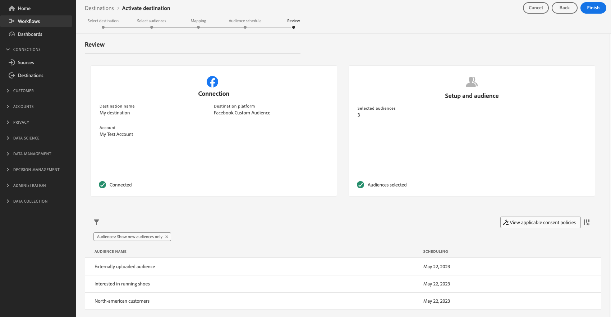

# Attivare i tipi di pubblico nelle destinazioni di streaming

>[!IMPORTANT]
> 
> * Per attivare i tipi di pubblico e abilitare il [passaggio di mappatura](#mapping) del flusso di lavoro, sono necessari **[!UICONTROL Visualizza destinazioni]**, **[!UICONTROL Attiva destinazioni]**, **[!UICONTROL Visualizza profili]** e **[!UICONTROL Visualizza segmenti]** [Autorizzazioni di controllo di accesso](/help/access-control/home.md#permissions).
> * Per attivare i tipi di pubblico senza passare attraverso il [passaggio di mappatura](#mapping) del flusso di lavoro, è necessario **[!UICONTROL Visualizza destinazioni]**, **[!UICONTROL Attiva segmento senza mappatura]**, **[!UICONTROL Visualizza profili]** e **[!UICONTROL Visualizza segmenti]** [Autorizzazioni di controllo di accesso](/help/access-control/home.md#permissions).
>* Per esportare *identità*, è necessario disporre dell&#39;autorizzazione **[!UICONTROL Visualizza grafo identità]** [Controllo di accesso](/help/access-control/home.md#permissions).   {width="100" zoomable="yes"}
> 
> Leggi la [panoramica sul controllo degli accessi](/help/access-control/ui/overview.md) o contatta l&#39;amministratore del prodotto per ottenere le autorizzazioni necessarie.

## Panoramica {#overview}

Questo articolo spiega il flusso di lavoro necessario per attivare i tipi di pubblico nelle destinazioni di streaming di Adobe Experience Platform.

## Prerequisiti {#prerequisites}

Per attivare i tipi di pubblico nelle destinazioni, devi avere [connesso correttamente a una destinazione](./connect-destination.md). Se non lo hai già fatto, vai al [catalogo delle destinazioni](../catalog/overview.md), sfoglia le destinazioni supportate e configura la destinazione che desideri utilizzare.

## Seleziona la destinazione {#select-destination}

1. Vai a **[!UICONTROL Connessioni > Destinazioni]** e seleziona la scheda **[!UICONTROL Catalogo]**.

   

1. Seleziona **[!UICONTROL Attiva pubblico]** nella scheda corrispondente alla destinazione in cui desideri attivare il pubblico, come illustrato nell&#39;immagine seguente.

   

1. Seleziona la connessione di destinazione da utilizzare per attivare i tipi di pubblico, quindi seleziona **[!UICONTROL Successivo]**.

   

1. Passa alla sezione successiva per [selezionare il pubblico](#select-audiences).

## Seleziona i tipi di pubblico {#select-audiences}

Per selezionare i tipi di pubblico che si desidera attivare nella destinazione, utilizzare le caselle di controllo a sinistra dei nomi dei tipi di pubblico, quindi selezionare **[!UICONTROL Avanti]**.

Puoi scegliere tra più tipi di pubblico, a seconda della loro origine:

* **[!UICONTROL Servizio di segmentazione]**: tipi di pubblico generati in Experience Platform dal servizio di segmentazione. Per ulteriori dettagli, consulta la [documentazione sulla segmentazione](../../segmentation/ui/overview.md).
* **[!UICONTROL Caricamento personalizzato]**: pubblico generato al di fuori di Experience Platform e caricato in Platform come file CSV. Per ulteriori informazioni sui tipi di pubblico esterni, consulta la documentazione su [importazione di un pubblico](../../segmentation/ui/audience-portal.md#import-audience).
* Altri tipi di pubblico, provenienti da altre soluzioni Adobe, ad esempio [!DNL Audience Manager].

## Mappare attributi e identità {#mapping}

>[!IMPORTANT]
>
>Questo passaggio si applica solo ad alcune destinazioni di streaming del pubblico. Se la destinazione non dispone di un passaggio **[!UICONTROL Mapping]**, passa alla [pianificazione del pubblico](#scheduling).
>
>Quando si attivano tipi di pubblico su destinazioni di streaming, è necessario mappare anche *almeno uno spazio dei nomi delle identità di destinazione*, oltre agli attributi del profilo di destinazione. In caso contrario, i tipi di pubblico non verranno attivati nella piattaforma di destinazione.
>  {zoomable="yes"}

Alcune destinazioni di streaming del pubblico richiedono la selezione di attributi di origine o spazi dei nomi di identità da mappare come identità di destinazione nella destinazione.

1. Nella pagina **[!UICONTROL Mapping]**, seleziona **[!UICONTROL Aggiungi nuovo mapping]**.

   

1. Selezionare la freccia a destra della voce **[!UICONTROL Campo Source]**.

   

1. Nella pagina **[!UICONTROL Seleziona campo di origine]**, utilizza le opzioni **[!UICONTROL Seleziona attributi]** o **[!UICONTROL Seleziona spazio dei nomi identità]** per passare tra le due categorie di campi di origine disponibili. Dagli attributi di profilo [!DNL XDM] e dagli spazi dei nomi di identità disponibili, seleziona quelli che desideri mappare alla destinazione, quindi scegli **[!UICONTROL Seleziona]**.

   Utilizza l&#39;opzione **[!UICONTROL Mostra solo campi con dati]** per visualizzare solo i campi schema compilati con valori. Per impostazione predefinita, vengono visualizzati solo i campi schema compilati.

   

1. Selezionare il pulsante a destra della voce **[!UICONTROL Campo di destinazione]**.

   

1. Nella pagina **[!UICONTROL Seleziona campo di destinazione]**, seleziona lo spazio dei nomi dell&#39;identità di destinazione a cui vuoi mappare il campo di origine e scegli **[!UICONTROL Seleziona]**.

   

1. Per aggiungere altre mappature, ripetere i passaggi da 1 a 5.

### Applicar trasformazione {#apply-transformation}

>[!CONTEXTUALHELP]
>id="platform_destinations_activate_applytransformation"
>title="Applicar trasformazione"
>abstract="Seleziona questa opzione quando utilizzi campi di origine senza hash per fare in modo che Adobe Experience Platform ne esegua automaticamente l’hashing all’attivazione."

Quando si esegue il mapping degli attributi di origine senza hash agli attributi di destinazione per i quali la destinazione prevede l&#39;hash (ad esempio: `email_lc_sha256` o `phone_sha256`), selezionare l&#39;opzione **Applica trasformazione** per fare in modo che Adobe Experience Platform esegua automaticamente l&#39;hash degli attributi di origine all&#39;attivazione.

## Pianificare l’esportazione del pubblico {#scheduling}

>[!CONTEXTUALHELP]
>id="platform_destinations_activate_enddate"
>title="End date (Data di fine)"
>abstract="L’aggiunta di una data di fine per la pianificazione dei tipi di pubblico non è disponibile."

Per impostazione predefinita, nella pagina **[!UICONTROL Pianificazione pubblico]** sono visualizzati solo i nuovi tipi di pubblico selezionati nel flusso di attivazione corrente.

Per visualizzare tutti i tipi di pubblico attivati nella destinazione, utilizza l&#39;opzione di filtro e disabilita il filtro **[!UICONTROL Mostra solo nuovi tipi di pubblico]**.

1. Nella pagina **[!UICONTROL Pianificazione pubblico]**, seleziona ogni pubblico, quindi utilizza i selettori **[!UICONTROL Data inizio]** e **[!UICONTROL Data fine]** per configurare l&#39;intervallo di tempo per l&#39;invio dei dati alla destinazione.

   

   * Per alcune destinazioni è necessario selezionare l&#39;**[!UICONTROL Origine del pubblico]** per ogni pubblico, utilizzando il menu a discesa sotto i selettori del calendario. Se la destinazione non include questo selettore, salta questo passaggio.

     

   * Alcune destinazioni richiedono di mappare manualmente [!DNL Platform] tipi di pubblico alla controparte nella destinazione di destinazione. A questo scopo, seleziona ogni pubblico, quindi immetti l&#39;ID pubblico corrispondente dalla piattaforma di destinazione nel campo **[!UICONTROL ID mappatura]**. Se la destinazione non include questo campo, salta questo passaggio.

     

   * Per alcune destinazioni è necessario immettere un **[!UICONTROL ID app]** quando si attivano [!DNL IDFA] o [!DNL GAID] tipi di pubblico. Se la destinazione non include questo campo, salta questo passaggio.

     

1. Seleziona **[!UICONTROL Avanti]** per passare alla pagina [!UICONTROL Rivedi].

## Controlla {#review}

Nella pagina **[!UICONTROL Rivedi]** puoi visualizzare un riepilogo della selezione. Seleziona **[!UICONTROL Annulla]** per interrompere il flusso, **[!UICONTROL Indietro]** per modificare le impostazioni oppure **[!UICONTROL Fine]** per confermare la selezione e iniziare a inviare dati alla destinazione.

### Valutazione dei criteri di consenso {#consent-policy-evaluation}

Se l’organizzazione ha acquistato **Adobe Healthcare Shield** o **Adobe Privacy &amp; Security Shield**, seleziona **[!UICONTROL Visualizza i criteri di consenso applicabili]** per vedere quali criteri di consenso vengono applicati e quanti profili vengono inclusi di conseguenza nell’attivazione. Leggi informazioni sulla [valutazione dei criteri di consenso](/help/data-governance/enforcement/auto-enforcement.md#consent-policy-evaluation) per ulteriori informazioni.

### Controlli dei criteri di utilizzo dei dati {#data-usage-policy-checks}

Nel passaggio **[!UICONTROL Rivedi]**, Experience Platform controlla anche eventuali violazioni dei criteri di utilizzo dei dati. Di seguito è riportato un esempio di violazione di una policy. Non puoi completare il flusso di lavoro di attivazione del pubblico finché non hai risolto la violazione. Per informazioni su come risolvere le violazioni dei criteri, leggere le [violazioni dei criteri di utilizzo dei dati](/help/data-governance/enforcement/auto-enforcement.md#data-usage-violation) nella sezione relativa alla governance dei dati.

### Filtrare i tipi di pubblico {#filter-audiences}

Inoltre, in questo passaggio puoi utilizzare i filtri disponibili nella pagina per visualizzare solo i tipi di pubblico la cui pianificazione o mappatura è stata aggiornata come parte di questo flusso di lavoro. Puoi anche scegliere quali colonne della tabella visualizzare.

Se si è soddisfatti della selezione e non sono state rilevate violazioni dei criteri, selezionare **[!UICONTROL Fine]** per confermare la selezione e iniziare a inviare dati alla destinazione.

## Verificare l’attivazione del pubblico {#verify}

Per informazioni dettagliate su come monitorare il flusso di dati verso le destinazioni, consulta la [documentazione sul monitoraggio della destinazione](../../dataflows/ui/monitor-destinations.md).

<!-- 
For [!DNL Facebook Custom Audience], a successful activation means that a [!DNL Facebook] custom audience would be created programmatically in [[!UICONTROL Facebook Ads Manager]](https://www.facebook.com/adsmanager/manage/). Audience membership in the audience would be added and removed as users are qualified or disqualified for the activated audiences.

>[!TIP]
>
>The integration between Adobe Experience Platform and [!DNL Facebook] supports historical audience backfills. All historical audience qualifications are sent to [!DNL Facebook] when you activate the audiences to the destination.
-->
