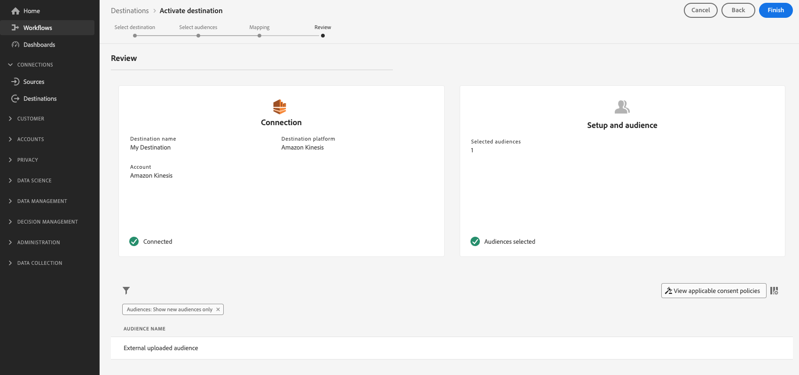

# Attivare i dati del pubblico nelle destinazioni di esportazione del profilo in streaming

## Panoramica {#overview}

Questo articolo spiega il flusso di lavoro necessario per attivare i dati del pubblico nelle destinazioni basate su profili di streaming Adobe Experience Platform, come Amazon Kinesis.

## Prerequisiti {#prerequisites}

Per attivare i dati nelle destinazioni, è necessario che [sia stato collegato correttamente a una destinazione](./connect-destination.md). Se non lo hai già fatto, vai al [catalogo delle destinazioni](../catalog/overview.md), sfoglia le destinazioni supportate e configura la destinazione che desideri utilizzare.

## Seleziona la destinazione {#select-destination}

1. Vai a **[!UICONTROL Connessioni > Destinazioni]** e seleziona la scheda **[!UICONTROL Sfoglia]** .

   

1. Seleziona il pulsante **[!UICONTROL Aggiungi segmenti]** corrispondente alla destinazione in cui desideri attivare i segmenti, come illustrato nell’immagine seguente.

   

1. Passa alla sezione successiva in [seleziona i segmenti](#select-segments).

## Selezionare i segmenti {#select-segments}

Usa le caselle di controllo a sinistra dei nomi dei segmenti per selezionare i segmenti che desideri attivare nella destinazione, quindi seleziona **[!UICONTROL Avanti]**.


## Selezionare gli attributi del profilo {#select-attributes}

Seleziona gli attributi di profilo da inviare alla destinazione.

>[!NOTE]
>
> Adobe Experience Platform precompila la selezione con quattro attributi consigliati e di uso comune dallo schema: `person.name.firstName`, `person.name.lastName`, `personalEmail.address`, `segmentMembership.status`.

Le esportazioni di file variano nei seguenti modi, a seconda che sia selezionato `segmentMembership.status`:
* Se il campo `segmentMembership.status` è selezionato, i file esportati includono i membri **[!UICONTROL Active]** nello snapshot completo iniziale e i membri **[!UICONTROL Active]** e **[!UICONTROL Expired]** nelle esportazioni incrementali successive.
* Se il campo `segmentMembership.status` non è selezionato, i file esportati includono solo i membri **[!UICONTROL Active]** nello snapshot completo iniziale e nelle esportazioni incrementali successive.


1. Nella pagina **[!UICONTROL Seleziona attributi]**, seleziona **[!UICONTROL Aggiungi nuovo campo]**.

   

1. Selezionare la freccia a destra della voce **[!UICONTROL Campo schema]**.

   

1. Nella pagina **[!UICONTROL Seleziona campo]** , seleziona gli attributi XDM che desideri inviare alla destinazione, quindi scegli **[!UICONTROL Seleziona]**.

   


1. Per aggiungere altre mappature, ripeti i passaggi da 1 a 3, quindi seleziona **[!UICONTROL Avanti]**.

## Revisione {#review}

Nella pagina **[!UICONTROL Rivedi]** puoi visualizzare un riepilogo della selezione. Seleziona **[!UICONTROL Annulla]** per interrompere il flusso, **[!UICONTROL Indietro]** per modificare le impostazioni oppure **[!UICONTROL Fine]** per confermare la selezione e iniziare a inviare dati alla destinazione.

>[!IMPORTANT]
>
>In questo passaggio, Adobe Experience Platform verifica la presenza di violazioni dei criteri di utilizzo dei dati. Di seguito è riportato un esempio di violazione di un criterio. Non puoi completare il flusso di lavoro di attivazione dei segmenti finché non avrai risolto la violazione. Per informazioni su come risolvere le violazioni dei criteri, consulta [Applicazione dei criteri](../../rtcdp/privacy/data-governance-overview.md#enforcement) nella sezione relativa alla governance dei dati .


Se non sono state rilevate violazioni dei criteri, selezionare **[!UICONTROL Fine]** per confermare la selezione e iniziare a inviare dati alla destinazione.



## Verificare l’attivazione dei segmenti {#verify}


Per le destinazioni di e-mail marketing e l’archiviazione cloud, Adobe Experience Platform crea un file `.csv` delimitato da tabulazioni nel percorso di archiviazione fornito. Attendi la creazione di un nuovo file nel percorso di archiviazione ogni giorno. Il formato predefinito del file è:
`<destinationName>_segment<segmentID>_<timestamp-yyyymmddhhmmss>.csv`

I file che si riceverebbero in tre giorni consecutivi potrebbero essere così:

```console
Salesforce_Marketing_Cloud_segment12341e18-abcd-49c2-836d-123c88e76c39_20200408061804.csv
Salesforce_Marketing_Cloud_segment12341e18-abcd-49c2-836d-123c88e76c39_20200409052200.csv
Salesforce_Marketing_Cloud_segment12341e18-abcd-49c2-836d-123c88e76c39_20200410061130.csv
```

La presenza di questi file nel percorso di archiviazione è la conferma di un&#39;attivazione riuscita. Per comprendere come sono strutturati i file esportati, è possibile [scaricare un file .csv di esempio](../assets/common/sample_export_file_segment12341e18-abcd-49c2-836d-123c88e76c39_20200408061804.csv). Questo file di esempio include gli attributi del profilo `person.firstname`, `person.lastname`, `person.gender`, `person.birthyear` e `personalEmail.address`.
