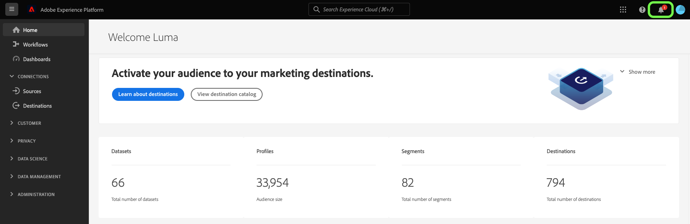
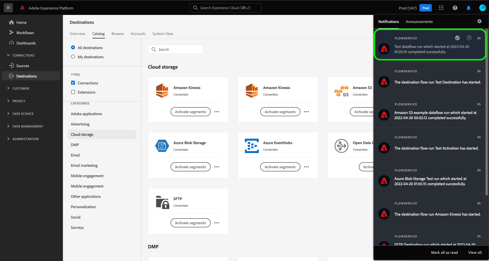

# Iscriviti agli avvisi di destinazione nel contesto

Adobe Experience Platform ti consente di abbonarti a avvisi basati su eventi relativi alle attività Adobe Experience Platform. Gli avvisi riducono o eliminano la necessità di eseguire il polling [[!DNL Observability Insights] API](../../observability/api/overview.md) per verificare se un processo è stato completato, se è stata raggiunta una determinata fase cardine all’interno di un flusso di lavoro o se si sono verificati errori.

Puoi abbonarti agli avvisi durante la creazione di un flusso di dati per ricevere messaggi di avviso relativi allo stato, al successo o all’errore dell’esecuzione del flusso.

Questo documento descrive come sottoscrivere messaggi di avviso per i flussi di dati di destinazione.

## Introduzione

Questo documento richiede una buona comprensione dei seguenti componenti di Adobe Experience Platform:

* [Destinazioni](../home.md): Integrazioni preconfigurate con piattaforme di destinazione che consentono l’attivazione diretta dei dati da Adobe Experience Platform. Puoi utilizzare le destinazioni per attivare i dati noti e sconosciuti per le campagne di marketing cross-channel, le campagne e-mail, la pubblicità mirata e molti altri casi d’uso.
* [Osservabilità](../../observability/home.md): [!DNL Observability Insights] consente di monitorare le attività di Platform mediante l’utilizzo di metriche statistiche e notifiche di eventi.
   * [Avvisi](../../observability/alerts/overview.md): Quando viene raggiunto un certo set di condizioni nelle operazioni di Platform (ad esempio un potenziale problema in caso di superamento di una soglia), Platform può inviare messaggi di avviso a tutti gli utenti dell’organizzazione che si sono abbonati.

## Iscriviti agli avvisi nell’interfaccia utente {#subscribe-destination-alerts}

>[!CONTEXTUALHELP]
>id="platform_destination_alerts_subscribe"
>title="Iscriviti agli avvisi di destinazione"
>abstract="Gli avvisi ti consentono di ricevere notifiche in base allo stato dei flussi di dati di destinazione. Puoi impostare le notifiche di avviso per ottenere aggiornamenti se il flusso di dati è stato avviato, se ha avuto esito positivo, se non è riuscito o se non ha inviato dati alla destinazione."
>text="Learn more in documentation"

>[!IMPORTANT]
>
>Devi abilitare le notifiche istantanee delle e-mail per il tuo account Platform per ricevere notifiche di avviso basate su e-mail per i tuoi flussi di dati.

Puoi abilitare gli avvisi per i flussi di dati durante la [!UICONTROL Configurare una nuova destinazione] fase [connessione di destinazione](connect-destination.md) workflow.

Seleziona gli avvisi a cui desideri abbonarti e quindi seleziona **[!UICONTROL Successivo]** per rivedere e completare il flusso di dati.

Gli avvisi disponibili per i flussi di dati di destinazione sono descritti nella tabella seguente.

* Per le destinazioni di streaming, solo la variabile [!DNL Activation Skipped Rate Exceeded] avviso disponibile.
* Per le destinazioni basate su file, sono disponibili tutti gli avvisi.

| Avvisi | Descrizione |
| --- | --- |
| Ritardo esecuzione flusso di destinazione | Questo avviso segnala quando un’esecuzione di un flusso di destinazione richiede più di 150 minuti per attivare un segmento. |
| Errore di esecuzione del flusso di destinazione | Questo avviso ti segnala quando si verifica un errore durante l’attivazione di un segmento a una destinazione. |
| Esecuzione flusso di destinazione completata | Questo avviso segnala quando un segmento viene attivato correttamente in una destinazione. |
| Inizio esecuzione flusso di destinazione | Questo avviso ti segnala quando un’esecuzione di un flusso di destinazione inizia ad attivare un segmento. |
| Frequenza di attivazione ignorata superata | Questo avviso ti segnala quando il tasso di attivazione salta ha superato l’1% delle attivazioni totali. Le identità vengono ignorate durante l&#39;attivazione quando presentano attributi mancanti o violazioni del consenso. |

## Ricezione degli avvisi {#receiving-alerts}

Una volta eseguito il flusso di dati di destinazione, puoi ricevere avvisi tramite l’interfaccia utente o tramite e-mail.

### Ricezione degli avvisi nell’interfaccia utente {#receiving-alerts-in-ui}

Gli avvisi sono rappresentati nell’interfaccia utente da un’icona di notifica nell’intestazione superiore dell’interfaccia utente di Platform. Seleziona l’icona di notifica per visualizzare messaggi di avviso specifici relativi ai flussi di dati.

Viene visualizzato il pannello Notifiche, che presenta un elenco degli aggiornamenti di stato nel flusso di dati creato.

Puoi passare il puntatore del mouse su un messaggio di avviso per contrassegnarlo come letto oppure puoi selezionare l&#39;icona dell&#39;orologio per impostare promemoria futuri sullo stato del flusso di dati.

Seleziona il messaggio di avviso per visualizzare informazioni specifiche sul flusso di dati.

La [!UICONTROL Dettagli dell&#39;esecuzione del dataflow] viene visualizzata la pagina . Nella parte superiore della schermata viene visualizzata una panoramica sul flusso di dati, con informazioni sugli attributi, l’ID di esecuzione del flusso di dati corrispondente e un riepilogo degli errori di alto livello.

Nella metà inferiore della pagina vengono visualizzate tutte le [!UICONTROL Errori di esecuzione del flusso di dati] che si è verificato durante la fase di esecuzione del flusso di dati. Da qui puoi visualizzare in anteprima la diagnostica degli errori o utilizzare la [[!DNL Data Access] API](https://www.adobe.io/experience-platform-apis/references/data-access/) per scaricare la diagnostica degli errori o il manifesto del file corrispondente al flusso di dati.

Per ulteriori informazioni sulla gestione degli errori del flusso di dati, consulta la guida su [monitoraggio dei flussi di dati delle destinazioni nell’interfaccia utente](../../dataflows/ui/monitor-destinations.md).

### Ricezione degli avvisi tramite e-mail {#receiving-alerts-by-email}

Gli avvisi relativi ai flussi di dati vengono inoltre inviati tramite e-mail. Seleziona il nome del flusso di dati nel corpo dell’e-mail per visualizzare ulteriori informazioni sul flusso di dati.

Simile all’avviso dell’interfaccia utente, il [!UICONTROL Panoramica dell&#39;esecuzione del dataflow] viene visualizzata una pagina che fornisce un’interfaccia per indagare eventuali errori associati al flusso di dati.

## Iscriviti e annulla l’abbonamento agli avvisi {#subscribe-and-unsubscribe}

Puoi abbonarti a più avvisi o annullare l’abbonamento a avvisi stabiliti per un flusso di dati di destinazione esistente nelle destinazioni [!UICONTROL Sfoglia] pagina.

Individua la connessione di destinazione per la quale desideri ricevere gli avvisi e seleziona i puntini di sospensione (`...`) per visualizzare un menu a discesa delle opzioni. Quindi, seleziona **[!UICONTROL Iscriviti agli avvisi]** per modificare le impostazioni di avviso del flusso di dati di destinazione.

Viene visualizzata una finestra a comparsa che fornisce un elenco di avvisi di destinazione. Seleziona gli avvisi a cui vuoi abbonarti o deseleziona gli avvisi a cui vuoi annullare l’iscrizione. Al termine, seleziona **[!UICONTROL Salva]**.

## Passaggi successivi {#next-steps}

Questo documento fornisce una guida dettagliata su come abbonarsi agli avvisi contestuali per i flussi di dati di destinazione. Per ulteriori informazioni, consulta la sezione [guida all’interfaccia utente per avvisi](../../observability/alerts/ui.md).
