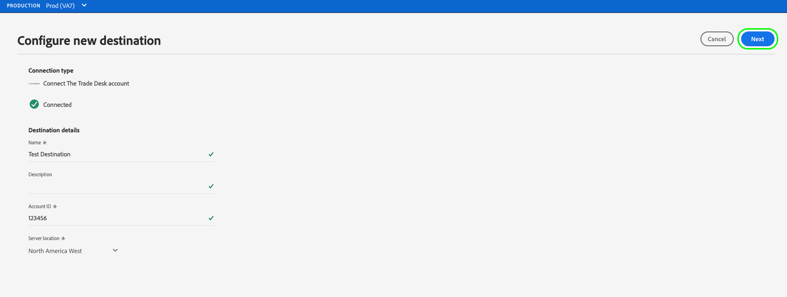

# Crea una nuova connessione di destinazione

>[!IMPORTANT]
> 
>Per connettersi a una destinazione, è necessario **[!UICONTROL Gestire le destinazioni]** [autorizzazione controllo accessi](/help/access-control/home.md#permissions). Leggi la sezione [panoramica sul controllo degli accessi](/help/access-control/ui/overview.md) oppure contatta l’amministratore del prodotto per ottenere le autorizzazioni richieste.

## Panoramica {#overview}

Prima di poter inviare i dati sul pubblico a una destinazione, è necessario impostare una connessione alla piattaforma di destinazione. Questo articolo illustra come impostare una nuova destinazione utilizzando l’interfaccia utente di Adobe Experience Platform.

## Crea una nuova connessione di destinazione {#setup}

1. Vai a **[!UICONTROL Connessioni]** > **[!UICONTROL Destinazioni]**, quindi seleziona la **[!UICONTROL Catalogo]** scheda .

   

1. A seconda che tu disponga di una connessione esistente alla destinazione, puoi visualizzare una **[!UICONTROL Configurazione]** o **[!UICONTROL Attivare i segmenti]** sulla scheda di destinazione. Per ulteriori informazioni sulla differenza tra **[!UICONTROL Attivare i segmenti]** e **[!UICONTROL Configurazione]**, fare riferimento alla [Catalogo](../ui/destinations-workspace.md#catalog) sezione della documentazione dell’area di lavoro di destinazione.

   Seleziona o **[!UICONTROL Configurazione]** o **[!UICONTROL Attivare i segmenti]**, a seconda del pulsante disponibile.

   

   

1. Se hai selezionato **[!UICONTROL Configurazione]**, passa al passaggio successivo.

   Se hai selezionato **[!UICONTROL Attivare i segmenti]**, puoi visualizzare un elenco delle connessioni di destinazione esistenti.

   Seleziona **[!UICONTROL Configurare una nuova destinazione]**.

   

1. Immetti i dettagli della connessione alla piattaforma di destinazione, quindi seleziona **[!UICONTROL Connetti alla destinazione]**.

   >[!NOTE]
   >
   >L&#39;immagine seguente è utilizzata solo a scopo illustrativo. I dettagli della connessione di destinazione variano tra le destinazioni. Per informazioni dettagliate sui dettagli di connessione per la destinazione, consulta **Parametri di connessione** sezione in ogni [catalogo di destinazione](../catalog/overview.md) (ad esempio, [Customer Match di Google](..//catalog/advertising/google-customer-match.md#parameters)).

   

1. (Facoltativo) Seleziona gli avvisi del flusso di dati di destinazione a cui desideri abbonarti. Puoi abbonarti agli avvisi durante la creazione di un flusso di dati per ricevere messaggi di avviso relativi allo stato, al successo o all’errore dell’esecuzione del flusso. Vedi [Iscriviti agli avvisi di destinazione nel contesto](alerts.md) per informazioni dettagliate sugli avvisi relativi al flusso di dati di destinazione.

   

1. Seleziona **[!UICONTROL Avanti]**.

   

1. Seleziona le azioni di marketing applicabili ai dati da esportare nella destinazione. Le azioni di marketing indicano l’intento per il quale i dati verranno esportati nella destinazione. Puoi scegliere tra azioni di marketing definite da Adobi o creare una tua azione di marketing. Per ulteriori informazioni sulle azioni di marketing, consulta la sezione [panoramica dei criteri di utilizzo dei dati](../../data-governance/policies/overview.md) pagina.

   

1. Seleziona **[!UICONTROL Salva ed esci]** per salvare la configurazione di destinazione, oppure seleziona **[!UICONTROL Successivo]** per passare ai dati sul pubblico [flusso di attivazione](activation-overview.md).