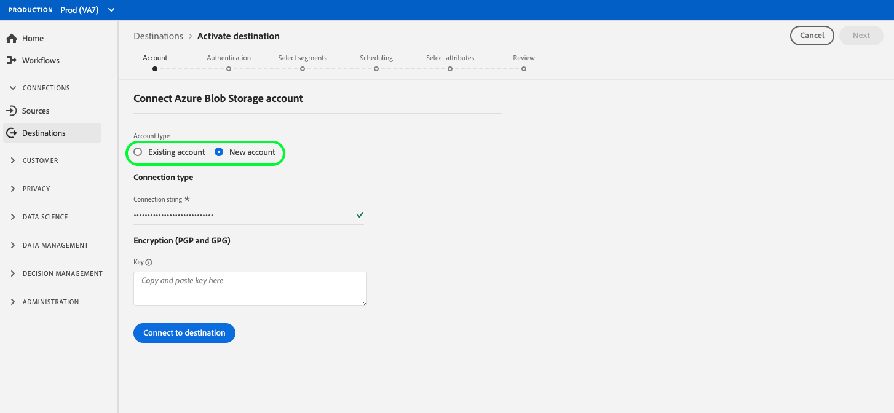

# Crea una nuova connessione di destinazione

## Panoramica {#overview}

Prima di poter inviare i dati sul pubblico a una destinazione, è necessario impostare una connessione alla piattaforma di destinazione. Questo articolo illustra come impostare una nuova destinazione utilizzando l’interfaccia utente di Adobe Experience Platform.

## Crea una nuova connessione di destinazione {#setup}

### Seleziona destinazione {#select-destination}

1. Vai a **[!UICONTROL Connessioni]** > **[!UICONTROL Destinazioni]** e seleziona la scheda **[!UICONTROL Catalogo]** .

   

1. A seconda che si disponga di una connessione esistente alla destinazione, è possibile visualizzare un pulsante **[!UICONTROL Configura]** o un pulsante **[!UICONTROL Attiva]** sulla scheda di destinazione. Per ulteriori informazioni sulla differenza tra **[!UICONTROL Attiva]** e **[!UICONTROL Configura]**, consulta la sezione [Catalogo](../ui/destinations-workspace.md#catalog) della documentazione dell&#39;area di lavoro di destinazione. Seleziona **[!UICONTROL Configura]** o **[!UICONTROL Attiva]** a seconda del pulsante disponibile.

   

   

<!-- 1. If you selected **[!UICONTROL Set up]**, skip this step. If you selected **[!UICONTROL Activate segments]**, you can now see a list of the existing destination connections. Select **[!UICONTROL Configure new destination]**.

    -->

### Passaggio account {#account}

Seleziona **[!UICONTROL Nuovo account]** per impostare una nuova connessione alla destinazione. Oppure, se in precedenza hai impostato una connessione alla destinazione, seleziona **[!UICONTROL Account esistente]** e seleziona la connessione esistente.

Le credenziali che è necessario immettere nel passaggio account variano in base alla destinazione e al tipo di autenticazione.

* Per le destinazioni di archiviazione cloud, è necessario fornire le credenziali ad Experience Platform per la connessione al percorso di archiviazione.

   

* Per Facebook e diverse altre destinazioni social e pubblicitarie, seleziona **[!UICONTROL Nuovo account]** , quindi seleziona **[!UICONTROL Connetti a destinazione]**. Verrà visualizzata la pagina di accesso di destinazione, in modo da poter collegare l’Experience Platform alla destinazione.

   

>[!IMPORTANT]
>
>Per informazioni dettagliate sui parametri richiesti in questo passaggio, consulta la sezione **[!UICONTROL Parametri di connessione]** in ogni pagina del catalogo di destinazione (ad esempio, [Azure Blob](../catalog/cloud-storage/azure-blob.md#parameters) richiede una stringa di connessione).

### Passaggio di autenticazione {#authentication}

Immetti i dettagli della connessione alla piattaforma di destinazione, quindi seleziona **[!UICONTROL Crea destinazione]**.

1. Seleziona le azioni di marketing applicabili ai dati da esportare nella destinazione. Le azioni di marketing indicano l’intento per il quale i dati verranno esportati nella destinazione. Puoi scegliere tra azioni di marketing definite da Adobi o creare una tua azione di marketing. Per ulteriori informazioni sulle azioni di marketing, consulta la pagina [panoramica dei criteri di utilizzo dei dati](../../data-governance/policies/overview.md) .

   >[!IMPORTANT]
   >
   >L&#39;immagine seguente è utilizzata solo a scopo illustrativo. I dettagli della connessione di destinazione variano tra le destinazioni. Per informazioni dettagliate sui dettagli di connessione per la destinazione, consulta la sezione **[!UICONTROL Parametri di connessione]** in ogni pagina [catalogo di destinazione](../catalog/overview.md) (ad esempio, [Customer Match di Google](../catalog/advertising/google-customer-match.md#parameters)).

   

1. Seleziona **[!UICONTROL Salva e esci]** per salvare la configurazione di destinazione, oppure seleziona **[!UICONTROL Avanti]** per procedere con i dati del pubblico [flusso di attivazione](activation-overview.md).