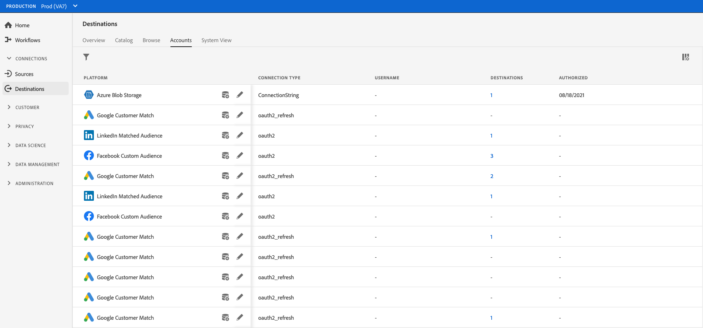

# Elimina account di destinazione

## Panoramica {#overview}

La scheda **[!UICONTROL Accounts]** mostra i dettagli sulle connessioni stabilite con varie destinazioni. Per tutte le informazioni disponibili per ciascun account di destinazione, vedere [Panoramica account](../ui/destinations-workspace.md#accounts).

Questo tutorial illustra i passaggi necessari per eliminare gli account di destinazione non più necessari tramite l’interfaccia utente di Experience Platform.

## Elimina account {#delete}

>[!TIP]
>
>Prima di eliminare l’account di destinazione, devi eliminare tutti i flussi di dati esistenti associati all’account di destinazione. Per eliminare i flussi di dati di destinazione esistenti, fare riferimento all&#39;esercitazione su [eliminazione dei flussi di dati di destinazione nell&#39;interfaccia utente](./delete-destinations.md).

Per eliminare gli account di destinazione esistenti, effettua le seguenti operazioni.

1. Vai alla [interfaccia utente di Experience Platform](https://platform.adobe.com/) e seleziona **[!UICONTROL Destinations]** dalla barra di navigazione a sinistra. Seleziona **[!UICONTROL Accounts]** dall&#39;intestazione superiore per visualizzare gli account esistenti.

   

2. Seleziona l&#39;icona del filtro  in alto a sinistra per avviare il pannello di ordinamento. Il pannello Ordinamento fornisce un elenco di tutte le destinazioni. Puoi selezionare più di una destinazione dall’elenco per visualizzare una selezione filtrata di account associati alle destinazioni selezionate.

   

3. Selezionare i puntini di sospensione (`...`) accanto al nome dell&#39;account che si desidera eliminare. Viene visualizzato un pannello a comparsa che fornisce opzioni per **[!UICONTROL Activate audiences]**, **[!UICONTROL Edit details]** e **[!UICONTROL Delete]** l&#39;account. Selezionare il pulsante  **[!UICONTROL Delete]** per eliminare l&#39;account desiderato.

   

4. Viene visualizzata una finestra di dialogo di conferma finale. Selezionare **[!UICONTROL Delete]** per completare il processo.

## Passaggi successivi {#next-steps}

Hai utilizzato correttamente l’area di lavoro delle destinazioni per eliminare gli account esistenti.

Per i passaggi su come eseguire queste operazioni a livello di programmazione utilizzando l&#39;API [!DNL Flow Service], fare riferimento al tutorial sull&#39;eliminazione di connessioni mediante l&#39;API del servizio Flusso[&#128279;](../api/delete-destination-account.md)
