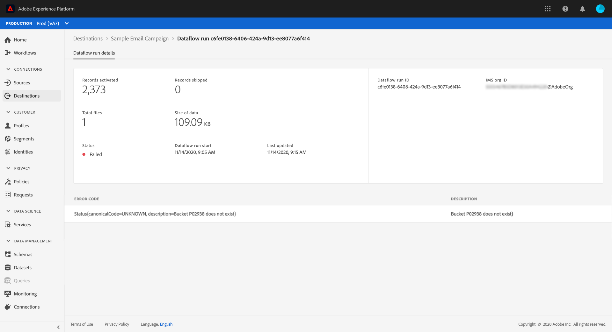

# Pagina dei dettagli sulla destinazione

Nell’interfaccia utente di Adobe Experience Platform, puoi visualizzare e monitorare gli attributi e le attività delle tue destinazioni. Tali dettagli includono il nome e l&#39;ID della destinazione, i controlli per attivare o disattivare le destinazioni e altro ancora. I dettagli per le destinazioni batch includono anche metriche per i record di profilo attivati e una cronologia delle esecuzioni dei flussi di dati.

>[!NOTE]
>
>La pagina dei dettagli delle destinazioni fa parte dell&#39; [!UICONTROL Destinations] area di lavoro nell&#39;interfaccia utente della piattaforma. Per ulteriori informazioni, consultate la panoramica [[!UICONTROL Destinations]](./destinations-workspace.md) dell’area di lavoro.

Nell&#39; **[!UICONTROL Destinations]** area di lavoro all&#39;interno dell&#39;interfaccia utente della piattaforma, andate alla **[!UICONTROL Browse]** scheda e selezionate il nome di una destinazione che desiderate visualizzare.

Viene visualizzata la pagina dei dettagli della destinazione, con i relativi controlli disponibili. Se state visualizzando i dettagli di una destinazione batch, viene visualizzata anche una dashboard di monitoraggio.

Inoltre, nella scheda Sfoglia, potete scegliere di eliminare il flusso di dati selezionato selezionando l&#39;icona del  . Tutti i segmenti attivati in una destinazione verranno non mappati prima che il flusso di dati venga eliminato.

## Barra destra

Nella barra a destra sono visualizzate le informazioni di base sulla destinazione.

La tabella seguente illustra i controlli e i dettagli forniti dalla barra a destra:

| Elemento a destra | Descrizione |
| --- | --- |
| [!UICONTROL Activate] | Selezionare questo controllo per modificare i segmenti mappati alla destinazione. Per ulteriori informazioni, consulta la guida sull’ [attivazione dei segmenti su una destinazione](./activate-destinations.md) . |
| [!UICONTROL Delete] | Consente di eliminare questo flusso di dati e di mappare i segmenti precedentemente attivati, se esistenti. |
| [!UICONTROL Destination name] | Questo campo può essere modificato per aggiornare il nome della destinazione. |
| [!UICONTROL Description] | Questo campo può essere modificato per aggiornare o aggiungere una descrizione facoltativa alla destinazione. |
| [!UICONTROL Destination] | Rappresenta la piattaforma di destinazione a cui vengono inviati i tipi di pubblico. Per ulteriori informazioni, vedi il catalogo [delle](../catalog/overview.md) destinazioni. |
| [!UICONTROL Status] | Indica se la destinazione è abilitata o disabilitata. |
| [!UICONTROL Marketing actions] | Indica le azioni di marketing (esempi di utilizzo) che si applicano a questa destinazione a fini di governance dei dati. |
| [!UICONTROL Category] | Indica il tipo di destinazione. Per ulteriori informazioni, vedi il catalogo [delle](../catalog/overview.md) destinazioni. |
| [!UICONTROL Connection type] | Indica il modulo tramite il quale le audience vengono inviate alla destinazione. I valori possibili includono &quot;[!UICONTROL Cookie]&quot; e &quot;[!UICONTROL Profile-based]&quot;. |
| [!UICONTROL Frequency] | Indica la frequenza con cui le audience vengono inviate alla destinazione. I valori possibili includono &quot;[!UICONTROL Streaming]&quot; e &quot;[!UICONTROL Batch]&quot;. |
| [!UICONTROL Identity] | Rappresenta lo spazio nomi identità accettato dalla destinazione, ad esempio `GAID`, `IDFA`o `email`. Per ulteriori informazioni sugli spazi dei nomi di identità accettati, consultate la panoramica [dello spazio dei nomi di](../../identity-service/namespaces.md)identità. |
| [!UICONTROL Created by] | Indica l&#39;utente che ha creato la destinazione. |
| [!UICONTROL Created] | Indica il datetime UTC al momento della creazione della destinazione. |

## [!UICONTROL Enabled]/[!UICONTROL Disabled] toggle

Potete utilizzare l&#39; **[!UICONTROL Enabled]interruttore/[!UICONTROL Disabled]** per avviare e mettere in pausa tutte le esportazioni di dati verso la destinazione.

## [!UICONTROL Dataflow runs]

La [!UICONTROL Dataflow runs] scheda fornisce i dati delle metriche nel flusso di dati, che vengono eseguiti sulle destinazioni batch. Viene visualizzato un elenco di singole esecuzioni e delle relative metriche specifiche, insieme ai seguenti totali per i record di profilo:

* **[!UICONTROL Profile records activated]**: Totale dei record di profilo creati o aggiornati per l&#39;attivazione.
* **[!UICONTROL Profile records skipped]**:  Totale dei record di profilo saltati per l&#39;attivazione in base alle uscite di profilo o agli attributi mancanti.

>[!NOTE]
>
>Le esecuzioni dei flussi di dati vengono generate in base alla frequenza di programmazione del flusso di dati di destinazione. Per ogni criterio di unione applicato a un segmento viene eseguita un&#39;esecuzione distinta per il flusso di dati.

Per visualizzare i dettagli di una particolare esecuzione di un flusso di dati, selezionare l&#39;ora di inizio dell&#39;esecuzione dall&#39;elenco. La pagina dei dettagli per un&#39;esecuzione di un flusso di dati contiene informazioni aggiuntive, come la dimensione dei dati elaborati e un elenco degli eventuali errori che si sono verificati con i dettagli per la diagnostica degli errori.

## [!UICONTROL Activation data]

Nella [!UICONTROL Activation data] scheda viene visualizzato un elenco di segmenti che sono stati mappati sulla destinazione, inclusa la data di inizio e la data di fine (se applicabile). Per visualizzare i dettagli di un particolare segmento, selezionatene il nome dall’elenco.

>[!NOTE]
>
>Per informazioni dettagliate su come esplorare la pagina dei dettagli di un segmento, consulta la panoramica [dell’interfaccia utente di](../../segmentation/ui/overview.md#segment-details)segmentazione.

## Passaggi successivi

Questo documento descrive le capacità della pagina dei dettagli di destinazione. Per ulteriori informazioni sulla gestione delle destinazioni nell’interfaccia utente, consultate la panoramica nell’ [[!UICONTROL Destinations] area di lavoro](./destinations-workspace.md).