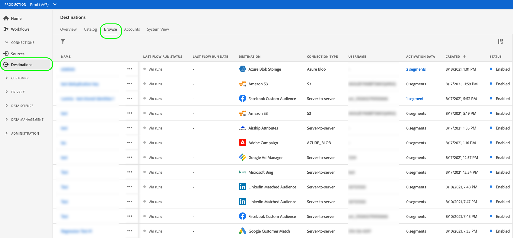
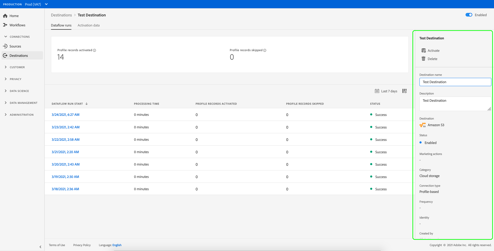
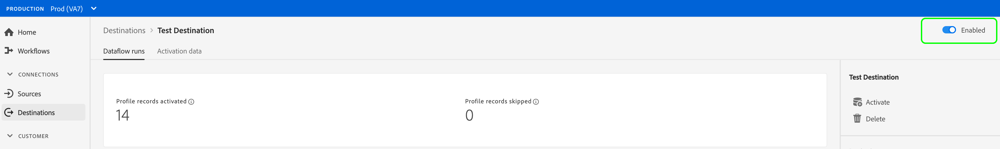
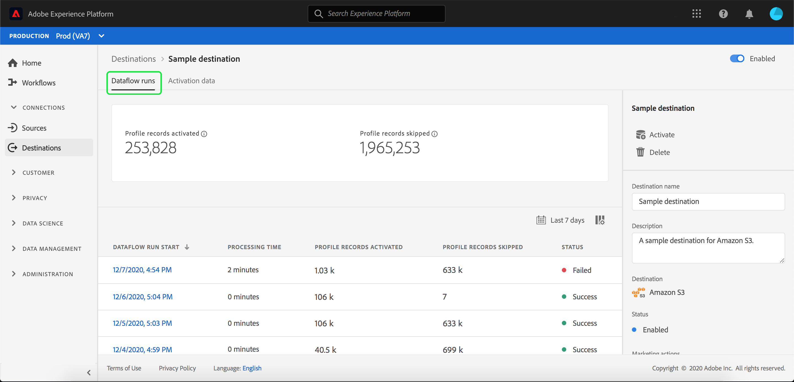
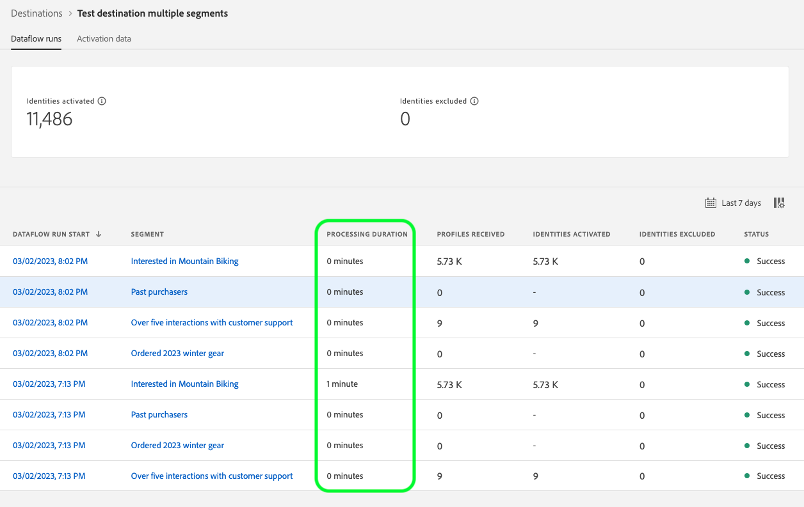
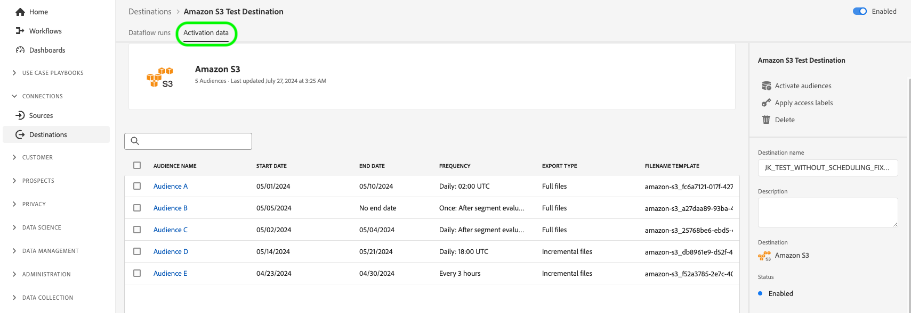
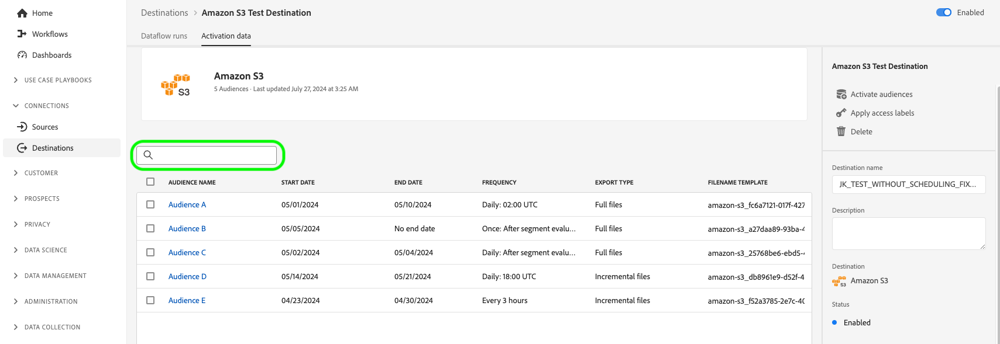
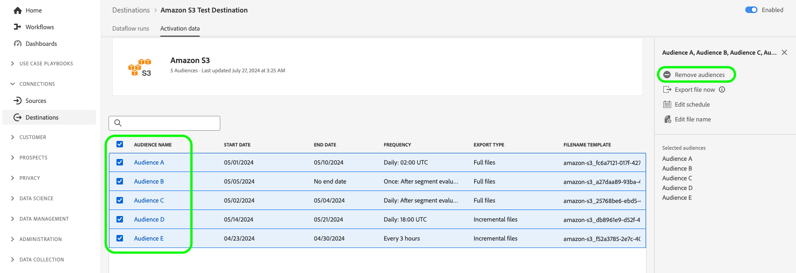

# Visualizzare i dettagli della destinazione

## Panoramica {#overview}

Nell’interfaccia utente di Adobe Experience Platform, puoi visualizzare e monitorare gli attributi e le attività delle destinazioni. Questi dettagli includono il nome e l’ID della destinazione, i controlli per attivare o disattivare le destinazioni e altro ancora. I dettagli includono anche metriche per record di profilo attivati, identità attivate, non riuscite ed escluse e una cronologia delle esecuzioni dei flussi di dati.

>[!NOTE]
>
>La pagina dei dettagli delle destinazioni fa parte dell&#39;area di lavoro [!UICONTROL Destinations] in [!DNL Experience Platform] [!DNL UI]. Per ulteriori informazioni, vedere [[!UICONTROL Destinations] area di lavoro overview](./destinations-workspace.md).

## Visualizzare i dettagli della destinazione {#view-details}

Per visualizzare ulteriori dettagli su una destinazione esistente, segui la procedura riportata di seguito. Puoi trovare l’ID di destinazione di una destinazione, l’utente che ha creato la destinazione, quando è stata creata e altre informazioni.

1. Accedi alla [interfaccia utente di Experience Platform](https://platform.adobe.com/) e seleziona **[!UICONTROL Destinations]** dalla barra di navigazione a sinistra. Seleziona **[!UICONTROL Browse]** dall&#39;intestazione superiore per visualizzare le destinazioni esistenti.

   

2. Seleziona l&#39;icona del filtro  in alto a sinistra per avviare il pannello di ordinamento. Il pannello Ordinamento fornisce un elenco di tutte le destinazioni. Puoi selezionare più di una destinazione dall’elenco per visualizzare una selezione filtrata di flussi di dati associati alla destinazione selezionata.

   

3. Seleziona la riga della destinazione per la quale desideri visualizzare ulteriori informazioni. Viene visualizzata una barra a destra con informazioni sulla destinazione, tra cui l’ID di destinazione, l’utente che ha creato la connessione di destinazione e altre informazioni.

   

4. In alternativa, è possibile visualizzare altre informazioni sulla destinazione selezionando *il nome della destinazione* che si desidera visualizzare.

   

5. La pagina dei dettagli della destinazione viene visualizzata nella barra a destra, con i controlli disponibili.

   

## Barra a destra {#right-rail}

Nella barra a destra vengono visualizzate le informazioni di base sulla destinazione selezionata.

La tabella che segue riporta i controlli e i dettagli forniti dalla barra a destra:

| Elemento barra a destra | Descrizione |
| --- | --- |
| [!UICONTROL Activate audiences] | Selezionare questo controllo per modificare i tipi di pubblico mappati alla destinazione, aggiornare le pianificazioni di esportazione o aggiungere e rimuovere gli attributi e le identità mappati. Per ulteriori informazioni, consulta le guide su [attivazione dei dati sul pubblico nelle destinazioni di streaming del pubblico](./activate-segment-streaming-destinations.md), [attivazione dei dati sul pubblico nelle destinazioni basate su profili batch](./activate-batch-profile-destinations.md) e [attivazione dei dati sul pubblico nelle destinazioni basate su profili di streaming](./activate-streaming-profile-destinations.md). |
| [!UICONTROL Delete] | Consente di eliminare questo flusso di dati e di annullare la mappatura dei tipi di pubblico precedentemente attivati, se presenti. |
| [!UICONTROL Destination name] | Questo campo può essere modificato per aggiornare il nome della destinazione. |
| [!UICONTROL Description] | Questo campo può essere modificato per aggiornare o aggiungere una descrizione facoltativa alla destinazione. |
| [!UICONTROL Destination] | Rappresenta la piattaforma di destinazione a cui vengono inviati i tipi di pubblico. Per ulteriori informazioni, vedere il [catalogo delle destinazioni](../catalog/overview.md). |
| [!UICONTROL Status] | Indica se la destinazione è abilitata o disabilitata. |
| [!UICONTROL Marketing actions] | Indica le azioni di marketing (casi di utilizzo) che si applicano a questa destinazione a scopo di governance dei dati. |
| [!UICONTROL Category] | Indica il tipo di destinazione. Per ulteriori informazioni, vedere il [catalogo delle destinazioni](../catalog/overview.md). |
| [!UICONTROL Connection type] | Indica il modulo tramite il quale i tipi di pubblico vengono inviati alla destinazione. I valori possibili includono [!UICONTROL Cookie] e [!UICONTROL Profile-based]. |
| [!UICONTROL Frequency] | Indica la frequenza con cui i tipi di pubblico vengono inviati alla destinazione. I valori possibili includono [!UICONTROL Streaming] e [!UICONTROL Batch]. |
| [!UICONTROL Identity] | Rappresenta lo spazio dei nomi dell&#39;identità accettato dalla destinazione, ad esempio `GAID`, `IDFA` o `email`. Per ulteriori informazioni sugli spazi dei nomi di identità accettati, vedere la [panoramica dello spazio dei nomi di identità](../../identity-service/features/namespaces.md). |
| [!UICONTROL Created by] | Indica l&#39;utente che ha creato la destinazione. |
| [!UICONTROL Created] | Indica il datetime UTC al momento della creazione della destinazione. |

{style="table-layout:auto"}

## Attiva/Disattiva [!UICONTROL Enabled]/[!UICONTROL Disabled] {#enabled-disabled-toggle}

È possibile utilizzare l&#39;interruttore **[!UICONTROL Enabled]/[!UICONTROL Disabled]** per avviare e sospendere tutte le esportazioni di dati nella destinazione.

## [!UICONTROL Dataflow runs] {#dataflow-runs}

La scheda [!UICONTROL Dataflow runs] fornisce i dati delle metriche sul flusso di dati eseguito su destinazioni batch e di streaming. Per informazioni dettagliate e definizioni delle metriche, consultare [Flussi dati di monitoraggio](monitor-dataflows.md).

>[!NOTE]
>
>* La funzionalità di monitoraggio delle destinazioni è attualmente supportata per tutte le destinazioni in Experience Platform *ad eccezione* delle destinazioni [Adobe Target](/help/destinations/catalog/personalization/adobe-target-connection.md), [Personalizzazione personalizzata](/help/destinations/catalog/personalization/custom-personalization.md) e [Experience Cloud Audiences](/help/destinations/catalog/adobe/experience-cloud-audiences.md).
>* Per le destinazioni [Amazon Kinesis](/help/destinations/catalog/cloud-storage/amazon-kinesis.md), [Azure Event Hubs](/help/destinations/catalog/cloud-storage/azure-event-hubs.md) e [HTTP API](/help/destinations/catalog/streaming/http-destination.md), vengono stimate le metriche relative alle identità escluse, non riuscite e attivate. Volumi più elevati di dati di attivazione consentono una maggiore precisione delle metriche.

### Durata esecuzioni flusso di dati {#dataflow-runs-duration}

Esiste una differenza nella durata visualizzata del flusso di dati eseguito tra lo streaming e le destinazioni basate su file.

### Destinazioni di streaming {#streaming}

Mentre il **[!UICONTROL Processing duration]** indicato per la maggior parte delle esecuzioni del flusso di dati in streaming è di circa quattro ore, come mostrato nell’immagine seguente, il tempo di elaborazione effettivo per qualsiasi esecuzione del flusso di dati è molto più breve. Le finestre di esecuzione del flusso di dati rimangono aperte più a lungo nel caso in cui Experience Platform debba riprovare a effettuare chiamate alla destinazione e assicurarsi inoltre di non perdere dati in arrivo tardivo per la stessa finestra temporale.

Per ulteriori informazioni, consulta le informazioni su [il flusso di dati viene eseguito su destinazioni di streaming](/help/dataflows/ui/monitor-destinations.md#dataflow-runs-for-streaming-destinations) nella documentazione di monitoraggio.

### Destinazioni basate su file {#file-based}

Per l&#39;esecuzione del flusso di dati su destinazioni basate su file, **[!UICONTROL Processing duration]** dipende dalle dimensioni dei dati esportati e dal caricamento del sistema. Inoltre, il flusso di dati viene eseguito su destinazioni basate su file e viene suddiviso per pubblico.

Per ulteriori informazioni, leggere le informazioni su [il flusso di dati viene eseguito su destinazioni batch (basate su file)](/help/dataflows/ui/monitor-destinations.md#dataflow-runs-for-batch-destinations) nella documentazione di monitoraggio.

## [!UICONTROL Activation data] {#activation-data}

Nella scheda **[!UICONTROL Activation data]** viene visualizzato un elenco dei tipi di pubblico mappati sulla destinazione, inclusa la data di inizio e di fine (se applicabile) e altre informazioni rilevanti per l&#39;esportazione dei dati, come tipo di esportazione, pianificazione e frequenza. Per visualizzare i dettagli di un particolare pubblico, selezionane il nome dall’elenco.

>[!TIP]
>
>Per visualizzare e modificare i dettagli sugli attributi e le identità mappate a una destinazione, seleziona **[!UICONTROL Activate audiences]** nella [barra a destra](#right-rail).

>[!BEGINSHADEBOX]

Scheda **[!UICONTROL Activation data]** per una destinazione basata su file.

>[!ENDSHADEBOX]

>[!BEGINSHADEBOX]

Scheda **[!UICONTROL Activation data]** per una destinazione di streaming.

>[!ENDSHADEBOX]

### Filtrare i tipi di pubblico attivati {#filter-audiences}

Per filtrare l’elenco dei tipi di pubblico attivati per una destinazione, immetti un nome di pubblico nella casella di ricerca. L’elenco dei tipi di pubblico si aggiorna automaticamente con i risultati della ricerca.

### Rimuovere più tipi di pubblico dai flussi di attivazione {#bulk-remove}

Per rimuovere più tipi di pubblico dai flussi di attivazione esistenti, selezionare i tipi di pubblico, quindi selezionare **[!UICONTROL Remove audiences]**.

### Esportare più file on-demand in destinazioni batch {#bulk-export}

Puoi [esportare più file on-demand](../ui/export-file-now.md) dalla pagina **[!UICONTROL Activation data]**. A tale scopo, selezionare i tipi di pubblico per i quali si desidera esportare i file su richiesta e selezionare il controllo **[!UICONTROL Export file now]** per attivare un&#39;esportazione una tantum che invierà un file per ogni pubblico selezionato alla destinazione batch.

### Modificare i programmi di attivazione per più tipi di pubblico esportati in destinazioni batch {#bulk-edit-schedule}

Per modificare la pianificazione di attivazione esistente di più tipi di pubblico contemporaneamente, selezionare i tipi di pubblico desiderati, quindi selezionare **[!UICONTROL Edit schedule]**. Per informazioni dettagliate su come definire o modificare una pianificazione di esportazione, consulta la sezione [Pianifica esportazione pubblico](../ui/activate-batch-profile-destinations.md#scheduling).

>[!NOTE]
>
>Per informazioni dettagliate sull&#39;esplorazione della pagina dei dettagli di un pubblico, consulta la [panoramica di Audience Portal](../../segmentation/ui/audience-portal.md#segment-details).

### Modificare i nomi dei file per più tipi di pubblico esportati in destinazioni batch {#bulk-edit-file-names}

Per modificare i nomi dei file esportati di più tipi di pubblico contemporaneamente, selezionare i tipi di pubblico desiderati, quindi selezionare **[!UICONTROL Edit file name]**. Per informazioni dettagliate su come definire o modificare un nome di file, leggere la sezione su come [configurare i nomi di file](../ui/activate-batch-profile-destinations.md#configure-file-names).

