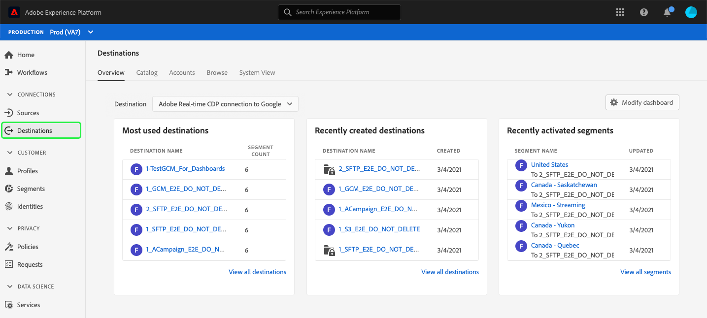
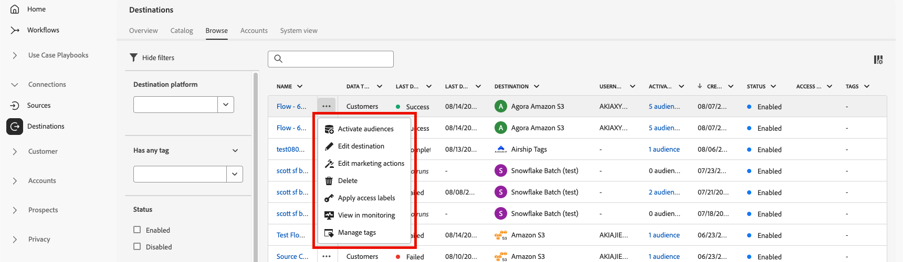

# Area di lavoro destinazioni {#destinations-workspace}

In Adobe Experience Platform, seleziona **[!UICONTROL Destinazioni]** dalla barra di navigazione a sinistra per accedere al [!UICONTROL Destinazioni] Workspace.

Il [!UICONTROL Destinazioni] workspace è costituito da cinque sezioni, [!UICONTROL Panoramica], [!UICONTROL Catalogo], [!UICONTROL Sfoglia], [!UICONTROL Account], e [!UICONTROL Vista sistema], descritto nelle sezioni seguenti.

## [!UICONTROL Panoramica] {#overview}

Il **[!UICONTROL Panoramica]** visualizza la scheda [!UICONTROL Destinazioni] fornendo metriche chiave relative ai dati di destinazione della tua organizzazione. Per ulteriori informazioni, visita [[!UICONTROL Destinazioni] guida del dashboard](../../dashboards/guides/destinations.md).

>[!NOTE]
>
>Se la tua organizzazione ha poca esperienza con Experienci Platform e non dispone ancora di destinazioni attive, il [!UICONTROL Destinazioni] dashboard e [!UICONTROL Panoramica] non sono visibili. Invece, selezionando [!UICONTROL Destinazioni] dalla barra di navigazione a sinistra viene visualizzata la [[!UICONTROL Catalogo] scheda](#catalog).

## [!UICONTROL Catalogo] {#catalog}

Il **[!UICONTROL Catalogo]** mostra un elenco di tutte le destinazioni disponibili in [!DNL Platform], a cui puoi inviare i dati.

Il [!DNL Platform] L’interfaccia utente di fornisce diverse opzioni di ricerca e filtro nella pagina del catalogo delle destinazioni:

* Utilizza la funzionalità di ricerca nella pagina per individuare una destinazione specifica.
* Filtrare le destinazioni utilizzando [!UICONTROL Categorie] controllo.
* Passa da [!UICONTROL Tutte le destinazioni] e [!UICONTROL Le mie destinazioni]. Quando selezioni **[!UICONTROL Tutte le destinazioni]**, tutti disponibili [!DNL Platform] vengono visualizzate le destinazioni. Quando selezioni **[!UICONTROL Le mie destinazioni]**, puoi visualizzare solo le destinazioni con le quali hai stabilito una connessione.
* Seleziona per visualizzare **[!UICONTROL Connessioni]** e/o **[!UICONTROL Estensioni]** tipi. Per comprendere la differenza tra le due categorie, leggi [Tipi e categorie di destinazione](../destination-types.md).

Le schede di destinazione contengono opzioni di controllo primarie e secondarie. I controlli principali includono [!UICONTROL Configurazione], [!UICONTROL Attiva], [!UICONTROL Attiva tipi di pubblico], o [!UICONTROL Esportare i set di dati]. I controlli secondari consentono di visualizzare le opzioni. Questi controlli sono descritti di seguito:

| control | Descrizione |
|---------|----------|
| [!UICONTROL Configurazione] | Consente di creare una connessione alla destinazione. |
| [!UICONTROL Attiva] | Dopo aver stabilito una connessione alla destinazione, puoi attivare i tipi di pubblico o esportare i set di dati in questa destinazione. |
| [!UICONTROL Attiva tipi di pubblico] | Dopo aver stabilito una connessione alla destinazione, puoi attivare i tipi di pubblico per questa destinazione. |
| [!UICONTROL Esportare i set di dati] | Dopo aver stabilito una connessione alla destinazione, puoi esportare i set di dati in questa destinazione. |
| [!UICONTROL Visualizza account] | Visualizzare gli account connessi per una destinazione. |
| [!UICONTROL Visualizza flussi di dati] | Visualizzare i flussi di attivazione dati esistenti per una destinazione. |
| [!UICONTROL Visualizzare la documentazione] | Apre un collegamento alla pagina della documentazione della destinazione specifica, per ulteriori informazioni e per facilitare la configurazione. |

{style="table-layout:auto"}

Seleziona una scheda di destinazione nel catalogo per aprire la barra a destra. Qui puoi vedere una descrizione della destinazione. La barra a destra fornisce gli stessi controlli descritti nella tabella precedente, inclusa una descrizione della destinazione e un’indicazione della categoria e del tipo di destinazione.

Per ulteriori informazioni sulle categorie di destinazione e sulle informazioni su ciascuna destinazione, vedi [Catalogo di destinazione](../catalog/overview.md) e [Tipi e categorie di destinazione](../destination-types.md).

## [!UICONTROL Account] {#accounts}

Il **[!UICONTROL Account]** Questa scheda mostra i dettagli sulle connessioni stabilite con varie destinazioni e ti consente di aggiornare o eliminare i dettagli dell’account esistente. Vedi la tabella seguente per tutte le informazioni che puoi ottenere su ciascun account di destinazione.

>[!TIP]
>
> * Seleziona i puntini di sospensione (`...`) in [!UICONTROL Piattaforma] e utilizza la **[!UICONTROL Attiva ]**/**[!UICONTROL  Attiva tipi di pubblico ]**/**[!UICONTROL  Esportare i set di dati ]**per esportare tipi di pubblico o set di dati in tale destinazione.
> * Seleziona i puntini di sospensione (`...`) in [!UICONTROL Piattaforma] e utilizza la **[!UICONTROL Modifica dettagli ]**controllo a [aggiorna](update-accounts.md) i dettagli di un account di destinazione esistente.
> * Seleziona i puntini di sospensione (`...`) in [!UICONTROL Piattaforma] e utilizza la **[!UICONTROL Elimina ]**controllo a [eliminare](delete-destination-account.md) un account di destinazione esistente.

| Elemento | Descrizione |
|---|---|
| [!UICONTROL Piattaforma] | La destinazione per la quale hai impostato la connessione. |
| [!UICONTROL Tipo connessione] | Rappresenta il tipo di connessione dell’account al bucket di archiviazione o alla destinazione. A seconda della destinazione, le opzioni di autenticazione sono: <ul><li>Per le destinazioni di e-mail marketing: può essere S3, FTP o BLOB di Azure.</li><li>Per destinazioni pubblicitarie in tempo reale: server-to-server</li><li>Per le destinazioni dell’archiviazione cloud Amazon S3: chiave di accesso </li><li>Per le destinazioni di archiviazione cloud SFTP: autenticazione di base per SFTP</li><li>Autenticazione OAuth 1 o OAuth 2</li><li>Autenticazione token Bearer</li></ul> |
| [!UICONTROL Nome utente] | Il nome utente selezionato nel [connessione guidata destinazione](../catalog/email-marketing/overview.md#connect-destination). |
| [!UICONTROL Destinazioni] | Rappresenta il numero di flussi di dati di destinazione univoci e riusciti connessi alle informazioni di base create per una destinazione. |
| [!UICONTROL Autorizzato] | La data in cui la connessione a questa destinazione è stata autorizzata. |

{style="table-layout:auto"}

## [!UICONTROL Sfogliare] {#browse}

Il **[!UICONTROL Sfoglia]** Questa scheda mostra le destinazioni con le quali hai stabilito una connessione. Destinazioni con **[!UICONTROL Abilitato/Disabilitato]** attiva/disattiva, imposta la destinazione rispettivamente su attiva o inattiva. Puoi anche visualizzare le destinazioni in cui i dati scorrono selezionando **[!UICONTROL Tipi di pubblico]** > **[!UICONTROL Sfoglia]** e selezionando un pubblico da verificare. Vedi la tabella seguente per tutte le informazioni fornite per ciascuna destinazione nel [!UICONTROL Sfoglia] scheda:

>[!TIP]
>
> * Seleziona i puntini di sospensione (`...`) in [!UICONTROL Nome] e utilizza la **[!UICONTROL Attiva ]**per esportare tipi di pubblico o set di dati in tale destinazione.
> * Seleziona i puntini di sospensione (`...`) in [!UICONTROL Nome] e utilizza la **[!UICONTROL Elimina ]**controllo a [rimuovere](delete-destinations.md) una connessione esistente a una destinazione.
> * Seleziona i puntini di sospensione (`...`) in [!UICONTROL Nome] e utilizza la **[!UICONTROL Visualizza nel monitoraggio ]**per visualizzare le informazioni di attivazione per questa destinazione in [dashboard di monitoraggio](/help/dataflows/ui/monitor-destinations.md#monitoring-destinations-dashboard).
> * Seleziona i puntini di sospensione (`...`) in [!UICONTROL Nome] e utilizza la **[!UICONTROL Iscriviti agli avvisi ]**per abbonarsi agli avvisi del flusso di dati di destinazione. È possibile abbonarsi agli avvisi per ricevere messaggi relativi allo stato, al completamento o al fallimento dell’esecuzione del flusso. Consulta [Iscriviti agli avvisi contestuali sulle destinazioni](alerts.md) per informazioni dettagliate sugli avvisi del flusso di dati di destinazione.

| Elemento | Descrizione |
|---------|----------|
| Nome | Il nome fornito per il flusso di attivazione verso questa destinazione. La stessa colonna include due controlli: [!UICONTROL Attiva] e [!UICONTROL Elimina destinazione]. |
| [!UICONTROL Stato ultima esecuzione del flusso] | Stato dell’ultima esecuzione del flusso di dati. Consulta [Visualizzare i dettagli della destinazione](destination-details-page.md) per ulteriori informazioni sulle esecuzioni dei flussi di dati. |
| [!UICONTROL Data ultima esecuzione del flusso] | Ora e data in cui si è verificata l’ultima esecuzione del flusso di dati. Consulta [Visualizzare i dettagli della destinazione](destination-details-page.md) per ulteriori informazioni sulle esecuzioni dei flussi di dati. |
| [!UICONTROL Destinazione] | La piattaforma di destinazione selezionata per il flusso di attivazione. |
| [!UICONTROL Tipo connessione] | Rappresenta il tipo di connessione al bucket di archiviazione o alla destinazione. <ul><li>Per le destinazioni di e-mail marketing: può essere S3, FTP o [!DNL Azure Blob].</li><li>Per destinazioni pubblicitarie in tempo reale: server-to-server.</li><li>Per le destinazioni di streaming: può essere [!DNL Azure Event Hubs] o [!DNL Amazon Kinesis].</li></ul> |
| [!UICONTROL Nome utente] | Credenziali account selezionate per il flusso di destinazione. |
| [!UICONTROL Dati di attivazione] | Indica il numero di tipi di pubblico attivati in questa destinazione. Seleziona questo controllo per ulteriori informazioni sui tipi di pubblico attivati. Fai riferimento a [Dati di attivazione](/help/destinations/ui/destination-details-page.md#activation-data) nella pagina dei dettagli della destinazione per ulteriori informazioni sui tipi di pubblico attivati. |
| [!UICONTROL Creato] | Data e ora UTC in cui è stato creato il flusso di attivazione verso la destinazione. Seleziona il simbolo freccia su/giù per ordinare i flussi di attivazione in base al primo più recente o al primo meno recente. |
| [!UICONTROL Stato] | `Enabled` oppure `Disabled`. Indica se i dati vengono attivati in questa destinazione. |

Fai clic su una riga di destinazione per visualizzare ulteriori informazioni sulla destinazione nella barra a destra.

Seleziona il nome della destinazione per visualizzare informazioni sui tipi di pubblico attivati per questa destinazione. Clic **[!UICONTROL Modifica attivazione]** per modificare o aggiungere i tipi di pubblico inviati a questa destinazione.

## [!UICONTROL Vista sistema] {#system-view}

Il **[!UICONTROL Vista sistema]** In questa scheda viene visualizzata una rappresentazione grafica dei flussi di attivazione impostati in Adobe Experience Platform.

Seleziona una delle destinazioni visualizzate nella pagina e fai clic su **[!UICONTROL Visualizza flussi di dati]** per visualizzare informazioni su tutte le connessioni impostate per ciascuna destinazione.

