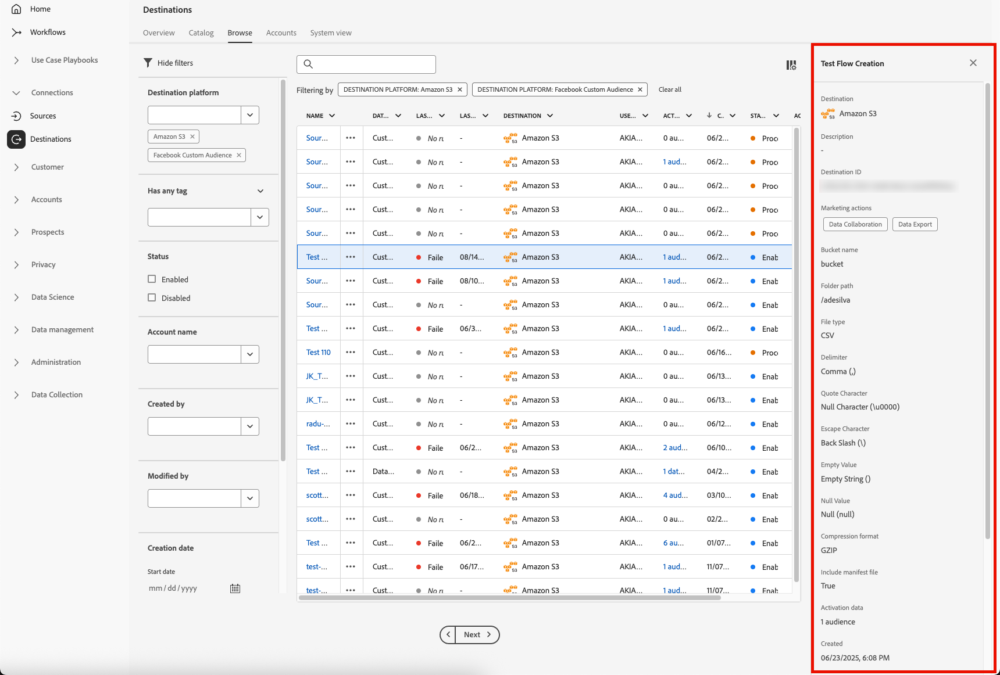

# Area di lavoro Destinazioni {#destinations-workspace}

In Adobe Experience Platform, selezionare **[!UICONTROL Destinations]** dalla barra di navigazione a sinistra per accedere all&#39;area di lavoro [!UICONTROL Destinations].

L&#39;area di lavoro di [!UICONTROL Destinations] è composta da quattro sezioni, [!UICONTROL Catalog], [!UICONTROL Browse], [!UICONTROL Accounts] e [!UICONTROL System View], descritte nelle sezioni seguenti.

## [!UICONTROL Catalog] {#catalog}

La scheda **[!UICONTROL Catalog]** visualizza un elenco di tutte le destinazioni disponibili in Piattaforma, a cui è possibile inviare i dati.

L&#39;interfaccia utente della piattaforma fornisce una serie di opzioni di ricerca e filtro nella pagina del catalogo delle destinazioni:

* Utilizzate la funzionalità di ricerca sulla pagina per individuare una destinazione specifica.
* Filtrare le destinazioni utilizzando il controllo [!UICONTROL Categories].
* Passa da [!UICONTROL All destinations] a [!UICONTROL My destinations]. Se è selezionata l&#39;opzione **[!UICONTROL All destinations]**, vengono visualizzate tutte le destinazioni della piattaforma disponibili. Quando si seleziona **[!UICONTROL My destinations]**, è possibile visualizzare solo le destinazioni con le quali è stata stabilita una connessione.
* Selezionare per visualizzare **[!UICONTROL Connections]** e/o **[!UICONTROL Extensions]**. Per comprendere la differenza tra le due categorie, vedere [Tipi di destinazione e categorie](../destination-types.md).

Le schede di destinazione contengono un controllo **[!UICONTROL Configure]** o **[!UICONTROL Activate]** e un controllo secondario che offre più opzioni. Sono descritti di seguito:

| Control | Descrizione |
---------|----------
| [!UICONTROL Configure] | Consente di creare una connessione alla destinazione. |
| [!UICONTROL Activate] | Una volta stabilita una connessione alla destinazione, puoi attivare i segmenti. |
| [!UICONTROL View account] | Visualizza gli account che hai connesso per una destinazione. |
| [!UICONTROL View dataflows] | Visualizzare i flussi di attivazione dei dati esistenti per una destinazione. |
| [!UICONTROL View documentation] | Consente di aprire un collegamento alla pagina della documentazione relativa alla destinazione specifica, per ulteriori informazioni e per facilitare la configurazione. |

Selezionate una scheda di destinazione nel catalogo per aprire la barra laterale destra.  Qui potete vedere una descrizione della destinazione. La barra a destra fornisce gli stessi controlli descritti nella tabella precedente, nonché una descrizione della destinazione e un&#39;indicazione della categoria e del tipo di destinazione.

Per ulteriori informazioni sulle categorie di destinazione e informazioni su ciascuna destinazione, vedere i [Catalogo di destinazione](../catalog/overview.md) e [Tipi e categorie di destinazione](../destination-types.md).

## [!UICONTROL Accounts] {#accounts}

Nella scheda **[!UICONTROL Accounts]** potete trovare ulteriori informazioni sulle connessioni stabilite con diverse destinazioni. Vedi la tabella seguente per tutte le informazioni che puoi ottenere su ogni destinazione:

>[!TIP]
>
>Utilizzare il pulsante  nella colonna **[!UICONTROL Platform]** per creare una nuova connessione di destinazione per tale account.

| Elemento | Descrizione |
---------|----------
| [!UICONTROL Platform] | Destinazione per la quale è stata impostata la connessione. |
| [!UICONTROL Connection Type] | Rappresenta il tipo di connessione al bucket di archiviazione o alla destinazione. <ul><li>Per le destinazioni di e-mail marketing: Può essere S3 o FTP.</li><li>Per le destinazioni pubblicitarie in tempo reale: Server-to-server</li><li>Per  destinazioni di archiviazione cloud Amazon S3: Chiave di accesso </li><li>Per le destinazioni di archiviazione cloud SFTP: Autenticazione di base per SFTP</li></ul> |
| [!UICONTROL Username] | Il nome utente selezionato nella [procedura guidata di connessione della destinazione](../catalog/email-marketing/overview.md#connect-destination). |
| [!UICONTROL Destinations] | Rappresenta il numero di flussi di destinazione univoci con esito positivo collegati alle informazioni di base create per una destinazione. |
| [!UICONTROL Authorized] | Data in cui è stata autorizzata la connessione a questa destinazione. |

Inoltre, potete modificare o aggiornare le informazioni sull&#39;account. Selezionare il pulsante  nella colonna **[!UICONTROL Platform]** per modificare le informazioni dell&#39;account.

Per gli account che utilizzano un tipo di connessione `OAuth2`, è possibile selezionare **[!UICONTROL Reconnect OAuth]** per rinnovare le credenziali dell&#39;account.

Per gli account che utilizzano un tipo di connessione `Access Key` o `ConnectionString`, potete modificare le informazioni di autenticazione dell&#39;account, incluse informazioni quali ID di accesso, chiavi segrete o stringhe di connessione.

Dopo aver modificato i dettagli dell&#39;account, selezionate **[!UICONTROL Save]** per completare l&#39;aggiornamento.

## [!UICONTROL Browse] {#browse}

Nella scheda **[!UICONTROL Browse]** sono visualizzate le destinazioni con le quali è stata stabilita una connessione. Le destinazioni con l&#39;opzione **[!UICONTROL Enabled]** attivata impostano la destinazione su attiva e viceversa. Per visualizzare le destinazioni in cui i dati scorrono, selezionare **[!UICONTROL Segments]** > **[!UICONTROL Browse]** e selezionare un segmento da esaminare. Per tutte le informazioni fornite per ciascuna destinazione, consultate la tabella seguente nella scheda Sfoglia:

>[!TIP]
>
>Utilizzare il pulsante  nella colonna **[!UICONTROL Name]** per attivare altri segmenti in quella destinazione.

| Elemento | Descrizione |
---------|----------
| Nome | Nome fornito per il flusso di attivazione a questa destinazione. |
| [!UICONTROL Destination] | La piattaforma di destinazione selezionata per il flusso di attivazione. |
| [!UICONTROL Connection Type] | Rappresenta il tipo di connessione al bucket di archiviazione o alla destinazione. <ul><li>Per le destinazioni di e-mail marketing: Può essere S3 o FTP.</li><li>Per le destinazioni pubblicitarie in tempo reale: Server-to-server</li></ul> |
| [!UICONTROL Username] | Le credenziali account selezionate per il flusso di destinazione. |
| [!UICONTROL Segments] | Il numero di segmenti che vengono attivati in questa destinazione. |
| [!UICONTROL Created] | Data e ora UTC alla quale è stato creato il flusso di attivazione per la destinazione. |
| [!UICONTROL Status] | `Active` oppure `Inactive`. Indica se i dati sono attualmente attivati per questa destinazione. Per modificare lo stato, vedere [Disattivazione](./activate-destinations.md#disable-activation). |

Fai clic su una riga di destinazione per visualizzare ulteriori informazioni sulla destinazione nella barra a destra.

Selezionate il nome di destinazione per visualizzare informazioni sui segmenti attivati per questa destinazione. Fare clic su **[!UICONTROL Edit activation]** per modificare o aggiungere i segmenti che vengono inviati a questa destinazione.

## [!UICONTROL System View] {#system-view}

La scheda **[!UICONTROL System View]** visualizza una rappresentazione grafica dei flussi di attivazione impostati nell&#39;Adobe Experience Platform.

Selezionate una delle destinazioni visualizzate sulla pagina e premete **[!UICONTROL View flows]** per visualizzare informazioni su tutte le connessioni configurate per ciascuna destinazione.

