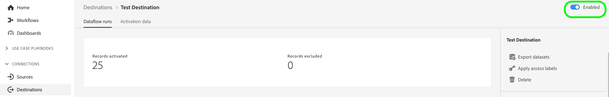

# Modifica flussi di dati di attivazione {#edit-activation-flows}

In Adobe Experience Platform, puoi configurare vari componenti dei flussi di dati di attivazione esistenti per le destinazioni, ad esempio:

* [Attiva o disattiva](#enable-disable-dataflows) flussi di dati di attivazione;
* [Aggiungere ulteriori tipi di pubblico e attributi di profilo](#add-audiences) ai flussi di dati di attivazione;
* [Aggiungere set di dati aggiuntivi](#add-datasets) ai flussi di lavoro di attivazione;
* [Modifica nomi e descrizioni](#edit-names-descriptions) per i flussi di dati di attivazione;

<!-- * [Apply access labels](#apply-access-labels) to exported data; -->

## Sfoglia flussi di dati di attivazione {#browse-activation-dataflows}

Segui i passaggi seguenti per sfogliare i flussi di dati di attivazione esistenti e identificare quello che desideri modificare.

1. Accedi a [interfaccia utente Experience Platform](https://platform.adobe.com/) e seleziona **[!UICONTROL Destinazioni]** dalla barra di navigazione a sinistra. Seleziona **[!UICONTROL Sfoglia]** dall&#39;intestazione superiore per visualizzare i flussi di dati di destinazione esistenti.

   

2. Seleziona l&#39;icona del filtro  in alto a sinistra per avviare il pannello di ordinamento. Il pannello Ordinamento fornisce un elenco di tutte le destinazioni. Puoi selezionare più di una destinazione dall’elenco per visualizzare una selezione filtrata di flussi di dati associati alla destinazione selezionata.

   

3. Seleziona il nome del flusso di dati di destinazione da modificare.

   

4. Viene visualizzata la pagina **[!UICONTROL Flusso di dati in esecuzione]** per la destinazione, con i relativi controlli disponibili. A seconda del tipo di destinazione, puoi eseguire varie operazioni di flusso di dati. Consulta le sezioni successive per ogni operazione di flusso di dati supportata.

## Abilitare o disabilitare i flussi di dati di attivazione {#enable-disable-dataflows}

Utilizza l&#39;interruttore **[!UICONTROL Enabled]/[!UICONTROL Disabled]** per avviare o sospendere tutte le esportazioni di dati nella destinazione.

## Aggiungere tipi di pubblico a un flusso di dati di attivazione {#add-audiences}

Seleziona **[!UICONTROL Attiva pubblico]** nella barra a destra per modificare i tipi di pubblico o gli attributi del profilo da inviare alla destinazione. Questa azione ti porta al flusso di lavoro di attivazione, che varia a seconda del tipo di destinazione.

Per ulteriori informazioni sui flussi di lavoro di attivazione per ciascun tipo di destinazione, consulta le seguenti guide:

* [Attiva i tipi di pubblico nelle destinazioni di streaming](./activate-segment-streaming-destinations.md) (ad esempio, Facebook o Twitter);
* [Attiva i tipi di pubblico nelle destinazioni di esportazione del profilo batch](./activate-batch-profile-destinations.md) (ad esempio, Amazon S3 o Oracle Eloqua);
* [Attiva i tipi di pubblico nelle destinazioni di esportazione del profilo di streaming](./activate-streaming-profile-destinations.md) (ad esempio, API HTTP o Amazon Kinesis).

## Aggiungere set di dati a un flusso di dati di attivazione {#add-datasets}

Seleziona **[!UICONTROL Esporta set di dati]** nella barra a destra per selezionare set di dati aggiuntivi da esportare nella destinazione. Questa opzione consente di accedere al [flusso di lavoro di esportazione del set di dati](export-datasets.md).

>[!NOTE]
>
>Questa opzione è visibile solo per [destinazioni che supportano l&#39;esportazione del set di dati](export-datasets.md#supported-destinations).

<!-- ## Apply access labels {#apply-access-labels}

Select **[!UICONTROL Apply access labels]** to edit the data usage labels for the exported data. See the [data usage labels documentation](../../data-governance/labels/overview.md) to learn more.

 -->

## Modifica nomi e descrizioni dei flussi di dati di attivazione {#edit-names-descriptions}

Per modificare il nome e la descrizione del flusso di dati di attivazione, utilizza i campi **[!UICONTROL Nome destinazione]** e **[!UICONTROL Descrizione]**.

## Passaggi successivi {#next-steps}

Seguendo questa esercitazione, hai utilizzato correttamente l&#39;area di lavoro **[!UICONTROL destinazioni]** per aggiornare i flussi di dati di destinazione esistenti.

Per ulteriori informazioni sulle destinazioni, consulta la [panoramica sulle destinazioni](../catalog/overview.md).
