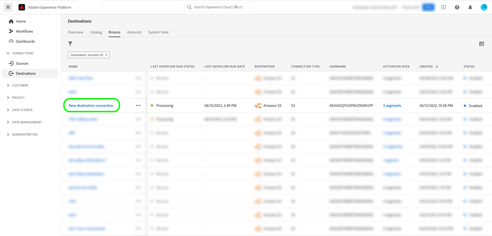

# Esportare file on-demand in destinazioni batch utilizzando l’interfaccia utente di Experience Platform

>[!IMPORTANT]
> 
>Per attivare i dati, è necessario **[!UICONTROL Visualizza destinazioni]**, **[!UICONTROL Attiva destinazioni]**, **[!UICONTROL Visualizza profili]** e **[!UICONTROL Visualizza segmenti]** [Autorizzazioni di controllo di accesso](/help/access-control/home.md#permissions). Leggi la [panoramica sul controllo degli accessi](/help/access-control/ui/overview.md) o contatta l&#39;amministratore del prodotto per ottenere le autorizzazioni necessarie.

## Panoramica su **[!UICONTROL Esporta file ora]** {#overview}

>[!CONTEXTUALHELP]
>id="platform_destinations_activationchaining_activatenow"
>title="Esporta subito i file"
>abstract="Seleziona questa opzione per fornire un’esportazione di file completa in aggiunta a eventuali esportazioni già pianificate. L’esportazione dei file viene attivata subito e raccoglie i risultati più recenti delle esecuzioni di segmentazione di Experience Platform."

In questo articolo viene descritto come utilizzare il interfaccia Experience Platform per esportare file su richiesta in destinazioni batch, ad esempio [l&#39;archiviazione](/help/destinations/catalog/cloud-storage/overview.md) cloud e [le destinazioni marketing via e-mail](/help/destinations/catalog/email-marketing/overview.md) .

Il **[!UICONTROL controllo Esporta file consente]** ora di esportare un file completo senza interrompere il programmare di esportazione corrente di un pubblico pianificato in precedenza. Questa esportazione si verifica in aggiunta alle esportazioni pianificate in precedenza e non modifica la frequenza di esportazione del pubblico. L’esportazione dei file viene attivata subito e raccoglie i risultati più recenti delle esecuzioni di segmentazione di Experience Platform.

A questo scopo puoi anche utilizzare le API di Experience Platform. Scopri come [attivare le audience on-demand per distribuire destinazioni batch tramite l&#39;API](/help/destinations/api/ad-hoc-activation-api.md) di attivazione annuncio-hoc.

## Prerequisiti {#prerequisites}

Per esportare i file su richiesta in destinazioni batch, è necessario avere [connesso a una destinazione](./connect-destination.md). Se non lo hai già fatto, vai al [catalogo delle destinazioni](../catalog/overview.md), sfoglia le destinazioni supportate e configura la destinazione che desideri utilizzare.

## Come esportare i file on-demand {#how-to-export-files-on-demand}

1. Vai a **[!UICONTROL Connessioni > destinazioni]**, seleziona la scheda Sfoglia **e il simbolo del filtro per mostrare le** connessioni esistenti alle destinazioni batch desiderate.

   

2. Seleziona la connessione di destinazione desiderata per esaminare il flusso di dati esistente verso la destinazione.

   

3. Selezionare il **[!UICONTROL scheda di dati]** Activation e selezionare i tipi di pubblico per i quali si desidera esportare i file su richiesta, quindi selezionare il **[!UICONTROL controllo Esporta file ora]** per attivare un&#39;esportazione una tantum che consegnerà un file per ogni pubblico selezionato alla destinazione batch.

   

4. Seleziona **[!UICONTROL Sì]** per confermare e attivare l&#39;esportazione del file.

   

5. Viene visualizzato un messaggio di conferma che informa dell&#39;avvio dell&#39;esportazione del file.

   

6. Puoi anche passare alla scheda **[!UICONTROL Esecuzioni flusso di dati]** per verificare che l&#39;esportazione del file sia stata avviata.

## Considerazioni {#considerations}

Quando si utilizza il **[!UICONTROL controllo Export file,]** tenere presenti le considerazioni seguenti:

* **[!UICONTROL Il file di esportazione ora]** funziona solo per i tipi di pubblico la cui programmare nel flusso di dati di attivazione batch si sovrappone alla data corrente. Sono inclusi i tipi di pubblico con pianificazioni che non hanno una data di fine (frequenza di esportazione di Una volta **) o in cui la data di** fine non è ancora passata.
* Quando si aggiunge un pubblico a un flusso di dati esistente, attendere almeno **un&#39;ora** prima di usare il **[!UICONTROL controllo Esporta file ora]** .
* Se si modifica il regola di unione di un pubblico o se si crea un pubblico che utilizza un nuovo regola di unione, attendere 24 ore prima di utilizzare il **[!UICONTROL controllo Esporta file ora]** .

## interfaccia messaggi di errore {#ui-error-messages}

Quando si utilizza il **[!UICONTROL controllo Esporta file ora]** , è possibile che si verifichi uno dei messaggi di errore elencati di seguito. Rivedi la tabella per capire come gestirli quando vengono visualizzati.

| Messaggio di errore | Risoluzione |
|---------|----------|
| Esecuzione già in corso per il pubblico `segment ID` per l&#39;ordine `dataflow ID` con ID esecuzione `flow run ID` | Questo messaggio di errore indica che è attualmente in corso un flusso di attivazione annuncio-hoc per un pubblico. Attendere il completamento del processo prima di attivare nuovamente il processo di attivazione. |
| `<segment name>` Audiences non fanno parte di questo flusso di dati o sono fuori programmare intervallo. | Questo messaggio di errore indica che i tipi di pubblico selezionati per l&#39;attivazione non sono mappati al flusso di dati o che il programmare di attivazione configurato per i tipi di pubblico è scaduto o non è ancora iniziato. Controlla se il pubblico è effettivamente mappato al flusso di dati e verifica che l&#39;attivazione del pubblico programmare si sovrapponga alla data attuale. |

## Informazioni correlate {#related-information}

* [Attiva i tipi di pubblico in destinazioni batch on-demand utilizzando le API di Experience Platform](/help/destinations/api/ad-hoc-activation-api.md)
* [Attivare i dati del pubblico nelle destinazioni di esportazione del profilo batch](/help/destinations/ui/activate-batch-profile-destinations.md)
