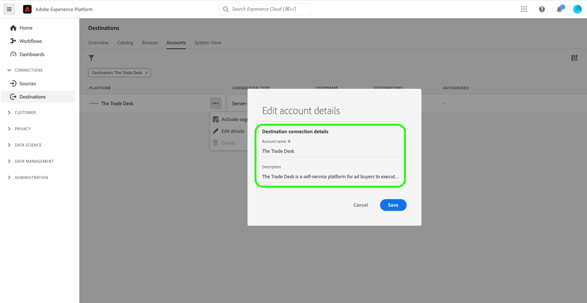

# Aggiorna account di destinazione

## Panoramica {#overview}

Il **[!UICONTROL Account]** Questa scheda mostra i dettagli sulle connessioni stabilite con varie destinazioni. Consulta la sezione [Panoramica sugli account](../ui/destinations-workspace.md#accounts) per tutte le informazioni che puoi ottenere su ciascun account di destinazione.

Questo tutorial illustra i passaggi necessari per aggiornare i dettagli dell’account di destinazione utilizzando l’interfaccia utente di Experience Platform.

Puoi aggiornare i dettagli dell’account di destinazione per aggiornare e autenticare nuovamente le credenziali per gli account correnti o scaduti per le destinazioni attualmente in uso. In genere, i token OAuth e bearer hanno una durata limitata, a seconda della piattaforma di destinazione. Quando questi token scadono, puoi aggiornarli nel flusso di lavoro descritto di seguito. Questo flusso di lavoro ti indirizza a passare attraverso il flusso di lavoro OAuth o a reinserire un token. Analogamente, se nella piattaforma a valle è stata modificata una password o un accesso utente, è possibile aggiornare le credenziali.

Per le destinazioni batch, puoi aggiornare l’accesso o la chiave segreta, se è stata modificata una di queste. Inoltre, se si desidera crittografare i file in futuro, è possibile inserire una chiave pubblica RSA e i file esportati verranno crittografati in futuro.

## Aggiorna account {#update}

Per aggiornare i dettagli di connessione alle destinazioni esistenti, segui la procedura riportata di seguito.

1. Accedi a [Interfaccia utente Experience Platform](https://platform.adobe.com/) e seleziona **[!UICONTROL Destinazioni]** dalla barra di navigazione a sinistra. Seleziona **[!UICONTROL Account]** nell’intestazione in alto per visualizzare i tuoi account esistenti.

   

2. Seleziona l’icona del filtro  in alto a sinistra per avviare il pannello ordina. Il pannello Ordinamento fornisce un elenco di tutte le destinazioni. Puoi selezionare più di una destinazione dall’elenco per visualizzare una selezione filtrata di account associati alle destinazioni selezionate.

   

3. Seleziona i puntini di sospensione (`...`) accanto al nome dell&#39;account che si desidera aggiornare. Viene visualizzato un pannello a comparsa che fornisce le opzioni per **[!UICONTROL Attiva tipi di pubblico]**, **[!UICONTROL Modifica dettagli]**, e **[!UICONTROL Elimina]** l’account. Seleziona la  **[!UICONTROL Modifica dettagli]** per modificare le informazioni sull&#39;account.

   

4. Immetti le credenziali dell&#39;account aggiornate.

   * Per gli account che utilizzano un `OAuth1` o `OAuth2` tipo di connessione, seleziona **[!UICONTROL Riconnetti OAuth]** per rinnovare le credenziali dell&#39;account. Puoi anche aggiornare il nome e la descrizione dell’account.

   

   * Per gli account che utilizzano un `Access Key` o `ConnectionString` tipo di connessione, puoi modificare le informazioni di autenticazione dell’account, tra cui l’ID di accesso, le chiavi segrete o le stringhe di connessione. Puoi anche aggiornare il nome e la descrizione dell’account.

   

   * Per gli account che utilizzano `Bearer token` tipo di connessione, se necessario, puoi inserire un nuovo token bearer. Puoi anche aggiornare il nome e la descrizione dell’account.

   

   * Per gli account che utilizzano `Server to server` tipo di connessione, puoi aggiornare il nome e la descrizione dell’account.

   

5. Seleziona **[!UICONTROL Salva]** per completare l&#39;aggiornamento dei dettagli dell&#39;account.

## Passaggi successivi

Seguendo questa esercitazione, hai utilizzato correttamente il **[!UICONTROL destinazioni]** per aggiornare gli account esistenti.

Per ulteriori informazioni sulle destinazioni, consulta [panoramica sulle destinazioni](../catalog/overview.md).