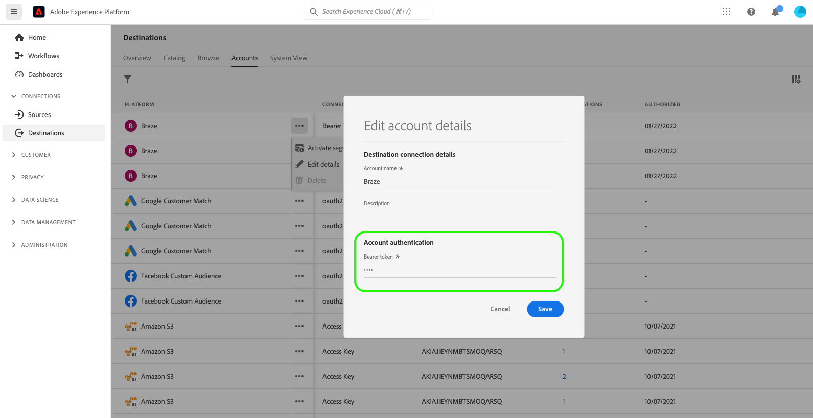

# Aggiorna account di destinazione

## Panoramica {#overview}

La **[!UICONTROL Account]** La scheda ti mostra i dettagli sulle connessioni che hai stabilito con diverse destinazioni. Fai riferimento a [Panoramica account](../ui/destinations-workspace.md#accounts) per tutte le informazioni che puoi ottenere su ogni account di destinazione.

Questa esercitazione descrive i passaggi per aggiornare i dettagli dell’account di destinazione utilizzando l’interfaccia utente di Experience Platform.

È possibile aggiornare i dettagli dell&#39;account di destinazione per aggiornare e autenticare nuovamente le credenziali per gli account correnti o scaduti per le destinazioni attualmente in uso. In genere, i token OAuth e bearer hanno una durata limitata, a seconda della piattaforma di destinazione. Quando questi token scadono, puoi aggiornarli nel flusso di lavoro descritto più avanti. Questo flusso di lavoro ti indirizza al flusso di lavoro OAuth o reinserisce un token. Analogamente, se una password o l&#39;accesso utente sono stati modificati nella piattaforma downstream, puoi aggiornare le credenziali.

Per le destinazioni batch, puoi aggiornare la chiave di accesso o la chiave segreta, se una di queste è cambiata. Inoltre, se desideri crittografare i file in futuro, puoi inserire una chiave pubblica RSA e i file esportati verranno crittografati in futuro.

## Aggiorna account {#update}

Per aggiornare i dettagli di connessione alle destinazioni esistenti, effettua le seguenti operazioni.

1. Accedi a [Interfaccia utente Experience Platform](https://platform.adobe.com/) e seleziona **[!UICONTROL Destinazioni]** dalla barra di navigazione a sinistra. Seleziona **[!UICONTROL Account]** dall&#39;intestazione superiore per visualizzare gli account esistenti.

   

2. Seleziona l’icona del filtro  in alto a sinistra per avviare il pannello di ordinamento. Il pannello di ordinamento fornisce un elenco di tutte le destinazioni. Puoi selezionare più di una destinazione dall’elenco per visualizzare una selezione filtrata di account associati alle destinazioni selezionate.

   

3. Seleziona i puntini di sospensione (`...`) accanto al nome dell’account che si intende aggiornare. Viene visualizzato un pannello a comparsa che fornisce le opzioni per **[!UICONTROL Attivare i segmenti]**, **[!UICONTROL Modifica dettagli]** e **[!UICONTROL Elimina]** il conto. Seleziona la  **[!UICONTROL Modifica dettagli]** per modificare le informazioni sull&#39;account.

   

4. Immetti le credenziali account aggiornate.

   * Per gli account che utilizzano un `OAuth1` o `OAuth2` tipo di connessione, selezionare **[!UICONTROL Riconnettere OAuth]** per rinnovare le credenziali del tuo account. Puoi anche aggiornare il nome e la descrizione del tuo account.

   

   * Per gli account che utilizzano un `Access Key` o `ConnectionString` tipo di connessione, puoi modificare le informazioni di autenticazione dell’account, incluse informazioni quali ID di accesso, chiavi segrete o stringhe di connessione. Puoi anche aggiornare il nome e la descrizione del tuo account.

   

   * Per account che utilizzano un `Bearer token` tipo di connessione, se necessario puoi inserire un nuovo token portatore. Puoi anche aggiornare il nome e la descrizione del tuo account.

   

   * Per account che utilizzano un `Server to server` tipo di connessione, è possibile aggiornare il nome e la descrizione dell&#39;account.

   

5. Seleziona **[!UICONTROL Salva]** per completare l&#39;aggiornamento dei dettagli dell&#39;account.

## Passaggi successivi

Seguendo questa esercitazione, hai utilizzato correttamente il **[!UICONTROL destinazioni]** per aggiornare gli account esistenti.

Per ulteriori informazioni sulle destinazioni, consulta [panoramica sulle destinazioni](../catalog/overview.md).