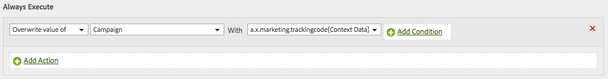

# Utilizzo di Adobe Analytics con Platform Web SDK

Adobe Experience Platform [!DNL Web SDK] può inviare dati ad Adobe Analytics. Questo funziona traducendo `xdm` in un formato utilizzabile da Adobe Analytics.

## Configurazione

Adobe Analytics raccoglie automaticamente i dati che invii se disponi di una suite di rapporti mappata nell’interfaccia utente di configurazione del cliente. Qui puoi mappare uno o più rapporti per una determinata configurazione. Dopo aver mappato una suite di rapporti, i dati iniziano automaticamente a scorrere.

## Gruppo di campi XDM

Per acquisire più facilmente le metriche di Adobe Analytics più comuni, forniamo un gruppo di campi di Analytics che puoi utilizzare. Per ulteriori dettagli su questo schema, consulta la documentazione del [Gruppo di campi schema Estensione completa Adobe Analytics ExperienceEvent](../../../xdm/field-groups/event/analytics-full-extension.md)

## Dati mappati automaticamente

Adobe Experience Platform [!DNL Edge Network] mappa automaticamente molte variabili XDM. È elencato l’elenco completo di tali variabili [qui](automatically-mapped-vars.md).

## Dati mappati manualmente

Qualsiasi dato che non viene mappato automaticamente da [!DNL Edge Network] accessibile tramite regole di elaborazione. I dati vengono appiattiti utilizzando la notazione del punto e sono disponibili come contextData.

Se avevi uno schema simile a questo.

```javascript
{
  key:value,
  object:{
    key1:value1,
    key2:value2
  },
  array:[
    "v0",
    "v1",
    "v2"
  ],
  arrayofobjects:[
    {
      obj1key:objval0
    },
    {
      obj2key:objval1
    }
  ]
}
```

Saranno quindi disponibili le chiavi di dati contestuali.

```javascript
a.x.key //value
a.x.object.key1 //value1
a.x.object.key2 //value2
a.x.array.0 //v0
a.x.array.1 //v1
a.x.array.2 //v2
a.x.arrayofobjects.0.obj1key //objval0
a.x.arrayofobjects.1.obj2key //objval1
```

Di seguito è riportato un esempio di regola di elaborazione che utilizzerebbe questi dati.



>[!NOTE]
>
>Con la raccolta di reti Edge, tutti gli eventi vengono inviati ad Analytics e a qualsiasi altro servizio configurato per lo stream di dati. Ad esempio, se hai sia Analytics che Target configurati come servizi e effettui chiamate separate per la personalizzazione e per Analytics, entrambi gli eventi verranno inviati ad Analytics e a Target. Questi eventi verranno registrati nei rapporti di Analytics e possono influenzare metriche quali il tasso di mancato recapito.
