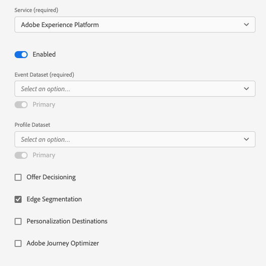

# Configurare un datastream

Questo documento descrive i passaggi per la configurazione di un [datastream](./overview.md) nell’interfaccia utente di .

## Accedere al [!UICONTROL Datastreams] workspace

Puoi creare e gestire i datastreams nell’interfaccia utente di raccolta dati o di Experience Platform selezionando **[!UICONTROL Datastreams]** nella navigazione a sinistra.

La **[!UICONTROL Datastreams]** visualizza un elenco dei datastreams esistenti, con il relativo nome descrittivo, ID e data dell’ultima modifica. Selezionare il nome di un datastream in [visualizzare i dettagli e configurare i servizi](#view-details).

Seleziona l’icona &quot;Altro&quot; (**...**) per un particolare datastream per rivelare più opzioni. Seleziona **[!UICONTROL Modifica]** per aggiornare [configurazione di base](#configure) per il datastream, oppure seleziona **[!UICONTROL Elimina]** per rimuovere il datastream.

## Crea un nuovo datastream {#create}

Per creare un datastream, inizia selezionando **[!UICONTROL Nuovo Datastream]**.

Viene visualizzato il flusso di lavoro di creazione del datastream, a partire dal passaggio di configurazione. Da qui, devi fornire un nome e una descrizione facoltativa per il datastream.

Se stai configurando questo datastream per l’utilizzo in Experience Platform e stai utilizzando l’SDK per web di Platform, devi anche selezionare un [schema Experience Data Model (XDM) basato su eventi](../../xdm/classes/experienceevent.md) per rappresentare i dati che intendi acquisire.

Seleziona **[!UICONTROL Opzioni avanzate]** per visualizzare controlli aggiuntivi per configurare il datastream.

 {#advanced-options}

| Impostazione | Descrizione |
| --- | --- |
| [!UICONTROL Posizione geografica] | Determina se si verificano ricerche di geolocalizzazione in base all&#39;indirizzo IP dell&#39;utente. Impostazione predefinita **[!UICONTROL Nessuno]** disabilita eventuali ricerche di geolocalizzazione, mentre il **[!UICONTROL Città]** fornisce le coordinate GPS a due posizioni decimali. La geolocalizzazione si verifica prima [!UICONTROL Offuscamento IP] e non è influenzato dal  [!UICONTROL Offuscamento IP] impostazione. |
| [!UICONTROL Offuscamento IP] | Indica il tipo di offuscamento IP da applicare al datastream. Qualsiasi elaborazione basata sull’IP del cliente sarà influenzata dall’impostazione di oscuramento dell’IP. Questo include tutti i servizi Experience Cloud che ricevono i dati dal tuo datastream. 
Opzioni disponibili:
 <ul><li>**[!UICONTROL Nessuno]**: Disattiva l’offuscamento dell’IP. L&#39;indirizzo IP dell&#39;utente completo verrà inviato tramite il datastream.</li><li>**[!UICONTROL Parziale]**: Per gli indirizzi IPv4, offusca l’ultimo ottetto dell’indirizzo IP dell’utente. Per gli indirizzi IPv6, offusca gli ultimi 80 bit dell’indirizzo. 
Esempi:
 <ul><li>IPv4: `1.2.3.4` -> `1.2.3.0`</li><li>IPv6: `2001:0db8:1345:fd27:0000:ff00:0042:8329` -> `2001:0db8:1345:0000:0000:0000:0000:0000`</li></ul></li><li>**[!UICONTROL Completo]**: Offusca l’intero indirizzo IP. 
Esempi:
 <ul><li>IPv4: `1.2.3.4` -> `0.0.0.0`</li><li>IPv6: `2001:0db8:1345:fd27:0000:ff00:0042:8329` -> `::/128`</li></ul></li></ul> Impatto dell’offuscamento dell’IP su altri prodotti Adobe: <ul><li>**Adobe Target**: Livello datastream [!UICONTROL Offuscamento IP] ha la precedenza su qualsiasi opzione di offuscamento dell’IP impostata in Adobe Target. Ad esempio, se il livello di datastream [!UICONTROL Offuscamento IP] è impostata su **[!UICONTROL Completo]** e l&#39;opzione di offuscamento dell&#39;IP di Adobe Target è impostata su **[!UICONTROL Ultima offuscamento dell&#39;ottetto]**, Adobe Target riceverà un IP completamente offuscato. Consulta la documentazione di Adobe Target su [Offuscamento IP](https://developer.adobe.com/target/before-implement/privacy/privacy/) e [geolocalizzazione](https://experienceleague.adobe.com/docs/target/using/audiences/create-audiences/categories-audiences/geo.html?lang=en) per ulteriori dettagli.</li><li>**Audience Manager**: L’impostazione di offuscamento dell’IP a livello di datastream ha la precedenza su qualsiasi opzione di offuscamento dell’IP impostata nell’Audience Manager e viene applicata a tutti gli indirizzi IP. Qualsiasi ricerca di geolocalizzazione eseguita da Audience Manager è influenzata dal livello del datastream [!UICONTROL Offuscamento IP] opzione . Una ricerca di geolocalizzazione in Audience Manager, basata su un IP completamente offuscato, comporterà una regione sconosciuta e tutti i segmenti basati sui dati di geolocalizzazione risultanti non verranno realizzati. Vedi la documentazione di Audience Manager su [Offuscamento IP](https://experienceleague.adobe.com/docs/audience-manager/user-guide/features/administration/ip-obfuscation.html?lang=en) per ulteriori dettagli.</li><li>**Adobe Analytics**: I dati inviati ad Adobe Analytics non sono interessati dal livello di datastream [!UICONTROL Offuscamento IP] impostazione. Al momento Adobe Analytics riceve indirizzi IP non offuscati. Affinché Analytics possa ricevere indirizzi IP offuscati, devi configurare l’offuscamento dell’IP separatamente, in Adobe Analytics. Questo comportamento verrà aggiornato nelle versioni future. Vedi Adobe Analytics [documentazione](https://experienceleague.adobe.com/docs/analytics/admin/admin-tools/manage-report-suites/edit-report-suite/report-suite-general/general-acct-settings-admin.html) per informazioni dettagliate su come abilitare l’offuscamento dell’IP in Analytics.</li></ul> |
| [!UICONTROL Cookie ID di prime parti] | Quando questa impostazione è abilitata, indica alla rete Edge di fare riferimento a un cookie specificato durante la ricerca di un [ID dispositivo di prime parti](../identity/first-party-device-ids.md), anziché cercare questo valore nella mappa identità.  Quando abiliti questa impostazione, devi fornire il nome del cookie in cui deve essere memorizzato l’ID. |
| [!UICONTROL Sincronizzazione ID di terze parti] | Le sincronizzazioni ID possono essere raggruppate in contenitori per consentire l’esecuzione di sincronizzazioni ID diverse in momenti diversi. Quando abilitata, questa impostazione consente di specificare quale contenitore di sincronizzazioni ID viene eseguito per questo datastream. |
| [!UICONTROL ID di terze parti ID ID del contenitore di sincronizzazione ID] | ID numerico del contenitore da utilizzare per la sincronizzazione ID di terze parti. |
| [!UICONTROL Ignorare gli ID contenitore] | In questa sezione puoi definire ID contenitore di sincronizzazione ID di terze parti aggiuntivi da utilizzare per sostituire quello predefinito. |
| [!UICONTROL Tipo di accesso] | Definisce il tipo di autenticazione che la rete Edge accetta per il datastream. <ul><li>**[!UICONTROL Autenticazione mista]**: Quando questa opzione è selezionata, la rete Edge accetta richieste autenticate e non autenticate. Seleziona questa opzione quando intendi usare l’SDK per web o [SDK per dispositivi mobili](https://aep-sdks.gitbook.io/docs/), insieme al [API server](../../server-api/overview.md). </li><li>**[!UICONTROL Solo autenticazione]**: Quando questa opzione è selezionata, la rete Edge accetta solo richieste autenticate. Selezionare questa opzione quando si intende utilizzare solo l&#39;API server e si desidera impedire l&#39;elaborazione di richieste non autenticate da parte della rete Edge.</li></ul> |

Da qui, se stai configurando il tuo datastream per Experience Platform, segui l&#39;esercitazione su [Preparazione per la raccolta dei dati](./data-prep.md) per mappare i dati su uno schema evento Platform prima di tornare a questa guida. In caso contrario, seleziona **[!UICONTROL Salva]** e passa alla sezione successiva.

## Visualizza i dettagli del datastream {#view-details}

Dopo aver configurato un nuovo datastream o selezionato uno esistente da visualizzare, viene visualizzata la pagina dei dettagli per quel datastream. Qui puoi trovare ulteriori informazioni sul datastream, compreso il relativo ID.

Dalla schermata dei dettagli del datastream, puoi [aggiungi servizi](#add-services) per abilitare le funzionalità dei prodotti Adobe Experience Cloud a cui hai accesso. È inoltre possibile modificare il [configurazione di base](#create), aggiorna [regole di mappatura](./data-prep.md), [copia il datastream](#copy)oppure eliminalo completamente.

## Aggiungere servizi a un datastream {#add-services}

Nella pagina dei dettagli di un datastream, seleziona **[!UICONTROL Aggiungi servizio]** per iniziare ad aggiungere i servizi disponibili per quel datastream.

Nella schermata successiva, utilizza il menu a discesa per selezionare un servizio da configurare per questo datastream. In questo elenco verranno visualizzati solo i servizi a cui hai accesso.

Seleziona il servizio desiderato, compila le opzioni di configurazione visualizzate, quindi seleziona **[!UICONTROL Salva]** per aggiungere il servizio al datastream. Tutti i servizi aggiunti vengono visualizzati nella visualizzazione dei dettagli del datastream.

Le sottosezioni seguenti descrivono le opzioni di configurazione per ogni servizio.

>[!NOTE]
>
>Ogni configurazione del servizio contiene un **[!UICONTROL Abilitato]** attiva automaticamente quando il servizio è selezionato. Per disabilitare il servizio selezionato per questo datastream, seleziona il **[!UICONTROL Abilitato]** scattare di nuovo.

### Impostazioni di Adobe Analytics {#analytics}

Questo servizio controlla se e come i dati vengono inviati ad Adobe Analytics. Ulteriori dettagli sono disponibili nella guida all&#39;indirizzo [invio di dati ad Analytics](../data-collection/adobe-analytics/analytics-overview.md).

| Impostazione | Descrizione |
| --- | --- |
| [!UICONTROL ID suite di rapporti] | **(Obbligatorio)** ID della suite di rapporti di Analytics a cui desideri inviare i dati. Questo ID si trova nell&#39;interfaccia utente di Adobe Analytics in [!UICONTROL Amministratore] > [!UICONTROL ReportSuites]. Se sono specificate più suite di rapporti, i dati vengono copiati in ciascuna suite di rapporti. |
| [!UICONTROL Override suite di rapporti] | In questa sezione puoi aggiungere ID suite di rapporti aggiuntivi da utilizzare per sostituire quello predefinito. |

### Impostazioni Adobe Audience Manager {#audience-manager}

Questo servizio controlla se e come i dati vengono inviati a Adobe Audience Manager. Tutto ciò che è necessario per inviare dati ad Audience Manager è quello di abilitare questa sezione. Le altre impostazioni sono facoltative ma incoraggiate.

| Impostazione | Descrizione |
| --- | --- |
| [!UICONTROL Destinazioni cookie abilitate] | Consente all’SDK di condividere le informazioni sui segmenti tramite [destinazioni cookie](https://experienceleague.adobe.com/docs/audience-manager/user-guide/features/destinations/custom-destinations/create-cookie-destination.html) da [!DNL Audience Manager]. |
| [!UICONTROL Destinazioni URL abilitate] | Consente all’SDK di condividere le informazioni sui segmenti tramite [Destinazioni URL](https://experienceleague.adobe.com/docs/audience-manager/user-guide/features/destinations/custom-destinations/create-url-destination.html) da [!DNL Audience Manager]. |

### Impostazioni Adobe Experience Platform {#aep}

>[!IMPORTANT]
>
>Quando abiliti un datastream per Platform, prendi nota della sandbox di Platform che stai utilizzando, come visualizzata nella barra multifunzione superiore dell’interfaccia utente.
>
>
>
>Le sandbox sono partizioni virtuali in Adobe Experience Platform che ti consentono di isolare i dati e le implementazioni da altre parti della tua organizzazione. Una volta creato un datastream, la relativa sandbox non può essere modificata. Per ulteriori dettagli sul ruolo delle sandbox in Experience Platform, consulta la sezione [documentazione sandbox](../../sandboxes/home.md).

Questo servizio controlla se e come i dati vengono inviati a Adobe Experience Platform.

| Impostazione | Descrizione |
|---| --- |
| [!UICONTROL Set di dati evento] | **(Obbligatorio)** Seleziona il set di dati della piattaforma a cui verranno inviati i dati evento cliente. Questo schema deve utilizzare [Classe ExperienceEvent XDM](../../xdm/classes/experienceevent.md). Per aggiungere altri set di dati, seleziona **[!UICONTROL Aggiungi set di dati evento]**. |
| [!UICONTROL Set di dati del profilo] | Seleziona il set di dati della piattaforma a cui verranno inviati i dati degli attributi del cliente. Questo schema deve utilizzare [Classe di profilo individuale XDM](../../xdm/classes/individual-profile.md). |
| [!UICONTROL Offer Decisioning] | Seleziona questa casella di controllo per abilitare l’Offer decisioning per un’implementazione Platform Web SDK. Consulta la guida su [utilizzo di Offer Decisioning con Platform Web SDK](../personalization/offer-decisioning/offer-decisioning-overview.md) per ulteriori dettagli sull’implementazione.  Per ulteriori informazioni sulle funzionalità di Offer Decisioning, consulta la [Documentazione di Adobe Journey Optimizer](https://experienceleague.adobe.com/docs/journey-optimizer/using/offer-decisioniong/get-started/starting-offer-decisioning.html?lang=it). |
| [!UICONTROL Segmentazione Edge] | Seleziona questa casella di controllo per abilitare [segmentazione dei bordi](../../segmentation/ui/edge-segmentation.md) per questo datastream. Quando l’SDK invia i dati tramite un datastream abilitato per la segmentazione edge, nella risposta vengono restituite tutte le appartenenze di segmenti aggiornate per il profilo in questione.  Questa opzione può essere utilizzata in combinazione con [!UICONTROL Destinazioni personalizzazione] per [casi d’uso per la personalizzazione di pagine successive](../../destinations/ui/configure-personalization-destinations.md). |
| [!UICONTROL Destinazioni personalizzazione] | Quando si attiva questa opzione dopo aver abilitato la [!UICONTROL Segmentazione Edge] questa opzione consente al datastream di connettersi a destinazioni di personalizzazione, ad esempio [Personalizzazione personalizzata](../../destinations/catalog/personalization/custom-personalization.md).  Fai riferimento alla documentazione sulle destinazioni per i passaggi specifici su [configurazione delle destinazioni di personalizzazione](../../destinations/ui/configure-personalization-destinations.md). |
| [!UICONTROL Adobe Journey Optimizer] | Seleziona questa casella di controllo per abilitare [Adobe Journey Optimizer](https://experienceleague.adobe.com/docs/journey-optimizer/using/ajo-home.html?lang=it) per questo datastream.    L’abilitazione di questa opzione consente al datastream di restituire contenuti personalizzati da campagne in entrata basate su web e app in [!DNL Adobe Journey Optimizer]. Questa opzione richiede [!UICONTROL Segmentazione Edge] essere attivo. Se [!UICONTROL Segmentazione Edge] non è selezionata, questa opzione è disattivata. |

### Impostazioni di Adobe Target {#target}

Questo servizio controlla se e come i dati vengono inviati ad Adobe Target.

| Impostazione | Descrizione |
| --- | --- |
| [!UICONTROL Token di proprietà] | [!DNL Target] consente ai clienti di controllare le autorizzazioni tramite l’uso delle proprietà. Per ulteriori informazioni sulle proprietà, consulta la guida su [configurazione delle autorizzazioni Enterprise](https://experienceleague.adobe.com/docs/target/using/administer/manage-users/enterprise/properties-overview.html) in [!DNL Target] documentazione.  Il token di proprietà si trova nell’interfaccia utente di Adobe Target in [!UICONTROL Configurazione] > [!UICONTROL Proprietà]. |
| [!UICONTROL ID ambiente di destinazione] | [Ambienti in Adobe Target](https://experienceleague.adobe.com/docs/target/using/administer/hosts.html) ti aiuta a gestire la tua implementazione in tutte le fasi di sviluppo. Questa impostazione specifica l&#39;ambiente da utilizzare con questo datastream.  Si consiglia di impostare questo valore in modo diverso per ogni `dev`, `stage`e `prod` ambienti datastream per semplificare le operazioni. Tuttavia, se hai già definito ambienti Adobe Target, puoi utilizzarli. |
| [!UICONTROL Spazio dei nomi ID di terze parti di Target] | Spazio dei nomi di identità per `mbox3rdPartyId` si desidera utilizzare per questo datastream. Consulta la guida su [implementazione `mbox3rdPartyId` con l’SDK per web](../personalization/adobe-target/using-mbox-3rdpartyid.md) per ulteriori informazioni. |
| [!UICONTROL Sostituzioni dei token di proprietà] | In questa sezione puoi definire token di proprietà aggiuntivi da utilizzare per sostituire quello predefinito. |

### [!UICONTROL Inoltro eventi] impostazioni

Questo servizio controlla se e come i dati vengono inviati a [inoltro eventi](../../tags/ui/event-forwarding/overview.md).

| Impostazione | Descrizione |
| --- | --- |
| [!UICONTROL Launch, proprietà] | **(Obbligatorio)** Proprietà di inoltro eventi a cui si desidera inviare i dati. |
| [!UICONTROL Ambiente Launch] | **(Obbligatorio)** Ambiente all’interno della proprietà selezionata a cui si desidera inviare i dati. |

>[!NOTE]
>
>È possibile selezionare **[!UICONTROL Immetti manualmente gli ID]** digitare i nomi delle proprietà e dell’ambiente anziché utilizzare i menu a discesa.

## Copiare un datastream {#copy}

Puoi creare una copia di un datastream esistente e modificarne i dettagli in base alle esigenze.

>[!NOTE]
>
>I datastreams possono essere copiati solo all&#39;interno dello stesso [sandbox](../../sandboxes/home.md). In altre parole, non è possibile copiare un datastream da una sandbox all’altra.

Dalla pagina principale nel [!UICONTROL Datastreams] area di lavoro, seleziona i puntini di sospensione (**....**) per il datastream in questione, quindi seleziona **[!UICONTROL Copia]**.

![Immagine che mostra [!UICONTROL Copia] opzione selezionata dalla visualizzazione elenco datastream](../assets/datastreams/configure/copy-datastream-list.png)

In alternativa, è possibile selezionare **[!UICONTROL Copia Datastream]** dalla visualizzazione dettagliata di un dato datastream.

![Immagine che mostra [!UICONTROL Copia] opzione selezionata dalla visualizzazione dei dettagli del datastream](../assets/datastreams/configure/copy-datastream-details.png)

Viene visualizzata una finestra di dialogo di conferma che richiede di specificare un nome univoco per il nuovo datastream da creare, insieme a dettagli sulle opzioni di configurazione che verranno copiate. Quando è pronto, seleziona **[!UICONTROL Copia]**.

La pagina principale del [!UICONTROL Datastreams] riappare l&#39;area di lavoro con il nuovo datastream elencato.

## Passaggi successivi

Questa guida illustra come gestire i datastreams nell’interfaccia utente di raccolta dati. Per ulteriori informazioni su come installare e configurare l’SDK web dopo aver configurato un datastream, consulta la [Guida alla raccolta dati E2E](../../collection/e2e.md#install).
