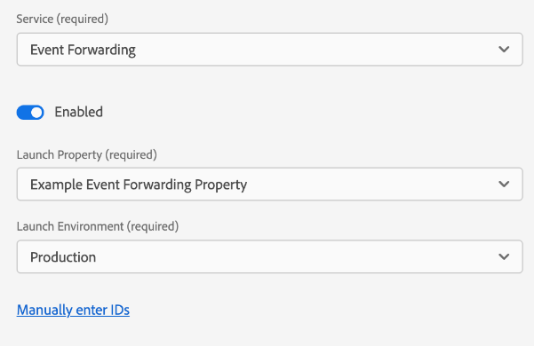

# Panoramica dei Datastreams

Un datastream rappresenta la configurazione lato server quando si implementano gli SDK per web e dispositivi mobili di Adobe Experience Platform. Mentre il [configura, comando](../fundamentals/configuring-the-sdk.md) nell&#39;SDK controlla gli elementi che devono essere gestiti sul client (come il `edgeDomain`), i datastreams gestiscono tutte le altre configurazioni per l&#39;SDK. Quando viene inviata una richiesta a Adobe Experience Platform Edge Network, la `edgeConfigId` viene utilizzato per fare riferimento al datastream. Questo consente di aggiornare la configurazione lato server senza dover apportare modifiche al codice sul sito web.

Questo documento descrive i passaggi per la configurazione di un datastream nell’interfaccia utente di raccolta dati.

>[!NOTE]
>
>Per poter accedere a questa funzione nell’interfaccia utente, è necessario eseguire il provisioning della tua organizzazione. Completa quanto segue [modulo](https://adobe.ly/websdkaccess) richiedere l&#39;accesso necessario. Per gestire i datastreams, il tuo account utente deve essere aggiunto a un profilo di prodotto per i tag in [!DNL Adobe Experience Platform].

## Accedere al [!UICONTROL Datastreams] workspace

Puoi creare e gestire i datastreams nell’interfaccia utente Raccolta dati selezionando **[!UICONTROL Datastreams]** nella navigazione a sinistra.

La [!UICONTROL Datastreams] visualizza un elenco dei datastreams esistenti, con il relativo nome descrittivo, ID e data dell’ultima modifica. Selezionare il nome di un datastream in [visualizzare i dettagli e configurare i servizi](#view-details).

Seleziona l’icona &quot;Altro&quot; (**...**) per un particolare datastream per rivelare più opzioni. Seleziona **[!UICONTROL Modifica]** per aggiornare [configurazione di base](#configure) per il datastream, oppure seleziona **[!UICONTROL Elimina]** per rimuovere il datastream.

## Crea un nuovo datastream {#create}

Per creare un datastream, inizia selezionando **[!UICONTROL Nuovo Datastream]**.

Viene visualizzato il flusso di lavoro di creazione del datastream, a partire dal passaggio di configurazione. Da qui, devi fornire un nome e una descrizione facoltativa per il datastream.

Se stai configurando questo datastream per l’utilizzo in Experience Platform e stai utilizzando l’SDK per web di Platform, devi anche selezionare un [schema Experience Data Model (XDM) basato su eventi](../../xdm/classes/experienceevent.md) per rappresentare i dati che intendi acquisire.

Seleziona **[!UICONTROL Opzioni avanzate]** per visualizzare controlli aggiuntivi per configurare il datastream.

| Impostazione | Descrizione |
| --- | --- |
| [!UICONTROL Posizione geografica] | Determina se si verificano ricerche GPS in base all&#39;indirizzo IP dell&#39;utente. Impostazione predefinita **[!UICONTROL Nessuno]** disabilita le ricerche GPS, mentre il **[!UICONTROL Città]** fornisce le coordinate GPS a due posizioni decimali. |
| [!UICONTROL Cookie ID di prime parti] | Quando questa impostazione è abilitata, indica alla rete Edge di fare riferimento a un cookie specificato durante la ricerca di un [ID dispositivo di prime parti](../identity/first-party-device-ids.md), anziché cercare questo valore nella mappa identità.  Quando abiliti questa impostazione, devi fornire il nome del cookie in cui deve essere memorizzato l’ID. |
| [!UICONTROL Sincronizzazione ID di terze parti] | Le sincronizzazioni ID possono essere raggruppate in contenitori per consentire l’esecuzione di sincronizzazioni ID diverse in momenti diversi. Quando abilitata, questa impostazione consente di specificare quale contenitore di sincronizzazioni ID viene eseguito per questo datastream. |

Da qui, se stai configurando il tuo datastream per Experience Platform, segui l&#39;esercitazione su [Preparazione per la raccolta dei dati](./data-prep.md) per mappare i dati su uno schema evento Platform prima di tornare a questa guida. In caso contrario, seleziona **[!UICONTROL Salva]** e passa alla sezione successiva.

## Visualizza i dettagli del datastream {#view-details}

Dopo aver configurato un nuovo datastream o selezionato uno esistente da visualizzare, viene visualizzata la pagina dei dettagli per quel datastream. Qui puoi trovare ulteriori informazioni sul datastream, compreso il relativo ID.

Dalla schermata dei dettagli del datastream, puoi [aggiungi servizi](#add-services) per abilitare le funzionalità dei prodotti Adobe Experience Cloud a cui hai accesso. È inoltre possibile modificare il [configurazione di base](#create), aggiorna [regole di mappatura](./data-prep.md), [copia il datastream](#copy)oppure eliminalo completamente.

## Aggiungere servizi a un datastream {#add-services}

Nella pagina dei dettagli di un datastream, seleziona **[!UICONTROL Aggiungi servizio]** per iniziare ad aggiungere i servizi disponibili per quel datastream.

Nella schermata successiva, utilizza il menu a discesa per selezionare un servizio da configurare per questo datastream. In questo elenco verranno visualizzati solo i servizi a cui hai accesso.

Seleziona il servizio desiderato, compila le opzioni di configurazione visualizzate, quindi seleziona **[!UICONTROL Salva]** per aggiungere il servizio al datastream. Tutti i servizi aggiunti vengono visualizzati nella visualizzazione dei dettagli del datastream.

Le sottosezioni seguenti descrivono le opzioni di configurazione per ogni servizio.

>[!NOTE]
>
>Ogni configurazione del servizio contiene un **[!UICONTROL Abilitato]** attiva automaticamente quando il servizio è selezionato. Per disabilitare il servizio selezionato per questo datastream, seleziona il **[!UICONTROL Abilitato]** scattare di nuovo.

### Impostazioni di Adobe Analytics

Questo servizio controlla se e come i dati vengono inviati ad Adobe Analytics. Ulteriori dettagli sono disponibili nella guida all&#39;indirizzo [invio di dati ad Analytics](../data-collection/adobe-analytics/analytics-overview.md).

| Impostazione | Descrizione |
| --- | --- |
| [!UICONTROL ID suite di rapporti] | **(Obbligatorio)** ID della suite di rapporti di Analytics a cui desideri inviare i dati. Questo ID si trova nell&#39;interfaccia utente di Adobe Analytics in [!UICONTROL Amministratore] > [!UICONTROL ReportSuites]. Se sono specificate più suite di rapporti, i dati vengono copiati in ciascuna suite di rapporti. |

### Impostazioni Adobe Audience Manager

Questo servizio controlla se e come i dati vengono inviati a Adobe Audience Manager. Tutto ciò che è necessario per inviare dati ad Audience Manager è quello di abilitare questa sezione. Le altre impostazioni sono facoltative ma incoraggiate.

| Impostazione | Descrizione |
| --- | --- |
| [!UICONTROL Destinazioni cookie abilitate] | Consente all’SDK di condividere le informazioni sui segmenti tramite [destinazioni cookie](https://experienceleague.adobe.com/docs/audience-manager/user-guide/features/destinations/custom-destinations/create-cookie-destination.html) da [!DNL Audience Manager]. |
| [!UICONTROL Destinazioni URL abilitate] | Consente all’SDK di condividere le informazioni sui segmenti tramite [Destinazioni URL](https://experienceleague.adobe.com/docs/audience-manager/user-guide/features/destinations/custom-destinations/create-url-destination.html) da [!DNL Audience Manager]. |

### Impostazioni Adobe Experience Platform

>[!IMPORTANT]
>
>Quando abiliti un datastream per Platform, prendi nota della sandbox di Platform che stai utilizzando, come visualizzata nella barra multifunzione superiore dell’interfaccia utente di Raccolta dati.
>
>
>
>Le sandbox sono partizioni virtuali in Adobe Experience Platform che ti consentono di isolare i dati e le implementazioni da altre parti della tua organizzazione. Una volta creato un datastream, la relativa sandbox non può essere modificata. Per ulteriori dettagli sul ruolo delle sandbox in Experience Platform, consulta la sezione [documentazione sandbox](../../sandboxes/home.md).

Questo servizio controlla se e come i dati vengono inviati a Adobe Experience Platform.

| Impostazione | Descrizione |
| --- | --- |
| [!UICONTROL Set di dati evento] | **(Obbligatorio)** Seleziona il set di dati della piattaforma a cui verranno inviati i dati evento cliente. Questo schema deve utilizzare [Classe ExperienceEvent XDM](../../xdm/classes/experienceevent.md). |
| [!UICONTROL Set di dati del profilo] | Seleziona il set di dati della piattaforma a cui verranno inviati i dati degli attributi del cliente. Questo schema deve utilizzare [Classe di profilo individuale XDM](../../xdm/classes/individual-profile.md). |
| [!UICONTROL Offer Decisioning] | Seleziona questa casella di controllo per abilitare l’Offer decisioning per un’implementazione Platform Web SDK. Consulta la guida su [utilizzo di Offer Decisioning con Platform Web SDK](../personalization/offer-decisioning/offer-decisioning-overview.md) per ulteriori dettagli sull’implementazione. Per ulteriori informazioni sulle funzionalità di Offer Decisioning, consulta la [Documentazione di Adobe Journey Optimizer](https://experienceleague.adobe.com/docs/journey-optimizer/using/offer-decisioniong/get-started/starting-offer-decisioning.html?lang=it). |
| [!UICONTROL Segmentazione Edge] | Seleziona questa casella di controllo per abilitare [segmentazione dei bordi](../../segmentation/ui/edge-segmentation.md) per questo datastream. Quando l’SDK invia i dati tramite un datastream abilitato per la segmentazione edge, nella risposta vengono restituite tutte le appartenenze di segmenti aggiornate per il profilo in questione.  Questa opzione può essere utilizzata in combinazione con [!UICONTROL Destinazioni personalizzazione] per [casi d’uso per la personalizzazione di pagine successive](../../destinations/ui/configure-personalization-destinations.md). |
| [!UICONTROL Destinazioni personalizzazione] | Se utilizzato in combinazione con il [!UICONTROL Segmentazione Edge] questa opzione consente al datastream di connettersi a motori di personalizzazione come Adobe Target. Fai riferimento alla documentazione sulle destinazioni per i passaggi specifici su [configurazione delle destinazioni di personalizzazione](../../destinations/ui/configure-personalization-destinations.md). |

### Impostazioni di Adobe Target

Questo servizio controlla se e come i dati vengono inviati ad Adobe Target.

| Impostazione | Descrizione |
| --- | --- |
| [!UICONTROL Token di proprietà] | [!DNL Target] consente ai clienti di controllare le autorizzazioni tramite l’uso delle proprietà. Per ulteriori informazioni sulle proprietà, consulta la guida su [configurazione delle autorizzazioni Enterprise](https://experienceleague.adobe.com/docs/target/using/administer/manage-users/enterprise/properties-overview.html) in [!DNL Target] documentazione.  Il token di proprietà si trova nell’interfaccia utente di Adobe Target in [!UICONTROL Configurazione] > [!UICONTROL Proprietà]. |
| [!UICONTROL ID ambiente di destinazione] | [Ambienti in Adobe Target](https://experienceleague.adobe.com/docs/target/using/administer/hosts.html) ti aiuta a gestire la tua implementazione in tutte le fasi di sviluppo. Questa impostazione specifica l&#39;ambiente da utilizzare con questo datastream.  Si consiglia di impostare questo valore in modo diverso per ogni `dev`, `stage`e `prod` ambienti datastream per semplificare le operazioni. Tuttavia, se hai già definito ambienti Adobe Target, puoi utilizzarli. |
| [!UICONTROL Spazio dei nomi ID di terze parti di Target] | Spazio dei nomi di identità per `mbox3rdPartyId` si desidera utilizzare per questo datastream. Consulta la guida su [implementazione `mbox3rdPartyId` con l’SDK per web](../personalization/adobe-target/using-mbox-3rdpartyid.md) per ulteriori informazioni. |

### [!UICONTROL Inoltro eventi] impostazioni

Questo servizio controlla se e come i dati vengono inviati a [inoltro eventi](../../tags/ui/event-forwarding/overview.md).

| Impostazione | Descrizione |
| --- | --- |
| [!UICONTROL Launch, proprietà] | **(Obbligatorio)** Proprietà di inoltro eventi a cui si desidera inviare i dati. |
| [!UICONTROL Ambiente Launch] | **(Obbligatorio)** Ambiente all’interno della proprietà selezionata a cui si desidera inviare i dati. |

>[!NOTE]
>
>È possibile selezionare **[!UICONTROL Immetti manualmente gli ID]** digitare i nomi delle proprietà e dell’ambiente anziché utilizzare i menu a discesa.

## Copiare un datastream {#copy}

Puoi creare una copia di un datastream esistente e modificarne i dettagli in base alle esigenze.

>[!NOTE]
>
>I datastreams possono essere copiati solo all&#39;interno dello stesso [sandbox](../../sandboxes/home.md). In altre parole, non è possibile copiare un datastream da una sandbox all’altra.

Dalla pagina principale nel [!UICONTROL Datastreams] area di lavoro, seleziona i puntini di sospensione (**....**) per il datastream in questione, quindi seleziona **[!UICONTROL Copia]**.

![Immagine che mostra [!UICONTROL Copia] opzione selezionata dalla visualizzazione elenco datastream](../images/datastreams/overview/copy-datastream-list.png)

In alternativa, è possibile selezionare **[!UICONTROL Copia Datastream]** dalla visualizzazione dettagliata di un dato datastream.

![Immagine che mostra [!UICONTROL Copia] opzione selezionata dalla visualizzazione dei dettagli del datastream](../images/datastreams/overview/copy-datastream-details.png)

Viene visualizzata una finestra di dialogo di conferma che richiede di specificare un nome univoco per il nuovo datastream da creare, insieme a dettagli sulle opzioni di configurazione che verranno copiate. Quando è pronto, seleziona **[!UICONTROL Copia]**.

La pagina principale del [!UICONTROL Datastreams] riappare l&#39;area di lavoro con il nuovo datastream elencato.

## Passaggi successivi

Questa guida illustra come gestire i datastreams nell’interfaccia utente di raccolta dati. Per ulteriori informazioni su come installare e configurare l’SDK web dopo aver configurato un datastream, consulta la [Guida alla raccolta dati E2E](../../collection/e2e.md#install).
