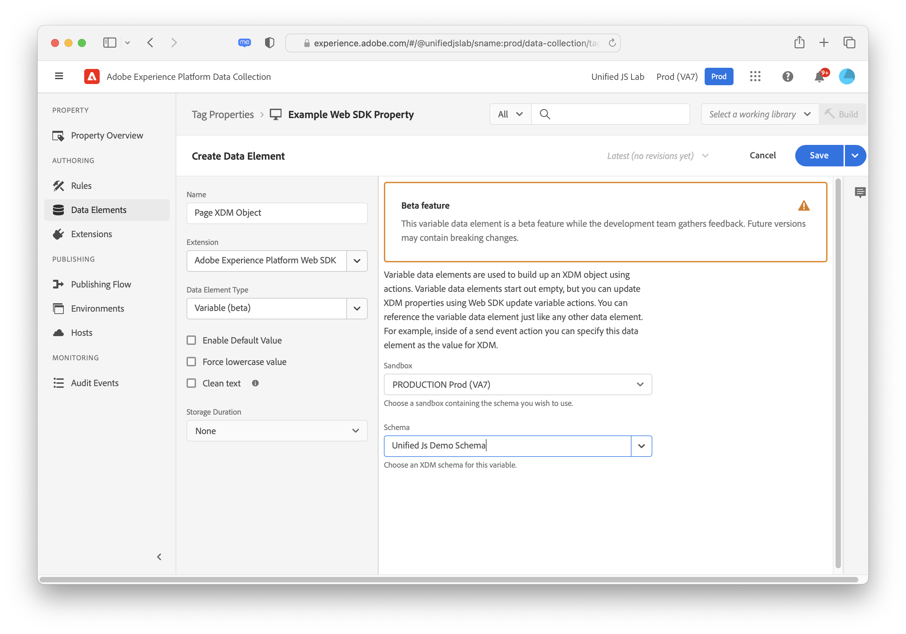

# Tipi di elementi dati

Dopo aver impostato [tipi di azioni](action-types.md) nel [Estensione tag Adobe Experience Platform Web SDK](web-sdk-extension-configuration.md), è necessario configurare i tipi di elementi dati. Questa pagina descrive i tipi di elementi dati disponibili.

## ID unione evento {#event-merge-id}

Quando viene utilizzato, questo elemento dati fornisce un ID unione evento. Per questo elemento dati non è necessaria alcuna configurazione. L’elemento dati fornito rimane lo stesso finché il visitatore non esce dalla pagina o finché il **[!UICONTROL Reimposta ID unione evento]** tipo di azione utilizzato.

## Mappa identità {#identity-map}

Una mappa delle identità consente di stabilire le identità del visitatore della pagina web. Una mappa di identità è costituita da spazi dei nomi, come _telefono_ o _email_, in cui ogni spazio dei nomi contiene uno o più identificatori. Ad esempio, se l’utente sul sito web ha fornito due numeri di telefono, il namespace del telefono deve contenere due identificatori.

In [!UICONTROL Mappa identità] elemento dati, fornirai le seguenti informazioni per ciascun identificatore:

* **[!UICONTROL ID]**: valore che identifica il visitatore. Ad esempio, se l’identificatore appartiene al _telefono_ namespace, il [!UICONTROL ID] può essere _555 555 555_. Questo valore in genere è derivato da una variabile JavaScript o da altri dati sulla pagina, quindi è meglio creare un elemento dati che faccia riferimento ai dati della pagina, quindi fare riferimento all’elemento dati nel [!UICONTROL ID] campo all&#39;interno del [!UICONTROL Mappa identità] elemento dati. Se, durante l’esecuzione sulla pagina, il valore ID è diverso da una stringa compilata, l’identificatore verrà rimosso automaticamente dalla mappa di identità.
* **[!UICONTROL Stato autenticato]**: selezione che indica se il visitatore è autenticato.
* **[!UICONTROL Principale]**: selezione che indica se l’identificatore deve essere utilizzato come identificatore principale dell’individuo. Se nessun identificatore è contrassegnato come primario, verrà utilizzato l’ECID come identificatore primario.

Non devi fornire un [!DNL ECID] durante la creazione di una mappa di identità. Quando utilizzi l’SDK, un’ [!DNL ECID] viene generato automaticamente sul server e incluso nella mappa di identità.

L’elemento dati della mappa delle identità viene spesso utilizzato insieme all’elemento [[!UICONTROL Oggetto XDM] tipo di elemento dati](#xdm-object) e [[!UICONTROL Impostare il consenso] tipo di azione](action-types.md#set-consent).

Ulteriori informazioni su [Servizio Adobe Experience Platform Identity](../../identity-service/home.md).

## Oggetto XDM {#xdm-object}

La formattazione dei dati in XDM è più semplice con l’elemento dati dell’oggetto XDM. La prima volta che apri questo elemento dati, seleziona la sandbox e lo schema di Adobe Experience Platform corretti. Dopo aver selezionato lo schema, puoi visualizzarne la struttura che potrai compilare facilmente.

Tieni presente che quando apri alcuni campi dello schema, ad esempio `web.webPageDetails.URL`, alcuni elementi vengono raccolti automaticamente. Anche se diversi elementi vengono raccolti automaticamente, puoi sovrascriverne alcuni, se necessario. Tutti i valori possono essere compilati manualmente o utilizzando altri elementi dati.

>[!NOTE]
>
>Compila solo le informazioni che sei interessato a raccogliere. Tutto ciò che non viene compilato viene omesso quando i dati vengono inviati alle soluzioni.

## Variabile (Beta) {#variable}

>[!IMPORTANT]
>
>Questa è attualmente una funzionalità beta ed è soggetta a modifiche. Le versioni future possono contenere modifiche che causano interruzioni.

Un altro modo per creare oggetti XDM è utilizzare **[!UICONTROL Variabile]** elemento dati. Quando viene fatto riferimento all’elemento dati dell’oggetto XDM, ad esempio all’interno di una `sendEvent` comando, il **[!UICONTROL Variabile]** l&#39;elemento dati può essere aggiornato tramite [!UICONTROL Aggiorna variabile] azioni. Per utilizzare l’elemento dati, seleziona la sandbox e lo schema di Adobe Experience Platform corretti.

Dopo aver creato questo elemento dati puoi utilizzare [Aggiorna variabile](./action-types.md#update-variable) azioni per modificare l’elemento dati. Quindi all’interno di invia le azioni evento utilizzano l’elemento dati variabile per l’opzione XDM.

## Passaggi successivi {#next-steps}

Scopri casi d’uso specifici, ad esempio [accesso a ECID](accessing-the-ecid.md).
