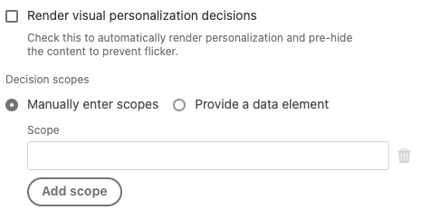

# Tipi di evento

Questa pagina descrive i tipi di evento Adobe Experience Platform forniti dall&#39;estensione tag Adobe Experience Platform Web SDK. Questi vengono utilizzati per [generare regole](https://experienceleague.adobe.com/docs/launch-learn/tutorials/fundamentals/building-rules-in-launch.html) e non devono essere confusi con il campo [`eventType` in XDM](https://experienceleague.adobe.com/docs/experience-platform/edge/fundamentals/tracking-events.html).

## [!UICONTROL Invia evento completato]

In genere, la proprietà dispone di una o più regole che utilizzano [[!UICONTROL Invia evento] action](action-types.md#send-event) per inviare eventi a Adobe Experience Platform Edge Network. Ogni volta che un evento viene inviato a Edge Network, viene restituita una risposta al browser con dati utili. Senza il tipo di evento [!UICONTROL Send event complete], non potrai accedere a questi dati restituiti.

Per accedere ai dati restituiti, crea una regola separata, quindi aggiungi alla regola un evento [!UICONTROL Send event complete] . Questa regola viene attivata ogni volta che viene ricevuta una risposta corretta dal server in seguito a un&#39;azione [!UICONTROL Invia evento].

Quando un evento [!UICONTROL Send complete] attiva una regola, fornisce i dati restituiti dal server che possono essere utili per eseguire determinate attività. In genere, aggiungi un&#39;azione [!UICONTROL Codice personalizzato] (dall&#39;estensione [!UICONTROL Core]) alla stessa regola che contiene l&#39;evento [!UICONTROL Send complete] . Nell&#39;azione [!UICONTROL Codice personalizzato], il codice personalizzato avrà accesso a una variabile denominata `event`. Questa variabile `event` conterrà i dati restituiti dal server.

La regola per la gestione dei dati restituiti da Edge Network potrebbe essere simile alla seguente:


Di seguito sono riportati alcuni esempi di come eseguire determinate attività utilizzando l&#39;azione [!UICONTROL Codice personalizzato] in questa regola.

### Rendering manuale di contenuti personalizzati

Nell’azione Codice personalizzato, nella regola per la gestione dei dati di risposta, puoi accedere alle proposizioni di personalizzazione restituite dal server. A questo scopo, digita il seguente codice personalizzato:

```javascript
var propositions = event.propositions;
```

Se esiste `event.propositions`, si tratta di un array contenente oggetti di proposta di personalizzazione. Le proposizioni incluse nell&#39;array sono determinate, in gran parte, dal modo in cui l&#39;evento è stato inviato al server.

Per questo primo scenario, si supponga di non aver selezionato la casella di controllo [!UICONTROL Decisioni di rendering] e di non aver fornito alcun [!UICONTROL ambito decisionale] all&#39;interno dell&#39;azione [!UICONTROL Invia evento] responsabile dell&#39;invio dell&#39;evento.



In questo esempio, la matrice `propositions` contiene solo le proposizioni relative all&#39;evento idonee per il rendering automatico.

La matrice `propositions` potrebbe avere un aspetto simile a questo esempio:

```json
[
  {
    "id": "AT:eyJhY3Rpdml0eUlkIjoiMTI3MDE5IiwiZXhwZXJpZW5jZUlkIjoiMCJ9",
    "scope": "__view__",
    "items": [
      {
        "id": "11223344",
        "schema": "https://ns.adobe.com/personalization/dom-action",
        "data": {
          "content": "<h2 style=\"color: yellow\">An HTML proposition.</h2>",
          "selector": "#hero",
          "type": "setHtml"
        },
        "meta": {}
      }
    ],
    "renderAttempted": false
  },
  {
    "id": "AT:PyJhY3Rpdml0eUlkIjoiMTI3MDE5IiwiZXhwZXJpZW5jZUlkIjoiMCJ8",
    "scope": "__view__",
    "items": [
      {
        "id": "11223345",
        "schema": "https://ns.adobe.com/personalization/dom-action",
        "data": {
          "content": "<h2 style=\"color: yellow\">Another HTML proposition.</h2>",
          "selector": "#sidebar",
          "type": "setHtml"
        },
        "meta": {}
      }
    ],
    "renderAttempted": false
  }
]
```

Quando invii l’evento, la casella di controllo [!UICONTROL Decisioni di rendering] non era selezionata, pertanto l’SDK non tentava di eseguire il rendering automatico dei contenuti. Tuttavia, l’SDK ha ancora recuperato automaticamente il contenuto idoneo per il rendering automatico e, se lo desideri, gli ha fornito la possibilità di eseguire manualmente il rendering. Tenere presente che la proprietà `renderAttempted` di ogni oggetto proposizione è impostata su `false`.

Se avessi invece selezionato la casella di controllo [!UICONTROL Decisioni di rendering] al momento dell&#39;invio dell&#39;evento, l&#39;SDK avrebbe tentato di eseguire il rendering di tutte le proposte idonee per il rendering automatico. Di conseguenza, per ogni oggetto della proposta la relativa proprietà `renderAttempted` è impostata su `true`. In questo caso non sarebbe necessario eseguire manualmente il rendering di queste proposte.

Finora, hai esaminato solo i contenuti di personalizzazione idonei per il rendering automatico (ad esempio, qualsiasi contenuto creato nel Compositore esperienza visivo di Adobe Target). Per recuperare qualsiasi contenuto di personalizzazione _non_ idoneo al rendering automatico, richiedi il contenuto fornendo ambiti decisionali utilizzando il campo [!UICONTROL Ambiti decisionali] nell&#39;azione [!UICONTROL Invia evento]. Un ambito è una stringa che identifica una particolare proposta che si desidera recuperare dal server.

L&#39;azione [!UICONTROL Invia evento] si presenta come segue:


In questo esempio, se sul server sono presenti proposizioni che corrispondono all&#39;ambito `salutation` o `discount`, queste vengono restituite e incluse nell&#39;array `propositions`. Tieni presente che le proposizioni idonee per il rendering automatico continueranno a essere incluse nell’array `propositions`, indipendentemente da come configuri i campi [!UICONTROL Decisioni di rendering] o [!UICONTROL Ambiti decisionali] nell’azione [!UICONTROL Invia evento]. La matrice `propositions`, in questo caso, avrà un aspetto simile a questo esempio:

```json
[
  {
    "id": "AT:cZJhY3Rpdml0eUlkIjoiMTI3MDE5IiwiZXhwZXJpZW5jZUlkIjoiMCJ2",
    "scope": "salutation",
    "items": [
      {
        "schema": "https://ns.adobe.com/personalization/json-content-item",
        "data": {
          "id": "4433221",
          "content": {
            "salutation": "Welcome, esteemed visitor!"
          }
        },
        "meta": {}
      }
    ],
    "renderAttempted": false
  },
  {
    "id": "AT:FZJhY3Rpdml0eUlkIjoiMTI3MDE5IiwiZXhwZXJpZW5jZUlkIjoiMCJ0",
    "scope": "discount",
    "items": [
      {
        "schema": "https://ns.adobe.com/personalization/html-content-item",
        "data": {
          "id": "4433222",
          "content": "<div>50% off your order!</div>",
          "format": "text/html"
        },
        "meta": {}
      }
    ],
    "renderAttempted": false
  },
  {
    "id": "AT:eyJhY3Rpdml0eUlkIjoiMTI3MDE5IiwiZXhwZXJpZW5jZUlkIjoiMCJ9",
    "scope": "__view__",
    "items": [
      {
        "id": "11223344",
        "schema": "https://ns.adobe.com/personalization/dom-action",
        "data": {
          "content": "<h2 style=\"color: yellow\">An HTML proposition.</h2>",
          "selector": "#hero",
          "type": "setHtml"
        },
        "meta": {}
      }
    ],
    "renderAttempted": false
  },
  {
    "id": "AT:PyJhY3Rpdml0eUlkIjoiMTI3MDE5IiwiZXhwZXJpZW5jZUlkIjoiMCJ8",
    "scope": "__view__",
    "items": [
      {
        "id": "11223345",
        "schema": "https://ns.adobe.com/personalization/dom-action",
        "data": {
          "content": "<h2 style=\"color: yellow\">Another HTML proposition.</h2>",
          "selector": "#sidebar",
          "type": "setHtml"
        },
        "meta": {}
      }
    ],
    "renderAttempted": false
  }
]
```

A questo punto, puoi eseguire il rendering del contenuto della proposta come ritieni opportuno. In questo esempio, la proposta che corrisponde all’ambito `discount` è una proposta HTML creata utilizzando il Compositore esperienza basato su moduli di Adobe Target. Supponi di avere un elemento nella pagina con l’ID di `daily-special` e di voler eseguire il rendering del contenuto dalla proposta `discount` nell’elemento `daily-special`. Effettua le seguenti operazioni:

1. Estrarre le proposizioni dall&#39;oggetto `event`.
1. Eseguire il ciclo di ogni proposta, cercando la proposta con un ambito di `discount`.
1. Se trovi una proposta, passa in rassegna ogni elemento della proposta, cercando l&#39;elemento che è contenuto HTML. (È meglio controllare che assumere).
1. Se trovi un elemento contenente contenuto HTML, trova l’elemento `daily-special` nella pagina e sostituisci il relativo HTML con il contenuto personalizzato.

Il codice personalizzato all&#39;interno dell&#39;azione [!UICONTROL Codice personalizzato] può essere visualizzato come segue:

```javascript
var propositions = event.propositions;

var discountProposition;
if (propositions) {
  // Find the discount proposition, if it exists.
  for (var i = 0; i < propositions.length; i++) {
    var proposition = propositions[i]; 
    if (proposition.scope === "discount") {
      discountProposition = proposition;
      break;
    }
  }
}

var discountHtml;
if (discountProposition) {
  // Find the item from proposition that should be rendered.
  // Rather than assuming there a single item that has HTML
  // content, find the first item whose schema indicates
  // it contains HTML content.
  for (var j = 0; j < discountProposition.items.length; j++) {
    var discountPropositionItem = discountProposition.items[i]; 
    if (discountPropositionItem.schema === "https://ns.adobe.com/personalization/html-content-item") {
      discountHtml = discountPropositionItem.data.content;
      break;
    }
  }
}

if (discountHtml) {
  // Discount HTML exists. Time to render it.
  var dailySpecialElement = document.getElementById("daily-special");
  dailySpecialElement.innerHTML = discountHtml;
}
```

### Accesso ai token di risposta di Adobe Target

Il contenuto di personalizzazione restituito da Adobe Target include [token di risposta](https://experienceleague.adobe.com/docs/target/using/administer/response-tokens.html), che sono dettagli sull&#39;attività, l&#39;offerta, l&#39;esperienza, il profilo utente, le informazioni geografiche e altro ancora. Questi dettagli possono essere condivisi con strumenti di terze parti o utilizzati per il debug. I token di risposta possono essere configurati nell’interfaccia utente di Adobe Target.

Nell’azione Codice personalizzato, nella regola per la gestione dei dati di risposta, puoi accedere alle proposizioni di personalizzazione restituite dal server. A questo scopo, digita il seguente codice personalizzato:

```javascript
var propositions = event.propositions;
```

Se esiste `event.propositions`, si tratta di un array contenente oggetti di proposta di personalizzazione. Per ulteriori informazioni sul contenuto di `result.propositions`, consulta [Rendering manuale del contenuto personalizzato](#manually-render-personalized-content) .

Supponi di voler raccogliere tutti i nomi delle attività da tutte le proposizioni di cui è stato eseguito automaticamente il rendering dall’SDK per web e inviarli in un singolo array. È quindi possibile inviare il singolo array a una terza parte. In questo caso, scrivi codice personalizzato all&#39;interno dell&#39;azione [!UICONTROL Codice personalizzato] in:

1. Estrarre le proposizioni dall&#39;oggetto `event`.
1. Passate in rassegna ogni proposta.
1. Determina se l&#39;SDK ha eseguito il rendering della proposta.
1. In tal caso, eseguire il ciclo tra i vari elementi della proposta.
1. Recupera il nome dell&#39;attività dalla proprietà `meta` , che è un oggetto contenente i token di risposta.
1. Invia il nome dell’attività a un array.
1. Invia i nomi delle attività a una terza parte.

```javascript
var propositions = event.propositions;
if (propositions) {
  var activityNames = [];
  propositions.forEach(function(proposition) {
    if (proposition.renderAttempted) {
      proposition.items.forEach(function(item) {
        if (item.meta) {
          // item.meta contains the response tokens.
          var activityName = item.meta["activity.name"];
          // Ignore duplicates
          if (activityNames.indexOf(activityName) === -1) {
            activityNames.push(activityName);  
          }
        }
      });
    }
  });
  // Now that activity names are in an array,
  // you can send them to a third party or use
  // them in some other way.
}
```


