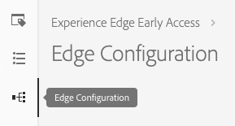

# Configurazione di Edge

La configurazione per l&#39;Adobe Experience Platform [!DNL Web SDK] è suddivisa in due posizioni. Il comando  Configura nell’SDK controlla gli elementi che devono essere gestiti sul client, come nel caso del `edgeDomain`. La configurazione edge gestisce tutte le altre configurazioni per l’SDK. Quando una richiesta viene inviata all&#39;Adobe Experience Platform [!DNL Edge Network], `edgeConfigId` viene utilizzata per fare riferimento alla configurazione lato server. Questo consente di aggiornare la configurazione senza dover apportare modifiche al codice sul sito Web.

## Creazione di un ID di configurazione Edge

Gli ID di configurazione Edge possono essere creati in  Adobe [!DNL Launch] utilizzando lo strumento di configurazione edge. Questo strumento consente di creare sia la configurazione dei bordi che gli ambienti all&#39;interno di tali configurazioni.

>[!NOTE]
>
>Lo strumento di configurazione edge è disponibile per i clienti del elenco consentiti , a prescindere dal fatto che vengano utilizzati [!DNL Launch] come gestore di tag. Inoltre, gli utenti richiedono le autorizzazioni Sviluppo in [!DNL Launch]. Per ulteriori dettagli, consultate l&#39;articolo Autorizzazioni  utente nella [!DNL Launch] documentazione.

Per creare una configurazione dei bordi, fate clic su **[!UICONTROL New Edge Configuration]** nell’area in alto a destra dello schermo. Dopo aver fornito un nome e una descrizione, viene richiesto di specificare le impostazioni predefinite per ogni ambiente.

### Impostazioni ambiente predefinite

Queste impostazioni predefinite vengono utilizzate per creare i primi tre ambienti con impostazioni identiche. Questi tre ambienti sono *dev*, *stage* e *prod*. Corrispondono ai tre ambienti predefiniti in [!DNL Launch]. Quando si crea una [!DNL Launch] libreria in un ambiente di sviluppo, la libreria utilizza automaticamente l&#39;ambiente di sviluppo dalla configurazione. È possibile modificare le impostazioni in singoli ambienti con la massima flessibilità.

L’ID utilizzato nell’SDK come ID `edgeConfigId` è composito che specifica la configurazione e l’ambiente. Se non è presente alcun ambiente, viene utilizzato l&#39;ambiente di produzione.

### Impostazioni ambiente

Di seguito sono riportate le impostazioni disponibili per un ambiente. La maggior parte delle sezioni può essere abilitata o disattivata. Se disabilitata, le impostazioni vengono salvate ma non sono attive.

#### [!UICONTROL Identity]

La sezione identità è l&#39;unica sezione sempre attiva. Sono disponibili due impostazioni: [!UICONTROL ID Syncs Enabled] e [!UICONTROL ID Sync Container ID].

##### [!UICONTROL ID Sync Enabled]

Controlla se l’SDK esegue o meno sincronizzazioni di identità con partner di terze parti.

##### [!UICONTROL ID Sync Container ID]

Le sincronizzazioni ID possono essere raggruppate in contenitori per consentire l’esecuzione di diverse sincronizzazioni ID in momenti diversi. Questo controlla quale contenitore di sincronizzazione ID viene eseguito per un determinato ID di configurazione.

#### Adobe Experience Platform

Le impostazioni elencate qui consentono di inviare i dati all&#39;Adobe Experience Platform. Abilita questa sezione solo se hai acquistato l’Adobe Experience Platform.

##### [!UICONTROL Sandbox]

Le sandbox sono posizioni nell&#39;Adobe Experience Platform che consentono ai clienti di isolare i dati e le implementazioni l&#39;una dall&#39;altra. Per ulteriori dettagli sul funzionamento, consultate la documentazione Sandbox.

##### [!UICONTROL Streaming Inlet]

Una ingresso in streaming è un&#39;origine HTTP nell&#39;Adobe Experience Platform. Questi vengono creati nella [!UICONTROL Sources] scheda di Adobe Experience Platform come API HTTP.

##### [!UICONTROL Event Dataset]

Le configurazioni Edge supportano l&#39;invio di dati a dataset con uno schema di classe [!UICONTROL Experience Event].

#### Adobe Target

Per configurare  Adobe Target, dovete fornire un codice client. Gli altri campi sono facoltativi.

>[!NOTE]
>
>L&#39;organizzazione associata al codice client deve corrispondere all&#39;organizzazione in cui viene creato l&#39;ID di configurazione.

##### [!UICONTROL Client Code]

L&#39;ID univoco per un account di destinazione. Per trovare questo percorso, è possibile passare a [!UICONTROL Adobe Target] > [!UICONTROL Setup]> [!UICONTROL Implementation] > [!UICONTROL edit settings] accanto al [!UICONTROL download] pulsante per [!UICONTROL at.js] oppure [!UICONTROL mbox.js]

##### [!UICONTROL Property Token]

[!DNL Target] consente ai clienti di controllare le autorizzazioni mediante l&#39;uso di proprietà. I dettagli sono disponibili nella sezione Autorizzazioni  Enterprise della [!DNL Target] documentazione.

Il token proprietà si trova in [!UICONTROL Adobe Target] > [!UICONTROL setup] > [!UICONTROL Properties]

##### [!UICONTROL Target Environment ID]

[Gli ambienti](https://docs.adobe.com/content/help/en/target/using/administer/hosts.html) di  Adobe Target consentono di gestire la propria implementazione in tutte le fasi dello sviluppo. Questa impostazione specifica quale ambiente utilizzare con ciascun ambiente.

 Adobe consiglia di impostare questa impostazione in modo diverso per ciascuno degli ambienti di configurazione `dev`, `stage`e `prod` edge, in modo da semplificare le cose. Tuttavia, se avete già [!UICONTROL Adobe Target environments] definito, potete usarli.

#### Adobe Audience Manager

Per inviare i dati ad Adobe Audience Manager è sufficiente abilitare questa sezione. Le altre impostazioni sono facoltative ma incoraggiate.

##### [!UICONTROL Cookie Destinations Enabled]

Consente all’SDK di condividere le informazioni sui segmenti tramite [Cookie Destinations](https://docs.adobe.com/content/help/en/audience-manager/user-guide/features/destinations/custom-destinations/create-cookie-destination.html) (Destinazioni [!DNL Audience Manager]cookie) da.

##### [!UICONTROL URL Destinations Enabled]

Consente all’SDK di condividere le informazioni sui segmenti tramite le destinazioni URL. Questi sono configurati in [!DNL Audience Manager].

#### Adobe Analytics

Controlla se i dati vengono inviati a  Adobe Analytics. Ulteriori dettagli sono disponibili in Panoramica [di](../solution-specific/analytics/analytics-overview.md)Analytics.

##### [!UICONTROL Report Suite ID]

La suite di rapporti si trova nella sezione  Adobe Analytics Admin in [!UICONTROL Admin > ReportSuites]. Se vengono specificate più suite di rapporti, i dati vengono copiati in ciascuna suite di rapporti.
