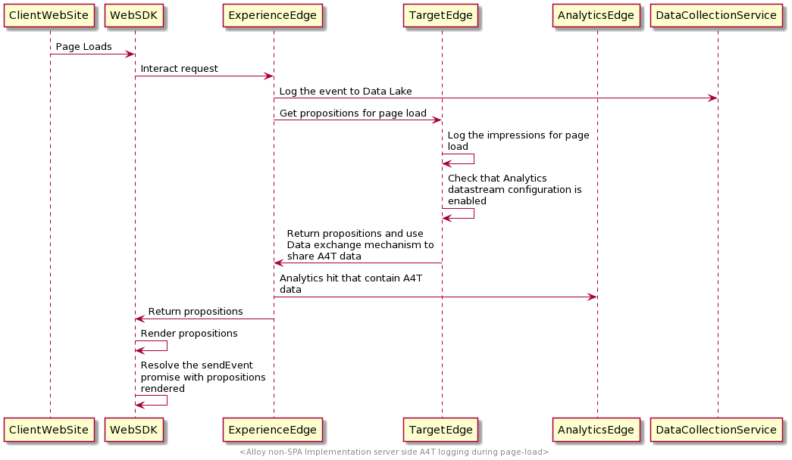

# Registrazione lato server per i dati A4T in Platform Web SDK

Adobe Experience Platform Web SDK consente di implementare la funzionalità Adobe Analytics for Target (A4T) sulla rete Edge di Platform. Quando la registrazione lato server è abilitata, tutti gli hit di Analytics inviati tramite la rete Edge vengono potenziati con i dettagli di Target sul lato server, senza dover passare attraverso il processo di unione degli hit.

La registrazione lato server per Analytics è abilitata quando Analytics è abilitato nella configurazione dello stream di dati:

Il diagramma seguente mostra il flusso dei dati nel sistema quando è abilitata la registrazione Analytics lato server:

## Passaggi successivi

Questa guida tratta la registrazione lato server per i dati A4T nell’SDK per web. Consulta la guida su [registrazione lato client](./client-side.md) per ulteriori informazioni su come gestire i dati A4T sul lato client.
