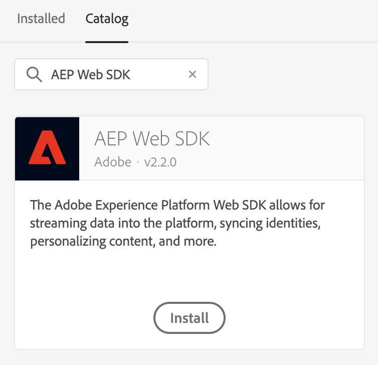

# [!DNL Offer Decisioning] Panoramica

>[!NOTE]
>
>L&#39;utilizzo di  Offer Decisioning in Adobe Experience Platform Web SDK è attualmente disponibile per l&#39;accesso anticipato a determinati utenti. Questa funzionalità non è disponibile per tutte le organizzazioni IMS.

L&#39;Adobe Experience Platform [!DNL Web SDK] può distribuire ed eseguire il rendering di offerte personalizzate gestite in  Offer Decisioning. Potete creare le offerte e altri oggetti correlati utilizzando l&#39;interfaccia utente (interfaccia utente) o le API di  Offer Decisioning.

## Prerequisiti

* L&#39;organizzazione IMS è abilitata per le decisioni edge
* Offerte, Attività create
* Configurazione Edge pubblicata

## Terminologia

È importante comprendere la seguente terminologia quando si utilizza  Offer Decisioning. Per ulteriori informazioni e per visualizzare i termini aggiuntivi, visitare il [glossario](https://experienceleague.adobe.com/docs/offer-decisioning/using/get-started/glossary.html?lang=en#get-started)Offer Decisioning.

* **Contenitore:** Un contenitore è un meccanismo di isolamento per tenere distanti le diverse preoccupazioni. L&#39;ID contenitore è il primo elemento percorso per tutte le API del repository. Tutti gli oggetti di decisione risiedono all&#39;interno di un contenitore.

* **Ambiti decisionali:** Per  Offer Decisioning, si tratta delle stringhe codificate Base64 di JSON contenenti gli ID attività e di posizionamento che desiderate vengano utilizzati dal servizio di decisione delle offerte per proporre offerte.

   *Campo di applicazione della decisione JSON:*

   ```json
   {
     "activityId":"xcore:offer-activity:11cfb1fa93381aca",
     "placementId":"xcore:offer-placement:1175009612b0100c"
   }
   ```

   *Stringa codificata Base64 ambito decisione:*

   ```json
   "eyJhY3Rpdml0eUlkIjoieGNvcmU6b2ZmZXItYWN0aXZpdHk6MTFjZmIxZmE5MzM4MWFjYSIsInBsYWNlbWVudElkIjoieGNvcmU6b2ZmZXItcGxhY2VtZW50OjExNzUwMDk2MTJiMDEwMGMifQ=="
   ```

   >[!TIP]
   >
   >Potete copiare il valore dell&#39;ambito decisionale dalla pagina Panoramica **** attività dell&#39;interfaccia utente.

   

* **Configurazione Edge:** Per ulteriori informazioni, consulta la documentazione sulla configurazione [](../../fundamentals/edge-configuration.md) edge.

* **Identità**: Per ulteriori informazioni, consulta questa documentazione in cui sono illustrate le modalità con cui [Platform Web SDK sfrutta il servizio](../../identity/overview.md)identità.

## Abilitazione  Offer Decisioning

Per attivare  Offer Decisioning, è necessario eseguire le seguenti operazioni:

1. Abilitato Adobe Experience Platform nella configurazione [](../../fundamentals/edge-configuration.md) edge e selezionare la casella &quot; Offer Decisioning&quot;
   
2. Seguite le istruzioni per [installare l’SDK](../../fundamentals/installing-the-sdk.md) (l’SDK può essere installato autonomamente o tramite [Adobe Experience Platform Launch](http://launch.adobe.com/it)). Di seguito è riportata una guida [introduttiva a Platform Launch](https://docs.adobe.com/content/help/it-IT/launch/using/intro/get-started/quick-start.html).
3. [Configurare l’SDK](../../fundamentals/configuring-the-sdk.md) per  Offer Decisioning. Di seguito sono riportati  passaggi specifici per Offer Decisioning.
   * SDK installato autonomamente
      1. Configura l’azione &quot;sendEvent&quot; con il tuo `decisionScopes`

      ```javascript
      alloy("sendEvent", {
          ...
          "decisionScopes": [
              "eyJhY3Rpdml0eUlkIjoieGNvcmU6b2ZmZXItYWN0aXZpdHk6MTIxYWIwOWMxM2JkZDIyNCIsInBsYWNlbWVudElkIjoieGNvcmU6b2ZmZXItcGxhY2VtZW50OjEyMWFiMDZhODRkMDViMTEifQ==",
              "eyJhY3Rpdml0eUlkIjoieGNvcmU6b2ZmZXItYWN0aXZpdHk6MTIxYWIyNWI5NTUwNWIxZiIsInBsYWNlbWVudElkIjoieGNvcmU6b2ZmZXItcGxhY2VtZW50OjEyMWFiMjFmOTQzMDE0MmIifQ=="
          ]
      })
      ```
   * SDK per avvio piattaforma
      1. [Creare una proprietà Launch piattaforma](https://docs.adobe.com/content/help/it-IT/launch/using/reference/admin/companies-and-properties.html)
      2. [Aggiungere il codice da incorporare per il lancio della piattaforma](https://docs.adobe.com/content/help/en/core-services-learn/implementing-in-websites-with-launch/configure-launch/launch-add-embed.html)
      3. Installa e configura l’estensione Adobe Experience Platform Web SDK con la configurazione Edge appena creata selezionando la configurazione dal menu a discesa &quot;Edge Configuration&quot; (Configurazione Edge). Documentazione utile sulle [estensioni](https://docs.adobe.com/content/help/en/launch/using/reference/manage-resources/extensions/overview.html).
         

         
      4. Crea gli elementi [](https://docs.adobe.com/content/help/it-IT/launch/using/reference/manage-resources/data-elements.html)dati necessari. Come minimo, è necessario creare una mappa identità SDK piattaforma Web e un elemento dati oggetto XDM SDK piattaforma.
         

         
      5. Creare le [regole](https://docs.adobe.com/content/help/it-IT/launch/using/reference/manage-resources/rules.html).
         * Aggiunta di un&#39;azione di invio evento SDK Web piattaforma e aggiunta del relativo elemento `decisionScopes` alla configurazione dell&#39;azione
            
      6. [Creare e pubblicare una libreria](https://docs.adobe.com/content/help/it-IT/launch/using/reference/publish/libraries.html) contenente tutte le regole, gli elementi dati e le estensioni che hai configurato


## Richieste e risposte di esempio

### Un `decisionScopes` valore

**Richiesta**

```json
{
  "events": [
    {
      "xdm": {
        "identityMap": {
          "ECID": [
            {
              "id": "91133425615229052182584359620783097099"
            }
          ]
        }
      },
      "query": {
        "personalization": {
          "decisionScopes": [
            "eyJhY3Rpdml0eUlkIjoieGNvcmU6b2ZmZXItYWN0aXZpdHk6MTFjZmIxZmE5MzM4MWFjYSIsInBsYWNlbWVudElkIjoieGNvcmU6b2ZmZXItcGxhY2VtZW50OjExNzUwMDk2MTJiMDEwMGMifQ=="
          ]
        }
      }
    }
  ]
}
```

| Proprietà | Obbligatorio | Descrizione | Limiti | Esempio |
|---|---|---|---|---|
| `identityMap` | Sì | Fare riferimento a questa documentazione [del servizio](../../identity/overview.md)identità. | Un&#39;identità per richiesta. | `{ "identityMap": { "ECID": [ { "id": "91133425615229052182584359620783097099" } ] } }` |
| `decisionScopes` | Sì | Un array di stringhe codificate Base64 di JSON contenenti gli ID attività e posizionamento. | Massimo 30 `decisionScopes` per richiesta. | `"decisionScopes": ["eyJhY3Rpdml0eUlkIjoieGNvcmU6b2ZmZXItYWN0aXZpdHk6MTFjZmIxZmE5MzM4MWFjYSIsInBsYWNlbWVudElkIjoieGNvcmU6b2ZmZXItcGxhY2VtZW50OjExNzUwMDk2MTJiMDEwMGMifQ=="]` |

**Risposta**

```json
{
  "requestId": "94c4f2f1-9218-43ce-afd3-eb0d853c5174",
  "handle": [
    {
      "payload": [
        {
          "id": "2862bb89-5df2-4bc6-85c2-d8f7e1a091de",
          "scope": "eyJhY3Rpdml0eUlkIjoieGNvcmU6b2ZmZXItYWN0aXZpdHk6MTFjZmIxZmE5MzM4MWFjYSIsInBsYWNlbWVudElkIjoieGNvcmU6b2ZmZXItcGxhY2VtZW50OjExNzUwMDk2MTJiMDEwMGMifQ==",
          "items": [
            {
              "id": "xcore:personalized-offer:124cc332095cfa74",
              "schema": "https://ns.adobe.com/experience/offer-management/content-component-html",
              "data": {
                "id": "xcore:personalized-offer:124cc332095cfa74",
                "format": "text/html",
                "language": [
                  "en-US"
                ],
                "content": "<p>20% Off on shipping</p>",
                "characteristics": {
                  "foo": "bar",
                  "foo1": "bar1"
                }
              }
            }
          ]
        }
      ],
      "type": "personalization:decisions",
      "eventIndex": 0
    }
  ]
}
```

| Proprietà | Descrizione | Esempio |
|---|---|---|
| `scope` | Il campo di applicazione della decisione che ha portato alle offerte proposte. | `"scope": "eyJhY3Rpdml0eUlkIjoieGNvcmU6b2ZmZXItYWN0aXZpdHk6MTFjZmIxZmE5MzM4MWFjYSIsInBsYWNlbWVudElkIjoieGNvcmU6b2ZmZXItcGxhY2VtZW50OjExNzUwMDk2MTJiMDEwMGMifQ=="` |
| `items.id` | ID dell&#39;offerta proposta. | `"id": "xcore:personalized-offer:124cc332095cfa74"` |
| `schema` | Schema del contenuto associato all&#39;offerta proposta. | `"schema": "https://ns.adobe.com/experience/offer-management/content-component-html"` |
| `data.id` | ID dell&#39;offerta proposta. | `"id": "xcore:personalized-offer:124cc332095cfa74"` |
| `format` | Formato del contenuto associato all&#39;offerta proposta. | `"format": "text/html"` |
| `language` | Un array di lingue associate al contenuto dell&#39;offerta proposta. | `"language": [ "en-US" ]` |
| `content` | Contenuto associato all&#39;offerta proposta nel formato di una stringa. | `"content": "<p style="color:red;">20% Off on shipping</p>"` |
| `deliveryUrl` | Contenuto immagine associato all’offerta proposta nel formato di un URL. | `"deliveryURL": "https://image.jpeg"` |
| `characteristics` | Caratteristiche associate all&#39;offerta proposta nel formato di un oggetto JSON. | `"characteristics": { "foo": "bar", "foo1": "bar1" }` |

### Più `decisionScopes` valori

**Richiesta**

```json
{
  "events": [
    {
      "xdm": {
        "identityMap": {
          "ECID": [
            {
              "id": "91133425615229052182584359620783097099"
            }
          ]
        }
      },
      "query": {
        "personalization": {
          "decisionScopes": [
            "eyJhY3Rpdml0eUlkIjoieGNvcmU6b2ZmZXItYWN0aXZpdHk6MTFjZmIxZmE5MzM4MWFjYSIsInBsYWNlbWVudElkIjoieGNvcmU6b2ZmZXItcGxhY2VtZW50OjExNzUwMDk2MTJiMDEwMGMifQ==",
            "eyJhY3Rpdml0eUlkIjoieGNvcmU6b2ZmZXItYWN0aXZpdHk6MTIyMjA4YjNhODc0MDU1OCIsInBsYWNlbWVudElkIjoieGNvcmU6b2ZmZXItcGxhY2VtZW50OjEyMjIwNDUyOTUxNGEyYzAifQ==",
            "eyJhY3Rpdml0eUlkIjoieGNvcmU6b2ZmZXItYWN0aXZpdHk6MTIyYzkxMzg1Mjc2MDE4YyIsInBsYWNlbWVudElkIjoieGNvcmU6b2ZmZXItcGxhY2VtZW50OjEyMzMxZjU2MTYyYWEyZjcifQ=="
          ]
        }
      }
    }
  ]
}
```

| Proprietà | Obbligatorio | Descrizione | Limiti | Esempio |
|---|---|---|---|---|
| `identityMap` | Sì | Fare riferimento a questa documentazione [del servizio](../../identity/overview.md)identità. | Un&#39;identità per richiesta. | `{ "identityMap": { "ECID": [ { "id": "91133425615229052182584359620783097099" } ] } }` |
| `decisionScopes` | Sì | Un array di stringhe codificate Base64 di JSON contenenti gli ID attività e posizionamento. | Massimo 30 `decisionScopes` per richiesta. | `"decisionScopes":["eyJhY3Rpdml0eUlkIjoieGNvcmU6b2ZmZXItYWN0aXZpdHk6MTFjZmIxZmE5MzM4MWFjYSIsInBsYWNlbWVudElkIjoieGNvcmU6b2ZmZXItcGxhY2VtZW50OjExNzUwMDk2MTJiMDEwMGMifQ==", "eyJhY3Rpdml0eUlkIjoieGNvcmU6b2ZmZXItYWN0aXZpdHk6MTIyMjA4YjNhODc0MDU1OCIsInBsYWNlbWVudElkIjoieGNvcmU6b2ZmZXItcGxhY2VtZW50OjEyMjIwNDUyOTUxNGEyYzAifQ=="` |

**Risposta**

```json
{
  "requestId": "94c4f2f1-9218-43ce-afd3-eb0d853c5174",
  "handle": [
    {
      "payload": [
        {
          "id": "2862bb89-5df2-4bc6-85c2-d8f7e1a091de",
          "scope": "eyJhY3Rpdml0eUlkIjoieGNvcmU6b2ZmZXItYWN0aXZpdHk6MTFjZmIxZmE5MzM4MWFjYSIsInBsYWNlbWVudElkIjoieGNvcmU6b2ZmZXItcGxhY2VtZW50OjExNzUwMDk2MTJiMDEwMGMifQ==",
          "items": [
            {
              "id": "xcore:personalized-offer:124cc332095cfa74",
              "schema": "https://ns.adobe.com/experience/offer-management/content-component-html",
              "data": {
                "id": "xcore:personalized-offer:124cc332095cfa74",
                "format": "text/html",
                "language": [
                  "en-US"
                ],
                "content": "<p style="color:red;">20% Off on shipping</p>",
                "characteristics": {
                  "foo": "bar",
                  "foo1": "bar1"
                }
              }
            }
          ]
        }
      ],
      "payload": [
        {
          "id": "2862bb89-5df2-4bc6-85c2-d8f7e1a091de",
          "scope": "eyJhY3Rpdml0eUlkIjoieGNvcmU6b2ZmZXItYWN0aXZpdHk6MTIyMjA4YjNhODc0MDU1OCIsInBsYWNlbWVudElkIjoieGNvcmU6b2ZmZXItcGxhY2VtZW50OjEyMjIwNDUyOTUxNGEyYzAifQ==",
          "items": [
            {
              "id": "xcore:personalized-offer:235fe313094cdb75",
              "schema": "https://ns.adobe.com/experience/offer-management/content-component-text",
              "data": {
                "id": "xcore:personalized-offer:235fe313094cdb75",
                "format": "text/text",
                "language": [
                  "en-US"
                ],
                "content": "20% Off on shipping",
                "characteristics": {
                  "foo2": "bar2",
                  "foo3": "bar3"
                }
              }
            }
          ]
        }
      ],
      "payload": [
        {
          "id": "2862bb89-5df2-4bc6-85c2-d8f7e1a091de",
          "scope": "eyJhY3Rpdml0eUlkIjoieGNvcmU6b2ZmZXItYWN0aXZpdHk6MTIyYzkxMzg1Mjc2MDE4YyIsInBsYWNlbWVudElkIjoieGNvcmU6b2ZmZXItcGxhY2VtZW50OjEyMzMxZjU2MTYyYWEyZjcifQ==",
          "items": [
            {
              "id": "xcore:personalized-offer:312de312095cda65",
              "schema": "https://ns.adobe.com/experience/offer-management/content-component-imagelink",
              "data": {
                "id": "xcore:personalized-offer:312de312095cda65",
                "format": "image/png",
                "language": [
                  "en-US"
                ],
                "deliveryURL": "https://image.jpeg"
              }
            }
          ]
        }
      ],
      "type": "personalization:decisions",
      "eventIndex": 0
    }
  ]
}
```

| Proprietà | Descrizione | Esempio |
|---|---|---|
| `scope` | Il campo di applicazione della decisione che ha portato alle offerte proposte. | `"scope": "eyJhY3Rpdml0eUlkIjoieGNvcmU6b2ZmZXItYWN0aXZpdHk6MTFjZmIxZmE5MzM4MWFjYSIsInBsYWNlbWVudElkIjoieGNvcmU6b2ZmZXItcGxhY2VtZW50OjExNzUwMDk2MTJiMDEwMGMifQ=="` |
| `items.id` | ID dell&#39;offerta proposta. | `"id": "xcore:personalized-offer:124cc332095cfa74"` |
| `schema` | Schema del contenuto associato all&#39;offerta proposta. | `"schema": "https://ns.adobe.com/experience/offer-management/content-component-html"` |
| `data.id` | ID dell&#39;offerta proposta. | `"id": "xcore:personalized-offer:124cc332095cfa74"` |
| `format` | Formato del contenuto associato all&#39;offerta proposta. | `"format": "text/html"` |
| `language` | Un array di lingue associate al contenuto dell&#39;offerta proposta. | `"language": [ "en-US" ]` |
| `content` | Contenuto associato all&#39;offerta proposta nel formato di una stringa. | `"content": "<p style="color:red;">20% Off on shipping</p>"` |
| `deliveryUrl` | Contenuto immagine associato all’offerta proposta nel formato di un URL. | `"deliveryURL": "https://image.jpeg"` |
| `characteristics` | Caratteristiche associate all&#39;offerta proposta nel formato di un oggetto JSON. | `"characteristics": { "foo": "bar", "foo1": "bar1" }` |