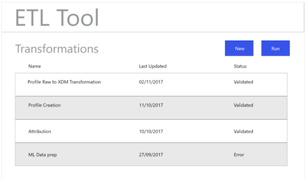

# Flusso di lavoro ETL

Vari strumenti di estrazione, trasformazione e caricamento (ETL) possono differire nel formato, ma la maggior parte di essi espone funzionalità simili per agevolare la combinazione di più origini di dati.

## Esempio di strumento ETL

I seguenti diagrammi forniscono modelli di azioni ETL comuni e un’esperienza utente generica basata sulle interazioni standard. Queste immagini possono essere facilmente adattate per un’esperienza di utilizzo ETL specifica.

Le azioni illustrate di seguito sono descritte nei passaggi descritti in [Guida all’integrazione di ETL](home.md). Alcuni passaggi fanno riferimento a &quot;Figure&quot; specifiche, altri descrivono azioni simili al flusso di lavoro mostrato qui.

### Figura 1 - Configurare il nuovo connettore Adobe Experience Platform:

### Figura 2 - [!DNL Experience Platform] Connettore attivato:

### Figura 3 - Interfaccia utente per la gestione delle trasformazioni ETL:

### Figura 4 - Nuova interfaccia utente di trasformazione, selezione [!DNL Experience Platform] Connessione:

### Figura 5 - Esplorazione dell’origine [!DNL Experience Platform] Set di dati:

### Figura 6 - Metadati e dati di esempio dal set di dati nell’interfaccia utente di ETL:

### Figura 7 - Visualizzazione delle informazioni sullo schema dei campi dai set di dati:

### Figura 8 - Anteprima dei dati dai set di dati:

### Figura 9 - Definizione dei parametri di sincronizzazione dei dati per il funzionamento della trasformazione:

### Figura 10 - Definizione del [!DNL Experience Data Model] Set di dati di destinazione (XDM):

### Figura 11 - Visualizzazione degli schemi gerarchici XDM e dei metadati per supportare la mappatura/le trasformazioni:

### Figura 12 - Salvare ed eseguire/pianificare le trasformazioni:

