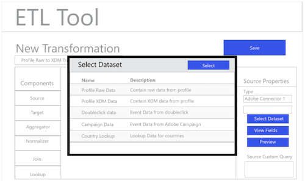

# Flusso di lavoro ETL

Diversi strumenti di estrazione, trasformazione e caricamento (ETL) possono variare in formato, ma la maggior parte di essi espone funzionalità simili per facilitare la combinazione di più origini dati.

## Esempio di strumento ETL

I diagrammi seguenti forniscono modelli di azioni ETL comuni e un&#39;esperienza utente generica in base alle interazioni standard. Queste immagini possono essere facilmente adattate per una specifica esperienza utente ETL.

Le azioni illustrate di seguito sono descritte nei passaggi descritti nella Guida all&#39;integrazione [ETL](home.md). Alcuni passaggi fanno riferimento a &quot;Figure&quot; specifiche, altri descrivono azioni simili al flusso di lavoro illustrato di seguito.

### Figura 1 - Configura nuovo connettore Adobe Experience Platform :

### Figura 2 - [!DNL Experience Platform] Connettore attivato:

### Figura 3 - Interfaccia utente di gestione delle trasformazioni ETL:

### Figura 4 - Nuova interfaccia utente di trasformazione, selezione della [!DNL Experience Platform] connessione:

### Figura 5 - Esplorazione per [!DNL Experience Platform] i set di dati di origine:

### Figura 6 - Metadati e dati di esempio dal set di dati nell’interfaccia ETL:

### Figura 7 - Visualizzazione delle informazioni sullo schema dei campi dai dataset:

### Figura 8 - Anteprima dei dati dai set di dati:

### Figura 9 - Definizione dei parametri di sincronizzazione dei dati per il funzionamento della trasformazione:

### Figura 10 - Definizione del set di dati di destinazione [!DNL Experience Data Model] (XDM):

### Figura 11 - Visualizzazione degli schemi gerarchici XDM e dei metadati per supportare la mappatura/le trasformazioni:

### Figura 12 - Salvataggio ed esecuzione/programmazione delle trasformazioni:

