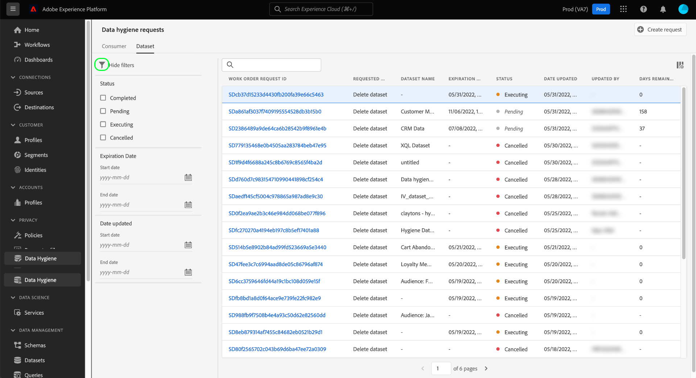

# Sfoglia gli ordini di lavoro per l&#39;igiene dei dati {#browse-work-orders}

>[!CONTEXTUALHELP]
>id="platform_hygiene_workorders"
>title="ID ordine di lavoro"
>abstract="Quando una richiesta di igiene dati viene inviata al sistema, viene creato un ordine di lavoro per eseguire l&#39;attività richiesta. In altre parole, un ordine di lavoro rappresenta un processo specifico di igiene dei dati, che include il suo stato attuale e altri dettagli correlati. A ogni ordine di lavoro viene assegnato automaticamente il proprio ID univoco al momento della creazione."
>text="See the data hygiene UI guide to learn more."

>[!IMPORTANT]
>
>Le funzionalità di igiene dei dati in Adobe Experience Platform sono attualmente disponibili solo per le organizzazioni che hanno acquistato Adobe Shield per il settore sanitario.

Quando una richiesta di igiene dati viene inviata al sistema, viene creato un ordine di lavoro per eseguire l&#39;attività richiesta. Un ordine di lavoro rappresenta un processo specifico di igiene dei dati, ad esempio un orario di vita pianificato (TTL) per un set di dati, che include il suo stato attuale e altri dettagli correlati.

Questa guida illustra come visualizzare e gestire gli ordini di lavoro esistenti nell’interfaccia utente di Adobe Experience Platform.

## Elencare e filtrare gli ordini di lavoro esistenti

Quando accedi per la prima volta al **[!UICONTROL Igiene dei dati]** nell’interfaccia utente viene visualizzato un elenco degli ordini di lavoro esistenti con i relativi dettagli di base.

![Immagine che mostra [!UICONTROL Igiene dei dati] Area di lavoro nell’interfaccia utente di Platform](../images/ui/browse/work-order-list.png)

<!-- The list only shows work orders for one category at a time. Select **[!UICONTROL Consumer]** to view a list of consumer deletion tasks, and **[!UICONTROL Dataset]** to view a list of time-to-live (TTL) schedules for datasets.

![Image showing the [!UICONTROL Dataset] tab](../images/ui/browse/dataset-tab.png) -->

Seleziona l’icona funnel () per visualizzare un elenco di filtri per gli ordini di lavoro visualizzati.

| Filtro | Descrizione |
| --- | --- |
| [!UICONTROL Stato] | Filtrare in base allo stato corrente dell&#39;ordine di lavoro. |
| [!UICONTROL Data di creazione] | Filtra in base al momento in cui è stata effettuata la richiesta TTL del set di dati. |
| [!UICONTROL Data di eliminazione] | Filtra in base alla data di eliminazione pianificata dal TTL. |
| [!UICONTROL Data di aggiornamento] | Filtra in base alla data dell’ultimo aggiornamento del TTL del set di dati. Le creazioni e le scadenza TTL vengono conteggiate come aggiornamenti. |

{style=&quot;table-layout:auto&quot;}

## Visualizza i dettagli di un ordine di lavorazione

Selezionare l&#39;ID di un ordine di lavoro elencato per visualizzarne i dettagli.

<!-- Depending on the type of work order selected, different information and controls are provided. These are covered in the sections below.

### Consumer delete details

>[!CONTEXTUALHELP]
>id="platform_hygiene_responsemessages"
>title="Consumer delete response"
>abstract="When a consumer deletion process receives a response from the system, these messages are displayed under the **[!UICONTROL Result]** section. If a problem occurs while a work order is processing, any relevant error messages will appear in this section to help you troubleshoot the issue. To learn more, see the data hygiene UI guide."

The details of a consumer delete request are read-only, displaying its basic attributes such as its current status and the time elapsed since the request was made.

### Dataset TTL details -->

La pagina dei dettagli di un set di dati TTL fornisce informazioni sui suoi attributi di base, inclusa la data di scadenza pianificata nei giorni rimanenti prima dell’eliminazione. Nella barra a destra è possibile utilizzare i controlli per modificare o annullare il TTL.

## Passaggi successivi

Questa guida illustra come visualizzare e gestire gli ordini di lavoro esistenti in materia di igiene dei dati nell’interfaccia utente di Platform. Per informazioni sulla creazione di ordini di lavoro personalizzati, consulta la guida su [pianificazione di un TTL set di dati](./ttl.md).
