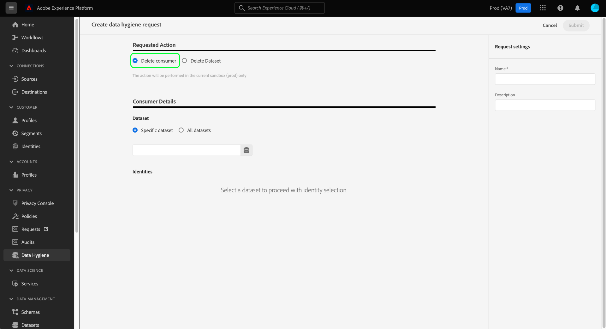
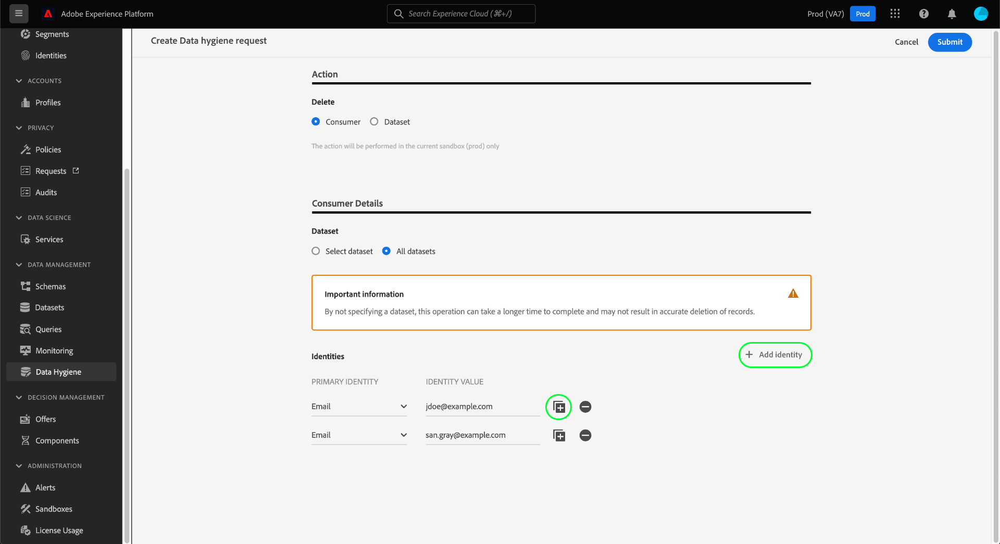
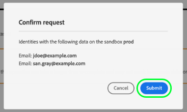

# Elimina record consumer

>[!IMPORTANT]
>
>Le funzionalità di igiene dei dati in Adobe Experience Platform sono attualmente disponibili solo per le organizzazioni che hanno acquistato **Scudo sanitario Adobe** o **Adobe Privacy e sicurezza scudo**.

La [[!UICONTROL Igiene dei dati] workspace](./overview.md) nell’interfaccia utente di Adobe Experience Platform puoi eliminare i record dei consumatori che partecipano al servizio Identity e al profilo cliente in tempo reale.

## Prerequisiti

L&#39;eliminazione dei record dei consumatori richiede una comprensione approfondita del funzionamento dei campi di identità in Experience Platform. In particolare, è necessario conoscere i valori di identità principali dei consumatori di cui si desidera eliminare i record, a seconda del set di dati (o dei set di dati) da cui li si sta eliminando.

Per ulteriori informazioni sulle identità in Platform, consulta la seguente documentazione:

* [Servizio Adobe Experience Platform Identity](../../identity-service/home.md): Collega le identità tra dispositivi e sistemi, collegando i set di dati in base ai campi di identità definiti dagli schemi XDM a cui sono conformi.
   * [Namespace Identity](../../identity-service/namespaces.md): Gli spazi dei nomi delle identità definiscono i diversi tipi di informazioni di identità che possono riferirsi a una singola persona e sono un componente obbligatorio per ciascun campo di identità.
* [Profilo cliente in tempo reale](../../profile/home.md): Sfrutta i grafici di identità dei consumatori per fornire profili di consumatore unificati basati su dati aggregati provenienti da più fonti, aggiornati in tempo quasi reale.
* [Experience Data Model (XDM)](../../xdm/home.md): Fornisce definizioni e strutture standard per i dati di Platform tramite l’utilizzo di schemi. Tutti i set di dati di Platform sono conformi a uno schema XDM specifico e lo schema definisce quali campi sono identità.
   * [Campi di identità](../../xdm/ui/fields/identity.md): Scopri come viene definito un campo di identità in uno schema XDM.

## Crea una nuova richiesta

Per avviare il processo, seleziona **[!UICONTROL Crea richiesta]** dalla pagina principale nell’area di lavoro.

![Immagine che mostra [!UICONTROL Crea richiesta] pulsante selezionato](../images/ui/delete-consumer/create-request-button.png)

Viene visualizzata la finestra di dialogo per la creazione della richiesta. Per impostazione predefinita, la **[!UICONTROL Consumatore]** è selezionata sotto la **[!UICONTROL Azione richiesta]** sezione . Lascia selezionata questa opzione.



## Seleziona set di dati

Sotto la **[!UICONTROL Dettagli del consumatore]** il passaggio successivo consiste nel determinare se si desidera eliminare i dati dei consumatori da un singolo set di dati o da tutti i set di dati.

Se scegli **[!UICONTROL Seleziona set di dati]**, seleziona l’icona del database () e viene visualizzata una finestra di dialogo che consente di selezionare il set di dati desiderato dall’elenco.


Se desideri eliminare i dati dei consumatori da tutti i set di dati, seleziona **[!UICONTROL Tutti i set di dati]**.

![Immagine che mostra [!UICONTROL Tutti i set di dati] opzione selezionata](../images/ui/delete-consumer/all-datasets.png)

>[!NOTE]
>
>Selezione della **[!UICONTROL Tutti i set di dati]** L’opzione può causare un tempo maggiore per l’operazione di eliminazione e potrebbe non causare un’eliminazione accurata dei record.

## Fornire le identità dei consumatori {#provide-consumer-identities}

>[!CONTEXTUALHELP]
>id="platform_hygiene_primaryidentity"
>title="Identità principale"
>abstract="Un&#39;identità primaria è un attributo che, ad Experience Platform, collega un record al profilo di un consumatore. Il campo di identità principale per un set di dati è definito dallo schema su cui si basa il set di dati. In questa colonna è necessario specificare il tipo (o namespace) per l’identità principale del consumatore, ad esempio `email` per gli indirizzi e-mail e `ecid` ad Experience Cloud ID. Per ulteriori informazioni, consulta la guida all’interfaccia utente per l’igiene dei dati ."

>[!CONTEXTUALHELP]
>id="platform_hygiene_identityvalue"
>title="Valore identità"
>abstract="In questa colonna è necessario fornire il valore per l&#39;identità principale del consumatore, che deve corrispondere al tipo di identità fornito nella colonna a sinistra. Se il tipo di identità principale è `email`, il valore deve essere l’indirizzo e-mail del consumatore. Per ulteriori informazioni, consulta la guida all’interfaccia utente per l’igiene dei dati ."

Quando si eliminano i dati dei consumatori, è necessario fornire informazioni di identità in modo che il sistema possa determinare quali record devono essere eliminati. Per qualsiasi set di dati in Platform, i record vengono eliminati in base alla **identità principale** campo definito dallo schema del set di dati.

Come tutti i campi di identità in Platform, un&#39;identità primaria è composta da due elementi: a **type** (a volte denominato namespace di identità) e **value**. Il tipo di identità fornisce il contesto in cui il campo identifica un consumatore (ad esempio un indirizzo e-mail) e il valore rappresenta l’identità specifica di un consumatore per quel tipo (ad esempio, `jdoe@example.com` per `email` tipo di identità).  I campi comuni utilizzati come identità includono informazioni sull&#39;account, ID dispositivo e ID cookie.

>[!TIP]
>
>Se non conosci l’identità principale per un particolare set di dati, puoi trovarlo nell’interfaccia utente di Platform. In **[!UICONTROL Set di dati]** workspace, seleziona il set di dati in questione dall’elenco. Nella pagina dei dettagli del set di dati, passa il puntatore del mouse sul nome dello schema del set di dati nella barra a destra. Viene visualizzata l&#39;identità principale insieme al nome e alla descrizione dello schema.
>
>

Se elimini record di consumer da un singolo set di dati, tutte le identità fornite devono avere lo stesso tipo, in quanto un set di dati può avere una sola identità primaria. Se esegui l’eliminazione da tutti i set di dati, puoi includere più tipi di identità, in quanto i diversi set di dati possono avere identità principali diverse.

Esistono due opzioni per fornire l&#39;identità del consumatore quando si eliminano i record del consumatore:

* [Caricare un file JSON](#upload-json)
* [Immetti i valori di identità manualmente](#manual-identity)

### Caricare un file JSON {#upload-json}

Per caricare un file JSON, puoi trascinarlo e rilasciarlo nell’area di fornitura oppure selezionare **[!UICONTROL Scegliere i file]** per sfogliare e selezionare dalla directory locale.


Il file JSON deve essere formattato come array di oggetti, ogni oggetto rappresenta un’identità del consumatore.

```json
[
  {
    "namespaceCode": "email",
    "value": "jdoe@example.com"
  },
  {
    "namespaceCode": "email",
    "value": "san.gray@example.com"
  }
]
```

| Proprietà | Descrizione |
| --- | --- |
| `namespaceCode` | Tipo di identità. |
| `value` | L&#39;identità del consumatore indicata dal tipo. |

Una volta caricato il file, puoi continuare a [invia la richiesta](#submit).

### Immetti le identità manualmente {#manual-identity}

Per immettere le identità manualmente, seleziona **[!UICONTROL Aggiungi identità]**.

![Immagine che mostra [!UICONTROL Aggiungi identità] pulsante selezionato](../images/ui/delete-consumer/add-identity.png)

Vengono visualizzati controlli che consentono di inserire le identità dei consumatori una alla volta. Sotto **[!UICONTROL Identità principale]**, utilizza il menu a discesa per selezionare il tipo di identità. Sotto **[!UICONTROL Valore identità]**, fornisce il valore di identità principale per il consumatore.


Per aggiungere altre identità, seleziona l’icona più () accanto a una delle righe, oppure seleziona **[!UICONTROL Aggiungi identità]**.



## Invia la richiesta (#submit)

Dopo aver aggiunto le identità alla richiesta, in **[!UICONTROL Impostazioni richieste]**, fornisci un nome e una descrizione facoltativa per la richiesta prima di selezionare **[!UICONTROL Invia]**.

![Immagine che mostra [!UICONTROL Invia] pulsante selezionato](../images/ui/delete-consumer/submit.png)

Viene richiesto di confermare l’elenco delle identità di cui si desidera eliminare i dati. Seleziona **[!UICONTROL Invia]** per confermare la selezione.



Dopo l&#39;invio della richiesta, viene creato un ordine di lavoro e viene visualizzato nel [!UICONTROL Consumatore] della scheda [!UICONTROL Igiene dei dati] workspace. Da qui è possibile monitorare lo stato dell&#39;ordine di lavoro durante l&#39;elaborazione della richiesta.

>[!NOTE]
>
>Consulta la sezione panoramica su [Tempistiche e trasparenza](../home.md#consumer-delete-transparency) per informazioni dettagliate sul modo in cui le eliminazioni dei consumatori vengono elaborate una volta eseguite.

## Passaggi successivi

Questo documento illustra come eliminare i record dei consumatori nell’interfaccia utente di Experience Platform. Per informazioni su come eseguire altre attività di igiene dei dati nell’interfaccia utente, consulta [panoramica dell&#39;interfaccia utente per l&#39;igiene dei dati](./overview.md).

Per scoprire come eliminare i record dei consumatori utilizzando l’API di igiene dei dati, consulta [guida all’endpoint dell’ordine di lavoro](../api/workorder.md).
